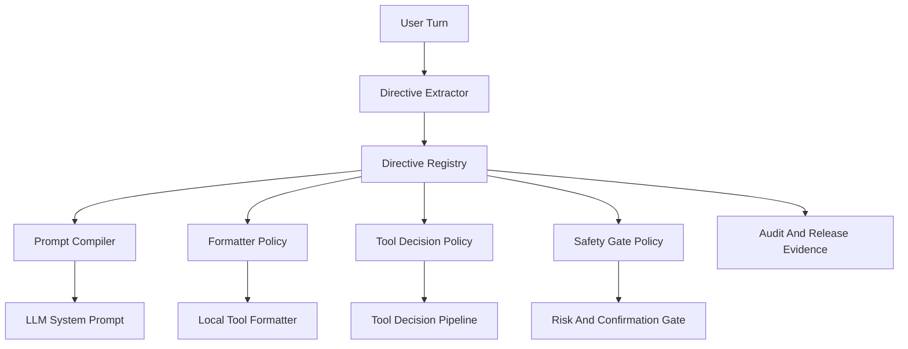

# AI Preference Governance Plan

## 背景判断

当前 C5/C1 已能把显式记忆写入 `projectFacts` 并通过 Memory Broker 软注入，但这只能影响模型生成，不能约束本地工具 formatter、agent loop warning、tool decision pipeline 或 destructive gate。成熟架构一般会区分：

- Saved memories：长期事实与偏好。
- Custom/project instructions：高优先级行为规则。
- Semantic / episodic / procedural memory：事实、经历、行为规程分开存储。
- Policy/tool plane：安全与执行规则不只靠 prompt，而要进入代码 gate。

因此 Jieyu 需要补一个“用户指令编译层”：把用户说的“请记住/以后/本轮/不要/默认”解析成结构化 directive，再按类别注入不同执行层。

## 目标架构

## 新增核心模型

在 [`src/ai/chat/chatDomain.types.ts`](src/ai/chat/chatDomain.types.ts) 扩展 `AiSessionMemory`，新增结构化 directives，而不是继续把所有内容塞进 `projectFacts`：

- `responsePreferences`
  - `language`: `auto | zh-CN | en`
  - `style`: `concise | detailed`
  - `format`: `bullets | prose | steps | evidence_first`
  - `evidenceRequired`: boolean
- `toolPreferences`
  - `defaultScope`: `project | current_track | current_scope`
  - `autoExecute`: `allow | ask_first | never`
  - `preferLocalReads`: boolean
- `safetyPreferences`
  - `denyDestructive`: boolean
  - `denyBatch`: boolean
  - `requireImpactPreview`: boolean
- `terminologyPreferences`
  - preferred labels and translations, e.g. `unit -> 语段`
- `sessionDirectives`
  - current-session-only rules such as “这轮只审查，不改代码”
- `directiveLedger`
  - audit-friendly record: source message, confidence, scope, createdAt, expiresAt, supersededBy

保留 `projectFacts` 作为 semantic memory，只存事实，不再承担行为约束。

## Phase 1: Directive Extractor

新增 [`src/ai/memory/userDirectiveExtractor.ts`](src/ai/memory/userDirectiveExtractor.ts)：

- 基于规则优先抽取高置信指令，先覆盖常见中文/英文句式：
  - `请记住，...`、`请记住：...`、`以后...`、`默认...`、`本轮...`、`不要...`、`执行前...`
  - `remember that...`、`from now on...`、`by default...`、`for this session...`、`do not...`
- 输出结构化 directive，不直接写 memory。
- 对低置信内容只进 `projectFacts` 或审计，不进入 hard policy。

更新 [`src/hooks/useAiChat.backgroundMemory.ts`](src/hooks/useAiChat.backgroundMemory.ts)：

- `extractBackgroundMemoryFacts` 保留 facts。
- 新增 `extractUserDirectives`。
- 写入时调用新的 reducer：`applyUserDirectivesToSessionMemory`。
- audit metadata 加入 `directiveCount`, `directiveCategories`, `confidence`。

## Phase 2: Directive Registry / Reducer

新增 [`src/ai/memory/userDirectiveRegistry.ts`](src/ai/memory/userDirectiveRegistry.ts)：

- 负责合并、覆盖、过期和冲突处理。
- 冲突规则：
  - 最新的明确用户指令覆盖旧指令。
  - 会话级指令优先于长期偏好，但会过期。
  - 安全偏好只允许更保守方向自动生效，例如“不要删除任何东西”可自动生效；“以后直接删除不用问我”不能绕过系统 destructive gate。
- 为每个 directive 生成 explainable audit：`accepted | ignored | downgraded | superseded`。

补 [`src/ai/chat/sessionMemory.ts`](src/ai/chat/sessionMemory.ts)：

- normalize 新字段。
- `buildSessionMemoryPromptDigest` 只展示必要摘要，不把全部 ledger 塞进 prompt。

## Phase 3: Prompt Compiler

新增 [`src/ai/chat/userDirectivePrompt.ts`](src/ai/chat/userDirectivePrompt.ts)，并接入 [`src/ai/chat/promptContext.ts`](src/ai/chat/promptContext.ts)：

- 在 `buildAiSystemPrompt` 中加入 `[USER_DIRECTIVES]` 高优先级块。
- 区分 hard vs soft：
  - hard: output language, session-only constraints, evidence-required。
  - soft: tone, formatting preference, terminology hints。
- 解决当前问题：如果 `responsePreferences.language=en`，系统 prompt 明确要求 natural-language final answer must be English，且本地 formatter 也用英文。

## Phase 4: Formatter Policy

新增 [`src/hooks/useAiChat.responsePolicy.ts`](src/hooks/useAiChat.responsePolicy.ts)：

- 从 `AiSessionMemory.preferences/directives` 解析当前 turn 的 `ResolvedResponsePolicy`。
- 输出：`locale`, `language`, `style`, `evidenceMode`, `formatMode`。

接入 [`src/hooks/useAiChat.streamCompletion.ts`](src/hooks/useAiChat.streamCompletion.ts)：

- `buildLocalToolClarificationMessage`
- `formatLocalContextToolResultMessage`
- `formatLocalContextToolBatchResultMessage`

接入 [`src/hooks/useAiChat.agentLoopRunner.ts`](src/hooks/useAiChat.agentLoopRunner.ts)：

- token budget warning 不再只看 UI locale，而是优先 `ResolvedResponsePolicy.language`。

## Phase 5: Tool And Safety Policy

接入 [`src/hooks/useAiChat.toolDecisionPipeline.ts`](src/hooks/useAiChat.toolDecisionPipeline.ts)、[`src/hooks/useAiChat.toolIntent.ts`](src/hooks/useAiChat.toolIntent.ts)、[`src/hooks/useAiChat.confirmExecution.ts`](src/hooks/useAiChat.confirmExecution.ts)：

- `toolPreferences.autoExecute=ask_first`：自动把 execute 降级为 confirmation/clarify。
- `toolPreferences.defaultScope`：给 local tool resolver 默认 scope hint，但不能覆盖用户本轮明确 scope。
- `safetyPreferences.denyDestructive=true`：destructive tool 直接 block。
- `safetyPreferences.requireImpactPreview=true`：高风险工具必须先走 preview。

注意：安全偏好只能加强，不允许削弱系统策略。

## Phase 6: Pinned Messages Semantics

当前 [`src/ai/chat/sessionMemory.ts`](src/ai/chat/sessionMemory.ts) 只存 `pinnedMessageIds`，不注入正文。补一个轻量方案：

- 新增 `pinnedDirectiveRefs` 或 `pinnedMessageDigest`。
- pin 时如果消息是用户指令，抽取 directive 并标为 `source=pinned_message`。
- Prompt 中只注入结构化摘要，不注入完整 pinned 正文。

这样“钉住消息”会真正影响 AI，而不是只影响 UI。

## Phase 7: Evidence And Debuggability

更新 [`scripts/generate-release-evidence-bundle.mjs`](scripts/generate-release-evidence-bundle.mjs)：

- 新增 `userDirectiveGovernance` section：
  - extracted count
  - accepted / ignored / downgraded / superseded
  - category distribution
  - policy application count
  - language/formatter mismatch count
- 在 audit log 中新增字段：
  - `ai_user_directive_extraction`
  - `ai_user_directive_application`
  - `ai_response_policy_resolution`

同时扩展 context debug：让 dogfood 时能看到当前 turn 生效的 response/tool/safety policy。

## 推荐落地顺序

1. 先做 Phase 1-4，解决语言、风格、本地工具输出不一致。
2. 再做 Phase 5，把“执行前问我/不要删除/默认范围”接入 tool 和 safety 层。
3. 再做 Phase 6，让 pinned message 有真实语义。
4. 最后做 Phase 7，把 evidence 闭环补齐。

## 验收样例

- 用户：“请记住，所有回答用英文”
  - 写入 `responsePreferences.language=en`
  - 普通 LLM 回复英文
  - local tool result 英文
  - agent loop warning 英文
- 用户：“本轮只审查，不改代码”
  - 写入 session directive
  - tool pipeline 拒绝 write/delete/modify 类工具
  - 下一轮新会话不继承
- 用户：“以后默认只看当前音频”
  - 写入 `toolPreferences.defaultScope=current_track`
  - local tool resolver 在用户未指定 scope 时采用 current track
- 用户：“不要删除任何东西”
  - 写入 `safetyPreferences.denyDestructive=true`
  - destructive tool 被 hard block
- 用户 pin 一条偏好消息
  - 抽取 directive
  - 在 prompt/policy 中可见
  - release evidence 有对应 application 记录