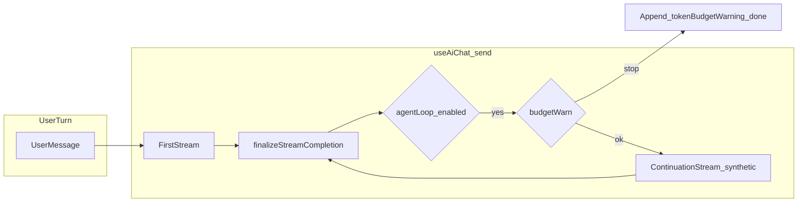

# AI 本地上下文 / Agent 续步：问题汇报

## 1. 现象复述（你看到的）

- 用户问的是**说话人**相关数量（「现在有几个说话人」类）。
- 模型走了 **`get_project_stats`**，回复里是 **`unitCount` 等工程统计** + `_readModel`，容易被误读成「条数 = 说话人数」。
- 若出现 **token 预算提示**（文案里带「继续 / continue」），用户照做再发一条后，**不会像「续跑同一条 agent 续步」那样接上**，下一轮是**新的用户轮次**，模型可能**再次选错工具或重复上一轮模式**。

---

## 2. 根因 A：语义维度错配（工具能答什么 vs 用户在问什么）

**事实（类型与实现）：**

- [`AiLongTermContext.projectStats`](src/ai/chat/chatDomain.types.ts) 只有 `unitCount` / `utteranceCount` / `translationLayerCount` / `aiConfidenceAvg`，**没有**「说话人实体数」或「项目中 distinct speaker 目录」字段。
- [`executeLocalContextToolCall` 里 `get_project_stats`](src/ai/chat/localContextTools.ts) 直接返回 `context.longTerm?.projectStats`，因此 **天然无法单独回答「说话人个数」**（除非从别处聚合，例如索引里的 `speakerId`，当前未作为该工具的一等字段暴露）。
- [`buildLocalContextToolGuide`](src/ai/chat/localContextTools.ts) 中对该工具的表述偏向 **「项目里有多少 segments/units」**，中文口语里「几个」又常被模型映射到 **unit 条数**，加剧 **说话人 vs 语段** 的混淆。

**同类风险（不仅本例）：**

| 用户口语维度 | 易误触发的工具/信号 | 实际含义 |
|--------------|---------------------|----------|
| 说话人 / 角色 / speaker | `get_project_stats`、`unitCount` | 语段/单位行数，不是说话人实体目录 |
| 几条 / 几个（模糊） | `get_project_stats`、`list_units` total | 若未在 prompt 里强制消歧，模型可能选「最省事」的 stats |
| 间隙 / 空白 / gap | `get_waveform_analysis` 的 `gapCount` | 波形时间轴上的静默区，**不是** unit 总数（[`promptContext` 里已有 `trackGaps_not_unit_count` 类提示](src/ai/chat/promptContext.ts)，但模型仍可能混用） |
| 层 / 翻译层数 | `translationLayerCount` | 与「条内容」不是同一概念 |

---

## 3. 根因 B：「继续」类文案与真实机制不一致（错误 affordance）

**代码行为（agent loop 预算刹车）：**

在 [`useAiChat.ts` 的 agent `while` 循环](src/hooks/useAiChat.ts) 中，若 `shouldWarnTokenBudget(estimatedRemainingTokens, …)` 为真：

- 把 `tokenBudgetWarning` **拼进当条 assistant 正文**；
- 将 `resolvedStatus = 'done'`；
- **`resolvedLocalToolResults = undefined`**，然后 **`break`**，**不再**发起带 `__LOCAL_TOOL_RESULT__` 的合成续步用户文。

因此：**没有任何「待恢复的续步队列」或「用户说继续就接着跑同一段 continuation」的状态机**；下一条用户消息是**全新 `send()`**，历史里只有普通 assistant/user 文本，**不会**自动注入 `buildAgentLoopContinuationInput(...)` 那种载荷。

**文案来源：**

- [`src/i18n/aiChatCardMessages.ts`](src/i18n/aiChatCardMessages.ts) 中 `tokenBudgetWarning` 的中英文目前带有「回复继续 / Reply continue to proceed」类表述，与上述实现 **语义不一致**，属于 **系统性 UX/协议风险**：任何触发该分支的对话都会出现「建议用户做的事」与「产品实际做的事」不符。

**顺带：**[`useAiChat.test.tsx`](src/hooks/useAiChat.test.tsx) 里对预算提示的断言用的是旧式中文子串（`预计继续执行还需约`），与当前 i18n 文案可能已不一致，说明这块历史上也经历过文案漂移，测试与产品文案未强绑定。

---

## 4. 根因 C：Agent 续步与「用户自然语言继续」是两条通道

- **真续步**：由运行时合成 `__LOCAL_TOOL_RESULT__` + `buildAgentLoopContinuationInput`（见 [`agentLoop.ts`](src/ai/chat/agentLoop.ts)），在同一轮 `send` 内 `while` 循环消费。
- **用户发「继续」**：只是新的一条 user message，**不保证**等价于上述合成输入；模型若仍认为「需要先拉 stats」，就会 **重复 `get_project_stats`** 或重复展示工具块。

---

## 5. 影响面小结

| 层级 | 影响 |
|------|------|
| 用户信任 | 工具结果「看起来像答案」但维度错误；「继续」无效或重复 |
| 模型行为 | 在缺少显式「维度—工具」契约时，易重复调用 stats / 混淆 gap 与 unit |
| 维护 | 新增本地工具或改 `buildLocalContextToolGuide` 时，若不同步「能答 / 不能答」说明，会反复出现同类问题 |

---

## 6. 结论（问题性质）

当前问题**不是单点 bug**，而是三类因素叠加：**工具结果维度不足或说明不足**、**提示词里「几个」类歧义**、以及 **预算刹车文案承诺了不存在的续步机制**。治理应分：**诚实 affordance**、**工具—维度契约**、**上下文层能直接给的数就不要让模型猜**。

---

## 7. 准备怎么改进（分阶段，可单独排期）

### P0 — 立刻止血：文案与测试对齐实现

- **改什么**：[`src/i18n/aiChatCardMessages.ts`](src/i18n/aiChatCardMessages.ts) 的 `tokenBudgetWarning` 去掉「回复继续 / Reply continue to proceed」这类暗示；改为明确：**已暂停本轮内的自动多步续步**；下一条用户消息是**新轮次**，不会自动注入 `__LOCAL_TOOL_RESULT__` 续步载荷；若仍需模型基于**已展示的工具 JSON** 用自然语言收尾，应直接在同一条回复里完成，或发起**更具体的追问**。
- **测什么**：[`src/hooks/useAiChat.test.tsx`](src/hooks/useAiChat.test.tsx) 中预算刹车用例的断言与文案强绑定（匹配新文案关键词或稳定子串），避免再出现「测试与 i18n 漂移」。

### P1 — 系统性降低「错工具」：契约 + 工具输出

- **契约（prompt 侧）**：在 [`buildLocalContextToolGuide`](src/ai/chat/localContextTools.ts)（必要时在 [`promptContext.ts`](src/ai/chat/promptContext.ts) 增加极短「维度 guardrail」行）集中维护一张**口语维度 → 允许的工具/字段**说明，至少覆盖：**units/语段** vs **distinct speakerId 于索引** vs **speaker 实体目录（若尚无工具则写清「当前无专用工具，勿用 unitCount 冒充」）** vs **waveform gaps**。
- **数据（执行侧）**：在 [`executeLocalContextToolCall`](src/ai/chat/localContextTools.ts) 的 `get_project_stats` 分支，当存在 `shortTerm.localUnitIndex` 时，**可选地**计算并返回 `distinctSpeakerIdsInIndex`（非空 `speakerId` 去重数），并在 guide 中注明：**这是索引行上的已指派说话人 ID 种数**，与「未引用实体数」「目录实体总数」可能不一致，避免二次误读。
- **测什么**：[`src/ai/chat/aiArchitectureIntegration.test.ts`](src/ai/chat/aiArchitectureIntegration.test.ts) / [`localContextTools.test.ts`](src/ai/chat/localContextTools.test.ts) 各加一条覆盖「有 localUnitIndex 时 stats 带 distinct 字段」的用例。

### P2 — 可选：上下文层预填（减少模型先调工具的冲动）

- **改什么**：若 [`buildTranscriptionAiPromptContext`](src/pages/TranscriptionPage.aiPromptContext.ts) 或现有统计管道里**已有低成本**的「说话人实体数 / 当前 scope 引用数」等，可写入 `shortTerm` 或 tier-2 文本（与现有 `projectStats`、`worldModelSnapshot` 风格一致），让「几个说话人」类问题优先被 **[CONTEXT] 直接约束**，工具作为补充而非唯一来源。
- **原则**：不引入重查询或阻塞主线程；若无现成字段则本阶段跳过，不强行加 DB 扫描。

### P3 — 文档与远期能力

- **文档**：新增 [`docs/architecture/ai-local-context-tool-governance.md`](docs/architecture/ai-local-context-tool-governance.md)（或并入现有 AI 接地计划 §11 风格章节）：维护「改工具必改三处」+「维度—工具矩阵」+「任何对用户可见的『回复 X 即 Y』必须与 ref 状态机一致」。
- **远期（单独 ADR）**：若产品确实需要「用户发继续则接着跑被预算打断的续步」，需要 **显式 pending 结构**（assistantId、loopStep、serialized tool results、epoch 校验），不能靠自然语言「继续」猜；工作量大，与 P0–P2 解耦。

---

## 8. 执行顺序建议

1. **先做 P0**（最小 diff、直接消除误导与重复追问的心理预期）。
2. **并行 P1 契约 + stats 字段**（治本类问题里性价比最高）。
3. **视数据可得性做 P2**。
4. **P3 文档与远期 ADR** 与代码可同周或稍后。

---

## 9. Governance

改 governed 文档时跑 `npm run check:docs-governance`；涉及工具/编排的回归：`npx vitest run src/hooks/useAiChat.test.tsx`（至少含预算用例）、`src/ai/chat/localContextTools.test.ts`、`src/ai/chat/aiArchitectureIntegration.test.ts` 子集。
