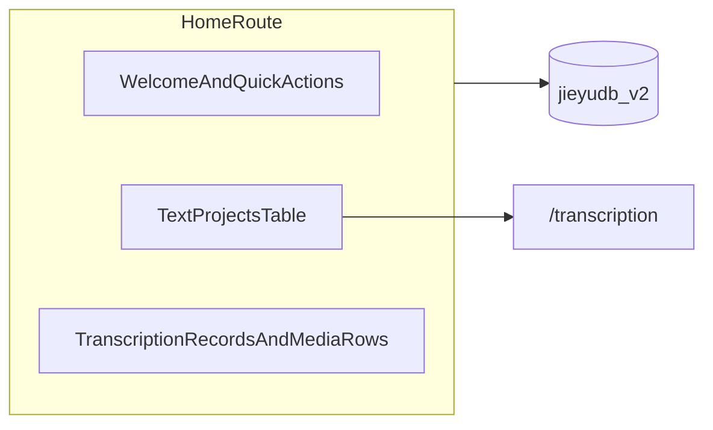

# 应用首页（项目概览 + 已有文件）规划

## 成熟方案与可借鉴案例

- **Adobe Creative Cloud / 各类创意套件首页**：分区展示「最近文件」、排序/筛选、缩略或元信息、以及「打开 / 新建」等主行动点；核心是**降低进入主工作区的摩擦**。[Creative Cloud Home 说明](https://helpx.adobe.com/ph_fil/creative-cloud/help/creative-cloud-desktop-app-home-screen.html)
- **IDE / 编辑器 Welcome（VS Code、JetBrains）**：左侧**最近项目列表** + 右侧**新建 / 打开 / 文档链接**；适合你们这种「单应用多工作区」心智。
- **笔记 / 知识库类（Obsidian、Notion）**：首页偏**库级概览**（统计、最近编辑）+ **进入上次空间**；与「浏览器内单一 IndexedDB 库 + 多条 text 文档」接近。
- **Curio「Project Gallery」**：多项目并存时的**画廊 / 分类 / 最近打开**；与你们「多条 `TextDocType` 并存」一致。[Curio Projects 文档](https://zengobi.com/curio/docs/32/projects)

**对解语的映射**：没有独立「磁盘工程文件夹」时，「项目」= `[TextDocType](src/db/types.ts)`（`id`, `title`, `updatedAt`…），「已有文件」= 每条 text 下的 `[MediaItemDocType](src/db/types.ts)`（`filename`, `duration`, `textId`…），必要时可补充统计（层、单元数量等）作为「项目健康度」——应用 `[LinguisticService.getAllTexts](src/services/LinguisticService.ts)` 与现有按 text 查询媒体的 API（如 `getMediaItemsByTextId`）即可，无需先上操作系统目录树。

## 命名与用语（对用户 / 对代码）

**对用户界面（中文，与现有 i18n 对齐）**

- **转写项目**（简称 **项目**）：对应 `texts` / `TextDocType`。与现有 `transcription.project.untitledZh` 等「未命名**项目**」一致；首页一级区块标题推荐 **「转写项目」**，避免叫「文本库」以免与语言学 `text` 术语混淆。
- **媒体** 或 **媒体文件**：对应 `media_items` / `MediaItemDocType`。与现有 `transcription.media.`* 一致；若列表里几乎全是音轨，副标题可用 **「音频与媒体」**。
- **不要**把项目和媒体笼统都叫「文件」：用户会联想到磁盘上的 `.jym` / `.eaf` 或「工程文件夹」；导出包、标注交换等可在首页用 **「导入 / 导出」** 或 **「项目包」** 单独入口（与左侧 Project Hub 叙事一致），与「媒体文件」区分。

**资产级称呼（产品定稿，与「轨道」区分）**

- **声文稿**：用户建的 **转写/标注 + 相应媒体** 这一套组合（以声学媒体为载体的成果）。英文：**transcription record**。
- **文本稿**：**纯文本**形态的成果（不强调或没有声学媒体载体时的稿）。英文：**text record**。
- **「轨道」**仍仅用于**时间轴 UI**（当前时间基底 / 多轨切换），**不叫**声文稿。
- **已导出的交换物**（`.eaf` / `.jyt` / `.jym` 等）：继续称 **「转写包」「导出包」「交换包」**；**不叫**声文稿，以免与库内稿混淆。
- **不推荐与声文稿/文本稿混用**：**「组块」**（纵读列，`pairedReading.bundleLabel`）、笼统 **「文件」**。

**时间轴 UI 专用**

- **当前轨道 / Track**；说明可用 **「时间轴媒体」**。
- **组块** ≠ **轨道** ≠ **声文稿** ≠ **文本稿**。

**对用户界面（英文）**

- `Transcription project` / `Project`；`Media` / `Media files`（或 `Audio & media`）。
- 资产：**transcription record**（声文稿）、**text record**（文本稿）。
- 交换物：`Export bundle` / `Transcription package`；时间轴：`Track`，副标 `Timeline media`。

**对源码文件（实施时）**

- 页面：`HomePage.tsx`（与 `TranscriptionPage.tsx`、`CorpusLibraryPage.tsx` 同级）。
- 可选纯逻辑：`useHomeInventory.ts` 或 `loadHomeDashboardData.ts`（封装 `getAllTexts` + 按 text 拉媒体、排序、空状态），避免 `HomePage` 过长。
- 样式：优先复用现有 `styles/pages/` 与 `PanelSection`；若需独立表，再考虑 `home-page.css` 或局部模块。
- i18n 键前缀：`app.home.`*、`app.nav.home`（导航标签），与现有 `app.nav.`* 并列；词条定稿 **声文稿** / **文本稿**，英文 **transcription record** / **text record**（建议独立 glossary 键便于复用，如 `app.glossary.transcriptionRecord` / `app.glossary.textRecord`）。

## 当前代码锚点

- 路由与默认入口：`[src/App.tsx](src/App.tsx)` 中 `<Route path="/" element={<Navigate to="/transcription" replace />} />`，主导航 `navGroups` 从转写开始。
- 壳布局：`[isTranscriptionWorkspacePathname](src/utils/transcriptionWorkspaceRoute.ts)` 仅对 `/transcription` 与 `/assets/*` 使用转写专用主区样式；首页走**默认 `app-main`** 即可。
- 图标类型：`[LeftRailNavIconName](src/utils/jieyuMaterialIcon.ts)` 为封闭枚举且注释要求与 `assets/lottie/left-rail/icons` 对齐；**首版建议复用已有 ligature**（例如 `local_library` 或 `inventory_2` 表示「资料库/概览」），避免在未补 Lottie 资源前扩展枚举导致不一致。

## 推荐产品形态（MVP → 增强）

**MVP（建议先做）**

1. **新路由**：例如保留 `/` 为首页，或显式 `/home` 且 `/` 重定向到 `/home`（二选一；从 SEO/书签角度 `**/` 作首页更自然**）。
2. **页面区块**（单页、与现有 `panel` / `PanelSection` 风格一致即可，可参考 `[CorpusLibraryPage](src/pages/CorpusLibraryPage.tsx)` 的轻量壳或 `[LexiconPage](src/pages/LexiconPage.tsx)` 的列表布局）：
  - **欢迎区**：应用名、简短说明、主按钮「进入转写」「新建项目」（若新建逻辑仅在转写页，可先只做「进入转写」+ 文案引导）。
  - **项目列表**：`getAllTexts()` 表格/卡片：标题（`MultiLangString` 需与转写侧一致的展示 helper）、`updatedAt`、`languageCode`。
  - **声文稿 / 文本稿入口（MVP 可先落媒体行）**：按 `textId` 分组列出 `media_items`（列示例：所属项目、文件名、时长）；副文案对应 **transcription record（声文稿）**；纯文档模式另列时用 **text record（文本稿）**。**「轨道」**仅用于转写页时间轴控件，不作此列表主标题。
  - **环境信息**：`[resolveHostVersion()](src/config/hostVersion.ts)`、可选存储用量估算（IndexedDB 精确用量在浏览器里受限，可只做「条数统计」或略过）。
3. **主导航**：在 `[navGroups](src/App.tsx)` 的 `workspace-core` **顶部**插入「首页」项，`to: '/'`（或 `/home`），并保证 `activeNavItem` 匹配逻辑对精确路径优先（当前 `startsWith` 规则对 `/` 需特别处理，避免误匹配其他路由）。
4. **懒加载与预热**：与其它页面一致 `lazy(() => import('./pages/HomePage'))`；若 `/` 改为首页，调整现有「首屏预热 TranscriptionPage」的 `[useEffect](src/App.tsx)` 条件，避免在仅打开首页时强行拉转写大包（可改为 `pathname.startsWith('/transcription')` 或用户点击「进入转写」时再预热）。
5. **i18n**：在 `[src/i18n/index.ts](src/i18n/index.ts)`（或你们现有词条文件）增加 `app.home.`* / `app.nav.home` 等键，中英一致。

**增强（第二阶段，按需）**

- **从首页打开指定项目**：当前转写工作区主要通过内部 `activeTextId` 状态驱动，未见稳定的 URL `textId` 协议。若要「点一条 text 即进入对应项目」，需在 Orchestrator / `useDialogs` 链路增加 `**?textId=` 或 `sessionStorage` 一次性 handoff`**，首页` navigate('/transcription?textId=…')`并在转写挂载时`setActiveTextId`+`loadSnapshot`。这是首页价值最大化的关键，但涉及跨页状态，建议单独立项。
- **「最近」排序**：在 `texts` 上按 `updatedAt` 排序即可；若需「最近打开」而非「最近修改」，再增加轻量 localStorage 记录 `lastOpenedTextId`。
- **云端项目行**（若已登录 Supabase）：可选展示 `[listAccessibleCloudProjects](src/collaboration/cloud/CollaborationDirectoryService.ts)` 与本地 `textId` 的并列视图——与现有协作叙事一致，但应作为可选模块以免拖慢首屏。

## 测试与质量

- **组件/页面测试**：`render` + `MemoryRouter` 初路由为 `/`，mock `LinguisticService.getAllTexts` / 媒体查询，断言列表与导航高亮。
- **App 级路由测试**：若已有 `[App.test.tsx](src/App.test.tsx)`，扩展断言 `/` 渲染首页而非直接落到转写。

## 风险与边界

- **「文件」语义**：浏览器端无法无权限枚举用户磁盘目录；若未来要「绑定本地文件夹」，需 **File System Access API** 或桌面壳（Tauri/Electron）——与本次 Dexie 内数据展示分开规划。
- **性能**：文本很多时列表需虚拟化或分页；MVP 可先 `limit` 或在 UI 上加「仅显示最近 N 条」。

## 主要改动文件（实施时）

- `[src/App.tsx](src/App.tsx)`：路由、`navGroups`、必要时 `activeNavItem` 与预热逻辑。
- 新增 `[src/pages/HomePage.tsx](src/pages/HomePage.tsx)`（及可选 `HomePage.module.css` 或复用现有 `styles/pages/` 下类名）。
- `[src/i18n/index.ts](src/i18n/index.ts)`（或对应 messages 模块）：文案。
- 可选：`[src/utils/jieyuMaterialIcon.ts](src/utils/jieyuMaterialIcon.ts)` + Lottie 资源（仅当需要专用 `home` 图标时）。

