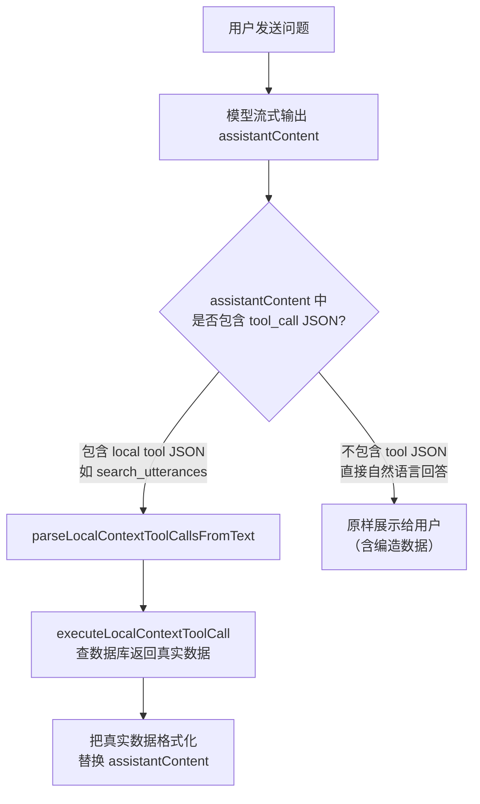

# 修复 AI 语段幻觉的彻底方案

## 根因分析

模型产生幻觉有 **三层互相叠加** 的结构性原因，而非单一漏洞：

### 第一层：上下文只有「统计摘要」，没有「真实数据」

模型在 system prompt 里看到的上下文长这样（`buildPromptContextBlock` 输出）：

```
[CONTEXT]
ShortTerm:
- page=transcription
- selectedUnitKind=utterance
- selectedUtteranceStartSec=48.40
- selectedUtteranceEndSec=59.90
- utterancesOnCurrentMediaCount=6     <-- 新加的，但之前没有
- selectedText=
LongTerm:
- projectStats(utterances=6, translationLayers=1, aiConfidenceAvg=0.850)
- waveformAnalysis(lowConfidence=0, overlaps=0, gaps=5, maxGapSec=13.4)
```

**关键问题**：模型知道「有 6 条」「有 5 个 gap」「最大间隙 13.4s」，但 **不知道每条的 id、起止时间、正文内容**。当用户问「有几个语段」时，模型 **只能从摘要反推**，而 `gaps=5` 很容易误推成「6 段之间有 5 个间隙」然后脑补均匀时间表。

### 第二层：模型「不会主动调工具」—— 只在输出被解析为 JSON 时才触发

看 [useAiChat.streamCompletion.ts](src/hooks/useAiChat.streamCompletion.ts) 的执行流程：



**这意味着：模型必须「选择」输出 `{"tool_call":{"name":"list_utterances",...}}` 才能触发查询**。但系统提示写的是「当用户要求执行操作时才返回 JSON」——模型把「查询语段」归类为「问题/解释」而非「操作」，因此**直接用自然语言编造答案**，根本不会调 `list_utterances`。

### 第三层：系统提示的指令与工具分类不匹配

在 [promptContext.ts](src/ai/chat/promptContext.ts) 的 `AI_FUNCTION_CALLING_SYSTEM_PROMPT` 中：

- 第 2 行：「当用户**要求执行操作**时，必须只返回 JSON」
- 第 3 行：「当用户只是**问候、闲聊、提问、解释或总结**时，**严禁返回 tool_call JSON**，必须返回自然语言」

而 `buildLocalContextToolGuide()` 列出了 `list_utterances`、`search_utterances` 等「查询类」工具，但模型被教导「提问 = 自然语言回答」。**查询类工具与「严禁返回 JSON」的指令矛盾**——模型在被问「有几个语段」时遵守了「提问不返回 JSON」的规则，所以跳过了查询工具，直接编造。

---

## 解决方案（三层对应三个修复）

### Fix 1: 在上下文中直接注入当前媒体的语段时间表

**最直接有效**：模型上下文里已经有数据，就没必要调工具再查。

- 在 `buildTranscriptionAiPromptContext` 中增加 `utterancesOnCurrentMediaSummary` 字段
- 内容：每条 utterance 的 `id`、`startTime`、`endTime`、转写正文前 40 字（截断）
- 在 `SHORT_TERM_TEMPLATES` 中渲染为紧凑格式，如：
  `utterances=[utt-1|0.00-35.10|"こんにちは...", utt-2|35.10-48.40|"", ...]`
- **受 `maxChars` 预算保护**：超长时自动截断尾部

涉及文件：
- [TranscriptionPage.aiPromptContext.ts](src/pages/TranscriptionPage.aiPromptContext.ts) — 增加参数
- [useTranscriptionAiController.ts](src/pages/useTranscriptionAiController.ts) — 传入 utterances 概要
- [chatDomain.types.ts](src/ai/chat/chatDomain.types.ts) — 扩展 `AiShortTermContext`
- [promptContext.ts](src/ai/chat/promptContext.ts) — 增加渲染模板

### Fix 2: 修正系统提示，让「查询类工具」不被「严禁 JSON」规则覆盖

在 `AI_FUNCTION_CALLING_SYSTEM_PROMPT` 中明确区分两类工具：

- **操作类**（`set_transcription_text`, `delete_layer` 等）：用户要求执行时返回 JSON
- **查询类**（`list_utterances`, `search_utterances`, `get_utterance_detail` 等）：**当你需要查看真实数据以回答用户问题时，必须先调查询工具获取数据，再基于返回结果回答，禁止编造**

具体：在「严禁返回 JSON」那条规则后加例外子句，并在 `buildLocalContextToolGuide()` 的引导文案中明确写：「回答关于语段数量、时间、内容的问题前，应先用 list_utterances / search_utterances 获取真实数据」。

涉及文件：
- [promptContext.ts](src/ai/chat/promptContext.ts) — 修改系统提示和查询工具引导

### Fix 3: 在 streamCompletion 中增加「幻觉检测 + 自动补救」

即便提示写对了，模型仍可能偶发幻觉。增加一道后置防线：

- 在 `resolveAiChatStreamCompletion` 中，当 `finalContent` 是自然语言（无 tool_call JSON）时，用正则检测是否包含「编造语段列表」的模式（如连续 3+ 行含 `**HH:MM.S – HH:MM.S**` 格式的时间范围）
- 若检测到且 `localToolCallCountRef.current === 0`（本轮未调过查询工具），自动追加一条提示：「以上语段时间数据为模型推测，可能不准确。如需查看真实数据，请让我查询。」
- 这样不阻断回答，但对用户透明

涉及文件：
- [useAiChat.streamCompletion.ts](src/hooks/useAiChat.streamCompletion.ts) — 增加检测逻辑

---

## 为什么三层都要修

| 只修一层 | 仍会出的问题 |
|----------|------------|
| 只注入时间表(Fix 1) | 超过 maxChars 预算时被截断，模型又会编造 |
| 只改提示(Fix 2) | 模型仍可能不遵守指令直接回答（LLM 不是 100% 听话） |
| 只加检测(Fix 3) | 治标不治本，每次都要打补丁提示 |

三层叠加 = **数据兜底 + 指令矫正 + 输出防线**。
