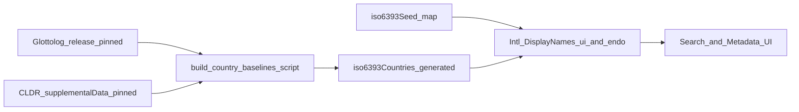

# 为 7867 语种补充分布国（Glottolog）+ 官方国（CLDR）及双语国名展示

## 背景与约束

- [`iso-639-3`](node_modules/iso-639-3/iso6393.d.ts) **不含**国家信息；当前 7867 条只在 [`iso6393Seed.generated.ts`](src/data/generated/iso6393Seed.generated.ts) 存 `name` / `invertedName` / 码与 scope/type。
- 持久化层已有 [`LanguageDocType.countries`](src/db/types.ts)（`string[]`，工作台占位为 **ISO2**，见 [`languageMetadataWorkspace.country.ts`](src/pages/languageMetadataWorkspace.country.ts)）。
- 你已选：**Glottolog 分布国** + **CLDR 官方国（一期必做）** + **UI 语言国名与各国本地称谓** 两种国名展示维度。

## 语言名称 vs 国家数据（范围说明）

- **未自动更新「语言名称」**：本计划中的「语言所在国」baseline **只增加/更新** ISO 639-3 → **国家码列表**（分布 / 官方）及 UI 上对 **国家/地区** 的 `Intl.DisplayNames` 渲染。**不会**因此重跑或改写 [`generate-language-name-indexes.mjs`](scripts/generate-language-name-indexes.mjs)、[`language-display-names.core.json`](public/data/language-support/language-display-names.core.json)、[`languageNameCatalog.generated.ts`](src/data/generated/languageNameCatalog.generated.ts) 里的 **语种** `english` / `native` / `byLocale` 等字符串。  
- **7867 英文语言名**仍来自 [`iso6393Seed.generated.ts`](src/data/generated/iso6393Seed.generated.ts)（`name` / `invertedName`），与国界数据 **独立版本、独立生成脚本**。  
- **若产品要「国别消歧」的语言标签**（例如列表中显示「法语（比利时）」或把国名拼进 `secondaryLabel`）：属于 **单独需求**，需在 UI 层组合 **现有语言名 + baseline 国别**（或扩展名称矩阵），**不在**本计划「仅补国家 baseline」的默示范围内；若要一期就做，须 **显式加验收项**。

## 仓库现状（代码审阅，2026-04）

以下基于当前树内实现，用于缩小计划与落地的差距。

### 已有 Glottolog CLDF 消费

- [`scripts/inject-glottolog-coordinates.mjs`](scripts/inject-glottolog-coordinates.mjs) 已从 **Glottolog CLDF** [`languages.csv`](https://raw.githubusercontent.com/glottolog/glottolog-cldf/master/cldf/languages.csv) 拉取数据，解析 `ID`、`Latitude`、`Longitude`、`ISO639P3code`、`Level`（仅 `language` 级），写入 [`top500-language-orthography-seeds.json`](public/data/language-support/top500-language-orthography-seeds.json)。  
- 同源 CSV 表头含 **`Countries`**（示例为 **单 ISO2**，如 `PG`、`US`）；**分布国 baseline 应复用该列与同一套 ISO639P3code→行的映射逻辑**，可与坐标脚本 **共享下载/解析**（合并脚本或 `import` 共用函数），避免第二套 Glottolog 解析。  
- **缺口**：脚本使用 **`master` 分支 raw URL，未钉 commit**——与「可复现构建」不一致；新流水线应 **钉版本**（并建议 **顺带** 将 inject 坐标脚本改为同钉版，或统一由 `build-country-baselines` 产出坐标补丁，减少漂移）。

### 语言目录搜索与静态资源模式

- [`LanguageCatalogSearchService.ts`](src/services/LanguageCatalogSearchService.ts) 已通过 **`/data/language-support/*.json`** + **`fetch` + 模块级 Promise 单例**（`loadLanguageDisplayCore`、`loadLanguageQueryAliases`、`loadLanguageQueryIndex`）加载语言展示与索引；**新增 country baselines 应沿用此模式**（新常量 URL + `fetchJson` + memo），而不是引入与首屏冲突的巨型 TS 内联表（与上文体积策略一致）。

### 运行时缓存与 LinguisticService 投影

- [`languageCatalogRuntimeCache.ts`](src/data/languageCatalogRuntimeCache.ts) 的 `LanguageCatalogRuntimeEntry` **无** `countries`；[`LinguisticService.languageCatalog.ts`](src/services/LinguisticService.languageCatalog.ts) 中 `buildRuntimeCacheEntry` **未**序列化国家字段。  
- `projectLanguageCatalogEntry` 仅在 [`languageDoc?.countries`](src/services/LinguisticService.languageCatalog.ts) 存在时输出 `countries`（约 1012 行），**无**任何 Glottolog/CLDR baseline 合并。  
- **含义**：语言资产工作台列表/详情若依赖 `LanguageCatalogEntry`，要在无 Dexie 数据时看到分布/官方国，需在 **`projectLanguageCatalogEntry`（或读路径上层）合并 JSON baseline**，或仅在 **搜索/独立详情 API** 展示——计划实现时 **二选一并写清**，避免只做 Search 导致工作台长期空白。

### 与现有类型/文案的命名冲突

- [`LanguageCatalogEntry`](src/services/LinguisticService.languageCatalog.ts) / [`LanguageDocType`](src/db/types.ts) 已有字段 **`officialStatus`**（枚举：`national` | `regional` | …），语义是 **「该语言记录层面的官方地位」**，与 **「官方国 ISO2 列表」** 不同。  
- 计划中的用户可编辑 **`countriesOfficial`**（或改名 **`officialCountryCodes`**）在 **UI 文案与 i18n key** 上须与现有 `workspace.languageMetadata.officialStatus` **明确区分**（例如「CLDR 官方国」「法定使用国」），避免产品/翻译混淆。

### 宏语言成员表

- 仓库 [`package.json`](package.json) 仅依赖 [`iso-639-3`](node_modules/iso-639-3) **包体未发现 macrolanguage 映射**（grep 无匹配）。**ISO 639-3 macrolanguage 表须单独版本化引入**（随脚本发布 SIL `macrolanguages.tab` 或等价 npm 包），不能假设现有依赖已提供。

### 7867 vs ~697 投影范围

- [`buildBaselineCodes`](src/services/LinguisticService.languageCatalog.ts) 来自 `GENERATED_LANGUAGE_DISPLAY_NAME_CORE` 的 key（约 **697** 条），`readLanguageCatalogProjection` 的默认 `languageIds` 并集 **不** 等于完整 7867。完整码表检索已在 **SearchService** 通过 `getIso639_3SeedMap()` 覆盖 **`catalogScope === 'language'`**。  
- **baseline 国 JSON** 的 key 集应对齐 **7867**（与 `iso6393Seed` 一致），供搜索与精确 lookup；工作台若只挂载投影条目，仅对 **有投影的 id** 显示合并国别亦可接受，但须在验收中写明。

## 数据层建议（核心）

1. **生成物（建议单独模块，避免塞进 seed 元组）**  
   - 新增例如 [`src/data/generated/iso6393Countries.generated.ts`](src/data/generated/iso6393Countries.generated.ts)（名称可定）内 **两个** 只读表，同一 key 集为小写 `iso6393`：  
     - **`distributionByIso6393`**：**分布国**（Glottolog CLDF **`Countries`** 列语义；同一 ISO 639-3 多 `language` 行时 **ISO2 并集**；宏语言子语言并集见下文）。  
     - **`officialByIso6393`**：**官方国（CLDR）**——由 CLDR `territoryInfo` / `languagePopulation` 中 **`officialStatus` 非空**（具体取值集合以钉版 LDML 为准，如 `official`、`official_regional` 等，脚本内白名单枚举）反查得到的「该语言在该国有官方/法定类地位」的领土，再规范为 **ISO 3166-1 alpha-2**，按语种聚合为列表；**去重、ISO2 字母序**。  
   - **BCP47 → ISO 639-3**：CLDR 语言子标签需经 **IANA / CLDR 别名表** 规范到三字母码；无法可靠映射到 639-3 的项 **跳过** 并记入构建日志，避免脏键。  
   - **宏语言（官方表）**：**最终** `officialByIso6393[M]` = **（按第 2 节自 CLDR 宽标签等直接并入 M 的领土）∪（各 encompassed 成员 `officialByIso6393[member]` 的并集）**，再 **ISO2 去重、字母序**；避免只做成员并集而丢失「CLDR 仅标在父标签上」的官方国。  
   - 由脚本在构建/维护时生成，可与 [`scripts/generate-language-name-indexes.mjs`](scripts/generate-language-name-indexes.mjs) 并列或拆为 `scripts/build-iso6393-country-baselines.mjs`（Glottolog + CLDR 同流水线）。  
   - **Unicode 许可**：NOTICE 中注明 **CLDR 使用条款**与版本号（与 `license-notice` todo 一致）。  
   - **产物体积（审阅补充）**：双表 × 7867 若直接生成巨型 **内联 TS 对象**，会拉长编译与包体；**优先**与现有 [`language-display-names.core.json`](public/data/language-support/language-display-names.core.json) 一致，采用 **`public/data/.../*.json` + 构建时校验 + 运行时按需 fetch**（或首屏并行预取）；若必须同步读，可只生成 **极小的 TS 包装**（URL 常量 + 类型）或按路由 code-split。计划验收增加 **生成物体积上限**（例如 gzip 后阈值）与 **CI 体积回归**（可选）。

2. **CLDR 与 ISO 639-3 / 宏语言的粒度错配（审阅补充，构建必处理）**  
   - **现象**：CLDR `languagePopulation` 的语言子标签常为 **较宽的 BCP47**（如 `ar`、`zh`），而 639-3 同时存在 **宏语言码**（`ara`、`zho`）与大量 **成员码**（`arb`、`cmn`…）。仅做字面映射会导致 **`ara` 官方国为空** 或成员与父标签重复计数。  
   - **建议策略（写入脚本规范）**：  
     1. 将每条 CLDR 语言子标签规范为 **language subtag 序列**（去脚本/变体后取 base）。  
     2. 用 **IANA Language Subtag Registry + CLDR 别名** 映射到 **优先 639-3**；若仅映射到 **639-1/639-2**，再经现有 [`iso-639-3`](node_modules/iso-639-3) 或项目内表转到 639-3（失败则跳过并记日志）。  
     3. **父标签 ↔ 宏语言**：若规范结果表明该标签在语义上对应某 **macrolanguage M**（依据 SIL macrolanguage 表或 IANA **Prefix** 与标准约定），则将该 territory 同时并入 **`officialByIso6393[M]`** 与（视 LDML 语义）**显式列出的成员**；避免重复时仍按 **ISO2 去重**。**具体「何时并入 M」** 以钉版 CLDR + IANA 可自动判定为准，并在 `reports/` 中输出 **人工可读规则摘要**（便于回归）。  
     4. **验收用例**：`ara`、`zho`、`nor` 等宏码在 CLDR 宽标签存在时，`officialByIso6393` **非预期全空**（与纯字面映射对比）。

3. **Glottolog 处理要点**  
   - **固定版本号**（如某年 release zip），脚本 README 写清下载 URL 与校验和；仓库可只提交**生成结果** + 脚本，或额外提交一份裁剪过的中间 CSV（看体积政策）。  
   - **ISO 639-3 ↔ Glottolog**：以 Glottolog 中挂到 ISO 639-3 的 languoid 为准；同一 ISO 码对应多个 languoid 时，对 `country_ids` 做 **并集去重**（与「分布国家」语义一致）。  
   - **宏语言（macrolanguage）**：见下文 **「宏语言：子语言国家并集」**（已定稿）。`collection` / `special` / `private-use` 等非 individual 码另表：无 encompass 语义时 **仅使用 Glottolog 上该码自身**（若有）或 **留空**。  
   - **许可**：在仓库 [`NOTICE`](NOTICE) 或 `docs/` 中注明 **Glottolog CC-BY** 及版本。

4. **「官方名称」两种含义的实现**  
   - **随 UI 语言**：沿用现有思路，`new Intl.DisplayNames([appLocale], { type: 'region' }).of(iso2)`（与 [`getCountryOptions`](src/pages/languageMetadataWorkspace.country.ts) 一致）。  
   - **各国本地称谓**：不试图塞进「宪法全称」词表（维护成本极高）；采用 **CLDR 标准地域名 + `ISO2 → BCP47[]`**（见上文多官方语）：对每个候选 locale 调用 `DisplayNames`。  
   - **多官方语国家**：见下文「一国多官方语言」；不再采用「只取一个 `endoLocale`」作为最终方案，避免误导（如比利时、瑞士）。

## 边界情况：跨多国 / 一国多官方语言

### 一个语言跨多国

- **数据**：Glottolog 侧对同一 ISO 639-3 合并多个 languoid 时，对 `country_ids` 做 **并集**；存储为 **去重后的 ISO2 列表**。为便于 diff 与稳定构建，列表按 **ISO2 字母序**排序（若需保留 Glottolog 原始优先级，可在脚本里可选保留「首国」元数据，**首版不引入「主国」概念**，避免与政治敏感性纠缠；若产品后续要强主国，再单独字段）。
- **展示（UI 语言国名）**：对每个 ISO2 各调用一次 `Intl.DisplayNames([uiLocale], { type: 'region' })`，得到 **多条国名**，用 **顿号/逗号** 连接（与中文、英文标点习惯一致可随 i18n）。列表过长时（例如超过 3～4 国）采用 **「前 N 项 + 等 +N」** 或 **折叠 + tooltip 全文**，避免搜索副标题撑爆布局。
- **展示（本地称谓 / endonym 行）**：对每个 ISO2 再按该国「多官方语」规则生成 **一段**该国称谓（见下）；多国则同样用分隔符连接，并共用同一套「过长截断」规则。
- **与用户数据关系**：IndexedDB 里用户填的 `countries` 仍表示 **分布国** 的权威覆盖（与 Glottolog baseline 语义对齐）；baseline 仅在没有或显式开启「用基线填充」时使用。**官方国（CLDR）** 一期以 **生成表 + UI 展示** 为必做；若需用户可改官方国列表，可 **同序增加** `countriesOfficial?: string[]` 与表单（实现项；未上 Schema 前 UI 只读展示 baseline 官方国）。

### 一个国家有多种官方语言

- **UI 语言那一行**：不变——仍是一次 `DisplayNames([uiLocale])` 按 **用户界面语言** 显示该国地域名（例如中文界面下瑞士显示「瑞士」），**与该国几种官方语无关**。
- **本地称谓那一行**（你选的「各国本地称谓」）：采用 **`ISO2 → BCP47[]`（有序列表）**，覆盖常见多官方语国家（如 `CH → [de-CH, fr-CH, it-CH, rm-CH]`、`BE → [nl-BE, fr-BE, de-BE]`）。对每个 locale 计算 `DisplayNames([thatLocale], { type: 'region' }).of(iso2)`，得到 **多个字符串**。
- **去重与合并**：若 CLDR 下某两个 locale 对该国简称相同（或规范化后相同），**合并为一条**；其余用 **「 / 」** 连接（与计划前文一致），例如「Schweiz / Suisse / Svizzera / Svizra」类效果。
- **上限**：单行展示建议 **最多 3～4 个片段**，超出部分收进 **tooltip 或「展开」**，避免副标题不可读。
- **降级**：某一 `BCP47` 不被运行时 `Intl` 支持时，跳过该 locale 或回退到 `en` / `country-state-city` 的 `name`（与 [`languageMetadataWorkspace.country.ts`](src/pages/languageMetadataWorkspace.country.ts) 的降级策略对齐）。

### 宏语言：子语言国家并集（已定）

- **规则**：对 ISO 639-3 中 `scope === 'macrolanguage'` 的码 \(M\)，baseline 国家集合 = **所有被 \(M\) encompass 的成员语言**（一般为 individual）各自 baseline 国家集合的 **并集**，再 **去重**、按 **ISO2 字母序** 排序，与「跨多国」单语条目同一套存储形状（`string[]`）。
- **成员表来源**：必须使用 **ISO 639-3 官方 macrolanguage 映射**（SIL 表：`M` → `I` 成员列表）。实现上优先查 `iso-639-3` 生态是否已带 `macrolanguages` 数据；若无则脚本随发布包 **钉版本** 拉取/内嵌裁剪表，避免手写漂移。
- **展开算法**：从 \(M\) 得到成员码集合；若某成员仍为 macrolanguage（标准中偶见链式），则 **迭代展开至不动点**（仅并入仍在 7867 表内的码），防止无限循环；未知或孤儿码跳过。
- **与 Glottolog 的关系**：**个体码**国家仍只来自 Glottolog（及同码多 languoid 并集）；**宏语言**不依赖 Glottolog 是否给 \(M\) 本身标了国——以子语言并集为准。若某成员在 Glottolog 无国家，则该成员贡献空集。
- **验收**：对 `ara`、`zho`、`nor` 等典型宏语言抽样：**分布表**并集应覆盖主要变体分布国；**官方表**并集应对各成员 CLDR 官方国取并集，列表稳定、可复现构建。

## 应用层接入（读路径）

- 暴露只读 API：例如 `getIso6393DistributionCountries(iso6393)`、`getIso6393OfficialCountries(iso6393)`（空则 `[]`），或返回 `{ distribution, official }` 单对象。  
- **搜索/目录**：在 [`LanguageCatalogSearchService`](src/services/LanguageCatalogSearchService.ts) 的 `LanguageCatalogCandidate` / `LanguageCatalogSearchEntry` 上 **必含**（或条件必显）**分布国**与**官方国**两套 ISO2 / 渲染后标签；`buildCandidate` 中分布国：**用户 `countries`** 优先，否则 **Glottolog 表**；官方国：**用户 `countriesOfficial`**（若 Schema 已加）优先，否则 **CLDR 表**。展示层对两套均使用前述 **UI 语言 + 本地称谓** 规则，**分两行或标签**（如「分布」「官方」），截断/tooltip 同前。  
- **语言元数据工作台**：新建条目时 **预填** `countriesText` 仍以 **分布 baseline** 为主；官方国一期可 **只读展示** CLDR 生成结果，待 `countriesOfficial` 落地后再对称编辑。  
- **同步读路径（审阅补充）**：[`languageCatalogRuntimeCache`](src/data/languageCatalogRuntimeCache.ts) 当前 **不含**国家字段；若存在 **必须同步** 展示国的调用方，需 **扩展 `LanguageCatalogRuntimeEntry`** 并在 `LinguisticService` 投影重建时写入；否则在计划中 **明确仅异步路径**（如已 fetch 的 catalog search）展示国信息，避免半套实现。

- **搜索索引（审阅补充）**：是否将 **分布/官方国名** 拼进 [`LanguageCatalogSearchService`](src/services/LanguageCatalogSearchService.ts) 的 MiniSearch `labels` **一期默认不纳入**（避免国名 token 爆炸与误匹配）；若产品要强搜「瑞士 官方语」，**二期**再加 **低权重** 字段或独立筛选器，并在计划中记为 follow-up。

## 同业方案调研与改进建议

以下为同类需求在开源/工业界的常见做法；其中 **CLDR 官方地位 + Glottolog 分布** 已上升为 **一期必做**（见上文生成物与应用层），本节保留作依据与后续增强参考。

### Unicode CLDR（`territoryInfo` / `languagePopulation`）

- **做法**：CLDR 在 [`supplementalData.xml`](https://github.com/unicode-org/cldr/blob/main/common/supplemental/supplementalData.xml) 的 `<territoryInfo>` 下，按 **国家/地区** 列出 `languagePopulation`，常带 `populationPercent`、`officialStatus` 等（参见 [Territory–Language 图表](https://www.unicode.org/cldr/charts/latest/supplemental/territory_language_information.html)）。
- **与 Glottolog 的差异**：CLDR 面向 **软件本地化与「在某国使用/官方地位」**，粒度偏 BCP 47 常用语；对 **7867 全量 ISO 639-3** 覆盖不完整，且是 **按国聚合** 而非按语种聚合。
- **在本计划中的角色（必做）**：构建时 **反查** `officialStatus`，生成 `officialByIso6393`；与 Glottolog `distributionByIso6393` **并列**，**不得**用 diff 结果自动覆盖任一张表。对称差 / 报告见 todo **`cldr-glottolog-diff-report`**。

### Glottolog 生态（pyglottolog / CLDF）

- **做法**：维护方推荐 **pyglottolog** 或 **Glottolog CLDF** 数据集做可复现流水线（见 [Glottolog README](https://github.com/clld/glottolog/blob/master/README.md) 与 [pyglottolog 文档](https://pyglottolog.readthedocs.io/en/latest/languoids.html)），避免各项目手工解析不同 CSV 列导致漂移。
- **改进建议**：构建脚本优先消费 **钉版的 CLDF 或官方 release 结构**，并在 README 写明版本与校验和；与当前计划一致，但把「输入格式」从模糊的 CSV 提升为 **与社区工具链一致** 的工件。

### Wikidata / 知识图谱

- **做法**：用语言项的 **P17（国家）**、**P2936（某地使用的语言）**、国家的 **P37（官方语言）** 等做 SPARQL 批量拉取；适合研究或 enrichment，噪声与编辑战成本较高。
- **改进建议**：**不作为 7867 主 baseline**；若需补缺语种，可 **仅对 Glottolog 无国且 CLDR 也无映射的码** 做离线快照 + 人工规则过滤，并单独标注 `source: wikidata` 便于审计。

### 语言码工具库（如 langcodes、ICU）

- **做法**：[`langcodes`](https://github.com/rspeer/langcodes) 等以 CLDR + IANA 为主，擅长 **标签规范化、`likelySubtags`、匹配距离**，一般不承担「全量 639-3 地理」。
- **改进建议**：在 **宏语言展开、deprecated 码别名** 上与这些规则对齐（避免 `in`/`he` 等与 639-3 三字母混用时的边角）；地理仍由 Glottolog + ISO macrolanguage 表负责。

### 汇总：非阻塞增强（在必做双表之外）

- **CLDF 输入**：与 Glottolog 社区一致，减少解析歧义。
- **Wikidata**：仅作可选补缺，带来源标签，避免默认混入主表。
- **Dexie `countriesOfficial`**：用户可编辑官方国列表，与 `countries` 对称（实现顺序：先只读展示 CLDR，再 Schema + 表单）。

## 风险与验收

- **覆盖率**：并非 7867 条在 Glottolog 都有 ISO 码或国家；**CLDR 官方表**亦仅覆盖其 `languagePopulation` 中出现的语言子标签——大量语种 **官方国为空** 属预期，UI **不展示官方行或显「—」** 即可。  
- **争议与特殊领土码**：CLDR 领土 id 含 **三位数字（UN M.49）** 与 **二位 alpha** 等；脚本须 **统一规范到 ISO 3166-1 alpha-2**（或项目明确支持的展示码集）；**无法无歧义映射的 territory 跳过** 并计入构建日志，避免静默丢国。  
- **Private-use / 特殊 639-3 码**（如 `qaa–qtz`、`und`）：双表允许 **全空**；不得写入非 7867 合法键。  
- **officialStatus 白名单**：验收时核对钉版 LDML 枚举，**脚本内白名单与文档一致**，避免升级 CLDR 后新取值被静默忽略或误收。  
- **一致性**：两生成表均为 baseline；**Dexie `countries`** 仍为分布国权威覆盖；`countriesOfficial` 未上线前官方行仅展示 CLDR baseline。  
- **测试**：跨多国、宏语言（`ara`/`zho`）、CLDR 有映射与无映射语种、构造语/特殊码；**必跑**构建产物与 **diff 报告** 存在且 schema 稳定；**宏语言 + CLDR 宽标签** 用例单独覆盖（见上文「粒度错配」）。  
- **`DisplayNames` 降级**：同前（`country-state-city` 兜底）。

