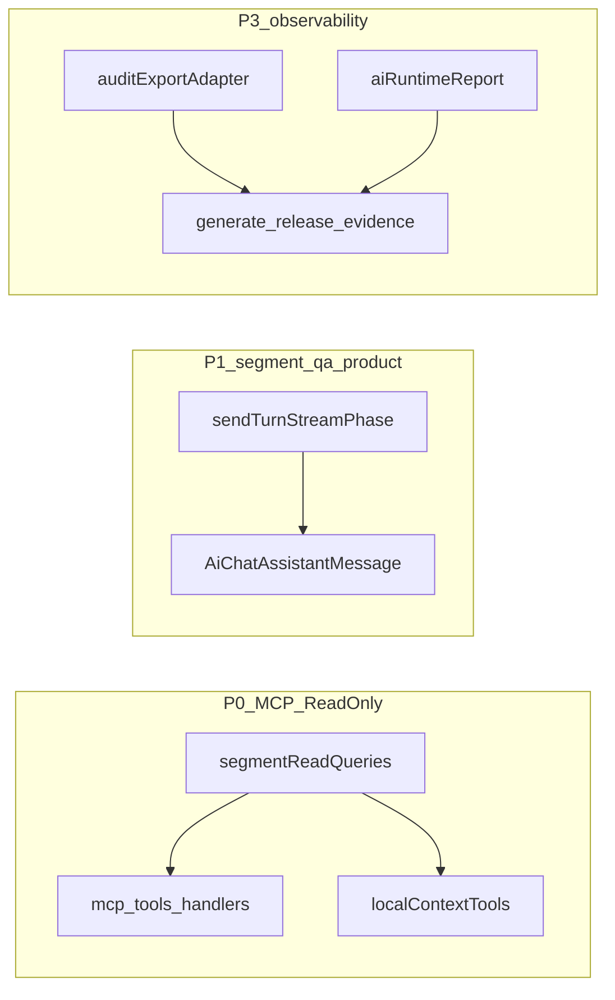

# P0–P3 落地情况多轮审查方案

## 0. 对照基准与已知代码事实（审查起点）

- **规划真源**：[docs/execution/plans/AI智能体架构改进方案-2026-05-06.md](docs/execution/plans/AI智能体架构改进方案-2026-05-06.md) 中 P0、P1、P2、P3 章节与 §9 PR 包、§9.8 验证基线、§11 风险排序。
- **已观察到的实现信号（只读核对，非最终结论）**：
  - **P0**：[`src/ai/queries/segmentReadQueries.ts`](src/ai/queries/segmentReadQueries.ts) + 测试；[`src/ai/mcp/server/tools.ts`](src/ai/mcp/server/tools.ts) 已 import 门面并标注真实查询；[`src/ai/chat/localContextTools.ts`](src/ai/chat/localContextTools.ts) 已复用 `segmentReadQueries`；[`src/ai/config/featureFlags.ts`](src/ai/config/featureFlags.ts) 已存在 `VITE_AI_MCP_SERVER_ENABLED` 读取路径。
  - **P1**：存在 `sourceScopeSummary` 路径（[`src/ai/vertical/sourceScopeSummary.ts`](src/ai/vertical/sourceScopeSummary.ts)、[`useAiChat.sendTurnStreamPhase.ts`](src/hooks/useAiChat.sendTurnStreamPhase.ts)、[`AiChatAssistantMessage.tsx`](src/components/ai/AiChatAssistantMessage.tsx)），与规划书中的 `CorpusSourceSetSummary` 命名不一致，需在审查中判定“等价落地 vs 仍缺字段/契约”。
  - **P2**：[`scripts/architecture-guard.config.mjs`](scripts/architecture-guard.config.mjs) 中 `useAiChat` 的 `maxLines` 已为 **1100**（方案里曾写 1350→1100 ratchet，需核对是否已达成第二阶段目标）。
  - **P3**：[`src/ai/eval/citationJudge.ts`](src/ai/eval/citationJudge.ts)、[`src/ai/eval/citationJudge.ts`](src/ai/eval/citationJudge.ts)、[`src/ai/audit/auditExportAdapter.ts`](src/ai/audit/auditExportAdapter.ts)、[`src/ai/eval/aiRuntimeReport.ts`](src/ai/eval/aiRuntimeReport.ts)（含 `byWorkflow` / `sampleRequestIds` 等字段）已存在；[`scripts/generate-release-evidence-bundle.mjs`](scripts/generate-release-evidence-bundle.mjs) 有大量 `skipReason` 分支，需对照方案中的 **skip taxonomy** 逐项核对是否“已结构化区分缺陷 skip vs 合理 skip”。

## 第一轮：验收清单对齐（完成度矩阵）

**目标**：把方案里每个 P0–P3 的 checkbox，映射到“已实现 / 部分实现 / 未实现 / 文档过时”。

**动作**：

1. 从规划书提取 P0–P3 的**原子验收项**（每条一行）。
2. 为每项标注**证据锚点**（文件路径 + 关键符号/测试名），例如：
   - P0：`tools.test.ts`、`McpServer.ts` 的 `runtimeContext` 注入、`readOptionalBooleanFlag` 路径。
   - P1：`buildSourceScopeSummaryFromEvidencePackets`、`ragCitationsToEvidencePackets`、`segmentQaReflection` 是否仅用于 retry 还是已透出 UI。
   - P2：`useAiChat.ts` 行数、`useAiChat.*` 文件数是否仍满足“不新增派生文件”的约束、P2a/P2b 迁移状态。
   - P3：`generate-release-evidence-bundle.mjs` 各卡片的 skip 分类、`auditExportAdapter` 是否被脚本消费、`relevanceJudge` 是否同样实现 `JudgeProvider`。

**产出**：`P0-P3_coverage_matrix.md`（可放在执行审计目录或作为审查附件；若你要求不进 docs，可先放 `docs/execution/audits/` 并跑 `check:docs-governance`）。

## 第二轮：主链路与旁路一致性（“链路是否正常”）

**目标**：验证“同一数据口径”在 **MCP**、**localContextTools**、**send-turn / RAG / evidence** 三条路径上是否一致，避免“一边真、一边假/一边宽、一边窄”。

**动作**：

1. **Scope 一致性**：对照 `McpServerRuntimeContext`（或等价结构）与 `SegmentReadQueryScope` / `resolveCorpusSourceSet` 的字段语义；列出“缺字段时的退化行为”是否会导致越界读取或空结果误读。
2. **Evidence 一致性**：从 [`useAiChat.sendPersistTurnAndBuildPromptContext.ts`](src/hooks/useAiChat.sendPersistTurnAndBuildPromptContext.ts) 追踪 `ragCitationsToEvidencePackets` → UI `citations` / `evidencePackets` → `sourceScopeSummary` 的生成条件；核对“无 evidence 时是否仍静默 degraded”。
3. **Agent loop 与审计**：从 [`useAiChat.agentLoopRunner.ts`](src/hooks/useAiChat.agentLoopRunner.ts) 核对 coordination audit、`pendingAgentLoopCheckpoint` 与 P3 release evidence 卡片字段是否能对上。

**产出**：一份“链路图 + 风险点列表（按严重度）”。

## 第三轮：测试与 CI 守门矩阵（可自动化证明）

**目标**：把“是否真绿”从主观判断变成可重复命令集合（与 §9.8 对齐）。

**动作**（执行阶段跑，不在 Plan mode 跑）：

- `npm run check:architecture-guard`
- `npm run check:agent-evals`（必要时 `check:agent-evals:trace`）
- `npm run check:plan-and-execute:pseudo-composed` 与 `check:plan-and-execute:checkpoint-recovery`（与 composed workflow / checkpoint 相关）
- 定向 vitest：`segmentReadQueries.test.ts`、`tools.test.ts`、`McpServer.test.ts`、`sourceScopeSummary.test.ts`、`citationJudge.test.ts`、`relevanceJudge.test.ts`、`aiRuntimeReport.test.ts`、`auditExportAdapter.test.ts`
- E2E：`npm run test:e2e:chromium` 中与 AI 相关的 smoke（当前仓库未见 `segmentQaEvidenceJump.spec.ts`，需在审查中标注“规划有、代码无”或改名存在）

**产出**：失败用例的“最小复现路径 + 怀疑模块”。

## 第四轮：定向 bug  hunt（高概率缺陷面）

**目标**：不靠广撒网，按数据边界与并发面做重点代码审阅。

**候选热点**（从架构形态推导，执行阶段用读代码 + 测试验证）：

1. **分页/offset 与总数**：`listSegmentSummaries` 返回 `total` 是否与 UI/MCP 分页语义一致。
2. **runtimeContext 缺失**：`textId/mediaId/layerId` 任一缺失时，工具结果是否仍“看起来像成功但其实 scope 过宽/过窄”。
3. **MCP 与 Dexie 异步**：`tools.ts` handler 的 async 路径是否在 server 层有超时/背压；与方案中 30s 约束是否一致。
4. **Evidence 与 citation 双轨**：若仍存在 legacy `citations` 字段，是否会在某些 workflow 下出现“UI 显示与 audit 不一致”。
5. **release evidence 的 skip 语义**：是否存在“其实是缺陷 skip 但被归因为 no_data”的分类错误。

**产出**：`bug_candidates` 列表（每条含：触发条件、影响、建议验证用例）。

## 第五轮：规划书一致性回写（避免“方案与事实漂移”）

**目标**：审查结束后，把规划书里仍写“未实现/硬编码 false/文件名不存在”的段落，改成与仓库一致（这是本轮审查的**文档交付物**之一）。

**已知的明显漂移点（需在第五轮修正）**：

- §1.2.1 仍写 `aiMcpServerEnabled` 硬编码 `false`，与 [`featureFlags.ts`](src/ai/config/featureFlags.ts) 现状冲突。
- P1 文案中的 `CorpusSourceSetSummary` vs 代码 `sourceScopeSummary` / `sourceScopeSummary.ts`：需统一命名或明确别名关系。
- PR 验收里引用不存在的 E2E 文件名时，应改为现有 spec 或补 spec 并更新方案。

## 最终交付物（审查结束时应具备的输出）

1. **P0–P3 完成度矩阵**（已实现/部分/缺失/文档过时）。
2. **链路一致性报告**（MCP vs 主链 vs audit）。
3. **测试矩阵结果**（命令 + 通过/失败摘要）。
4. **bug 候选清单**（按优先级排序，标明是否阻断发布）。
5. **规划书修订 PR**（仅修正漂移与验收命令，不改变技术路线）。

## 执行顺序建议

按 §11 的风险排序精神执行审查：**先证明 P0 数据真实性与 scope 正确，再证明 P1 evidence/source 口径，再进入 P3 观测链路**，避免“在假数据上做 release evidence 优化”。
