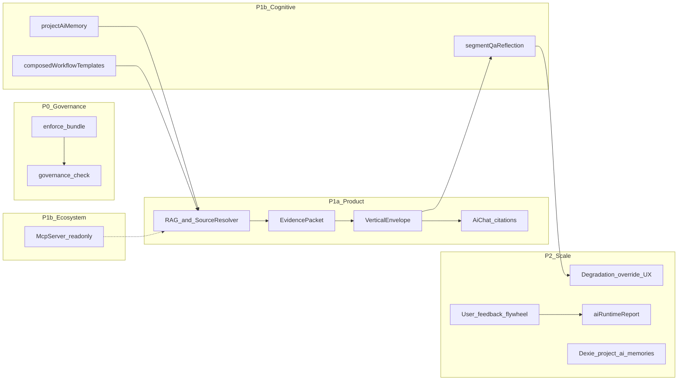

# PR1–20 全链路多轮次审查规划

## 依据与范围

- **单一规格源**：[docs/execution/plans/AI智能体-工业成熟度补齐路线图-2026-05-05.md](docs/execution/plans/AI智能体-工业成熟度补齐路线图-2026-05-05.md)（§0 目标、§1 差距、§2–5 分阶段交付、**§7.2 PR 切分表**、§7.3 实施细节、§9 验收分层）。
- **PR 枚举**：PR-1～PR-6（P0）、PR-7a/7b + PR-8～10（P1a）、PR-11～15（P1b）、PR-16～20（P2）。注意 **PR-7a 与 PR-7b 为同一工作流的前后两段**，审查时拆成两行，避免把「7b 待排期」误记为 7a 未完成。
- **与路线图修订记录的关系**：文档 §12 已将 PR-17～20 标为「已完成」；审查时仍以 **代码 + 门禁命令** 为准，修订记录仅作初筛。

## 审查原则（避免一轮走偏）

1. **分层验收**：blocking（安全/治理）与 quality / exploratory 分开记结论，与 §9 一致；不得用「全绿」掩盖 exploratory 未验证。
2. **产物分离**：PR-1 相关须区分 **enforce 正式产物** vs **dry-run / shadow 报告**（例如当前仓库中的 [release-evidence-governance-gate.json](docs/execution/release-gates/release-evidence/release-evidence-governance-gate.json) 若仍为 `dryRun: true` / `mode: shadow`，应标注为「非 enforce SoT」，不得与 PR-1 退出条件混为一谈）。
3. **「不触碰」约束**：PR 表右列「不触碰」为负向验收项——审查时检查是否出现越界改动（例如 P0 某些 PR 声明不改生产核心逻辑）。
4. **文档漂移**：路线图 §7.2 底部「新增 script 在 package.json 均不存在」**已过时**（当前 [package.json](package.json) 已存在大量 `gate:*`、`check:agent-evals:cases` 等）；审查输出中应单列 **路线图正文 vs 仓库现状** 的文档修正建议（可选：小补丁更新 §7.2 说明，非本次审查必选）。

## 五轮审查流程

### 第一轮：PR × 交付物 × 证据 — 可追溯矩阵

为每个 PR 建一行（建议产出 Markdown 表或审计 ndjson），列至少包括：

| 列 | 说明 |
|----|------|
| PR 编号 / 阶段 | 来自 §7.2 |
| 路线图交付描述 | 来自 §2.1–5.1 与 §7.2「范围」 |
| **验收命令** | 从 §2.3、§3.3、§4.3、§5.3 映射到该 PR（多对多时全列） |
| **代码锚点** | §7.2「文件类型」+ §7.3.6 MCP 落位清单中的具体路径 |
| **门禁证据类型** | script 通过 / vitest / 生成 JSON / 人工 spot-check |
| 结论占位 | 第二轮后填 |

**重点映射示例**（审查表内应展开至 20 行）：

- PR-1：`gate:release-evidence:governance:enforce` + [scripts/check-release-evidence-governance.mjs](scripts/check-release-evidence-governance.mjs) + [scripts/generate-release-evidence-bundle.mjs](scripts/generate-release-evidence-bundle.mjs) + `docs/execution/release-gates/release-evidence/` 下 enforce 产物与 `archive/dry-run/` 历史件。
- PR-2/6：[src/ai/vertical/](src/ai/vertical/)（registry、evidence、tool shadow、[mcpCompatibility.ts](src/ai/vertical/mcpCompatibility.ts)）、`npm run check:mcp-schema-compatibility`。
- PR-3/8：[scripts/agent-evals/run-cases.mjs](scripts/agent-evals/run-cases.mjs)、[scripts/agent-evals/cases/](scripts/agent-evals/cases/)（当前约 30 个 JSON + 测试文件，与 §3.1「30 条」对齐度在此轮清点）。
- PR-7b：对照 §3.1 PR-7b 子弹（`corpus_source_set`、`candidateSourceIds`、evidence 卡片 UI、degraded UX、prompt 注入与 citation 校验）——**与 §3.1「待排期」及 §3.4「PR-7b 质量增强待排期」逐条打勾/打叉**。

### 第二轮：自动化门禁「全链路」扫一遍

按阶段串跑（可一条 shell 串联，日志落文件），与路线图一致：

**P0（§2.3）**  
`typecheck`、`check:architecture-guard`、`check:ai-session-sidecar-entrypoints`、`check:voice-agent-pre-merge`、`check:agent-evals:trace`、`check:agent-evals:cases`、`gate:release-evidence:core`、`gate:release-evidence:governance:enforce`、`check:mcp-schema-compatibility`。

**P1a（§3.3）**  
`gate:release-evidence:session-sidecar-sandbox`、`check:release-evidence:governance:strict`（若仍存在，明确其 **dry-run/报告** 语义，与 PR-1 拆分是否一致）、`gate:voice-maintenance`、`gate:release-evidence:core`、`perf:ai`（若存在）、`check:agent-evals:cases`、`check:workflow-cost-baseline`、`check:citation-accuracy`。

**P1b（§4.3）**  
`typecheck`、`check:agent-evals:cases`、`check:llm-as-judge:citation`、`check:mcp-server:read-only`、**`check:reflection:segment-qa`**（路线图标列；当前 [package.json](package.json) 中未见该 script——第二轮应记为 **缺失或别名不同**）、`check:plan-and-execute:pseudo-composed`。

**P2（§5.3）**  
`gate:release-evidence:core:require-cost-guard-trend-ready`、`gate:m6-release`、`check:agent-evals:cases`、`test:e2e:chromium`、`gate:m5-observability`、`check:llm-as-judge:relevance`、`check:plan-and-execute:checkpoint-recovery`、`check:a2a-schema-reservation`、`check:user-feedback-flywheel`、**`check:degradation-manual-override`**（路线图标列；仓库有 [scripts/check-degradation-manual-override.mjs](scripts/check-degradation-manual-override.mjs)，但 **package.json 未挂载**——记 gap）。

**本轮产出**：按「命令 → exit → 关键日志片段」归档；失败项反向映射到 PR 行。

### 第三轮：代码锚点 spot-audit（按 PR 抽查「是否真落地」）

每 PR 至少 1 个「深读」锚点 + 1 个「负向」检查（是否违反不触碰）：

- **PR-4**：[`src/ai/policy/`](src/ai/policy/) 与 `aiCapabilityTaxonomy`、写入口扫描脚本；与 agent-evals 中 policy/adversarial case 行为是否同向。
- **PR-5**：[`src/ai/boundary-guard.test.ts`](src/ai/boundary-guard.test.ts)（若存在）与 pre-merge 脚本引用关系。
- **PR-7a**：[`src/ai/vertical/sourceResolver.ts`](src/ai/vertical/sourceResolver.ts)、[`evidencePacket.ts`](src/ai/vertical/evidencePacket.ts)、[`useAiChat.sendTurnStreamPhase.ts`](src/hooks/useAiChat.sendTurnStreamPhase.ts) / persist 链路上 envelope 与 audit。
- **PR-11/20**：[`projectAiMemory.ts`](src/ai/memory/projectAiMemory.ts) vs Dexie [`project_ai_memories`](src/db/)（schema、migration、单测）；是否「不删 localStorage 版」仍成立。
- **PR-12**：[`segmentQaReflection.ts`](src/ai/vertical/segmentQaReflection.ts) 与 audit 类型（路线图 PR 表写 `reflection.ts` 为 **文档路径漂移**，审查报告注明）。
- **PR-13/18**：[`composedWorkflowTemplates.ts`](src/ai/vertical/composedWorkflowTemplates.ts) + [`TaskRunner.ts`](src/ai/tasks/TaskRunner.ts) 的 `lastError` / retry。
- **PR-14/19**：[`citationJudge.ts`](src/ai/eval/citationJudge.ts)、[`relevanceJudge.ts`](src/ai/eval/relevanceJudge.ts)、[`aiRuntimeReport.ts`](src/ai/eval/aiRuntimeReport.ts)。
- **PR-15**：[`src/ai/mcp/server/`](src/ai/mcp/server/) 与 `check-mcp-server-read-only.mjs` 覆盖范围（mock vs 真实 HTTP）。
- **PR-16/17**：[`userFeedback`](src/ai/eval/userFeedback.ts)、[`AiChatFeedbackButtons.tsx`](src/components/ai/AiChatFeedbackButtons.tsx)、[`degradationManualOverride.ts`](src/ai/chat/degradationManualOverride.ts)、[`AiChatDegradationOverride.tsx`](src/components/ai/AiChatDegradationOverride.tsx)。
- **PR-20**：[`a2aSchemaReservation.ts`](src/ai/vertical/a2aSchemaReservation.ts)、[`src/ai/mcp/client/`](src/ai/mcp/client/)。

### 第四轮：端到端叙事一致性（「闭环故事」是否自洽）

用一条用户旅程串 PR（便于发现「有类型无调用」「有脚本无 npm」）：

审查问题清单示例：**envelope 是否在 persist 与 stream_done 两阶段一致**；**Reflection 结果是否进入 audit 且与 PR-17 UX 同源**；**MCP Server 是否与 EvidencePacket 叙事隔离（只读不写入主链）**。

### 第五轮：差距清单与优先级（审查交付物）

输出结构化结论（建议固定小节）：

1. **Blocking**：门禁失败、enforce 口径违规、安全 case 未覆盖。
2. **Quality**：quality case 通过率、引用/成本脚本与运行时脱节（路线图已声明部分为「预留」）。
3. **Exploratory**：MCP 外部客户端真实调用、飞轮月增量等——区分「未验证」与「不适用」。
4. **Doc/Repo drift**：如 PR-12 路径、§7.2 script 占位说明过时、**npm script 缺失**（`check:reflection:segment-qa`、`check:degradation-manual-override`）。
5. **PR-7b 专项**：逐条对照 §3.1，标为 done / partial / not_started。

## 建议排期（执行审查时）

- **0.5 天**：第一轮矩阵 + 第四轮草图。
- **0.5–1 天**：第二轮全命令跑通（含 e2e 与 m6 gate 时适当延长）。
- **1–1.5 天**：第三轮锚点深读 + 第五轮成文。

## 不在本次「审查规划」内（除非用户追加）

- 直接改路线图正文或修 CI（审查完成后可另开任务）。
- 对 PR-7b 或 P2 未达标项做实现，除非审查结论升级为「修复任务」。
