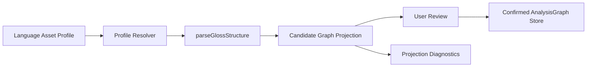

# Structural Rule Profile 完整实施计划

## 目标

把当前已新增的 `src/annotation/` 代码基座推进为产品可用能力：用户可在语言资产中配置 structural rule profile，标注页使用解析与 projection 生成候选 `analysisGraph`，用户确认后才写入标注关系层。

核心链路：

## 实施阶段

### P0：冻结合同与基线

- 保留并扩展当前 `src/annotation/analysisGraph.ts`、`src/annotation/structuralRuleProfile.ts`、`src/annotation/analysisGraphProjection.ts`。
- 将 `docs/execution/audits/标注-analysisGraph-fixture基线-2026-04-25.md` 作为验收样例来源，后续每新增 edge case 先补 fixture。
- 明确 `LeipzigValidator` 和 structural parser 分工：`src/ai/LeipzigValidator.ts` 负责缩写/格式校验，`src/annotation/structuralRuleProfile.ts` 负责结构符号解析。

### P1：语言资产持久化模型

- 在 `src/db/types.ts` 新增 `StructuralRuleProfileAssetDocType`。
- 在 `src/db/schemas.ts` 新增 Zod 校验与 `validateStructuralRuleProfileAssetDoc`。
- 在 Dexie engine 中新增集合，例如 `structural_rule_profiles`，字段建议：`id`、`scope`、`languageId?`、`projectId?`、`enabled`、`priority`、`profile`、`createdAt`、`updatedAt`、`provenance?`。
- 更新 import/export 校验映射，确保语言资产模板可随项目导入导出。

### P2：Profile Resolver

- 新增 `src/annotation/structuralRuleProfileResolver.ts`。
- 实现 `resolveStructuralRuleProfile(systemProfile, assets, context)`。
- 合并顺序严格遵守路线图：系统默认 → 语言模板 → 项目模板 → 用户会话覆盖。
- disabled asset 不参与；同 scope 内按 `priority` 和 `updatedAt` 决定覆盖顺序。
- resolver 输出前必须跑 `validateStructuralRuleProfile()`，marker 冲突直接变成可展示错误。

### P3：Service 边界

- 新增或扩展语言资产 service，优先沿用 `src/services/LinguisticService.orthography.ts` 的模式。
- 建议新增 `src/services/LinguisticService.structuralProfiles.ts`，提供 create/update/list/enable/disable/preview。
- preview API 串起：asset/profile → resolver → `parseGlossStructure()` → `projectStructuralParseToAnalysisGraph()`。
- preview 只返回候选 graph 和 diagnostics，不写 `unit_tokens`、`unit_morphemes` 或 relation 表。

### P4：标注页候选预览

- 在标注页 M1b/M2 入口中增加 “结构解析预览”。
- 输入 gloss 后用当前语言/项目 profile 做即时解析，展示 segments、boundaries、warnings、projection diagnostics。
- 对 `needsReview` 和 `unsupported` 只显示候选，不允许一键静默写入。
- 用户确认后才进入 `alternativeAnalysis` 或 pending relation，仍不覆盖 `manualConfirmed` 结果。

### P5：Confirmed AnalysisGraph 存储

- 在确认 UX 稳定后，再决定是否新增专门 graph store，或先复用 `UnitRelationDocType`/已有 relation 存储。
- 最小写入只支持 `glosses`、`hasPos`、`linksLexeme`、`partOfMwe`、`discontinuousPartOf`、`alternativeAnalysis`。
- 高级关系如 `suppletes`、`derivedByProcess`、`overwritesTone` 先作为候选和只读诊断，不在第一批开放编辑。

### P6：语言资产 UI

- 在语言资产面板新增 `Validator 模板 / Structural Profile` 子页。
- 支持新建、复制系统模板、编辑符号、启停、导入导出、sandbox preview。
- UI 表单不暴露原始 JSON 作为唯一入口；高级模式可查看 JSON，但保存前必须通过 schema。
- sandbox 输入一行 gloss，实时展示 parser result、候选 graph 摘要和 diagnostics。

### P7：导出与互操作

- projection diagnostic 进入导出管线：LaTeX 可完整表达的直接导出，CoNLL-U/FLEx/LIFT 表达不足的降级到 MISC/custom field/note。
- 导出前展示 “完整表达 / 降级 / 需确认 / 不支持” 汇总。
- 每个导出 profile 加 1-2 个 fixture 回归测试。

### P8：测试与门禁

- 单元测试：resolver、service preview、parser、projection、schema。
- DB 测试：Dexie migration/import/export round trip。
- 页面测试：语言资产 sandbox、标注页候选预览、确认写入不覆盖人工结果。
- 每个阶段至少跑 `npm run -s typecheck` 和聚焦 Vitest；涉及 docs 或 DB schema 时补跑对应治理/迁移测试。

## 不做的事

- 不把复杂形态关系塞回 gloss/POS/note 字符串。
- 不在第一阶段做任意 graph editor。
- 不让 parser 自动覆盖人工确认结果。
- 不把 Leipzig 当成唯一理论模型；它只是默认 profile 和展示/导出约定。