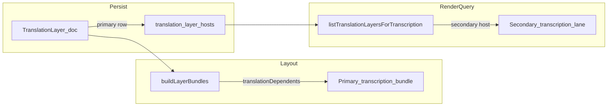

# 多宿主译文层（方案 2b）实现规划

## 背景与约束

- 今天译文只认单父：[`LayerDocType.parentLayerId`](src/db/types.ts)，[`buildLayerBundles`](src/services/LayerOrderingService.ts) 用 `rootBundles.get(layer.parentLayerId)` 把译文放进**唯一**独立转写 bundle 的 `translationDependents`。
- 已存在 [`LayerLinkDocType` / `layer_links`](src/db/types.ts)（`transcriptionLayerKey` + `layerId`），在 [`useTranscriptionLayerActions.syncTranslationParentLinks`](src/hooks/useTranscriptionLayerActions.ts) 里用于重连；语义与索引偏「键桥接」，不宜无设计地塞满「多宿主」以免与 `linkType`/`literal` 等含义打架。**2b 采用新集合**更清晰，后续若收敛可再评估合并。

## 目标数据模型

新建文档类型（名称可最终定稿，例如 **`TranslationLayerHostDocType`**），集合名例如 **`translation_layer_hosts`**：

- `id: string`（建议 `textId::translationLayerId::transcriptionLayerId` 或 UUID）
- `textId: string`
- `translationLayerId: string`（宿主：译文层）
- `transcriptionLayerId: string`（被宿主：转写层）
- `role: 'primary' | 'secondary'`（**主宿主**决定 `buildLayerBundles` 归属与默认导出主轴）
- `sortOrder: number`（同角色内排序；主宿主通常 0）
- `createdAt` / `updatedAt`

**不变式（建议）**：

- 同一 `(textId, translationLayerId, transcriptionLayerId)` 唯一。
- 每个 `translationLayerId` 在迁移后**至少一条** `primary`（可与现有 `parentLayerId` 对齐）。
- `secondary` 可 0..N。

**与 `parentLayerId` 的关系（迁移策略）**：

- **Phase 1（双写/读合并）**：写入/更新宿主表时，同步把 `primary` 的 `transcriptionLayerId` 写回 `LayerDocType.parentLayerId`，保证旧代码路径不炸。
- **Phase 2（可选）**：读路径全面走解析器后，再评估是否弱化为「仅缓存/冗余」或移除（需更大回归面）。

## 存储与校验落点

- **类型与 Zod**：[`src/db/types.ts`](src/db/types.ts) + [`src/db/schemas.ts`](src/db/schemas.ts) + `validateTranslationLayerHostDoc` 接入 [`src/db/io.ts`](src/db/io.ts) 的 `tableByCollection` / `validate*` 映射。
- **Dexie**：[`src/db/engine.ts`](src/db/engine.ts) 新版本 migration：建表 + 复合索引（至少 `translationLayerId`、`transcriptionLayerId`、`textId`）。
- **Rx 适配**：与 `layer_links` 同模式挂 [`DexieCollectionAdapter`](src/db/engine.ts)（或项目既有 CollectionAdapter 模式）。
- **事务边界**：在 [`src/db/dexieTranscriptionGraphStores.ts`](src/db/dexieTranscriptionGraphStores.ts) 增加读写 store 列表，凡「改层 + 改宿主」同事务处必须声明新表。
- **级联**：[`LayerTierUnifiedService`](src/services/LayerTierUnifiedService.ts) 删除译文层时 `removeBySelector` 同步清理宿主行（与 `layer_links` 清理并列）。

## 核心读模型：统一解析 API

新增小模块（建议路径 [`src/hooks/useTranscriptionLayerActions.ts`](src/hooks/useTranscriptionLayerActions.ts) 或 `src/utils/translationLayerHosts.ts`）：

- `listHostTranscriptionLayerIds(translationLayerId, { hosts, layers })` → `string[]`（含 primary/secondary，有序）。
- `listTranslationLayersForTranscription(transcriptionLayerId, { hosts, layers })` → 译文层列表（**宿主表命中 OR `parentLayerId===id`**，过渡期并集）。
- `getPrimaryHostTranscriptionLayerId(translationLayerId, ...)` → 用于拖拽/排序锚点。
- `assertHostInvariants(...)`（开发/迁移校验用）。

**对照视图**：将 [`TranscriptionTimelineComparison`](src/pages/TranscriptionPage.ReadyWorkspace.tsx) 内 `translationLayerAppliesToComparisonSourceTranscriptionIds` / `pickTranslationLayerForComparisonUnit` 从「只看 `parentLayerId`」改为调用解析器（以 `transcriptionLayerId` 精确匹配宿主）。

**层操作**：[`useTranscriptionLayerActions`](src/hooks/useTranscriptionLayerActions.ts) 里「列译文子层」「重绑父层」等 `.filter((layer) => ... parentLayerId === targetLayer.id)` 改为「宿主表包含该转写 id」。

## `buildLayerBundles` 与 UI 轨道策略（关键产品决策，写进实现说明）

- **轨道排序/拖拽**：译文层仍只挂在 **primary** 对应独立转写 bundle 的 `translationDependents`（保持 [`buildLayerBundles`](src/services/LayerOrderingService.ts) 主体结构不大改），避免一条译文在扁平 `layers[]` 里出现两次导致 `sortOrder`/拖拽地狱。
- **「法轨也要看到同一中文轨」**：在 **渲染/查询层**（如 [`TranscriptionTimelineMediaLanes`](src/components/TranscriptionTimelineHorizontalMediaLanes.tsx) 或数据源 hook）对给定 `transcriptionLayerId` 合并 `listTranslationLayersForTranscription`，而不是依赖 bundle 内是否包含该译文行。

## 写入路径（创建/编辑宿主）

- **创建译文层**：[`useTranscriptionLayerActions`](src/hooks/useTranscriptionLayerActions.ts)（或 `LayerTierUnifiedService`）在插入译文层后写入 1 条 `primary` host；若产品 UI 允许多选宿主，则批量 upsert + 重设 primary（单事务）。
- **切换主宿主**：更新 `role`/`sortOrder` + 同步 `parentLayerId`（Phase 1）；必要时触发 `computeCanonicalLayerOrder` 相关路径（[`LayerOrderingService`](src/services/LayerOrderingService.ts)）。
- **删除转写层**：删除或级联更新宿主行（禁止译文层悬空：若删的是 primary，需提升某 secondary 或阻止删除并提示）。

## 同步、导入导出、云

- 若存在项目快照/云同步：在对应 snapshot schema 与 merge 规则中增加该集合（搜索 `layer_links` 的同步处理方式对齐）。
- JSON 导入：[`src/db/importDatabaseFromJson`](src/db/importDatabaseFromJson.test.ts) 一类路径需支持新集合或迁移生成。

## 测试矩阵（最小）

- 迁移：旧库仅有 `parentLayerId` → 宿主表有一条 `primary`，读 API 与旧过滤等价。
- 双宿主：英+法各一条转写 + 一条中文译文，`listTranslationLayersForTranscription('fr')` 与 `('en')` 均包含中文层 id。
- 删除/重绑：删主宿主、换主宿主、`LayerTierUnifiedService` 删译文层清理宿主。
- 对照：纵向模式下法组仍显示中文（与当前 [`filterTranslationLayersForComparisonGroup`](src/pages/TranscriptionPage.ReadyWorkspace.tsx) 目标一致）。

## 分期（建议）

1. **P0**：类型 + Dexie/Rx + 迁移 + `TranslationLayerHostService` + 级联删除；**读路径**先用于对照/过滤；写路径保持「改 `parentLayerId` 即同步一行 primary host」。
2. **P1**：UI：层管理器/侧栏增加「多宿主」编辑；时间轴译文轨在非法轨上通过查询显示（若产品确认要显示）。
3. **P2**：导出/AI 主轴策略、性能索引、考虑与 `layer_links` 合并或废弃重复概念。

## 风险与显式不做

- **同一译文对英/法同时维护两套不同正文**：仍是一条译文层 + 一份 segment 存储；若产品要「分宿主分叉正文」，应另开译文层或引入分支语义（本方案不覆盖）。
- **权限/锁**：多宿主需后续产品规则（可在 P2）。
