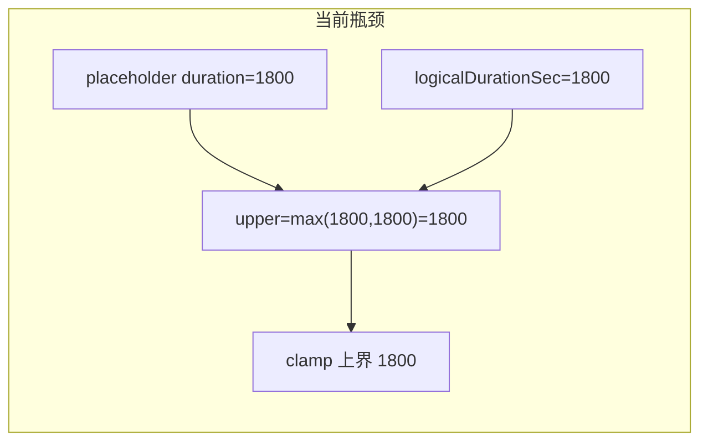

# 无媒体独立语段突破 1800s 上限

## 竞品与领域做法（简要）

| 产品 / 模式 | 无媒体或「纯文档」时间 | 绑定媒体后 | 删媒体后 |
|-------------|------------------------|------------|----------|
| **ELAN** | 新建工程通常与媒体一起创建；时间对齐层语义上依附于媒体时间线。独立层/无媒体场景下，标注时间可沿时间轴延伸（无「先写死 30 分钟画布」的硬编码上限），见 [MPI ELAN 手册：Creating a new document](https://www.mpi.nl/tools/elan/docs/manual/Sec_Creating_a_new_document.html)。 | 时间轴与播放器时长一致，标注受媒体时长约束。 | 媒体路径断开时仍保留标注时间值；与具体实现相关，常见为保留时间戳而非重算。 |
| **Praat / Audacity** | 无独立「无限」声学轴：对象时长即边界。 | 同左。 | 删除 sound 即对象消失或时长变。 |
| **Jieyu 现状** | 同左。 | 晋升占位后写真实 `duration`；**计划变更**：若该 `mediaId` 上已有 unit/segment 的 `endTime` 超过新文件时长，则**线性压缩**到 `[0, duration]`（见下文）。 | [`deleteAudioPreserveTimeline`](src/services/LinguisticService.cleanup.ts) 仍保留行与时间；仅 UI 文案与实现曾对用户误导。 |

**对比结论**：删音后保留坐标与 ELAN 等仍可对齐；**不合理的是 1800 与 `max(media, logical)` 组合成的建段硬顶**。首次导入声学时，ELAN/Praat 系工作流通常以**媒体时长**为可见上界，故在「占位 → 声学」转折点做一次**时间轴比例映射**与竞品「绑定媒体后受时长约束」一致。

---

## 目标行为

1. **无声学占位轨 / 文献轴**：独立语段拖选、「下一段」等插入上界视为**无声学上限**（仅受兄弟语段间隙与 time_subdivision 父边界约束），可沿时间轴任意延伸。
2. **有声学轨**：保持现有语义——[`independentSegmentInsertionUpperBoundSec`](src/utils/timelineMediaDurationForBounds.ts) 仍为 `max(声学时长, 逻辑跨度)`，避免「画布逻辑长于 `media.duration` 时拖选被误夹到已有语段上」的回归（注释已说明）。
3. **缩放 / 标尺**：当语段实际已超出 `metadata.logicalDurationSec` 时，时间轴可读跨度应至少覆盖 **`max(元数据逻辑长, 当前轨上 units 最大 end)`**，避免「库里有远端语段但视口仍锁在 1800」。
4. **首次绑定声学（占位晋升 / replace 到占位）**：若该 `mediaId` 下时间跨度相对新文件**超长**，则对该 `mediaId` 上所有相关行的 `startTime`/`endTime` 做**缩放 + 平移**（你已选「非仅缩放」）。**建议默认 v1 算法**（实现与测试写死，后续可加设置）：令 `L = max(maxUnitEnd(units on mediaId), texts.metadata.logicalDurationSec ?? 0)`；若 `L > duration` 且 `duration > ε`：(1) 比例 `s = duration / L`；(2) `t1 = t * s`；(3) **平移** `t2 = t1 - minStartMapped`（使映射后最早起点为 0）；(4) 若因舍入导致 `maxEnd > duration`，再整体左移或右端钳制（二选一写清）。若 `L <= duration` 则**不做映射**（零变换）。最小段长（如 0.05s）在映射后若违反，需次要策略（钳制 end 或合并，测试中固定）。
5. **删音频文案**：与实现一致——删除的是**可播放载荷**（blob/url），**不**级联删除 `layer_units`；占位行与同 id 保留。更新 [`src/i18n/index.ts`](src/i18n/index.ts) 中 `transcription.dialog.deleteAudioDescription`、`transcription.action.confirmDeleteAudio`（中/英），必要时核对 [`TranscriptionPage.Dialogs.tsx`](src/pages/TranscriptionPage.Dialogs.tsx) 仅用上述 key。

---

## 实现方案（推荐，改动集中）

### 1. 占位行：建段上界视为无界

在 [`mediaDurationSecForTimeBounds`](src/utils/timelineMediaDurationForBounds.ts) 中（或紧邻的专用小函数，避免循环依赖）：

- 若 [`isMediaItemPlaceholderRow`](src/utils/mediaItemTimelineKind.ts)（或等价的 `resolveMediaItemTimelineKind === 'placeholder'`）为真，则**直接返回 `Number.POSITIVE_INFINITY`**，不再使用占位行上的正 `duration` 作为声学上界。

这样：

- 删音后占位行若带有较大 `duration`（[`deleteAudioPreserveTimeline`](src/services/LinguisticService.cleanup.ts) 写入），仍不会在「占位」语义下误当声学硬顶。
- 与文件中已有注释一致：`duration <= 0` 已表示「尚无声学上界」；占位行在语义上同属「无声学上界」。

**类型**：将参数从 `{ duration?: number }` 收窄为可传入 `Pick<MediaItemDocType, 'duration' | 'details' | 'filename'>`（或 `MediaItemDocType`），更新所有调用点（[`transcriptionSegmentCreationActions`](src/pages/transcriptionSegmentCreationActions.ts)、AI adapter、测试等）。

**测试**：扩展 [`timelineMediaDurationForBounds.test.ts`](src/utils/timelineMediaDurationForBounds.test.ts)：`placeholder + duration: 1800` → `Infinity`；声学行 `duration: 60` → `60`；`independentSegmentInsertionUpperBoundSec(placeholder1800, 9999)` → `Infinity`（与 `logicalCap` 无关）。

### 2. 逻辑轴缩放：与内容最大 end 取 max

在 [`computeLogicalTimelineDurationForZoom`](src/pages/readyWorkspaceLogicalTimelineDuration.ts) 中：

- 在「metadata 中有正的 `logicalDurationSec`」分支下，仍计算 `maxEnd`（遍历 `unitsOnCurrentMedia`），返回 **`Math.max(logicalDurationSecFromMapping, maxEnd)`**（若全为 0 则维持原 `logicalDurationSec`）。
- 更新/新增 [`readyWorkspaceLogicalTimelineDuration` 单测](src/pages/)（若尚无独立测试文件，可在 `TranscriptionPage` 相关测试或新建小测试文件中覆盖）：`logical=1800`、某 unit `endTime=5000` → 期望 `5000`。

这样 ReadyWorkspace 里 [`tierIndependentSegmentCreateRangeClamp`](src/pages/TranscriptionPage.ReadyWorkspace.tsx) 与传给 segment creation 的 `logicalTimelineDurationForZoom` 与波形桥一致增长。

### 3. 默认值是否仍写 1800（可选、产品决策）

- **最小改动**：保留 [`createProject`](src/services/LinguisticService.ts) / [`ensureDocumentTimeline`](src/services/LinguisticService.ts) / [`createPlaceholderMedia`](src/services/LinguisticService.ts) 的 1800 作为「空项目初始画布」与导出/测试锚点，仅通过 (1)(2) 解除**硬顶**。
- **若希望占位行 `duration` 与「无声学」语义一致**：可把新占位 `duration` 改为 `0`，依赖 (1) 中 placeholder 分支返回 `Infinity`；需审计少量依赖「占位 duration > 0」的代码路径（优先用 (1) 的显式分支更稳）。

### 4. 导入声学后的时间比例映射 + 平移（新增）

- **触发点**：[`LinguisticService.importAudio`](src/services/LinguisticService.ts) 在 `shouldPromotePlaceholders` 为真且成功 `put` 声学行**之后**（同一 Dexie 事务内为佳，与 `refreshMediaTimelineMetadata` 顺序需设计），或 `replace` 到占位晋升的等价路径；**不要**在「add 新轨」且未合并旧占位语料时误映射其它 `mediaId`。
- **输入**：目标 `mediaId`、`input.duration`（新文件秒数）、该 `textId` 下该 `mediaId` 的 `layer_units`（含 `unit` 与 `segment`）、`texts.metadata.logicalDurationSec`（参与 `L`）。
- **公式**：见上文「目标行为」第 4 点（缩放后减 `minStartMapped`，再处理舍入越界）；`toFixed(3)` 与现有一致；`refreshMediaTimelineMetadata` 在映射后应用更新后的 `logicalDurationSec`（通常 `duration` 或与 `newMaxEnd` 取 max）。
- **关联数据**：若 `anchors`、`unit_relations` 等存绝对秒且挂同一 `mediaId`，需一并检索并同步或确认仅 `layer_units` 为权威时间（以代码审计为准）。
- **后续扩展**：若产品要「可配置 offset」，可在设置或导入对话框暴露；v1 采用固定平移规则即可。
- **测试**：在 [`LinguisticService.test.ts`](src/services/LinguisticService.test.ts) 增加「占位上长语段 → importAudio → 全部落入 `[0, duration]`」用例；覆盖 `L <= duration` 时零变换。

### 5. 删音频文案（新增）

- 替换「及其所有句段」为准确描述，例如：**移除当前媒体的录音/可播放文件，时间轴上的句段与转写内容保留，并以占位轨继续编辑**（中文）；英文对等。
- 同步 [`reportActionError`](src/pages/useTranscriptionProjectMediaController.ts) 使用的 `actionLabel` 所引 key，避免两处措辞矛盾。

---

## 回归与验证清单

- [`transcriptionSegmentCreationActions`](src/pages/transcriptionSegmentCreationActions.ts) / [`useTranscriptionSegmentCreationController.test.tsx`](src/pages/useTranscriptionSegmentCreationController.test.tsx)：独立语段在占位媒体 + `logicalTimelineDurationSec=1800` 下，拖选超过 1800 仍应成功（mock 占位行 `details.timelineKind: 'placeholder'`）。
- [`LinguisticService.test.ts`](src/services/LinguisticService.test.ts)：新增 import 重映射用例；既有 `deleteAudio keeps unit times` 等**删音**用例应保持。
- 有声学：`independentSegmentInsertionUpperBoundSec({ duration: 30 }, 5000)` 仍为 `5000`，防止波形短于逻辑轴时的回归。

---

## 非目标（本迭代不做）

- **再次**导入第二条声学轨（`importMode: 'add'`）时对旧轨自动重映射（仅规定占位→首条声学绑定路径）。
- UI 上为「导入是否压缩时间轴」提供单独开关（若后续需要再在设置里加）。
