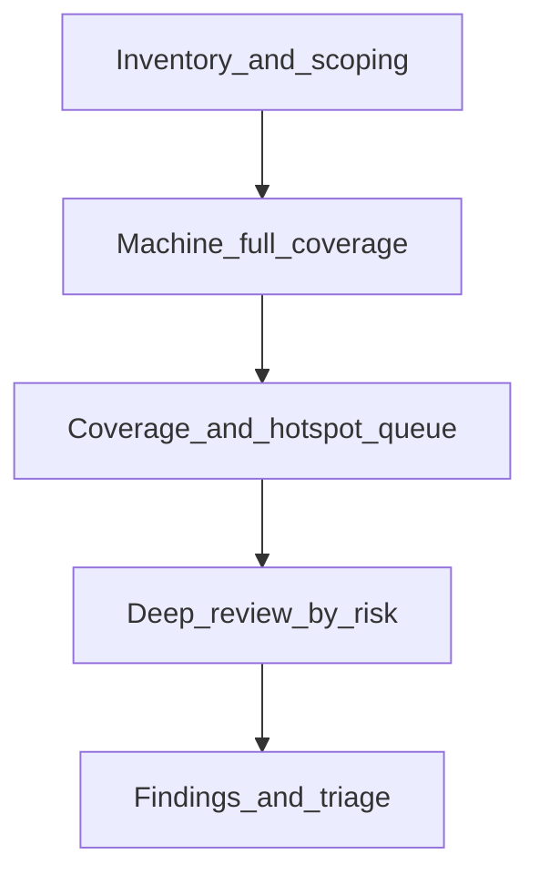

# 全仓“全覆盖”代码审查规划（Jieyu）

## 先对齐现实约束（否则目标会失真）

- **“逐行通读全仓”**对中大型前端/TS 仓库通常不可作为单一交付标准：成本高、注意力衰减快、且会漏掉跨文件不变量（并发、事务、同步协议）。
- 更可靠的“全覆盖”定义建议拆成两层：
  - **机器全覆盖**：对可自动化规则做到“零漏网”（类型、lint、架构守卫、回归测试矩阵、依赖审计等）。
  - **认知全覆盖**：对**高风险面**与**测试盲区**做到系统性深读，并用清单保证没有“整块区域从未被审视”。

本仓库已经内置了很强的“机器审查”编排，应作为第一轮基线：[`package.json`](package.json) 的 `validate`（`typecheck` + `gate:acoustic` + `test` + `build:guard`）与 `test`（包含大量 `check:*` 与 `vitest run`）。

## 第 0 步：划定审查边界与资产地图（半天级）

- **纳入**：`src/`、`scripts/`、`public/`（若含业务契约/数据种子）、关键配置（`vite`/`tsconfig`/`playwright`）、`docs/` 仅当与实现一致性相关（仓库另有文档治理脚本）。
- **排除/降权**：生成物、第三方 vendored、体积巨大的静态资源（改为抽检/哈希一致性）、纯锁文件噪声。
- **输出**：目录级“风险标签”（例如：`src/collaboration/cloud/`、`src/db/`、`src/hooks/useTranscription*Sync*`、`src/ai/chat/`）与依赖边界图（可直接消费 `npm run report:architecture-hotspots` / `check:architecture-guard` 的方向）。

## 第 1 步：机器层“全覆盖”（优先跑通 `validate`）

目标：把“能自动证明错/可疑”的问题尽量归零。

- **类型系统全覆盖**：`npm run typecheck`（[`package.json`](package.json)）。
- **项目自研门禁矩阵（比通用 ESLint 更贴近 Jieyu）**：直接以 `npm run test` 为中枢（它会串联 CSS 架构、i18n hardcoded guard、分层/分段存储边界、tier 边界、translation host link SSOT、架构守卫等，见 [`package.json`](package.json) 的 `test` 脚本）。
- **构建与供应链**：`npm run build:guard`（含 `npm audit --omit=dev`）。
- **专项回归闸门（按需叠加，不必一次全开）**：例如协作云相关 `gate:collaboration-cloud`、时间线迁移相关 `gate:timeline-cqrs-full-migration`、面板 `gate:panel-phase1` 等（都在 [`package.json`](package.json)）。

**产物**：失败项=必须修复或明确豁免；警告项进入人工复核队列。

## 第 2 步：把“逐行”落到“可证明的执行路径覆盖”

目标：用测试执行轨迹逼近“逐行”，并显式暴露盲区。

- **单测覆盖率扫描**：`npm run test:coverage`（[`package.json`](package.json)），导出报告后对：
  - **低覆盖 + 高变更频率**文件优先深读
  - **低覆盖 + 高扇出/高权限**（DB 写入、云同步 apply、导入导出、支付/密钥虽未必存在但按敏感 API 扫描）强制深读
- **E2E 作为关键用户路径补盲**：`npm run test:e2e`（[`package.json`](package.json)）覆盖“真实浏览器集成面”，专门抓 React 生命周期、路由、权限、网络层问题。

## 第 3 步：静态“漏洞模式”全仓检索（与第 1 步互补）

目标：抓规则引擎不好表达的危险模式（建议固定检索词并记录命中上下文）。

- **安全/隐私**：`dangerouslySetInnerHTML`、`eval(`、`new Function`、`postMessage`、硬编码 token、宽松 CSP、开放重定向等。
- **并发与一致性**：`Dexie`/`transaction`/`mutex`/`applyRemote`/`conflict` 相关路径（你们 git status 里云同步与 timeline 变更较多，适合重点队列）。
- **资源与性能**：大数组全量排序、同步 decode、无取消的 async、在 render 里做重计算等（结合 `perf:*` baseline 脚本方向）。

## 第 4 步：架构与“跨文件不变量”审查（不是看行，是看契约）

目标：发现单行审查容易漏的系统性问题。

- **依赖方向/分层污染**：`check:architecture-guard`、`check:tier-boundary-imports`、`check:tierid-diffusion`、`check:segmentation-storage-boundary`（均在 `npm run test` 链路中）。
- **领域 SSOT**：`check:translation-host-link-ssot`（你们近期新增/修改相关脚本与 util，适合作为审查锚点）。

## 第 5 步：人工/AI 深读的工作法（保证“没有整块盲区”）

把深读拆成可轮换的“审查包（review packet）”，每个包 300–800 行有效代码当量 + 明确问题清单：

- **审查包模板（每个包固定问法）**
  - 失败模式：错误默认值、空值、边界索引、单位（秒/毫秒/帧）、离线/弱网
  - 数据契约：schema 版本、迁移可重放、幂等键、冲突合并语义
  - UI 状态机：loading/error/retry、取消与竞态、StrictMode 双调用
  - 可观测性：错误是否可定位、指标是否泄露隐私
- **轮转策略**：按第 0 步风险标签轮转；每轮结束在表格里勾掉“目录域已审”。

## 第 6 步：变更熵优先（在存量全仓之上叠加）

目标：用有限深度换最大缺陷捕获率。

- 对 `main..HEAD`（或目标发布分支）做 **变更文件优先深读** + **相关邻居文件**（同 hook/service 的调用链上溯 1–2 层）。
- 对“大 diff / 高复杂度增长”文件触发强制二审（可借助 `report:architecture-hotspots` 的方向）。

## 第 7 步：统一缺陷分级与交付物（让结果可行动）

建议分级：

- **P0**：数据损坏/安全/不可逆丢失/同步分裂
- **P1**：功能错误、明显回归、严重性能
- **P2**：可维护性、一致性、体验瑕疵
- **P3**：风格/注释/非紧急清理

交付物：

- `findings.md`（或 issue 列表）：每条包含**位置**、**触发条件**、**影响**、**建议修复**、**是否需测试补洞**
- “豁免/已知风险”必须写清理由与 owner

## 建议的时间盒（可按发布节奏裁剪）

- **T0 0.5–1d**：范围地图 + 跑通 `validate` 并清票
- **T1 1–3d**：coverage/e2e 盲区队列 + 静态模式扫描清票
- **T2 持续**：风险目录审查包轮转（直到所有高风险域勾完）

## 关键结论

- 你要的“全覆盖”，在本仓库最划算的落地方式是：**以 `npm run validate`/`npm run test` 作为机器全覆盖底座**，再用 **coverage + 变更熵 + 架构热点**生成“必须人工深读”的队列，而不是试图一次性肉眼扫完每一行。
