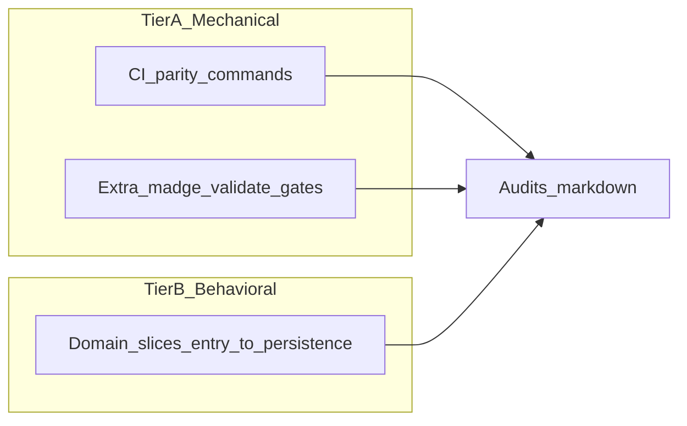

# 全仓代码审查轮次规划

## 与 AGENTS.md / CLAUDE.md / copilot-instructions.md 的对齐（合规性说明）

以下仓库规则在规划中**显式落实**；执行审查时 Tier B 须按清单勾选，避免只做机械扫描。

| 规则来源 | 要求摘要 | 在本计划中的落点 |
|----------|----------|------------------|
| [AGENTS.md](AGENTS.md) / [CLAUDE.md](CLAUDE.md) Code Review Hard Rules | 从真实入口追踪到回读；不得以文件级或「字段存在」代替 | Tier B「按可达入口分区」+ 成功标准中的调用链/读写路径 |
| 同上 | 持久化须「写入 → reload/requery → 回读 → 可见行为」 | Tier B 末段 + 报告轮次 6 结论格式 |
| 同上 | 每条结论须含：断裂路径、为何现有检查可能漏掉、需何验证 | 报告骨架第 7 节（与 Hard Rules 输出格式一致） |
| 同上 | 审查测试须走真实用户/service 入口并断言业务结果 | 报告轮次 4；Tier B 抽查 Vitest 是否只断言 mock/快照 |
| [copilot-instructions.md](copilot-instructions.md) §0.1（与上表等价，更细） | 入口含 UI、路由、命令、**worker message**、emit/listen、**定时任务**、**脚本**、**service API** | Tier B 增加「非 UI 入口」子清单（见下） |
| 同上 | 「仍被引用」≠ 仍有效；区分 production / test-only / fixture / migration / script | Tier B 结论模板中强制标注使用场景 |
| 同上 | 必查隐蔽风险：陈旧 callback、未 await、吞错、flag 不可达分支、listener 泄漏、陈旧 cache 写、cleanup、迁移兼容、环境差异 | Tier B「隐蔽风险」核对表（见下） |
| copilot §0.1 / 二–三章 | `check:architecture-guard`、hotspot 85% 纪律、编排层不堆业务、controller/service 落位 | Tier A 全量 `check:architecture-guard` + 热点报告对照 [ARCH-3](docs/execution/governance/arch3-architecture-guard-hotspots-2026-05-05.md)；Tier B 转写域核对 Orchestrator/ReadyWorkspace 与 controller 边界 |
| copilot §九 / CLAUDE 设计约束 | 语言资产面板 CSS 最多 2 层可见 `border` | Tier B「语言资产 / 面板」切片；有 CSS 变更时跑 `gate:panel-phase1` 或专项 CSS 子集 |
| [jieyu-docs-governance.mdc](.cursor/rules/jieyu-docs-governance.mdc) | 人类审查报告放 `docs/execution/audits/`；大 doc 改动后 `check:docs-governance` | 产出路径 + Tier A 文档治理行 |
| PR 模板 [.github/pull_request_template.md](.github/pull_request_template.md) | typecheck、npm test、热点报告、时间轴 gate 等 | Tier A 以 CI `quality` 为基线；时间轴/AI 相关改动在报告中勾选对应 `gate:*` |

**Tier B 增补：非 UI 入口（copilot 硬规则显式化）**

每域至少覆盖一类：Worker / 定时器 / CLI 或 `scripts/` 调用链 / MCP tool handler / Dexie upgrade path（与当前变更域交叉时优先）。

**Tier B 增补：隐蔽风险核对表（执行时逐项抽样，有则记入报告）**

陈旧 callback、未 await、吞错、feature flag 不可达分支、孤立或重复 subscription、陈旧 cache 写、资源 cleanup、迁移/旧 enum 兼容、权限与降级路径、构建与运行时环境差异。

## 目标与成功标准

- **目标**：在一轮审查结束时，有一份可追溯的**人类撰写**审查产物（符合 [jieyu-docs-governance](.cursor/rules/jieyu-docs-governance.mdc)：放在 [`docs/execution/audits/`](docs/execution/audits/)），包含：执行命令、通过/失败、热点与债务分级、**按入口点的数据流结论**（非仅文件存在性检查），且满足上表与 **copilot-instructions §0.1 代码审查硬规则** 的输出要求。
- **成功标准**：报告内每个「红/黄」结论都附带**可复现命令**或**具体调用链/读写路径**；与上一轮 [`docs/execution/audits/CODE_REVIEW_REPORT_2026-05-04.md`](docs/execution/audits/CODE_REVIEW_REPORT_2026-05-04.md) 可对账的维度（架构门禁、循环依赖、类型、DB、CSS、测试、构建、安全）均有**当前快照**。

## 审查在仓库里的含义（避免与「通读每一行」混淆）

本仓已有大量**可执行**治理脚本；全仓审查应把其当作**第一层机械审查**，把 AGENTS/CLAUDE 中的 **Code Review Hard Rules** 当作**第二层行为审查**（入口 → 状态变更 → 持久化 → 读回/日志）。

## Tier A：自动化证据基线（先做，产出表格素材）

**与 CI `quality` job 对齐**（见 [`.github/workflows/ci.yml`](.github/workflows/ci.yml)：`typecheck`、`check:fire-and-forget-governance`、`check:acceptance-1`、`npm test`、`report:architecture-hotspots`）— 作为「全仓健康」最小可合并证据集。

建议**额外**纳入上一轮报告中已证明高价值的项（仓库文档亦引用 `madge`）：

| 维度 | 命令 / 入口 | 说明 |
|------|----------------|------|
| 类型 | `npm run typecheck` | 与 CI 一致 |
| 架构守卫 | `npm run check:architecture-guard` | 含 doc-symbol-parity、timeline 单宿主、telemetry、fire-and-forget；失败即硬问题 |
| 热点只读 | `npm run report:architecture-hotspots` | 与 CI 一致；输出对照 [ARCH-3 台账](docs/execution/governance/arch3-architecture-guard-hotspots-2026-05-05.md) |
| 循环依赖 | `npx madge --circular --extensions ts,tsx src` | 与 [规划文档](docs/execution/plans/AI智能体-战略规划与下一步-2026-05-07.md) 中收口证据口径一致 |
| 全量门禁包 | `npm run validate` | [`package.json`](package.json) 中 `validate` = `typecheck` + `gate:acoustic` + `npm test` + `build:guard`；**耗时最长**，适合作为「深轮」或夜间跑；报告中注明机器与时间 |
| 文档治理 | `npm run check:docs-governance`（及按需 `npm run report:docs-link-debt`） | CI 独立 job；大文档搬迁后必跑 |

**CI 其他并行 job**（按风险选题抽样进报告，不必一轮全跑完）：`agent-evals-gate`、`gate:timeline-phase1`、`gate:timeline-cqrs-full-migration`、`gate:m2`、`otel-contract-gate` 等— 在报告中列「与发布/当前迭代相关的子集」并勾选已跑项即可。

## Tier B：人工行为与数据流审计（按域切片，对齐 Hard Rules）

按**可达入口**分区，每区完成「入口 → 副作用 → 持久化 → 读回」最短路径，而不是按目录字母序扫文件。执行前打开上文 **「与 AGENTS…对齐」** 表及 **非 UI 入口 / 隐蔽风险** 两段作为强制检查单。

建议默认切片（可按迭代优先级删减）：

1. **转写主路径**：页面 / Orchestrator / ReadyWorkspace → segment create-mutate 控制器 → `LinguisticService` / Dexie 写路径；对照 ADR/守卫（如 `check:transcription-lane-read-scope`、`TranscriptionPage` 结构测试）。
2. **AI 对话与工具**：`useAiChat*` 系列、MCP 服务端（[`src/ai/mcp/server/McpServer.ts`](src/ai/mcp/server/McpServer.ts)）、audit replay / release evidence；关注：未 await、错误吞没、流式完成与持久化一致性（当前 git 变更集中于此，应**增量深读**）。
3. **协作与云同步**：`CollaborationSyncBridge`、冲突解决路径；Vitest 合约测试与 `gate:collaboration-cloud` 是否覆盖当前关注点。
4. **语言资产 / 面板**：若本轮含 UI/CSS 变更，对照 `gate:panel-phase1` 与 DESIGN/tokens 规则；面板 CSS 两层边框规则见 copilot-instructions。

**持久化相关**：每个「写」结论必须能指向**写后读回**证据（现有测试名、或审查时补的最小复现），避免仅列字段名。

## 产出物结构（建议沿用 2026-05-04 模板）

新文件命名示例：`docs/execution/audits/CODE_REVIEW_REPORT_2026-05-07.md`（日期按实际审查完成日调整）。

建议章节骨架（与旧报告对齐，便于对账）：

1. 摘要表（维度 × 状态 × 说明）
2. 轮次 1：架构 / 依赖 / 循环 / 分层（命令输出摘要 + madge 结论）
3. 轮次 2：类型与数据层（`tsc`、Dexie/迁移、`check:db-transaction-facade`）
4. 轮次 3：CSS 与 UI 契约（可摘录 `npm test` 中已含的 CSS 子集结果）
5. 轮次 4：测试与 CI 对齐（哪些 job 已等价覆盖）
6. 轮次 5：构建预算与安全（`build:guard` / `audit:prod`）
7. 轮次 6：行为审计发现（按域：问题 → 路径 → 为何现有检查可能漏掉 → 建议验证方式）
8. 附录：完整命令日志路径或粘贴关键片段

## 增量优先（针对当前工作区）

`git status` 显示变更涉及 AI 运行时报告、MCP、`useAiChat` 发送/流式阶段、audit replay 等— **Tier B 应优先从这些 diff 路径做数据流审计**，再扩展到全域抽样，避免「全仓」变成均匀浅扫。

## 时间与执行顺序建议

1. **第 1 天**：Tier A 中 CI 对齐子集 + `madge` + `report:architecture-hotspots` → 填入报告「仪表盘」。
2. **第 2–3 天**：Tier B 分域；每域 2–4 小时深挖 + 记录调用链。
3. **可选深跑**：`npm run validate` 或关键 `gate:*` 放在机器空闲时段；报告注明 profile。

## 非目标（本轮审查可不包含，除非用户明确要求）

- 不在审查轮次内直接批量改代码（审查与修复 PR 分离更清晰）。
- 不把 `~/.cursor/plans` 当规格源（仓库规则已明确）。
