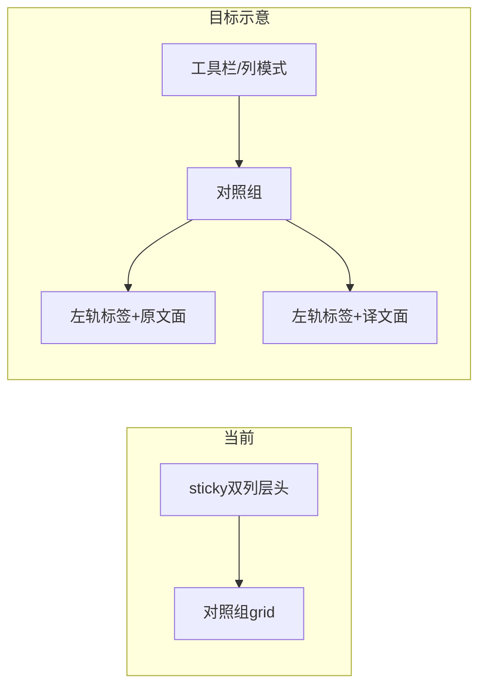

# 对照模式：层头下放到每行左侧

## 观点（回答「你认为呢」）

把**层头语义**从「整列吸顶一行」迁到**每条逻辑编辑行左侧**，在对照场景里**是合理且可落地的**：一对多 / 多对一时，行数不对等，顶栏无法表达「这一行属于哪一侧、哪一层」；左侧窄轨与每条 [`TimelineDraftEditorSurface`](src/components/transcription/TimelineDraftEditorSurface.tsx) 同高，**对齐关系随内容走**，比强行保留双列大层头更一致。

需要注意的取舍：

- **信息密度**：每行重复短标签（应用缩写/图标 + `title` 全长），避免把完整 [`TimelineLaneHeader`](src/components/TimelineLaneHeader.tsx) 搬进每一行。
- **与「媒体轨每 unit 一行」的关系**：对照视图 DOM 与轨道 annotation 行**不是同一棵树**；若要做到与轨道**像素级同一行**，需要更大改（嵌入轨道或双壳同步）。本方案在你选的「对照 + 时间轴粒度」下，应理解为 **「组内每条 source/target 行」左侧**，这是当前数据模型里与 unit 最接近的一行。
- **吸顶与分割条**：[`timeline-comparison.css`](src/styles/pages/timeline/timeline-comparison.css) 里 `.timeline-comparison-header` 为 `sticky`，且 [`TranscriptionTimelineComparison.tsx`](src/components/TranscriptionTimelineComparison.tsx) 用 `headerEl.offsetHeight` 参与分割条 top 计算；顶栏变矮或职责迁移后，**必须复测** `--timeline-comparison-global-splitter-line-top` / `ResizeObserver` 路径，避免分割条与行错位。

## 实现要点（对照模式限定）

1. **行布局**：在 [`TranscriptionTimelineComparison.tsx`](src/components/TranscriptionTimelineComparison.tsx) 中，对 `group.sourceItems.map` 与译文侧 `targetItems` 渲染处，为每个 surface 外包一层 flex 容器：`[左侧轨 | TimelineDraftEditorSurface]`。左侧轨宽度固定（如 28–36px），`min-width: 0` 的编辑区仍在右。
2. **轨内容**：复用现有 `sourceHeaderContent` / `targetHeaderContent` 的**短文案**或抽一个 `buildComparisonRowRailLabel(...)`（可与 [`transcriptionFormatters`](src/utils/transcriptionFormatters.ts) 对齐）；点击行为与当前顶栏按钮一致：`patchComparisonFocus` + `onFocusLayer`（原文用 `sourceLayerId`，译文用 `targetLayer?.id`）。
3. **顶栏处理（二选一，实现前定稿）**  
   - **A（推荐）**：保留顶栏仅作「列模式 / 样式」等工具区；**移除或弱化**双列「层名」大按钮，避免与行轨重复。  
   - **B**：顶栏保留双列但改为极简（图标），行轨承担主标签。
4. **样式**：在 [`timeline-comparison.css`](src/styles/pages/timeline/timeline-comparison.css) 增加 `.timeline-comparison-row-rail` 等规则；`compactMode` 为 `source`/`target` 时隐藏对侧列的轨+面，与现有列隐藏逻辑一致。
5. **可访问性**：行轨用 `button` 或带 `tabIndex` 的 `role="button"`，`aria-label` 含层名与「聚焦该层」语义；避免整行重复焦点陷阱。
6. **测试**：扩展 [`TranscriptionTimelineComparison.test.tsx`](src/components/TranscriptionTimelineComparison.test.tsx)——多 `sourceItems`、多 `targetItems` 时，断言每行存在对应侧轨且点击触发 `onFocusLayer` / focus patch。

## 不在首版范围（若要坚持「与轨道同一行」）

- 在滚动时间轴上为每个 unit 画与对照行共享的左侧层头：需统一滚动容器或同步虚拟列表，牵涉 [`TranscriptionTimelineMediaLanes`](src/components/TranscriptionTimelineMediaLanes.tsx) / [`TranscriptionTimelineTextOnly`](src/components/TranscriptionTimelineTextOnly.tsx) 与对照壳的布局协议，**单独立项**更合适。
