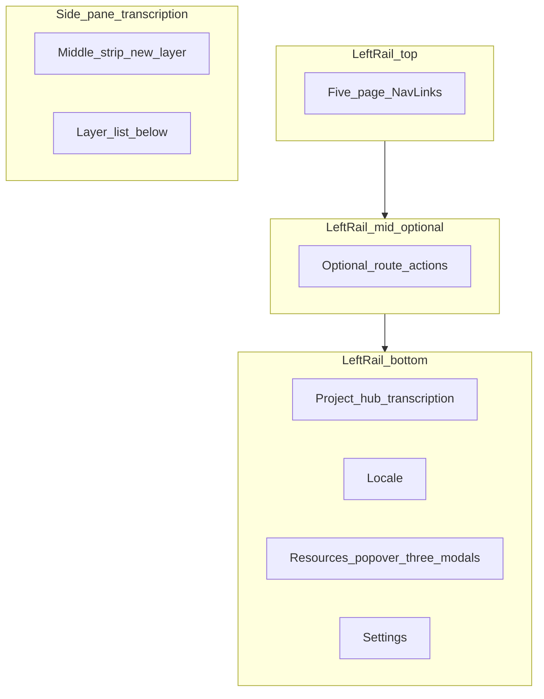

# 左侧栏三区分层：需求评估与重构建议

## 已拍板的产品决策（本次更新）

1. **新建层**  
   - **放在侧栏（`app-side-pane`）中间区域**，作为常驻或醒目的主操作，而不是藏在层列表的右键/溢出菜单里。  
   - **从「现在的菜单」中移除**该入口（实现时需定位 [SidePaneSidebar](src/components/SidePaneSidebar.tsx) 及相关 `ContextMenu` / 快捷菜单项，避免重复入口；逻辑仍复用现有「新建转写层」handler）。

2. **语言资产三件套**  
   - **执行方案 C**：在**左轨底栏**（与语言切换、设置同组或相邻）增加 **「资源」** 主按钮；点击后展开 **Popover / 子菜单**，列出与当前完全相同的三个入口（语言元数据、正字法、正字法桥），仍打开现有 `ModalPanel` + `openAssetPanelFromTarget` 流程。  
   - **移除** [App.tsx](src/App.tsx) 中 `app-left-rail-secondary` 整段（标题 + 三个按钮），避免与方案 C 重复。

---

## 需求评估（保留）

你的三类划分与常见桌面产品（活动区 / 上下文 / 系统区）一致，**方向正确**。在已拍板后：

- **左轨中段**可留给「仍希望出现在左轨的、随路由变化的快捷操作」（若有）；**转写页的核心「新建层」不再占左轨**，避免与侧栏职责打架。  
- **语言资产**与「本页操作」已分离：资源进底栏 C，新建层进侧栏中部。

---

## 当前左侧栏：按钮与菜单清单（审查结果）

实现集中在 [src/App.tsx](src/App.tsx)（`aside.app-left-rail`）与 [src/components/transcription/LeftRailProjectHub.tsx](src/components/transcription/LeftRailProjectHub.tsx)（Portal 到 `#left-rail-bottom-slot`）。

| 区域（现状） | 控件类型 | 行为 | 备注 |
|-------------|---------|------|------|
| 上段 `app-left-rail-group` | 5× `NavLink` | 路由：`/transcription`、`/annotation`、`/analysis`、`/writing`、`/lexicon` | 与需求「顶栏五页」一致 |
| 中段 `app-left-rail-secondary` | 区块标题 + 3× `button` | 打开语言资产 Modal | **计划移除**，改由底栏「资源」方案 C 承接 |
| 伸缩区 `left-rail-bottom-slot` | Portal | 转写页 `LeftRailProjectHub` | 计划迁入底栏固定组 |
| 最下 utility | Locale + Settings | 切换语言、设置模态 | 旁增加「资源」 |

**侧栏**：层相关操作（含「新建转写层」）当前多在 [SidePaneSidebar](src/components/SidePaneSidebar.tsx) 菜单内；**计划**将「新建层」提升至侧栏**中部**显式控件，并从原菜单移除。

**图标/语义冲突（仍建议修）**：`FolderKanban`（标注页 vs 项目枢纽）、`Languages`（词典 vs 原语言元数据按钮，元数据按钮移除后仅剩词典则压力减小，仍可为词典换更贴图标）。

---

## 重构与优化建议（按优先级）

### P0 — 信息架构

1. **[app-shell-layout.css](src/styles/pages/app-shell-layout.css) + [App.tsx](src/App.tsx)**  
   - 左轨：顶导航 / 可选中段槽 / 底栏 **项目（条件）+ Locale + 资源 + Settings**。  
   - 删掉 `app-left-rail-secondary` 三按钮，资源改由底栏 Popover。

2. **方案 C 实现要点**  
   - 复用 `handleAssetPanelToggle` / `openAssetPanelFromTarget` / `pathToPanelId`，与当前三路径一致。  
   - Popover 内三项：`language-metadata`、`orthographies`、`orthography-bridges`；关闭逻辑与现有 `handleAssetPanelClose` 一致。  
   - 可选：`资源` 按钮在某一面板已打开时显示 `active` 态（与现 `isAssetPanelActive` 思路一致，可对「任一面板打开」或「当前项」细化）。

3. **侧栏新建层**  
   - 在 [AppShellSidePane](src/App.tsx) 注册的转写侧栏内容之上，或仅在转写 `sidePaneRegistration` 布局中，增加**中部工具条**（如 `PanelButton` + 图标），点击 = 现有打开「新建转写层」对话框/流程。  
   - 从层行右键、`…` 菜单等**移除**重复「新建转写层」（保留编辑/删除等若产品需要）。  
   - 单一路径调用同一 `onCreateLayer`（或现有等价 API），避免双实现。

4. **`LeftRailProjectHub`**  
   - 归入底栏「项目」，非转写路由不渲染但占位高度稳定。

### P1 — 可选左轨中段

- 仅当产品仍需要「左轨随页变化」的其它快捷方式时再引入 `LeftRailContext`；**新建层不在此列**。

### P2 — 图标与无障碍

- 为「资源」、Project Hub、词典等选不重复图标；补充 `aria-label` / i18n 键（如 `app.leftRail.resources`）。

### P3 — 测试

- 布局守卫、LeftRail、**SidePaneSidebar 交互测试**（新建层入口迁移、菜单项删除断言）。

---

## 小结

- **新建层**：侧栏中部主入口，原菜单内入口移除，逻辑复用。  
- **语言资产**：**方案 C** 底栏「资源」Popover，三 Modal 行为不变；左轨中段语言组删除。  
- **落地顺序建议**：方案 C（含删 secondary）→ 侧栏新建层与菜单清理 → Project Hub 底栏化 → 左轨 CSS 三区收束 → 图标与测试。
