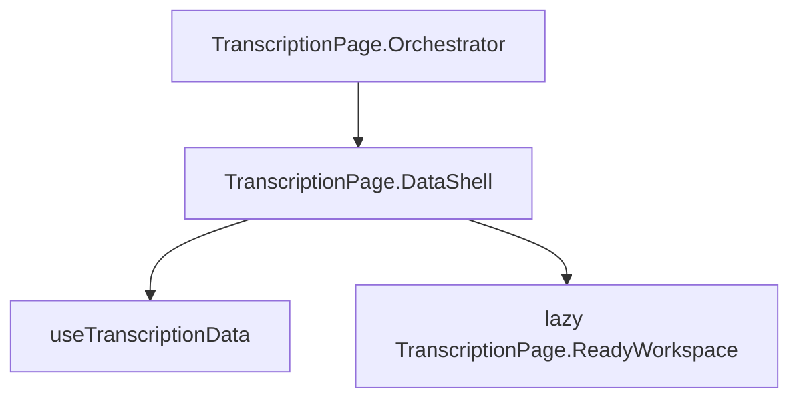

# 确信度徽标问题：代码审查与架构对照报告

## 0. 状态更新（2026-04-18）

- **即时显示**：用户确认设置确信度种类后 **可直接显示**，**不再需要刷新** —— 主时间轴 + 控制器乐观/别名路径问题可视为 **已解决**。
- **剩余**：仅 **串层**（若原意是「串行」执行顺序问题，请单独说明场景；下文按 **跨层污染** 理解）。
- 计划内原「内存陈旧导致必须刷新」的待办（`verify-dexie-vs-memory`、`fix-memory-sync`）已 **取消/暂缓**，避免与当前验收结论冲突；若侧栏等非主面仍偶发滞后，可再抽样 §9 矩阵。

---

## 1. 壳层架构（页面装载与运行时边界）

- [`TranscriptionPage.Orchestrator.tsx`](src/pages/TranscriptionPage.Orchestrator.tsx)：极薄壳，仅渲染 `TranscriptionPageDataShell`。
- [`TranscriptionPage.DataShell.tsx`](src/pages/TranscriptionPage.DataShell.tsx)：调用 `useTranscriptionData()`；在 `ready` 后 **Suspense + lazy** 挂载 `TranscriptionPageReadyWorkspace`，把 `data` 整体下传。
- **结论**：确信度逻辑不在壳层分叉；**串层**问题集中在 **ReadyWorkspace 内多消费链是否共用错误 scope**（时间轴控制器 vs SegmentMeta vs 其它读宿主回退）。

---

## 2. 数据库与写入架构（per-layer 段行）

**设计意图（与代码注释一致）**

- `layer_units` 中 `unitType === 'segment'` 的行承载 **层私有** 的 `selfCertainty`；不得写回共享宿主 `unitType === 'unit'`。
- 写入主路径：[`useTranscriptionUnitActions.ts`](src/hooks/useTranscriptionUnitActions.ts) 中 `saveUnitLayerFields` → `applyPerLayerRowFieldPatch` → `LinguisticService.saveUnitsBatch`（unit）或 `LayerUnitSegmentWriteService.upsertSegments`（segment）。
- 保存后异步：[`SegmentMetaService.syncForUnitIds`](src/services/SegmentMetaService.ts)，按 **段行自身的 `layerId` + `mediaId`** 触发 `rebuildScopes`。

**与「串层」仍相关的架构点**

- [`useLayerSegments.ts`](src/hooks/useLayerSegments.ts)：依附层不在 `segmentsByLayer` 的 key 中；**任何仍按「焦点层 id」去查 layer_units 或 segment_meta 而不解析源层的消费方**，都可能与主时间轴读到的不一致，表现为「只在独立层 + 依附层之间串」。

---

## 3. 控制器读路径（已做与串层边界）

[`useTranscriptionSelfCertaintyController.ts`](src/pages/useTranscriptionSelfCertaintyController.ts)：

1. **`selfCertaintyByScopedUnitId`**：`scopedKey(seg.layerId, seg.id)`。
2. **`segmentRowLayerIndex`**：单物理段行时把 lane/menu 的 layer **别名到 storage `layerId`**（依附层 ↔ 源层显示对齐）。
3. **仍不读宿主**：段行无值则 `undefined`。

**仍可能导致「串感」或错层展示的边缘**

| 条件 | 与串层的关系 |
|------|----------------|
| 某 UI **未走** `resolveSelfCertaintyForUnit`，仍读 `host.selfCertainty` 或错误 `layerId` 的 meta | 与主时间轴表现不一致，像「串层」 |
| `SegmentMeta` 在 **依附层** scope 下与源层 rebuild 结果分裂 | 侧栏 / 检索 / facet 与主时间轴不一致 |
| 段行 `layerId` 为空（`::id`） | 多消费链键分裂，易出现错层或随机感 |

---

## 4. 时间轴 UI 读路径

[`TranscriptionTimelineTextOnly.tsx`](src/components/TranscriptionTimelineTextOnly.tsx)：`segment` 禁止 `realUtt?.selfCertainty` 回退 —— 与控制器一致，**利于防串层**。

---

## 5. 右键菜单与选择态

[`useTimelineAnnotationHelpers.tsx`](src/hooks/useTimelineAnnotationHelpers.tsx)：`ctxMenu.layerId` 为 **当前 lane**；控制器对 segment 乐观键已做 storage 别名（单段行前提）。

---

## 6. ReadyWorkspace 与 leaf 的接缝

[`TranscriptionPage.ReadyWorkspace.tsx`](src/pages/TranscriptionPage.ReadyWorkspace.tsx)：`saveUnitSelfCertainty` 适配器丢弃 branded kind，依赖 id 唯一性 —— **架构债务**，与当前「显示已好」弱相关；若串层来自 **写错行**，需再验证 Dexie 目标行。

---

## 7. 侧栏与 SegmentMeta（串层优先排查带）

[`SidePaneSidebarSegmentList.tsx`](src/components/SidePaneSidebarSegmentList.tsx)：

- `liveQuery(() => SegmentMetaService.listByLayerMedia(focusedLayerRowId, mediaId))` —— 焦点为 **依附层** 时，与 [`SegmentMetaService.rebuildForLayerMedia`](src/services/SegmentMetaService.ts) 使用的 `[layerId+mediaId]` 查询 **易与物理段行所在源层 id 不一致**。
- Fallback 读 `sourceSegments` 上 `segment.selfCertainty` 时，若内存与 Dexie 或 meta 投影不一致，会与主时间轴「看起来串层」。

**结论**：**串层/错层感** 的下一优先深挖点是 **SegmentMeta + 侧栏 + 任何 listByLayerMedia(焦点层)** 是否与 `resolveSegmentTimelineSourceLayer` 对齐。

---

## 8. 根因归纳（仅保留与「串层」相关）

1. **Meta / 侧栏 / 检索链** 使用 **焦点层 id** 而非 **源层段 storage layerId**，与主时间轴控制器语义分裂。
2. **其它读路径** 仍向宿主合并 `selfCertainty`（全仓审计）。
3. **空 `layerId` 段行** 导致多链键不一致，放大错层观感。

---

## 9. 验证矩阵（串层向）

| 验证项 | 若异常指向 |
|--------|------------|
| 同一 segmentId，主时间轴徽标 vs 侧栏列表「确信度」 facet | §7 meta scope 或 fallback |
| `segment_meta` 中该段 `layerId` 与 `layer_units` 段行 `layerId` 是否一致 | rebuild/list scope |
| 全仓是否仍有 `selfCertainty` 读自 **host** 或 **未 scoped 的 unit** | §8.2 |

---

## 10. 修复方向建议（串层阶段）

- **统一 meta 查询 scope**：对复用源层段的依附层，list/rebuild 使用 **`resolveSegmentTimelineSourceLayer` 的源层 id**（与侧栏已有 `sourceLayer` 概念对齐）。
- **审计读宿主**：任何 per-layer 字段禁止 `?? host.selfCertainty`。
- **数据**：补全段行 `layerId`，避免 `::id`。

---

## 11. 参考文件清单

- 壳层：[`TranscriptionPage.Orchestrator.tsx`](src/pages/TranscriptionPage.Orchestrator.tsx)、[`TranscriptionPage.DataShell.tsx`](src/pages/TranscriptionPage.DataShell.tsx)
- 控制器：[`useTranscriptionSelfCertaintyController.ts`](src/pages/useTranscriptionSelfCertaintyController.ts)
- 写入：[`useTranscriptionUnitActions.ts`](src/hooks/useTranscriptionUnitActions.ts)、[`LayerUnitSegmentWriteService.ts`](src/services/LayerUnitSegmentWriteService.ts)
- 段加载：[`useLayerSegments.ts`](src/hooks/useLayerSegments.ts)
- 时间轴：[`TranscriptionTimelineTextOnly.tsx`](src/components/TranscriptionTimelineTextOnly.tsx)、[`useTimelineAnnotationHelpers.tsx`](src/hooks/useTimelineAnnotationHelpers.tsx)、[`TranscriptionOverlays.tsx`](src/components/TranscriptionOverlays.tsx)
- 侧栏 / Meta：[`SidePaneSidebarSegmentList.tsx`](src/components/SidePaneSidebarSegmentList.tsx)、[`SegmentMetaService.ts`](src/services/SegmentMetaService.ts)
- ReadyWorkspace 接缝：[`TranscriptionPage.ReadyWorkspace.tsx`](src/pages/TranscriptionPage.ReadyWorkspace.tsx)
