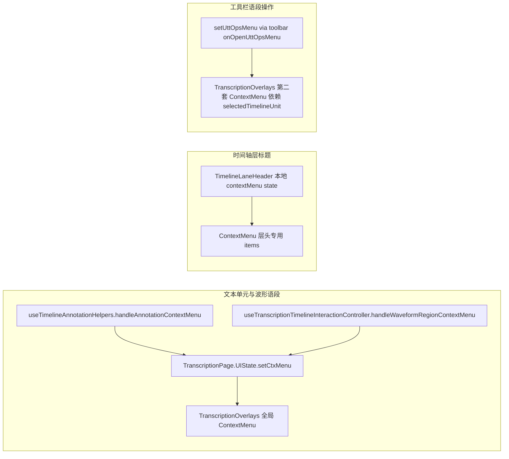

# 转写右键菜单情境化：现状汇报与整改方案

## 1. 现状：三条独立链路

| 链路 | 入口文件 | 行为摘要 |
|------|----------|----------|
| 全局语段菜单 | [`src/hooks/useTimelineAnnotationHelpers.tsx`](src/hooks/useTimelineAnnotationHelpers.tsx)（文本区）、[`src/pages/useTranscriptionTimelineInteractionController.ts`](src/pages/useTranscriptionTimelineInteractionController.ts)（波形 region） | 均写入同一 `ctxMenu`（[`src/pages/TranscriptionPage.UIState.ts`](src/pages/TranscriptionPage.UIState.ts)）；波形路径带 `source: 'waveform'`，**文本路径未写 `source`**，在 [`src/components/TranscriptionOverlays.tsx`](src/components/TranscriptionOverlays.tsx) 中默认当作 `'timeline'`。 |
| 层头菜单 | [`src/components/TimelineLaneHeader.tsx`](src/components/TimelineLaneHeader.tsx) | **不经过** `ctxMenu`，本地 `useState` 打开菜单；与全局菜单并行存在。 |
| Utt 操作菜单 | [`src/pages/transcriptionToolbarProps.ts`](src/pages/transcriptionToolbarProps.ts) 等 | [`src/components/TranscriptionOverlays.tsx`](src/components/TranscriptionOverlays.tsx) 内第二块菜单，**仅依赖** `selectedTimelineUnit`，与右键落点无关（工具栏场景可接受）。 |

---

## 2. 问题根因（与点击区域的关系）

### 2.1 全局菜单：同一套 `items` 拼装，情境信息不足

[`TranscriptionOverlays.tsx`](src/components/TranscriptionOverlays.tsx) 在 `ctxMenu` 存在时用**同一闭包**组装：删除/合并/拆分、`selectBefore`/`selectAfter`、备注、（可选）确信度子菜单、**转写层才显示**的说话人子菜单、编辑层元数据、显示样式等。

已做对的一点：`isTranscriptionLayerContext` 控制说话人子菜单（约 194–290 行）。

仍明显「不够 context sensitive」的点：

1. **`source` 仅区分 timeline vs waveform，且文本右键未设置**  
   - 备注等用 `ctxMenu.source ?? 'timeline'`（约 229 行），文本区与 timeline 语义混用，后续无法对「波形上右键」单独隐藏/弱化项（例如某些仅适合文本时间轴的操作）。

2. **翻译层 / 转写层共用大量「结构操作」**  
   - 删除、合并前后、拆分、`selectBefore`/`selectAfter` 等对**翻译行**是否都应出现，当前未按 `layerType === 'translation'` 系统裁剪；用户体感常为「我在译文字里右键，却看到一堆像主轨结构编辑的项」。

3. **确信度子菜单**  
   - 只要注入 `onSetUnitSelfCertaintyFromMenu` 即出现（约 232–258 行），未与 `layerType` / `unitKind` / `source` 组合约束；在译文行或波形上是否应展示需产品定义后代码化。

4. **「编辑层元数据」「显示样式」**  
   - 对当前 `ctxMenu.layerId` 合理，但在**波形**上右键时，用户心智是「时间/选区」，仍出现完整排版子菜单，容易被视为噪音（可按 `source === 'waveform'` 折叠为子类或「更多…」）。

### 2.2 层头菜单：把「全局轨行为」挂到每一层（含翻译层）

[`src/components/TranscriptionTimelineTextOnly.tsx`](src/components/TranscriptionTimelineTextOnly.tsx) 对每个 [`TimelineLaneHeader`](src/components/TimelineLaneHeader.tsx) 传入**相同**的：

- `speakerQuickActions`（若存在则所有层都有，约 678 行）
- `trackModeControl`（只要有多轨切换回调，**所有层**都带「轨道」子菜单，约 679–691 行）

而 [`TimelineLaneHeader.tsx`](src/components/TimelineLaneHeader.tsx) 中：

- **说话人**块（约 336–369 行）语义是「对当前**选中**语段批量指派说话人」，与「右键这一层标题」无直接对象关系；在**翻译层标题**上出现尤其违和。
- **轨道**块（约 372–464 行）是**整条时间轴**的多轨/锁定模式，却出现在**每一条**层标题的右键里；在翻译层右键「切换多轨模式」属于典型无关项。

层头里合理的部分：`layerOperationMenuItems`（编辑元数据、新建层、删除）、`viewMenuItems`（折叠/连线）、当前层的显示样式——这些与「这一层」强相关。

---

## 3. 整改方案（建议实施顺序）

### 3.1 为 `ctxMenu` 增加显式「菜单情境」

在 [`TranscriptionPage.UIState.ts`](src/pages/TranscriptionPage.UIState.ts) 扩展 `ContextMenuState`（命名示例）：

- `menuSurface: 'timeline-annotation' | 'waveform-region'`（或保留并规范 `source`，与现有 note 的 `timeline`/`waveform` 对齐）
- 可选：`layerType: 'transcription' | 'translation'`（由打开菜单时从 `layers` 解析，避免 Overlays 再猜）

写入点：

- [`useTimelineAnnotationHelpers.tsx`](src/hooks/useTimelineAnnotationHelpers.tsx) `handleAnnotationContextMenu`：`menuSurface: 'timeline-annotation'`，并带上 `layerType`。
- [`useTranscriptionTimelineInteractionController.ts`](src/pages/useTranscriptionTimelineInteractionController.ts) `handleWaveformRegionContextMenu`：`menuSurface: 'waveform-region'`（已有 `source: 'waveform'` 可合并或迁移）。

### 3.2 抽出「纯函数」菜单构建器 + 策略表

新建例如 `src/components/transcription/buildTranscriptionUnitContextMenuItems.ts`（或 `src/utils/transcriptionContextMenu.ts`）：

- 输入：`ctxMenu` 扩展字段、`selectedUnitIds`、`transcriptionLayers`/`translationLayers`、`flags`（各 handler 是否存在）。
- 输出：`ContextMenuItem[]`。
- 用**显式策略**裁剪，例如：
  - `layerType === 'translation'`：隐藏或合并「仅转写结构」项（合并邻接、选区扩展等按产品表逐项定）；保留备注/样式/译文元数据等。
  - `menuSurface === 'waveform-region'`：可选隐藏「全选前/后」或收到二级「更多」；显示样式可降级。
  - `unitKind === 'segment'`：与现有 `isSegmentUnitContext` 分支对齐，避免散落三元表达式。

[`TranscriptionOverlays.tsx`](src/components/TranscriptionOverlays.tsx) 仅负责调用构建器与 `onClose`，减少 180+ 行内联逻辑。

### 3.3 层头：按层类型与「仅默认转写轨」挂载全局块

在 [`TranscriptionTimelineTextOnly.tsx`](src/components/TranscriptionTimelineTextOnly.tsx) 渲染 `TimelineLaneHeader` 时：

- **`trackModeControl`**：仅当 `layer.layerType === 'transcription'` 且（建议）`layer.id === defaultTranscriptionLayerId` 或 `layerIndex === 0` 时传入；其它层不传，避免翻译层头出现全局轨模式。
- **`speakerQuickActions`**：同样建议**仅**挂在主转写轨（或产品指定的「说话人主语义」层）；翻译层不传。

若需在非主轨仍访问说话人批量操作，可放到工具栏或侧栏，而不是层头右键。

可选：扩展 [`TimelineLaneHeader.tsx`](src/components/TimelineLaneHeader.tsx) props，例如 `headerMenuPreset: 'layer-chrome' | 'layer-chrome-plus-track'` 以文档化组合，防止未来再堆全局项。

### 3.4 测试与回归

- 扩展 [`src/components/TranscriptionOverlays.test.tsx`](src/components/TranscriptionOverlays.test.tsx)：给定 `ctxMenu` + `translation`/`transcription` + `waveform`/`timeline`，断言菜单项 id 或 label 子集存在/不存在。
- 扩展 [`src/components/TimelineLaneHeader.test.tsx`](src/components/TimelineLaneHeader.test.tsx)：转写层头有轨道/说话人块；翻译层头无（或仅有层操作+样式）。

---

## 4. 范围与非目标

- **范围内**：上述三处中与「右键落点语义」直接相关的裁剪与层头 props 条件化。
- **非目标**（可另开任务）：波形空白区自定义菜单、侧栏 [`SidePaneSidebar`](src/components/SidePaneSidebar.tsx) 层右键、MediaLanes 若后续增加右键的统一策略。

---

## 5. 关键代码锚点（便于对照）

- 全局菜单拼装：[`src/components/TranscriptionOverlays.tsx`](src/components/TranscriptionOverlays.tsx) 约 176–327 行。
- 文本区打开菜单：[`src/hooks/useTimelineAnnotationHelpers.tsx`](src/hooks/useTimelineAnnotationHelpers.tsx) 约 196–247 行（未设 `source`）。
- 波形 region 打开菜单：[`src/pages/useTranscriptionTimelineInteractionController.ts`](src/pages/useTranscriptionTimelineInteractionController.ts) 约 183–215 行。
- 层头挂载轨/说话人：[`src/components/TranscriptionTimelineTextOnly.tsx`](src/components/TranscriptionTimelineTextOnly.tsx) 约 659–691 行；层头菜单定义：[`src/components/TimelineLaneHeader.tsx`](src/components/TimelineLaneHeader.tsx) 约 305–464 行。
