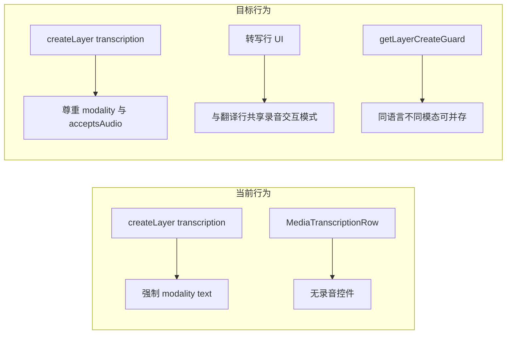

# 转写层录音模态（SayMore careful speech 向）架构方案

## 现状结论（代码事实）

- **层类型**：业务上仍用 `[LayerDocType.layerType](src/db/types.ts)` 的 `'transcription' | 'translation'` 即可表达「 careful speech 仍是转写语义」，**不必**新增第三枚举值；与 Tier 桥接的 `contentType` 仍为 `transcription`（见 `[TierBridgeService](src/services/TierBridgeService.ts)` 注释与映射）。
- **模态字段**：`[LayerDocType](src/db/types.ts)` 已有 `modality: 'text' | 'audio' | 'mixed'` 与 `acceptsAudio`；翻译层创建时已写入 `acceptsAudio: effectiveModality !== 'text'`（`[useTranscriptionLayerActions](src/hooks/useTranscriptionLayerActions.ts)`）。
- **人为截断**：同一 hook 内对转写层写死 `effectiveModality = layerType === 'transcription' ? 'text' : …`，导致即使用户/工具传模态也会被丢掉（约 229 行附近）。
- **录音与内容持久化**：`[useRecording](src/hooks/useRecording.ts)` 仅按 `modality`/`acceptsAudio` 判断是否可录；`[useTranscriptionVoiceTranslationActions](src/hooks/useTranscriptionVoiceTranslationActions.ts)` 按 `layerId` 写入 `layer_unit_contents` + `media_items`，**未**硬编码 `layerType === 'translation'`。`[useTranscriptionTimelineController](src/pages/useTranscriptionTimelineController.ts)` 中 `translationAudioByLayer` 也是按 `layerId` 索引，**不**区分层类型。
- **UI 缺口**：媒体时间轴上，翻译行走 `[TranscriptionTimelineMediaTranslationRow](src/components/TranscriptionTimelineMediaTranslationRow.tsx)`（含 `[TimelineTranslationAudioControls](src/components/TimelineTranslationAudioControls.tsx)`）；转写行走 `[TranscriptionTimelineMediaTranscriptionRow](src/components/TranscriptionTimelineMediaTranscriptionRow.tsx)`，**仅有文本**，`[TranscriptionTimelineMediaLanes](src/components/TranscriptionTimelineHorizontalMediaLanes.tsx)` 在 `layer.layerType === 'transcription'` 分支未传入录音相关 props。
- **「同语言 + 录音转写后再建同语言文本转写」**：阻塞点在 `[getLayerCreateGuard](src/services/LayerConstraintService.ts)` 的 `duplicate-same-type-without-alias`：当前是「同 `layerType` + 同 `languageId`」即要求别名，**未**把 `modality` 纳入区分维度（约 428–437 行）。

## 实现范围：是否「顺手」修代码事实

**会，且算主线交付。** 「现状结论」里指出的不一致与缺口，与功能目标直接绑定，应在**同一实现批次**内修掉，而不是单独开单的「可选顺手清理」。具体包括：

- 转写层创建路径写死 `effectiveModality === 'text'`（`[useTranscriptionLayerActions](src/hooks/useTranscriptionLayerActions.ts)`）— 与需求冲突，**必改**。
- `[getLayerCreateGuard](src/services/LayerConstraintService.ts)` 重复判定忽略 `modality` — **必改**（否则「同语言文本 + 同语言录音」仍被挡）。
- 媒体时间轴转写行未接 `translationAudioByLayer` / 录音回调 — **必改**（否则层上选了 audio 仍无法录）。
- `[useRecording](src/hooks/useRecording.ts)` 提示语写「口译层」与实现（仅看 modality）不符 — **必改**（避免用户误解）。

计划中单独标为**可选**的仅有：`media_items.details.source` 按 `layerType` 区分字符串（观测/导出友好，不影响功能正确性）。

## 架构调整清单

### 1. 层约束与校验（核心：同语言不同模态）

- **文件**：`[src/services/LayerConstraintService.ts](src/services/LayerConstraintService.ts)`
- **改动**：为 `getLayerCreateGuard` 的 `input` 增加可选 `modality?: 'text' | 'audio' | 'mixed'`（创建意图）。将「同类型同语言重复」判定改为：
  - 在 `layerType === existing.layerType` 且 `normalizeLanguageId` 相同的前提下，再比较 **规范化模态**（建议：`layer.modality ?? 'text'` 与 `input.modality ?? 'text'`）。
  - **仅当语言相同且模态也相同**、且 `alias` 为空时，才返回 `duplicate-same-type-without-alias`。
  - **翻译层**可同步使用该规则，避免「同语言两个 mixed 翻译」被误放行（可选但推荐一致）。
- **调用方**：`[LayerActionPopover](src/components/LayerActionPopover.tsx)` 在 `getLayerCreateGuard(...)` 与 `[useTranscriptionLayerActions.createLayer](src/hooks/useTranscriptionLayerActions.ts)` 内调用 guard 时传入即将创建的 `modality`。
- **测试**：在 `[LayerConstraintService.constraintModes.test.ts](src/services/LayerConstraintService.constraintModes.test.ts)` 或专门测试文件中增加用例：已存在 `zho` + `text` 转写层时，新建 `zho` + `audio` 转写层无别名应 `allowed: true`；两个 `zho` + `text` 仍应要求别名。

### 2. 创建与持久化路径

- **文件**：`[src/hooks/useTranscriptionLayerActions.ts](src/hooks/useTranscriptionLayerActions.ts)`
- **改动**：将 `effectiveModality` 对转写层改为与翻译层一致：`modality ?? 'text'`，并设置 `acceptsAudio: effectiveModality !== 'text'`（与现有翻译逻辑一致）。
- **可选（命名/观测）**：`[useTranscriptionVoiceTranslationActions](src/hooks/useTranscriptionVoiceTranslationActions.ts)` 中 `media_items.details.source` 当前为 `'translation-recording'`；可为转写层分支写入 `'transcription-recording'`（或保留同一字符串但加 `layerType` 维度），便于日志与导出过滤——**不改变** `translationAudioMediaId` 字段语义即可落地（避免 DB 迁移）。

### 3. 时间轴 UI 对齐翻译层

- **文件**：
  - `[src/components/TranscriptionTimelineHorizontalMediaLanes.tsx](src/components/TranscriptionTimelineHorizontalMediaLanes.tsx)` — 在 `layer.layerType === 'transcription'` 分支，对每一行像翻译层一样解析 `translationTextByLayer` / `translationAudioByLayer`（已存在 props）、`recording*`、`startRecordingForUnit` / `stopRecording` / `deleteVoiceTranslation`，并传入行组件。
  - **实现策略（二选一，推荐前者）**：
    - **A（推荐）**：扩展 `[TranscriptionTimelineMediaTranscriptionRow](src/components/TranscriptionTimelineMediaTranscriptionRow.tsx)`，把 `[TranscriptionTimelineMediaTranslationRow](src/components/TranscriptionTimelineMediaTranslationRow.tsx)` 中与 `layerSupportsAudio` / `TimelineTranslationAudioControls` / `mixed` 分支相同的结构拷入或抽成小型共享子组件（例如 `TimelineLayerAudioToolsRow`），使转写行在 `audio`/`mixed` 时行为与翻译行一致。
    - **B**：在 lanes 内按 `layer.modality` 在转写/翻译两种 Row 之间切换（耦合层类型与 UI 命名，可读性略差）。
- **依赖**：`[layerUsesOwnSegments](src/hooks/useLayerSegments.ts)` 仍用于 **文本** 走 segment vs unit 的保存路径；**录音**是否启用勿再简单等同于 `!usesOwnSegments`（见下文「翻译层录音失效」节根因 A，与 `recording-uses-own-segments` todo）。
- **文案**：`[useRecording.ts](src/hooks/useRecording.ts)` 内错误提示仍写「口译层」，应在支持转写录音后改为中性描述（如「当前层不支持录音」）。
- **文档模式时间轴**：若 `[TranscriptionTimelineTextOnly.tsx](src/pages/TranscriptionPage.TimelineContent.tsx)` 中翻译层已展示录音控件，转写层若有 `audio`/`mixed`，需同样接入（避免「媒体模式有、文档模式无」）。

### 4. 层管理 UI

- **文件**：`[src/components/LayerActionPopover.tsx](src/components/LayerActionPopover.tsx)`
- **改动**：
  - `create-transcription` 时展示与翻译相同的 **模态** 下拉（可限制默认选项：例如 careful speech 主推 `audio` 或 `mixed`，由产品决定）。
  - `handleCreate` 中 `createLayer(..., modality)` 对转写动作也传入 `modality`；`getLayerCreateGuard` 同步传入 `modality` 以驱动上文重复校验。

### 5. 层约束关系（symbolic vs independent）的产品建议

- **不要求改类型系统**：`careful speech` 仍建议建模为 `**layerType: 'transcription'` + `modality: 'audio' | 'mixed'`**。
- **推荐默认**：第二套「同语言 careful 录音」转写层使用 `**constraint: 'symbolic_association'`**，父层选主 `**independent_boundary`** 文本转写层，这样时间单元与主转写 1:1 对齐，最接近 SayMore 的「逐条重录」工作流；技术上与现有「依赖型转写子层」模型一致（仓库内已有转写子层测试用例，如 `[layerLinkConnector.test.ts](src/utils/layerLinkConnector.test.ts)`）。
- **仍允许**：用户显式创建 `**independent_boundary`** 的同语言另一转写层（在模态不同且通过新 guard 的前提下），用于完全独立分段；需在计划中注明与翻译/导出/对齐的额外复杂度（非本方案必选）。

### 6. 明确不修改（除非另开需求）

- `**cross-type-same-language`**：仍禁止同 `languageId` 下同时存在转写与翻译（`[getLayerCreateGuard](src/services/LayerConstraintService.ts)` 约 416–426 行）。这与「两个转写层同语言不同模态」是正交的；若未来要允许「zho 主转写 + zho 自由翻译」，需单独产品决策与更大范围 UX 调整。

## 翻译层录音失效：根因与修复计划（与上文并列交付）

以下解释「audio / mixed 翻译层上录音像失效」的**代码层根因**，修复与「转写层接录音」同属本方案批次，避免只做新功能、旧路径仍坏。

### 根因 A：`layerSupportsAudio` 与 `usesOwnSegments` 硬绑定

- **位置**：[`TranscriptionTimelineMediaTranslationRow.tsx`](src/components/TranscriptionTimelineMediaTranslationRow.tsx)、[`TranscriptionTimelineTextTranslationItem.tsx`](src/components/TranscriptionTimelineTextTranslationItem.tsx) 中均为  
  `layerSupportsAudio = !usesOwnSegments && (modality === 'audio' | 'mixed' | acceptsAudio)`。
- **行为**：[`layerUsesOwnSegments`](src/hooks/useLayerSegments.ts) 在层自身 `constraint` 为 `independent_boundary` 或 `time_subdivision` 时为 `true`。此时 **无论 modality**，`layerSupportsAudio === false`，录音控件不出现或等价于失效。
- **为何常见**：新建翻译虽默认 `symbolic_association`，**导入/旧数据**仍可能带 `independent_boundary` / `time_subdivision` 的翻译层。
- **修复方向**：为**翻译层**单独收紧条件——例如仅在「录音必须绑定到 unit 且当前行无法解析父 unit」时禁用，而不是凡 `usesOwnSegments` 即禁用；或引入显式 `layerSupportsTimelineRecording(layer)`，与「segment 文本编辑」正交。落地前需确认 [`saveVoiceTranslation`](src/hooks/useTranscriptionVoiceTranslationActions.ts) 在 segment 展示路径上始终用 **父 unit** 作为真源（与当前 `sourceUnit` 一致）。

### 根因 B：segment 行与 `recordingUnitId` 语义不一致

- **位置**：[`useRecording`](src/hooks/useRecording.ts) `setRecordingUnitId(unit.id)` 使用 `startRecordingForUnit` 传入的 **unit**（翻译行里对 segment 传的是 **父 unit**）；[`TranscriptionTimelineMediaTranslationRow`](src/components/TranscriptionTimelineMediaTranslationRow.tsx) 中 `isCurrentRecording = recording && recordingUnitId === item.id` 的 `item.id` 在 segment 行为 **segment id**。
- **行为**：开始录音后 `isCurrentRecording` 恒为 false，`audioActionDisabled` 为 true → **当前行与其它行录音按钮被误置灰**，停止/录制态错位，表现为「一录就失效」。
- **修复方向**：用统一语义比较，例如 `recordingUnitId === (item.kind === 'segment' ? item.parentUnitId ?? item.id : item.id)`（与 `sourceUnit` 解析一致）；[`TranscriptionTimelineTextTranslationItem`](src/components/TranscriptionTimelineTextTranslationItem.tsx) 中同类判断一并改。

### 根因 C：转写轨道未接录音（与「新功能」重叠）

- **位置**：[`TranscriptionTimelineMediaLanes`](src/components/TranscriptionTimelineHorizontalMediaLanes.tsx) 转写分支仅用 [`TranscriptionTimelineMediaTranscriptionRow`](src/components/TranscriptionTimelineMediaTranscriptionRow.tsx)，未传录音 props。
- **行为**：若在**转写层**上设 `audio`/`mixed`，时间轴上录音必失效——由上文 **§3 / media-timeline todo** 覆盖。

### 根因 D（次要）：时间轴壳 `text-only`

- **位置**：[`resolveTimelineShellMode`](src/utils/timelineShellMode.ts) 在无可用声学（无 URL / 未就绪 / duration≤0）时走 `TranscriptionTimelineTextOnly`。
- **行为**：`textOnlyPropsInput` 已 spread `sharedLaneProps`，一般仍带录音回调；若遇「壳子切换瞬间 props 未齐」，优先核对 **A/B** 而非壳子本身。

### 本块验收（翻译层回归）

- `symbolic_association` + `mixed` 翻译：在 **unit** 与 **segment** 迭代时间轴上均可开始/停止录音，且录音中仅非当前行置灰。
- 若保留对特殊 constraint 的限制：需在 UI 上给出明确禁用原因（避免无声失败）；若产品要求该 constraint 仍可录音，则按根因 A 放宽后复测保存结果与 [`listUnitTextsByUnit`](src/hooks/useTranscriptionVoiceTranslationActions.ts) 一致。

## 验收建议

- 新建 `zho` + `audio` 转写层后，可不填别名再建 `zho` + `text` 转写层。
- 媒体时间轴上 `audio`/`mixed` 转写层出现录音控件，录音后 `translationAudioByLayer` 能在该 `layerId` 下读到条目并可播放/删除。
- 现有「同语言两个 text 转写无别名」仍被拦截；回归翻译层录音与约束测试。
- **翻译层**：segment 时间轴上录音开始/停止状态正确，无「一开录全轨灰」；`independent_boundary`/`time_subdivision` 翻译层要么可录音要么有明确禁用提示（与根因 A 修复策略一致）。

