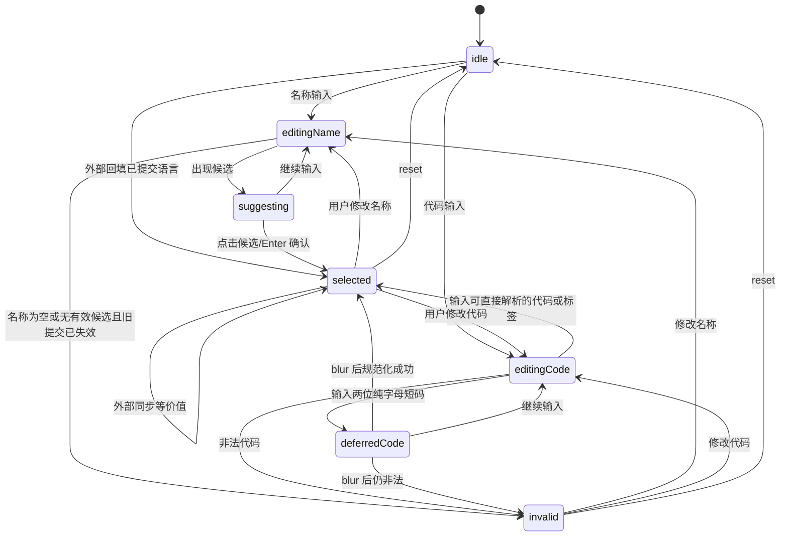

> 文档角色：历史规划文档。仅用于保留当时的方案、约束与决策背景，不再作为当前实现的事实源。当前现状请优先查看 docs/architecture/ 与 README 中的文档索引。

# 规划：语言输入成熟组件化状态模型方案 - 2026-04-05

## 1. 目的

在现有 [src/components/LanguageIsoInput.tsx](../../../../src/components/LanguageIsoInput.tsx) 可用的前提下，把“语言名称 + ISO / BCP 47 输入”的实现从一组相互协作的规则函数，进一步收敛成接近业内成熟 Combobox / Autocomplete 的状态模型。

本方案不推翻现有语言目录、ISO 639-3 持久化主键和两字符短码延迟提交策略，而是在其之上补足：

- 输入草稿与已提交选中项分离。
- 名称编辑、代码编辑、候选选择、失焦提交、宿主回填的来源分离。
- 由显式状态转移替代跨函数隐式协作。
- 让后续 UI 行为和回归测试都围绕统一状态机展开。

## 2. 当前实现与成熟做法的核心差距

现状可以概括为“分层已经有了，但状态模型还不够硬”。

当前链路：

- 组件交互： [src/components/LanguageIsoInput.tsx](../../../../src/components/LanguageIsoInput.tsx)
- 共享类型： [src/utils/languageInputTypes.ts](../../../../src/utils/languageInputTypes.ts)
- 状态机与派生状态： [src/utils/languageInputReducer.ts](../../../../src/utils/languageInputReducer.ts)
- 语言解析： [src/utils/langMapping.ts](../../../../src/utils/langMapping.ts)
- 宿主同步： [src/utils/languageInputHostState.ts](../../../../src/utils/languageInputHostState.ts)

当前主要短板：

1. 名称输入与代码输入都还是直接改写同一个值对象，缺少真正的 selectedLanguage 实体。
2. 名称侧仍偏“边输入边改 canonical value”，没有和代码侧一样清晰的提交边界。
3. 外部同步、用户输入、候选选择、失焦确认没有显式来源标记，只能靠当前字符串形态反推。
4. 当前规则主要靠多个 helper 协同，不是单个 reducer / 状态机管理。
5. ARIA 已经比普通自制输入强，但离成熟 Combobox 仍差一层统一语义与键盘规范收口。

## 3. 目标状态模型

### 3.1 核心原则

成熟做法不是“名称和代码互相改字符串”，而是三层值并存：

- 输入草稿：用户此刻在框里看到和正在编辑的文本。
- 已选语言：当前确定选中的领域对象。
- 已提交值：最终给宿主和持久化层使用的结构化结果。

对应到本项目，建议把状态拆成下面这个结构：

```ts
export interface LanguageSelectionDraft {
  nameInput: string;
  codeInput: string;
  activeField: 'name' | 'code' | null;
}

export interface LanguageSelectionOption {
  languageId: string;
  displayName: string;
  iso6391?: string;
  iso6392?: string;
  localeTag?: string;
  scriptTag?: string;
  regionTag?: string;
  variantTag?: string;
  warnings: string[];
}

export interface LanguageSelectionCommitted {
  languageId: string;
  languageName: string;
  localeTag?: string;
  scriptTag?: string;
  regionTag?: string;
  variantTag?: string;
}

export interface LanguageInputModel {
  draft: LanguageSelectionDraft;
  selectedOption: LanguageSelectionOption | null;
  committed: LanguageSelectionCommitted | null;
  suggestions: LanguageSelectionOption[];
  activeSuggestionIndex: number;
  status:
    | 'idle'
    | 'editing-name'
    | 'editing-code'
    | 'suggesting'
    | 'selected'
    | 'invalid'
    | 'deferred-code';
  lastChangeSource:
    | 'user-name-input'
    | 'user-code-input'
    | 'suggestion-click'
    | 'suggestion-enter'
    | 'blur-commit'
    | 'external-sync'
    | 'reset';
}
```

### 3.2 为什么这样拆

这套模型直接解决当前最容易反复出 bug 的几类问题：

1. 用户删掉语言名称后重输，旧 ISO 不能再挂着不动。
原因：draft 变了，但 committed 和 selectedOption 不会被假装还有效。

2. 两位短码如 `en`、`zh` 在编辑中不应该立刻规范化。
原因：它们落在 `deferred-code` 状态，而不是直接覆盖 committed。

3. 宿主从外部同步一个新 code 时，不能把用户还没提交的本地输入直接冲掉。
原因：`external-sync` 会成为单独来源，允许基于状态做冲突决策。

## 4. 目标状态图



这个图的关键点是：

- 只有 `selected` 状态才代表“当前语言已被确认”。
- `editingName` 和 `editingCode` 是草稿态，不应该假装 committed 还有效。
- `deferredCode` 是代码输入特有的中间态，用来保留两位短码语义。

## 5. 事件流设计

建议把现在分散在多个 helper 里的输入处理函数收口成 reducer 事件。

### 5.1 事件定义

```ts
type LanguageInputEvent =
  | { type: 'nameChanged'; value: string }
  | { type: 'codeChanged'; value: string }
  | { type: 'nameSuggestionHovered'; index: number }
  | { type: 'nameSuggestionCommitted'; index: number; source: 'click' | 'enter' }
  | { type: 'codeBlurred' }
  | { type: 'externalValueSynced'; value: LanguageIsoInputValue }
  | { type: 'resetToValue'; value: LanguageIsoInputValue }
  | { type: 'clear' };
```

### 5.2 规则要点

1. `nameChanged`

- 只更新 `draft.nameInput`。
- 重新计算 suggestions。
- 如果当前草稿已明显不再对应 committed / selectedOption，立即使 committed 失效。
- 只有在出现唯一明确匹配，或用户明确选中候选时，才进入 `selected`。

2. `codeChanged`

- 先做 sanitize。
- 两位纯字母短码进入 `deferred-code`。
- 能直接解析的 ISO / BCP 47 才更新 `selectedOption` 和 `committed`。

3. `codeBlurred`

- 仅对 `deferred-code` 生效。
- 成功则规范化并进入 `selected`。
- 失败则进入 `invalid`。

4. `externalValueSynced`

- 如果当前处于纯外部驱动、无本地草稿冲突，可以直接更新 committed。
- 如果当前用户正处于编辑态，则只更新基线值，不直接覆盖 draft，除非策略明确要求“外部强制覆盖”。

## 6. 组件实现建议

### 6.1 从多个 helper 过渡到 reducer

建议新增：

- `src/utils/languageInputReducer.ts`
- `src/utils/languageInputReducer.test.ts`

职责划分：

- [src/utils/langMapping.ts](../../../../src/utils/langMapping.ts)
  - 保留为纯解析/检索/规范化能力层。
- [src/utils/languageInputReducer.ts](../../../../src/utils/languageInputReducer.ts)
  - 承担状态机和事件转移。
- [src/components/LanguageIsoInput.tsx](../../../../src/components/LanguageIsoInput.tsx)
  - 只负责渲染、键盘事件转发、aria 绑定。
- [src/utils/languageInputHostState.ts](../../../../src/utils/languageInputHostState.ts)
  - 只负责宿主如何把 committed 映射到页面模型。

### 6.2 组件层建议保留的本地状态

成熟做法并不意味着所有状态都要上抛。组件内建议只保留：

- popover 是否展开
- 当前高亮候选索引
- input DOM 焦点信息

其余语义状态交给 reducer 管理。

## 7. 与业内成熟组件的对应关系

对照 React Aria / Downshift / Headless UI 这类成熟实现，本项目建议对齐的点如下：

1. 语义上明确 `inputValue` 和 `selectedItem` 不同。
2. 提交动作只发生在明确事件上，而不是所有输入事件都修改 canonical value。
3. 草稿与提交态共存，失焦/回车/选择候选才推动提交。
4. 辅助提示、错误、已识别标签属于 derived state，不直接写回领域值。

不建议直接照搬外部库的地方：

1. 本项目有 ISO 639-3 + BCP 47 双层解析和两位短码延迟提交，这是业务特有规则。
2. 宿主层仍以 ISO 639-3 作为持久化核心主键，不能直接替换成任意 locale string。

## 8. 建议迁移路径

### 已完成落地状态

1. reducer 已落地到 [src/utils/languageInputReducer.ts](../../../../src/utils/languageInputReducer.ts)，组件由统一事件和 selector 驱动。
2. 宿主组件已切换到 committed value 协议，外部同步统一经过共享 helper。
3. 组件键盘/鼠标候选选择、两位短码延迟提交、标签拆分等关键交互已补回归。
4. 旧的 helper 拼接层 `src/utils/languageInputState.ts` 已删除，当前不存在兼容层。

## 9. 最低验收标准

重构完成后，至少要保证以下行为稳定：

1. 已选中 `English / eng` 后，删掉名称并输入 `Portuguese`，旧 `eng` 立即失效，形成明确匹配后自动更新为 `por`。
2. 输入 `en`、`zh` 这类短码时，编辑态不自动规范化，失焦后才提交。
3. 输入合法标签如 `zh-Hant-HK` 时，主语言、脚本、地区、变体能稳定拆分。
4. 外部同步值不会无条件覆盖本地未提交草稿。
5. 键盘选择候选与鼠标点击候选行为一致。

## 10. 建议的下一步

当前这份文档保留价值主要是记录目标模型与设计取舍；实现层已经完成，后续若继续演进，应直接围绕 [src/utils/languageInputReducer.ts](../../../../src/utils/languageInputReducer.ts)、[src/utils/languageInputHostState.ts](../../../../src/utils/languageInputHostState.ts) 和 [src/components/LanguageIsoInput.tsx](../../../../src/components/LanguageIsoInput.tsx) 扩展，而不是重新引入过渡 helper。