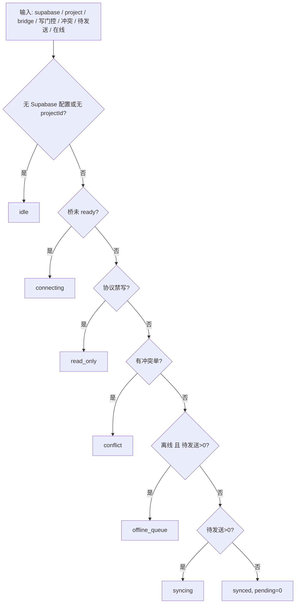

# 协作「阶段 / 门控」可视化（ARCH-6）

> 与 `docs/remediation-plan-2026-04-24.md` §3.6 对账；不替代代码真值，**以源码为准**。

## 1. 同步状态徽章 `deriveCollaborationSyncBadge`（`collaborationSyncDerived`）

**判定规则**：`src/collaboration/cloud/collaborationSyncSurfaceGates.ts` 内命名谓词与 `deriveCollaborationSyncBadge` 使用**同序**的「先匹配先生效」；以下流程自上而下。

- **与发布门控 m10–m13 无硬耦合**：本图为 **UI 同步徽章**，见 `collaborationPromotionRuntime` 的 **PhaseId** 是另一套（推进/发版闸门）。

## 2. 协议写门控 `evaluateCollaborationProtocolGuard`

顺序评估 `projects` 行（见 `src/collaboration/cloud/collaborationProtocolGuard.ts`）：无行 → 允许；否则依次检查 `protocolVersion` 可解析、**不大于**且**严格等于**客户端所支持主版本、存在 `app_min_version`、客户端 semver ≥ min。任一步失败则 `cloudWritesDisabled` + `reasons[]`。

## 3. 发布/推进相位 `m10`–`m13`

门控与灰度/阻断汇总见 `src/collaboration/collaborationPromotionRuntime.ts`（`PHASE_ORDER`、`evaluatePromotionReadiness`）。此处不另画整表，避免与 `digest` 规则漂移。

## 后续

- 协作事务合并管道（`collaborationTransactionSyncRuntime`）与 **Bridge 多阶段 bootstrap** 若再拆，可各增一节 flowchart。本次未改其控制流，仅把 **徽章门控** 抽谓词以符合 ARCH-6「命名谓词 + 文档」的窄落地。
