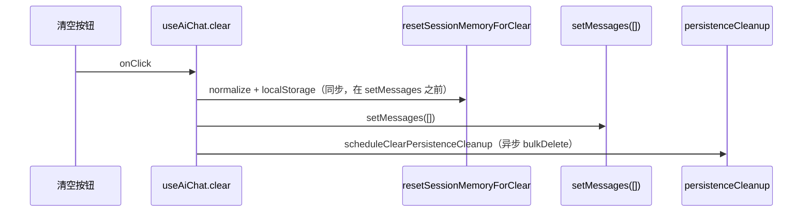
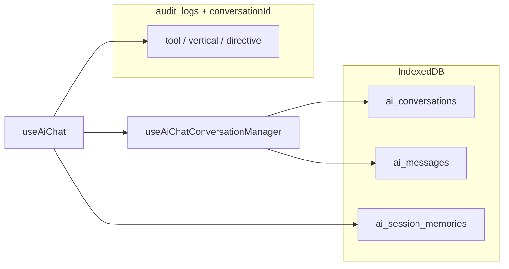
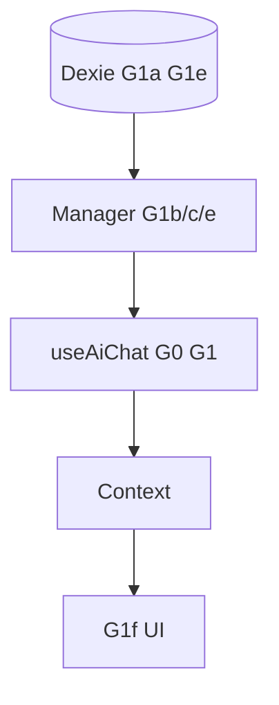

# AI 对话会话管理落地方案

> **关联**：[AI与代码库可治理性综合整改方案-2026-05-13.md](./AI与代码库可治理性综合整改方案-2026-05-13.md) **Phase G**；**UI 入口**：[ai-conversation-management/design.md](../specs/ai-conversation-management/design.md)；转写页装配见 `useTranscriptionAiController.ts` → `useAiChat` → `AiChatCard`。
>
> **结论摘要**：Dexie 双表、审计/replay、pin/摘要、垂直 workflow 面板**可复用**；缺口在**会话目录编排**与 **按会话隔离的状态存储**。清空体感延迟来自 **UI 更新顺序 + 同步 localStorage 全量 normalize + 无 generation 下 `flushSync` 流式回写 + O(n) `bulkDelete`**。终态：**sessionMemory 迁入 IndexedDB**、**新建/切换 O(1) 换 `conversationId`**、**G0 generation 必达**；**不以 localStorage 分桶作为终态**。
>
> **交付状态（2026-05-18）**：G0–G3 与 PR-1～PR-6 已按 [tasks.md](../specs/ai-conversation-management/tasks.md) 收口；`featureFlags.aiConversationManagement` 默认 **true**；G2d 为 **LLM 异步标题**（`conversationTitleLlm.ts`，规则兜底）。未纳入本期：rename、取消归档、Gx-audit TTL。

---

## 一、背景与目标

| 维度 | 说明 |
| --- | --- |
| **产品定位** | 转写页 AI 助手：按 **项目（`textId`）** 组织多会话；**清空** vs **新建** 语义分离；Run 视图 + 可重放，区别于纯聊天气泡。 |
| **现状** | 仅维护 **一条活跃会话**（`useAiChat.conversationState` 按 `updatedAt` 全局取最新，**不区分 `textId`**）；`archived` / `title` / `textId` 在 schema 存在但主路径未写；`sessionMemory` 为 **全局** `localStorage` 单 key（`jieyu.aiChat.sessionMemory`）。 |
| **总目标** | 补齐会话目录 UX；**交互延迟 / 流式竞态 / 存储选型** 纳入可测契约；与行业模式对齐（乐观 UI、按项目隔离、长列表虚拟化）。 |

**优先级（产品）**

| 批次 | 能力 |
| --- | --- |
| **P0** | 新建、列表、切换、按 `textId` 分组、自动标题（MVP）、**清空 vs 新建**、消息区虚拟化/分页 |
| **P1** | 归档、删除 + 确认、会话内搜索、**LLM 异步标题**、多标签同步 |
| **差异化** | Run 视图 + 按 `conversationId` 过滤的可重放；pin、摘要、工具链回看 |

---

## 二、可复用资产与缺口（调研摘要）

### 2.1 可直接或组合复用

| 能力 | 位置 |
| --- | --- |
| 会话/消息 schema | `src/db/types.ts` `AiConversationDoc`；`engine.ts`：`ai_conversations: 'id, textId, updatedAt, archived'`；`ai_messages: 'id, conversationId, [conversationId+createdAt], status, updatedAt'` |
| 建会话 / 拉历史 | `useAiChat.conversationState.ts` |
| 清空（删消息、留 conv 行） | `useAiChat.ts` `clear`；`useAiChat.persistenceCleanup.ts` |
| 项目级级联删 | `LinguisticService.cleanup.ts` |
| Pin / 摘要 / Run / Replay | `sessionMemory.ts`；`AiChatSummaryPanels.tsx`；`auditReplay.ts`；`AiChatDecisionPanel.tsx` |
| UI 装配 | `AiChatCard.tsx`、`AiChatContext.tsx`、`useTranscriptionAssistantSidebarControllerInput.ts` |
| 虚拟列表基建 | 仓库已依赖 `@tanstack/react-virtual`（ADR 0017；侧栏语段列表已用），AI 消息区**尚未**接入 |

### 2.2 主要缺口（代码级，2026-05-16 核实）

| 缺口 | 证据 / 影响 |
| --- | --- |
| 无 `createConversation` / `switchConversation` / 列表 UI | P0 无法交付 |
| **`UseAiChatOptions` 无 `textId`**；`useTranscriptionAiController` 未传入 | 无法按项目分组 |
| **`generation` 令牌缺失**；`clear` 未 `stop()` | 流式 `flushSync` + `setMessages` 可在清空/切换后写回 UI/Dexie |
| `sessionMemory` 全局 localStorage + 同步 `normalize` + `JSON.stringify` | 阻塞主线程；多会话后容量与串数据风险 |
| `clear` = O(n) `bulkDelete` 同 `conversationId` | 长会话清空/切换体感差 |
| 历史一次灌满 UI | `mapHistoryRowsToUiMessages` 全量反转 → 50+ 条重型 `AiChatAssistantMessage` 挂载 |
| 审计/replay 多为全局最近 N 条 | Run 视图无法按会话过滤 |

---

## 三、外部审查采纳（2026-05-16）

> 对「AI 对话会话管理落地方案审查报告」的结论：**现状诊断采纳**；下列为写入本方案的**分期调整**，避免 localStorage 分桶被当作终态。

### 3.1 行业模式（吸收要点，非 1:1 照搬）

| 来源 | 可吸收模式 | 本方案对应 |
| --- | --- | --- |
| 桌面 Agent（如 Claude Code） | 按项目目录隔离；append-only / 少全量 rewrite；会话态与工作流态分离 | `textId` 分组；消息已在 Dexie；`sessionMemory` 迁 IDB |
| Web 聊天产品 | 乐观 UI；虚拟列表；新建 = 换 active pointer；标题异步生成 | G0a、G1g、G1e、G1d / G2d |
| 浏览器存储 | 大对象、审计、聊天记录 → **IndexedDB**；localStorage 仅小配置 | G1a 迁 Dexie |

### 3.2 采纳 vs 原方案对照

| 主题 | 原方案 | **采纳后** |
| --- | --- | --- |
| sessionMemory | G1a localStorage 分桶 | **G1a**：Dexie **每会话一行** JSON（async）；**G1a+**（可选）字段拆表 |
| 清空性能 | G0d 保留 `bulkDelete` 作清空主路径 | **G0**：乐观 UI + generation；**G1e**：新建 O(1)；清空软标记 + 后台删；**仅 `deleteConversation` 默认硬删** |
| 竞态 | G0c generation（略） | **G0c 必达**：覆盖 **`flushSync` 流式路径**及全部 `setMessages` |
| 长列表 | §五「考虑虚拟列表」 | **G1g P0 子项**：`@tanstack/react-virtual` 或首屏 N 条 + 向上加载 |
| 自动标题 | G1d 截断 ~40 字 | **G1d MVP（临时）**；**G2d** 后台 LLM/规则标题 |
| 多标签 | 未提及 | **G2e 可选**：`BroadcastChannel` + localStorage 信标 fallback |
| 测试 | 写入 `useAiChat.test.tsx` | **`useAiChat.clearLatency.test.tsx`** 等拆分文件 |
| audit_logs | 未提及 | **横切 Gx-audit**：TTL / 子库评估（不阻塞 G0–G1） |

### 3.3 二次审查采纳（实施精度，2026-05-17）

> 下列 **必须修改** 项已写入 §四–§五对应 G\* 条；**建议补充** 与 **实施提醒** 见各条「实施说明」子段。

| 级别 | 主题 | 处置 |
| --- | --- | --- |
| **必须** | G1e 软标记字段 | 新增 **`clearedAt?: string`**（ISO），**禁止**复用 `archived` 表示清空 |
| **必须** | G2e 多标签 fallback | `storage` 事件**不能**感知 IDB；改用 **localStorage 信标 key** + refetch Dexie |
| **必须** | G1a Dexie schema 字符串 | 明确 `ai_session_memories: 'conversationId, updatedAt'`（`conversationId` 为 PK） |
| 建议 | G1a 迁移时机/竞态 | 首次 `loadSessionMemory` lazy 迁移，幂等 `put` |
| 建议 | G0c generation 透传 | `conversationGenerationRef` 经 `RunAiChatSendTurnArgs` 等**显式透传** |
| 建议 | Gx-schema 索引 | 本期仅字段，不加 `parentMessageId` 索引 |
| 建议 | G1g 滚动方向 | **自底向上**增长，与侧栏正向虚拟化区分 |
| 提醒 | G1c 兼容 | 无 `textId` 时 fallback 全局最新（排除 archived + cleared） |
| 提醒 | G0→G1e 窗口 | G0 PR 注明清空延迟终态在 G1e |
| 提醒 | G1d i18n | 需新增 `ai.chat.newConversation`（当前仅有 `defaultConversationTitle`） |

---

## 四、清空对话延迟：根因与 Phase 0

### 4.1 调用链（现状）



### 4.2 根因排序

| # | 根因 | 说明 |
| --- | --- | --- |
| 1 | 同步 sessionMemory **先于** `setMessages` | 全量 `normalizeSessionMemory` + `localStorage.setItem` |
| 2 | React 大批量卸载 | `AiChatAssistantMessage` 重型子树 |
| 3 | 异步 IDB `bulkDelete` | 仍可能占主线程；且为 O(n) |
| 4 | **无 generation + 未 stop + `flushSync`** | `useAiChat.sendTurnStreamPhase.ts` ~L105 |
| 5 | 清空 = 删光同 id | 非 O(1) 换 pointer |

### 4.3 Phase 0 修复项（G0）

| ID | 动作 | 验收 |
| --- | --- | --- |
| **G0a** | **乐观 UI**：先 `setMessages([])` + `stop()` / `abort` + 清 `pendingToolCall`；**延后** memory 持久化（`queueMicrotask` / `requestIdleCallback`） | 长会话（≥30 条）清空：气泡 ≤1 帧内消失 |
| **G0b** | **`clearSessionMemoryFastPath`**（过渡）：仅剥 summary/pin/checkpoint，跳过全量 normalize | `sessionMemory.test.ts` |
| **G0c** | **`conversationGenerationRef`**：`send` / `clear` / `switch` / `delete` 均 `++`；**所有** `setMessages`（含 `flushSync` 内）执行前比对 generation，过期则 return；`flushAssistantDraft` / `finalizeAssistantMessage` 同理 | `useAiChat.clearLatency.test.tsx`：clear 后 mock 流式不写回 UI |
| **G0d** | **持久化**：G0 阶段可保留 async `bulkDelete` 作**过渡**；与 G1e 合并后清空主路径改为 `clearedAt` + lazy 删 | 无刷新后消息复活 |
| **G0e** | **可观测（可选）** | `ai.chat.clear.ui_latency_ms` 等 dev 指标 |

**PR 合并最低线**：**G0a + G0c**（G0b 强烈建议同 PR）。

**测试**：G0 用例放入 **`src/hooks/ai/useAiChat.clearLatency.test.tsx`**（勿再膨胀 4445 行的 `useAiChat.test.tsx`）。

**G0c 实施说明（generation 透传）**

- 在 `useAiChat` 顶层：`conversationGenerationRef = useRef(0)`（或 `type GenerationSnapshot = { current: number }` 包一层对象，便于测试注入）。
- **显式透传**至各子路径参数对象（**禁止**依赖隐式闭包读到陈旧 ref）：
  - `RunAiChatSendTurnArgs` / `RunAiChatSendTurnStreamPhaseInput`
  - `createAssistantPersistenceHelpers` 选项
  - `useAiChat.sendTurnPersistAndPrimaryStream.ts`、`useAiChat.sendTurnCompletion.ts` 等
- 流式闭包模式：`const genAtStart = conversationGenerationRef.current`；`flushSync` 内 `setMessages` 前若 `conversationGenerationRef.current !== genAtStart` 则 **return**。
- 已知 `setMessages` 调用点（实施时 grep 补全）：`useAiChat.sendTurnStreamPhase.ts`（含 `flushSync`）、`useAiChat.assistantPersistence.ts`、`useAiChat.sendTurnPersistAndPrimaryStream.ts`、`useAiChat.sendTurnPreflight.ts`、`useAiChat.ts`（`clear`、history load 等）、agent loop / output-cap retry 分支。

**G0→G1e 过渡（实施提醒）**

- G0 合入后、G1e 合入前：`clear()` 仍可能走 **O(n) `bulkDelete`**，长会话清空延迟**未完全消除**。
- **G0 PR 描述须注明**：竞态与首帧 UI 由 G0 解决；**清空性能终态在 G1e**（`clearedAt` + 后台删），避免产品侧误解。

---

## 五、分阶段交付

### Phase 1 — P0 会话目录 + 存储 + 列表性能

| ID | 动作 | 落位 | 验收 |
| --- | --- | --- | --- |
| **G1a** | **`sessionMemory` 迁 Dexie**（见下方「G1a 实施说明」） | schema + migration + `sessionMemory.ts`；`sessionMemory.test.ts` |
| **G1a+** | （可选 / Phase 2）字段拆行、单字段更新 | 非 G1 阻塞 |
| **G1b** | `useAiChatConversationManager`：`createConversation`、`switchConversation`、`listConversations({ textId, excludeArchived: true, excludeCleared: true })` | `src/hooks/ai/` 或 `src/pages/useAiChatConversationManager.ts` |
| **G1c** | **`textId` 注入链**（见「G1c 实施说明」） | vitest |
| **G1d** | **自动标题 MVP（临时）**：首条 user 后 patch `title`（截断 ~40 字）；无 title 时 UI 用 **`ai.chat.conversationList.newConversation`** | 文档标注 temporary |
| **G1e** | **语义与性能**（见「G1e 实施说明」） | 两按钮 + i18n；vitest |
| **G1f** | **会话列表 UI**（`AiConversationListPopover` + HeaderBar）；见 [ai-conversation-management/design.md](../specs/ai-conversation-management/design.md) | 手动 + §2.1 双入口（侧栏/浮动窗） |
| **G1g** | **消息区虚拟化**（见「G1g 实施说明」） | perf test 标定 p95；勿写死单一 100ms |

**G1a 实施说明（Dexie schema + 迁移）**

- **表名**：`ai_session_memories`。
- **Dexie stores 字符串**（`conversationId` 为 **string PK**，每会话一行，**非** `++id`）：
  ```ts
  ai_session_memories: 'conversationId, updatedAt'
  ```
- **文档形状**（Zod + `types.ts`）：`{ conversationId: string; payload: AiSessionMemory; updatedAt: string }`（`payload` 为序列化 JSON 对象，与现 `normalizeSessionMemory` 输出兼容）。
- **版本升级**：bump Dexie `version(N).stores({ ... })` 增加 store；`upgrade` 回调中**不必**迁移 localStorage（见下 lazy 策略）。
- **localStorage 迁移（lazy，非 `onupgradeneeded`）**：
  - 触发：首次 `loadSessionMemory(conversationId)`（或模块级一次性 guard）检测 `localStorage.getItem('jieyu.aiChat.sessionMemory')`。
  - 若存在：解析 → 写入**当前活跃** `conversationId` 的 `ai_session_memories` 行（`put` 覆盖）→ 成功后 **`removeItem`** 原 key。
  - **竞态**：`try/catch` 包裹；同一 `conversationId` 多次 `put` **幂等**；多标签可能重复执行，结果一致即可。
- **读写**：`load`/`persist` **async**；hook 内内存缓存，切换会话时换缓存指针。

**G1c 实施说明（`textId` + 向后兼容）**

1. `UseAiChatOptions.textId?: string`（`src/ai/chat/chatDomain.types.ts`）。
2. `useTranscriptionAiController` 传入当前转写 `textId`。
3. `ensureConversation(textId?)`：
   - **有 `textId`**：取该 `textId` 下 `updatedAt` 最新、且 `archived !== true` 且 **`clearedAt` 未设置** 的会话；
   - **无 `textId`（向后兼容）**：fallback 全局最新，同样排除 **archived** 与 **cleared**。
4. 新建会话 `insert` 时写入 `textId`（`ai_conversations` 索引已存在，无需改 stores 字符串）。

**G1e 实施说明（清空 vs 新建 vs 删除）**

| API | 行为 |
| --- | --- |
| **`startNewConversation`** | 新 `conv_*` + switch；**O(1)**；**不**删旧消息 |
| **`clearCurrentConversation`** | 对当前 conv 写 **`clearedAt: nowIso()`** → UI 立即空 → **后台** lazy `bulkDelete` 该 conv 下 `ai_messages`（不阻塞首帧）；列表默认 **过滤 `clearedAt`** |
| **`deleteConversation`** | 用户确认后硬删 messages + conv 行 |

**Schema 变更（G1e，与 G2a `archived` 语义分离）**

- `src/db/types.ts` `AiConversationDoc` 增加：`clearedAt?: string`
- `src/db/schemas.ts` `aiConversationDocSchema` 增加：`clearedAt: isoDateSchema.optional()`
- **`engine.ts`**：本期 **可不** 为 `clearedAt` 加 Dexie 复合索引（列表量小，内存 filter 即可）；若后续搜索需按 cleared 筛，再追加 migration

**禁止**：用 `archived: true` 表示「用户清空当前对话」——会与 **G2a 用户归档** 在列表/搜索语义上冲突。

**G1g 实施说明（虚拟列表方向）**

- AI 消息区为 **自底向上增长**（最新在下方），与侧栏语段列表（自上而下）不同。
- `@tanstack/react-virtual`：采用 **自底锚定** 策略（如初始滚动到底、`measureElement` + 反向 flex 列，或「首屏最近 N turn + 向上滚动加载更早」）；实施时对照 `SidePaneSidebarSegmentList` 的正向虚拟化，**勿复用同一滚动配置**。
- 备选 MVP：首屏只渲染最近 **N** 个 turn，滚到顶再分页拉 Dexie（与虚拟化二选一，至少满足「不全量挂载 100+ 行」）。

**G2e 实施说明（多标签同步）**

- 主路径：`BroadcastChannel`（如 `jieyu.aiChat.conversations`）在 create / delete / archive / clear 后广播 `{ type, conversationId, textId?, epoch }`；其他标签 **refetch** `listConversations`。
- **Fallback**（无 `BroadcastChannel` 或需覆盖 Safari 旧版）：Dexie 写入**无法**触发 `storage` 事件 → 每次 mutating 操作后 bump **localStorage 信标**：
  ```ts
  localStorage.setItem('jieyu.aiChat.conversationListEpoch', String(Date.now()))
  ```
  其他标签 `window.addEventListener('storage', …)` 监听该 key → **refetch Dexie**（不依赖 IDB 事件）。
- 未实现 G2e 时：文档注明「多标签会话列表可能短暂不一致」。

**Go/No-Go（P0）**：G0a–G0c + G1a–G1g（G1a+ 可后置）。

### Phase 2 — P1

| ID | 动作 | 验收 |
| --- | --- | --- |
| **G2a** | `archiveConversation` → `archived: true` | vitest |
| **G2b** | `deleteConversation` + 确认；硬删 messages + conv | 勿复用 `clear()` |
| **G2c** | `conversationSearch.ts`（title + 最近 N 条 content） | 列表搜索 |
| **G2d** | **LLM 异步标题**（替代 G1d 截断；规则兜底） | `conversationTitleLlm.test.ts`；UI `titleGenerating` |
| **G2e** | **多标签同步**（见 §五 G2e 实施说明）：`BroadcastChannel` + **localStorage `conversationListEpoch` 信标** fallback | `conversationListSync.ts`；双标签烟测 |

**G2d 实施说明（LLM 标题）**

- **触发**：首条 user 消息 persist 后 `scheduleConversationTitlePatch`（`useAiChat.sendPersistTurnAndBuildPromptContext.ts`），不阻塞 send turn。
- **调用**：`createAiChatProvider(settings)` + 流式 `chat` 收集短标题（与 `VoiceIntentLlmResolver` 同模式）；`maxTokens: 64`，超时 15s。
- **落位**：`src/hooks/ai/conversationTitleLlm.ts`（prompt + sanitize）、`conversationTitleGeneration.ts`（patch Dexie + `notifyConversationListMutated`）。
- **UI**：Dexie 仍为默认 title 时 Header/列表显示 `ai.chat.conversationList.titleGenerating`；写回后刷新列表。
- **关闭 LLM**：`VITE_AI_CONVERSATION_LLM_TITLE_ENABLED=false` → 仅 `buildConversationTitleRuleBased` 兜底。

### Phase 3 — 差异化 Run / Replay

| ID | 动作 | 验收 |
| --- | --- | --- |
| **G3a** | 审计 API 支持 `conversationId?` | `auditReplay.test.ts` |
| **G3b** | Run 面板组合现有 Decision/Summary/Adoption，按会话过滤 | `useTranscriptionAiController` 传 `conversationId` |
| **G3c** | `AiChatRunTimelinePanel`（决策 + vertical 审计时间线） | `aiChatRunTimeline.test.ts`；flag on 时展示 |

### 横切 — 不阻塞 G0–G1

| ID | 动作 | 说明 |
| --- | --- | --- |
| **Gx-audit** | `audit_logs`：按 `timestamp` 索引 + TTL 清理（30/90 天）或独立 Dexie 库评估 | 对齐 [C阶段AI治理完整落地方案-2026-04-25.md](./C阶段AI治理完整落地方案-2026-04-25.md) |
| **Gx-schema** | `ai_messages` 预留 **`parentMessageId?: string`**（Zod optional）；**本期不加 Dexie 索引**；未来分支对话启用时再 migration 追加 `parentMessageId` 索引；排序仍以 `[conversationId+createdAt]` 为主，**不假设** `createdAt` 毫秒唯一 | 类型 + schema only |

---

## 六、性能与并发契约（全阶段）

| 契约 | 要求 |
| --- | --- |
| **乐观 UI 优先** | 切换/新建/清空：先 `conversationId` + `messages`（或骨架），后 Dexie / memory |
| **O(1) pointer** | 新建/切换默认不 `bulkDelete`；硬删仅删除会话或显式「不可恢复清空」后台任务 |
| **sessionMemory 在 IDB** | 禁止以 localStorage 分桶为终态；切换加载 async payload |
| **generation + Abort** | 凡 bump generation 的操作均 `stop()` 流 |
| **`flushSync` 纪律** | 流式 delta 必须校验 generation；长期可考虑减 `flushSync` 频率（独立优化） |
| **虚拟列表** | 多会话上线时消息区不得全量挂载 100+ 重型行 |
| **Dexie** | 批量删除单事务；避免仅为 `updatedAt` 额外 `put` conv |
| **非阻塞面板** | Decision / Summary 等可用 `startTransition` |

---

## 七、架构示意（目标态）



> **localStorage**：仅保留 AI 设置等小配置（`aiChatSettingsStorage`）；**不再**承载 `sessionMemory` 主数据。

---

## 八、门禁与验收

| 改动触及 | 必跑 |
| --- | --- |
| G0 | `useAiChat.clearLatency.test.tsx`；`sessionMemory.test.ts`（G0b） |
| G1 + schema | `typecheck`；Dexie migration（`ai_session_memories` + `AiConversationDoc.clearedAt`）；`sessionMemory.test.ts` |
| G1g / `AiChatCard` | `AiChatMessageThreadVirtualPerformanceBaseline.test.ts`；必要时 `test:e2e:chromium` |
| G2d | `conversationTitleLlm.test.ts`、`conversationTitleGeneration.llm.test.ts` |
| G1f 烟测 | `tests/e2e/aiConversationManagementSmoke.spec.ts` |
| `docs/` | `check:docs-governance`；`check:plans-frontmatter` |

**关键路径（审查对齐）**

| 阶段 | 必达 |
| --- | --- |
| **G0** | G0a + G0c（generation 含 `flushSync`） |
| **G1** | G1a（IDB memory + schema 字符串）+ G1e（`clearedAt` + O(1) 新建）+ G1g（底向上虚拟化）+ G1c（textId 链） |
| **G2+** | 归档/搜索/**LLM 标题**/多标签 |
| **G3** | 审计 `conversationId` 过滤 + Run 时间线（可选面板） |

---

## 九、联合实施与防冲突（Plan + UI Spec）

> **目的**：本落地方案（G0–G3 数据/逻辑）与 [ai-conversation-management/design.md](../specs/ai-conversation-management/design.md)（G1f 等 UI）**同一特性、同一列车**，避免「后端先改语义、UI 仍调旧 API」或并行 PR 改同一文件。

### 9.1 文档真源层级（冲突时按此裁决）

| 优先级 | 文档 | 管辖 |
| --- | --- | --- |
| 1 | **本文件** | G\* ID、schema、Hook/API 语义、`clearedAt`、generation、Dexie |
| 2 | [requirements.md](../specs/ai-conversation-management/requirements.md) | 用户场景、可测验收 |
| 3 | [design.md](../specs/ai-conversation-management/design.md) | 布局、组件、交互、i18n、双入口 |
| 4 | PR 描述 | 仅记录本 PR 的 G\*，不得推翻 1–3 |

**硬规则**：UI **只调** §9.3 契约方法，**不**在组件内写 Dexie/ generation；逻辑 **不**在 `AiChatCard` 实现 list/switch。

### 9.2 依赖分层（只允许自上而下）



| 层 | 典型文件 | 禁止 |
| --- | --- | --- |
| L0 | `db/*` | UI 直接写 conv |
| L1 | `useAiChatConversationManager.ts` | import 组件 |
| L2 | `useAiChat.ts`、`sessionMemory.ts` | import `AiChatCard` |
| L3 | `AiChatContext.tsx`、sidebar input | 重复 list 逻辑 |
| L4 | `AiConversationList*`、`AiChatHeaderBar` | 改 schema / generation |

**G1g** 仅动消息渲染子树，不改 §9.3 契约。

### 9.3 唯一对外契约（接缝）

共用一个类型文件（如 `aiConversationManager.types.ts`）：

| 暴露 API | G* | UI |
| --- | --- | --- |
| `activeConversationId` | G1b | 列表 active、`chatTitle` |
| `listConversations` / `conversations` | G1b/c | Popover |
| `startNewConversation()` | G1e | 新建按钮 |
| `switchConversation(id)` | G1b | 列表项（内 bump generation） |
| `clearCurrentConversation()` | G1e | `ai.chat.clearCurrent` |
| `deleteConversation(id)` | G2b | ⋮ 删除 |
| `archiveConversation(id)` | G2a | ⋮ 归档 |

**flag off**：保留 `onClearAiMessages` → 旧 `clear()`；**flag on**：仅 `clearCurrent` + 新会话 API。

### 9.4 PR 列车（须按序合并）

| 序 | 内容 | 闸门 |
| --- | --- | --- |
| PR-1 | G0 | `useAiChat.clearLatency.test.tsx` |
| PR-2 | `clearedAt` + `ai_session_memories` | migration + sessionMemory 测试 |
| PR-3 | Manager + Context + flag（**false**） | hook/manager vitest |
| PR-4 | G1f UI + i18n + 双入口 | requirements §3；**依赖 PR-3** |
| PR-5 | G1g（可与 PR-4 并行若不改 Context 签名） | perf 记录 |
| PR-6 | flag **true** + G2 + G2d LLM 标题 + G3 | 全量验收；见 tasks.md |

**共轨文件**（PR-3 与 PR-4 勿并行各改一版）：`useAiChat.ts`、`AiChatContext.tsx`、`useTranscriptionAssistantSidebarControllerInput.ts`、`AiChatCard.tsx`。

### 9.5 Feature Flag

| 值 | 行为 |
| --- | --- |
| `false` | 旧单会话；G0 可生效；无 Popover（`VITE_AI_CONVERSATION_MANAGEMENT_ENABLED=false`） |
| `true` | **默认**：多会话 + `clearCurrent` / `startNew` + G2/G3 能力 |

### 9.6 并行锁边界

| 轨 | 可独立改 | 勿碰 |
| --- | --- | --- |
| 后端 | `db/*`、Manager、sessionMemory、conversationState | Popover、css |
| UI | `AiConversationList*`、HeaderBar、css | sendTurn*、Dexie version |
| 共轨 | Context、Card 装配 | 须 PR-3 先于 PR-4 |

### 9.7 PR 自检清单

- [ ] 标题含 G\* ID
- [ ] 遵守 §9.2 分层
- [ ] 改 Context 则对照 §9.3 更新 spec
- [ ] clear/switch 含 generation + stop
- [ ] i18n 双语 + dictKeys
- [ ] flag off 旧路径仍绿
- [ ] 共轨文件已协调

### 9.8 常见冲突预防

| 风险 | 预防 |
| --- | --- |
| UI 仍调 `clear()` | PR-4 只绑 `clearCurrentConversation` |
| Popover 与 Provider 同开 | `headerOverlay` 互斥 |
| 切换 pin 串 | PR-2 先于 PR-4 |
| 流式写回 | PR-1 先于 PR-3 |
| 浮动窗旧清空 | PR-4 含 ChatWindow 或声明 scope |

### 9.9 联合收口定义

requirements §3 全勾；flag 默认开；侧栏+浮动窗语义一致；G0–G3 与文档 G\* 一一对应（见 [tasks.md](../specs/ai-conversation-management/tasks.md)）。

---

## 十、维护

- PR 引用 **G\* / Gx\*** ID，并贴 §9.7 自检清单。
- 与 [segment-qa-vertical-ledger.md](../audits/segment-qa-vertical-ledger.md) 独立；Run/审计横切改动仍可按 F 台账更新。
- **已收口（2026-05-18）**：本专篇 `status: completed`；综合方案 Phase G 见交付注记；后续增量（rename、unarchive、Gx-audit）单独立项。
