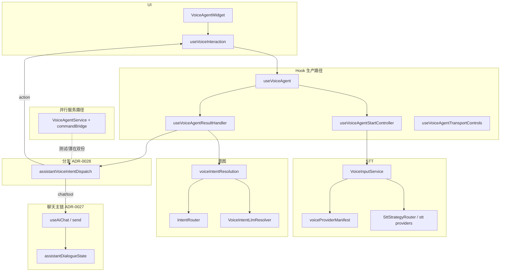

---

## title: AI 语音智能体全盘审查与架构演进方案

doc_type: execution-plan
status: active
owner: repo
last_reviewed: 2026-05-01
source_of_truth: execution-plan
depends_on:

- ../adr/0027-voice-unified-non-dictation-chat-path.md
- ../adr/0028-assistant-multimodal-orchestration-local-first.md
- ../architecture/voice-unified-chat-path.md
- ../architecture/transcription-voice-action-id-registry-contract.md
- ./C阶段AI治理完整落地方案-2026-04-25.md

# AI 语音智能体全盘审查与架构演进方案（2026-05-01）

## 0. 文档目的

在**不立即改代码**的前提下，对当前仓库内 **AI 语音智能体**相关实现做多轮全盘审查的结论汇总，并给出**分阶段、可验收、可回滚**的架构演进设计方案。实施时须与 [ADR-0027](../adr/0027-voice-unified-non-dictation-chat-path.md)、[ADR-0028](../adr/0028-assistant-multimodal-orchestration-local-first.md) 及既有执行方案（如 [C 阶段 AI 治理](./C阶段AI治理完整落地方案-2026-04-25.md)）对齐。

## 1. 审查范围（何谓「全盘」）

### 1.1 纳入范围（代码与功能链）

| 层级         | 主要路径                                                                                                                                                                                                                                |
| ---------- | ----------------------------------------------------------------------------------------------------------------------------------------------------------------------------------------------------------------------------------- |
| UI / 编排入口  | `VoiceAgentWidget`、`useVoiceInteraction`、`TranscriptionPage` 助手运行时对语音的接线                                                                                                                                                            |
| Hook 栈     | `useVoiceAgent`、`useVoiceAgentResultHandler`、`useVoiceAgentStartController`、`useVoiceAgentTransportControls`、`useVoiceAgentModeController`、`useVoiceAgentDictationPipeline`、`useVoiceAgentWakeWord`、`useVoiceAgentProviderControls` |
| 服务单例路径     | `VoiceAgentService` 及拆分模块：`VoiceAgentService.commandBridge`、`VoiceAgentService.runtime`、`VoiceAgentService.state`、`VoiceAgentService.recordingControls`、`VoiceAgentService.wakeWord`                                                |
| STT / 引擎   | `VoiceInputService`（含 recording / vad / probes）、`services/stt/`*、`SttStrategyRouter`、`voiceProviderManifest`、`voiceCommercialSttRuntime`                                                                                            |
| 意图与分发      | `IntentRouter`、`voiceIntentResolution`、`VoiceIntentLlmResolver`、`assistantVoiceIntentDispatch`、`voiceAgentServiceDictationSttRoute`                                                                                                 |
| STT 终局与对话态 | `assistantVoiceSttOrchestrate`、`assistantDialogueState`、与 `useAiChat` / `AiChatCard` 门闈（ADR-0028 实现锚点）                                                                                                                              |
| 听写         | `SpeechAnnotationPipeline`、`pages/voiceDictationFlow`、`voiceDictationRuntime`                                                                                                                                                       |
| TTS / 反馈   | `utils/assistantWebSpeechTts`、`EarconService`、`GlobalContextService.assistantTtsEnabled` 等                                                                                                                                          |
| 观测与持久化     | `voiceConfirmedPendingTelemetry`、`VoiceSessionStore`、`userBehaviorStore` / `inputModality`                                                                                                                                          |

### 1.2 多轮审查方法（建议固定为四轮）

1. **链路轮**：从麦克风打开到「action / chat / tool / dictation」出口的完整时序图；标出异步边界与二次入口（`toggle`、`dispose`、页面卸载）。
2. **状态与并发轮**：`sessionRef` / `exclusiveStartPromise` / `voiceActivateToken`、与聊天侧 `pending tool`、对话态 `derive()` 的优先级是否在所有入口一致。
3. **治理与契约轮**：ActionId 五处同步、`voiceProviderManifest` 与运行时 lazy load 是否同源、审计字段是否随语音路径写入。
4. **可维护性轮**：行数阈值（`useVoiceAgent`、`VoiceInputService`、`VoiceAgentService`）、重复 lazy-loader、双路径语义漂移风险。

## 2. 现状架构（读模型）

**要点**：生产界面以 Hook 栈为主；`VoiceAgentService` 仍保留完整实现并与 `commandBridge` 共用 `assistantVoiceIntentDispatch`，符合 ADR-0028 所述「分阶段收敛」，**未**等价于「单一路径文件数唯一」。

## 3. 审查发现（按严重度）

### P0 — 架构债务与长期分叉风险

1. **双实现核心（Hook vs `VoiceAgentService`）**
  - `VoiceAgentService.ts` 体量仍大（约 1100+ 行），与 `useVoiceAgent` 及 `useVoiceAgent.runtime` 中的 lazy import 模式**并行存在**。  
  - 风险：修复竞态、引擎切换、manifest 行为时若只改一侧，出现**行为漂移**。  
  - 对齐：ADR-0028 §3「提取后退役生产路径」——当前属**进行中**，非已关闭项。
2. **Lazy runtime 双份**
  - `VoiceAgentService` 与 `useVoiceAgent.runtime` 各自维护 `loadVoiceInputRuntime` 等 promise；`useVoiceAgent.structure.test.ts` 用结构断言约束 Hook 侧，**不自动约束 Service 侧**。  
  - 风险：缓存键、分包边界、manifest 失败策略在两处演化不一致。

### P1 — 复杂度与编排层负担

1. `**useVoiceAgent` / `useVoiceInteraction` / `VoiceInputService` 行数**
  - 均属「高变更频率 + 多职责」热点，逼近仓库 `check:architecture-guard` 对单文件复杂度的纪律。  
  - 与 AGENTS.md「编排下沉」一致：进一步拆分应优先 **controller 化**（页级 `useTranscription*Controller` 模式），避免再抽薄 hook。
2. **意图链路易读性**
  - `resolveVoiceIntent` → LLM 回退 → refine → `dispatchResolvedVoiceIntent` 跨多文件；新人定位「为何未进聊天」成本较高。  
  - 建议：维护**单一顺序图**（可放在 `docs/architecture/` 的 voice 专文附录），与 `voice-unified-chat-path.md` 交叉链接。

### P2 — 产品能力与治理缺口

1. **TTS**
  - 已有 `assistantWebSpeechTts`、设置项与停止时清理（如 `useVoiceAgentStartController` 中 `stopAssistantWebSpeechTts`）。  
  - ADR-0028「开放项」仍要求：缺省开关、离线/CSP/许可等**单独规格或 ADR**——当前属**规格未闭环**，非纯实现缺失。
2. **C3 manifest 与 release-stable**
  - C 阶段方案写明 C3 MVP 已落地，但 **voice provider health 与降级路径**仍需 release evidence **连续周期**验证后才宜标为 release-stable。

### 已缓解或已有治理抓手（审查中标记为「不必重复造轮子」）

- **麦克风竞态**：整改计划 CRITICAL-3 已闭环摘要（`exclusiveStartPromise` + 异步 stop 等）。  
- **非听写统一主链**：ADR-0027 + `voice-unified-chat-path.md` + 手工验收脚本索引。  
- **ActionId 契约**：`transcription-voice-action-id-registry-contract.md` + `npm run check:voice-agent-pre-merge`。  
- **Hooks 违规**：CRITICAL-5 对 `GroundingContext` 的勘误已标记完成。

## 4. 改造设计方案（分阶段）

### Phase A — 防漂移与可证明性（1–2 个 PR，低风险）

**状态（2026-05-01）**：已落地（A1–A3）。

**目标**：不削减功能，降低双路径语义漂移概率。

| 动作  | 说明                                                                                                                                                                             |
| --- | ------------------------------------------------------------------------------------------------------------------------------------------------------------------------------ |
| A1  | 建立 **「语音关键行为对照表」**（Hook 路径 vs `VoiceAgentService` 路径）：start/stop、manifest 失败、engine 切换、final STT 后分支；每次改语音必更新该表一行（可放在本方案 §4 附录或 `docs/architecture/` 短文）。                      |
| A2  | 为 `VoiceAgentService.commandBridge` 与 `useVoiceAgentResultHandler` 的**共有分支**增加 **参数化契约测试**（同一组 `SttResult` + `VoiceIntent` 输入，断言进入 `dispatchResolvedVoiceIntent` 前的 guard 一致）。 |
| A3  | 将 **lazy-loader** 收敛为 `services/voiceRuntimeLoaders.ts`（或等价单模块）由 Hook 与 Service **共同 import**，删除重复 `let xxxPromise`（需验证 bundle 与循环依赖）。                                         |

**交付物索引**：`[voice-agent-hook-vs-service-behavior-matrix.md](../../architecture/voice-agent-hook-vs-service-behavior-matrix.md)`、`src/services/voiceRuntimeLoaders.ts`、`src/hooks/voiceIntentResolution.serviceHookParity.test.ts`。

**验收**：`npm run check:voice-agent-pre-merge`、`npx vitest run` 覆盖 voice 相关结构测试 + commandBridge / resultHandler 新增用例；无行为变更类回归由 E2E 抽检清单执行（见 Phase D）。

### Phase B — ADR-0028 收敛（多 PR，中风险）

**状态（2026-05-01）**：**B1**（听写 STT + interim 同源）、**B2**（`_handleSttResult` → `VoiceAgentService.sttResultDispatch.ts` 单一委托）、**B3**（结构守卫）已落地；`VoiceAgentService` 类仍承载会话/录音/唤醒等生命周期（非 STT 分发职责），与 ADR-0028「分阶段退役」一致。

**目标**：生产运行时**单一分发事实源**，`VoiceAgentService` 退居测试适配或极薄门面。

| 动作  | 说明                                                                                                                                                      |
| --- | ------------------------------------------------------------------------------------------------------------------------------------------------------- |
| B1  | 将 `VoiceAgentService.commandBridge` 内仍独有的分支逻辑迁入 `assistantVoiceIntentDispatch` 或 `assistantVoiceSttOrchestrate` 等 **与 React 无关**模块（与 ADR-0028 §3.1 一致）。 |
| B2  | `VoiceAgentService` 仅保留：状态镜像、事件订阅、与 Hook 相同的 **委托调用**（内部直接调已提取的纯函数/模块）。                                                                                 |
| B3  | 更新 `VoiceAgentService.structure.test.ts`：断言「禁止新增与 Hook 路径重复的巨型 switch」行数上限或 import 黑名单（与 architecture-guard 协调）。                                        |

**验收**：全量 voice 相关 Vitest + 转写页语音相关 E2E（若有）；ADR-0028 文中可增加「阶段 B 完成」勾选段（需单独 doc PR 或 ADR 修订附录）。

**本迭代交付物**：`tryConsumeSttThroughDictationPipeline`、`applyVoiceSttInterimIfNotFinal`、`VoiceAgentService.sttResultDispatch.ts`、`VoiceAgentService.structure.test.ts` Phase B 断言；行为矩阵文档「听写 pipeline」与 STT 委托节。

### Phase C — 热点拆分（与编排纪律一致）

**状态（2026-05-01）**：**C1 部分落地** — 转写页专用语音摘要与 `sendToAiChat` 桥接迁至 `src/services/transcriptionVoiceInteractionWiring.ts`；`useVoiceInteraction` 变薄。**C2 部分落地** — Web Speech 类型与 ctor/AEC 迁至 `VoiceInputService.webSpeechSupport.ts`；**STT fallback 链、链切片、商业未配置原因、失败文案**迁至 `VoiceInputService.fallbackChain.ts`；**Web Speech 结果/致命错误**迁至 `VoiceInputService.webSpeechEngine.ts`；**Web Speech 实例化、连续模式 onend、rec.start**迁至 `VoiceInputService.webSpeechSession.ts`；**WhisperX VAD 策略与 RecordingExecutor 绑定**迁至 `VoiceInputService.vadSync.ts`；**引擎切换 debounce 定时器 + token + switching 标志**迁至 `VoiceInputService.engineSwitchCoordinator.ts`（`SttEngine` 仍从 `VoiceInputService` 导出）。recording/probes 与 `RecordingExecutor` 本体的可选进一步切分仍为后续 PR。

**目标**：`useVoiceAgent` / `VoiceInputService` 不继续无上限膨胀。

| 动作  | 说明                                                                                                                                                               |
| --- | ---------------------------------------------------------------------------------------------------------------------------------------------------------------- |
| C1  | 页级：将 `useVoiceInteraction` 中「与转写页强绑定」的回调迁入 `useTranscription*Controller` 风格文件（若尚未存在的专用 controller，则新建 `useTranscriptionVoiceAssistantController.ts` 等，命名遵循仓库惯例）。 |
| C2  | 服务级：`VoiceInputService` 按 **生命周期 / 引擎策略 / 商业 provider 桥** 再切分（已有 `recording`/`vad`/`probes` 的可延续方向）。                                                             |

**验收**：`npm run check:architecture-guard` 无新增 hotspot 违规；对应结构测试更新。

### Phase D — TTS 与观测（产品 + 工程）

**状态（2026-05-01）**：已起草 **`docs/adr/0029-assistant-tts-web-speech-policy.md`（`proposed`）** 作为 TTS 规格入口；release evidence 连续采样口径仍按 C 阶段方案执行，未改 CI 脚本。

**目标**：TTS 与语音链路可观测性达到「可发布叙事」。

| 动作  | 说明                                                                                            |
| --- | --------------------------------------------------------------------------------------------- |
| D1  | 起草 **TTS ADR 或 architecture 节**：缺省、降级、与 `assistantDialogueState` 的互斥（朗读 vs 新消息）。              |
| D2  | release evidence：为 voice manifest health / 降级路径增加 **与 C 阶段方案 §4.2 一致的**周期采样说明（不替代代码，只定义门禁口径）。 |

**验收**：与 `docs/execution/release-gates/` 现有 voice  rollout 文档对齐；必要时扩展 `voice-unified-chat-path-rollout.md` 的检查项。

## 5. 非目标（本方案不承诺）

- 一次性重写整条 STT 引擎矩阵或引入未讨论的新商业引擎。  
- 在未做 Phase A/B 前，仅因「文件变长」做机械拆文件而不下沉业务逻辑。  
- 用 fixture-only 替代运行时语音链路的发布证据。

## 6. 建议的下一步（工程顺序）

1. 评审本方案并确认 **Phase A** 是否立即立项（推荐：是）。
2. 指定 owner：Phase B 需与「转写助手 / useAiChat」owner 协同，避免门闈双改。
3. 每个 Phase 结束跑一次：`npm run check:voice-agent-pre-merge`、`npm run check:architecture-guard`、以及 release-gates 中与语音相关的文档索引自检。

---

## 附录 A：关键文件清单（便于 PR 分刀）

- Hook：`src/hooks/useVoiceAgent*.ts`、`useVoiceInteraction.ts`  
- 服务：`src/services/VoiceAgentService*.ts`、`VoiceInputService*.ts`、`assistantVoiceIntentDispatch.ts`、`assistantVoiceSttOrchestrate.ts`、`voiceIntentResolution.ts`  
- STT：`src/services/stt/`*、`voiceProviderManifest.ts`  
- UI：`src/components/VoiceAgentWidget.tsx`  
- TTS：`src/utils/assistantWebSpeechTts.ts`  
- 契约：`scripts/check-transcription-text-telemetry-contract.mjs`（ActionId）

## 附录 B：与历史规划的关系

历史文档 `docs/execution/archive/historical-root-docs/规划-语音智能体架构设计方案-2026-03-18.md` 中的 **P0/P1/P2**（如 `TtsService` 独立产品化）与本方案 **Phase D / Phase C** 对应；**当前事实源**以 `docs/architecture/`、`docs/adr/` 与代码为准。