# ReadyWorkspace.body 彻底拆分 — 一次性收口计划（2026-05-09）

## 0. 目标与边界

### 0.1 目标（本计划执行完毕时的验收）

| 项 | 验收标准 |
|----|----------|
| **body 体积** | `TranscriptionPage.ReadyWorkspace.body.tsx` **≤ 550 行**（薄壳：chunk 导出面 + 结构锚点；**不重放**大段 hook）。**2026-05-09 收口**：薄壳 **~20 行**，重编排迁至 `TranscriptionPage.ReadyWorkspaceOrchestrator.tsx`（守卫/结构测试/ lane 脚本已对齐）。 |
| **单 hook 文件** | 每个新建 `useReadyWorkspace*.ts(x)`：**≤ 300 行**，且 `useEffect` + `useMemo` + `useCallback` **合计 ≤ 12**（与 `copilot-instructions.md` 一致）。超限则**再拆文件**，禁止单文件硬堆。 |
| **入口** | `TranscriptionPage.ReadyWorkspace.tsx` 保持 **仅 CSS + re-export body**（现行规则不变）。 |
| **行为** | 无用户可见行为变化；`npx tsc --noEmit`、`npm run check:architecture-guard`、`node scripts/check-transcription-lane-read-scope.mjs`、**全量或约定子集** Vitest（至少 `TranscriptionPage.structure.test.ts` + 既有 ReadyWorkspace / transcription 相关用例）通过。 |
| **文档** | 更新 `docs/architecture/code-governance-plan-2026-05-06.md` 中 ReadyWorkspace **入口 / body / 各阶段 hook** 行数表；本文件「落地记录」打勾日期。 |

### 0.2 非目标（避免范围 creep）

- 不改业务语义、不重写 `useTranscriptionData` 内聚逻辑。
- 不把 **JSX 大块** 再塞回 body（Layout 已是独立文件则保持）。
- 不引入 `src/features/` 等新目录体系。

### 0.3 硬约束（执行中必须遵守）

1. **React hook 顺序**：下列「依赖层级」中，**低层级 hook 的输出**只能被 **高层级** 使用；迁移时**禁止**在同一组件内对同一批逻辑「复制粘贴两套 hook」导致双订阅。
2. **`exactOptionalPropertyTypes`**：向子 hook / controller 传参时，可选字段用 **`...(x !== undefined ? { x } : {})`**，禁止显式传 `undefined`。
3. **架构守卫**：每新增 `src/pages/useReadyWorkspace*.ts(x)`，在 `scripts/architecture-guard/rules.pages.mjs` 中二选一：**纳入 ratchet**（`architectureGuardPageRatchetFileRules`）或 **满足 bulk `use*` 规则**；并为从 body 迁出的 **requiredRegex** 做「body 或新文件二选一」迁移，避免双缺失。
4. **结构测试**：`TranscriptionPage.structure.test.ts` 中凡断言 `readTranscriptionReadyWorkspaceRuntimeSource()` 的接线，若字面量迁入子模块，改为 **`readTranscriptionReadyWorkspaceRuntimeSource() + fs.readFileSync(相关 hook/slice)`** 或统一 **`readReadyWorkspaceWiringBundle()`**（见 §6）。

---

## 1. 依赖层级（Hook 顺序真值表）

下列顺序 **必须** 在最终 `TranscriptionPageReadyWorkspace`（或唯一编排壳）中保持。拆分时，**同一阶段 hook 内部**子调用顺序也与下表一致。

```mermaid
flowchart TB
  subgraph L0[L0 环境与数据]
    D[data + router + locale + toast]
  end
  subgraph L1[L1 段作用域与壳]
    S1[segmentScope]
    S2[shellController]
    S3[deepLinkEffects]
  end
  subgraph L2[L2 选区与桥]
    C1[selectionContextController]
    C2[segmentBridgeController]
  end
  subgraph L3[L3 恢复与 refs]
    R1[recoveryBanner]
    R2[runtimeRefs]
    R3[voiceAssistantBridgeRefs]
  end
  subgraph L4[L4 布局与笔记]
    W1[waveformRuntimeController]
    W2[workspaceLayoutController]
    W3[displayStyleControl]
    W4[UIState + verticalPaneFocus + noteHandlers]
  end
  subgraph L5[L5 时间轴读模型前置]
    T1[transcriptionLaneReadScope memo]
    T2[timelineUnitViewIndex]
    T3[documentSpan ref + logical duration]
  end
  subgraph L6[L6 段图前置簇]
    B[readyPhaseBootstrap 或子拆]
  end
  subgraph L7[L7 波形桥]
    WF[waveformBridgeController]
    L7e[layoutEffect sync documentSpan ref]
  end
  subgraph L8[L8 选区快照与 AI 基础态]
    SS[selectionSnapshot]
    AI0[deferredAiRuntimeBridge + local AI UI state]
    LD[layoutDerivations]
    APL[aiPanelLogic]
    ORE[observerRecommendationExecutor]
    APS[acousticPanelState]
  end
  subgraph L9[L9 时间轴同步与助手与回放]
    TS[timelineSyncSetup]
    AC[assistantController]
    PB[playbackReadModelSetup]
    AU[audioCaptureController]
  end
  subgraph L10[L10 侧栏与面板与轨控]
    ASI[assistantSidebarControllerInput]
    ASC[assistantSidebarController]
    WPE[workspacePanelEffects]
    TEC[trackEditControllers]
  end
  subgraph L11[L11 视图模型与轴与渲染与 Surface]
    VM[viewModels + toolbar extras]
    AX[axisStatus]
    RC[renderController]
    BR[assistantBridge assemble + join]
    SF[surfaceOrchestratorBundle + nested builder]
  end
  D --> S1 --> S2 --> S3 --> C1 --> C2
  C2 --> R1 --> R2 --> R3 --> W1 --> W2 --> W3 --> W4
  W4 --> T1 --> T2 --> T3 --> B --> WF --> L7e
  L7e --> SS --> AI0 --> LD --> APL --> ORE --> APS
  APS --> TS --> AC --> PB --> AU
  AU --> ASI --> ASC --> WPE --> TEC --> VM --> AX --> RC --> BR --> SF
```

**说明**：`L6` 当前为 `useReadyWorkspaceReadyPhaseBootstrap`；`L8` 内顺序以现有 body 为准（`selectionSnapshot` 必须在波形桥与 `layoutEffect` 之后）。

---

## 2. 目标文件树（一次性落地清单）

下列文件为 **计划新增或大幅改写** 的落位；命名可按实现微调，但**职责边界**不得合并回 mega-hook。

### 2.1 阶段编排 hook（`src/pages/useReadyWorkspace*.ts`）

| # | 文件（建议名） | 职责 | 行数预算 | 迁出 body 的近似行块 |
|---|----------------|------|----------|----------------------|
| 1 | `useReadyWorkspaceDomainShellPhase.ts` | `segmentScope` + `segmentScopeMediaItem` + `shellController` + `deepLinkEffects` | ≤280 | ~228–354 |
| 2 | `useReadyWorkspaceSelectionBridgePhase.ts` | `selectionContextController` + `segmentBridgeController` | ≤220 | ~355–399 |
| 3 | `useReadyWorkspaceRecoveryAndRefsPhase.ts` | `recoveryBanner` + `backupReminder` + `runtimeRefs` + `voiceAssistantBridgeRefs` | ≤260 | ~394–439 |
| 4 | `useReadyWorkspaceWorkspaceChromePhase.ts` | `waveformRuntimeController` + `workspaceLayoutController` + 竖排派生 + `displayStyleControl` + overlap/lock toast state + `UIState` + `verticalPaneFocus` + `noteHandlers` | ≤300 | ~447–591 |
| 5 | `useReadyWorkspaceTimelineReadModelPrepPhase.ts` | `transcriptionLaneReadScope` + `timelineUnitViewIndex` + `activeTextLogicalDuration` + `documentSpanSecFromBridgeRef`（仅 ref 初始化，不含 bridge 写回） | ≤240 | ~586–617 |
| 6a | `useReadyWorkspaceSegmentGraphCluster.ts` | 原 `readyPhaseBootstrap` 内：**unified sync + segment clamp + interaction helpers** | ≤260 | 自原 bootstrap 拆出 |
| 6b | `useReadyWorkspaceSegmentMutationCreationCluster.ts` | **mutationController + adapters + creationController** | ≤280 | 自原 bootstrap 拆出 |
| 6c | `useReadyWorkspaceUnitOpsAndOverlayCluster.ts` | **unitOps + overlayActionRouting** | ≤220 | 自原 bootstrap 拆出 |
| 7 | `useReadyWorkspaceWaveformBridgePhase.ts` | `waveformBridgeController` + `useLayoutEffect` 同步 `documentSpanSecFromBridgeRef` | ≤200 | ~685–779 |
| 8 | `useReadyWorkspaceSelectionAndAiPrepPhase.ts` | `selectionSnapshot` + deferred AI 相关 `useState` + `useDeferredAiRuntimeBridge` + `layoutDerivations` + `aiPanelLogic` + `observerRecommendationExecutor` + `acousticPanelState` | ≤300 | ~781–884 |
| 9 | `useReadyWorkspaceTimelineAssistantPlaybackPhase.ts` | `timelineSyncSetup` + `assistantController` + `playbackReadModelSetup` + `audioCaptureController` | ≤300 | ~886–1092 |
| 10 | `useReadyWorkspaceSidebarAndTrackPhase.ts` | `assistantSidebarControllerInput`（含现有 header/runtime slice 调用）+ `assistantSidebarController` + `workspacePanelEffects` + `trackEditControllers` | ≤300 | ~1089–1235 |
| 11 | `useReadyWorkspaceViewModelsAndSurfacePhase.ts` | `viewModels`（`buildReadyWorkspaceViewModelsInput` 及各 slice）+ `toolbarPropsWithCollaboration` + `axisStatus` + `renderController` + `join` + `assemble` bridge + `surfaceOrchestratorBundle`（含 nested + layeredFlat） | ≤300 **若单文件仍超则再拆 11a/11b** | ~1237–1751 |

**行数预算原则**：若预估值 >280，**先在设计阶段拆文件**，不要写到 295 再想办法。

### 2.2 纯函数 / 类型（可选，用于给阶段 hook 减负）

| 文件 | 职责 |
|------|------|
| `readyWorkspaceReadyWorkspacePhaseTypes.ts`（或就近 `*.types.ts`） | 各 `useReadyWorkspace*Phase` 的 **入参 / 返回值** 公共类型，避免阶段之间循环类型引用 |
| `readyWorkspaceDocumentSpanBridgeSync.ts` | 将「`documentSpanSecFromBridge` → ref」抽成 **命名函数 + 单测可测** 的极小模块（若仍保留 `useLayoutEffect` 则仅 1 处） |

### 2.3 删除或瘦身为 re-export

| 文件 | 动作 |
|------|------|
| `useReadyWorkspaceReadyPhaseBootstrap.ts` | **删除**或改为 **re-export** 三个 cluster（6a–6c）+ 薄组合函数 `useReadyWorkspaceReadyPhaseBootstrap`（仅 3 行调用 + return merge），避免调用方大面积改名时可保留同名 API |

---

## 3. 执行顺序（单次 PR 或同一里程碑内严格按序）

建议 **同一分支 / 同一里程碑** 内按下列顺序提交（可 squash 前保持多次 commit，但不要合一半停）：

1. **准备**：新增 `readReadyWorkspaceWiringBundle()`（或等价）到 `TranscriptionPage.structure.test.ts`；列出将从 body 删除的 `requiredRegex` 清单对照 `rules.pages.mjs`。
2. **拆 L6**：实现 6a、6b、6c + 更新/删除 `useReadyWorkspaceReadyPhaseBootstrap`；跑 tsc + guard + structure test。
3. **拆 L1–L5**：按表 2.1 顺序实现 hook 1→5；每完成一个 hook，从 body 删除对应块并改为单次调用；**每步** tsc + structure test。
4. **拆 L7**：`useReadyWorkspaceWaveformBridgePhase`；注意 `documentSpanSecFromBridgeRef` 读写边界。
5. **拆 L8**：`useReadyWorkspaceSelectionAndAiPrepPhase`（最重 UI 局部 state 在此阶段收口）。
6. **拆 L9**：timeline + assistant + playback + audio（注意 `playbackReadModelSetup` 对 `timelineReadModel.epoch` 的下游）。
7. **拆 L10**：sidebar + panel + track edit。
8. **拆 L11**：viewModels + surface；若 >300 行则拆为：
   - **11a** `useReadyWorkspaceViewModelsPhase.ts`
   - **11b** `useReadyWorkspaceSurfaceAssemblyPhase.ts`（仅 bridge join + assemble + bundle + builders 调用）
9. **body 终稿**：只保留阶段调用 + `return`；核对 `maxUseMemo` / `maxUseCallback` / `maxUseEffects` body 规则。
10. **守门全量**：`npm run check:architecture-guard`、`check:docs-governance`（若改 `docs/architecture/`）、`report:docs-link-debt`（若大量改 docs 链接）。
11. **治理表**：更新 `code-governance-plan-2026-05-06.md` 行数快照。

---

## 4. 架构守卫与结构测试改动清单

### 4.1 `scripts/architecture-guard/rules.pages.mjs`

- **`TranscriptionPage.ReadyWorkspace.body.tsx` / `TranscriptionPage.ReadyWorkspaceOrchestrator.tsx` 的 `requiredRegexes`**：凡已迁出薄 body 的锚点（例如阶段 hook、`useReadyWorkspaceWaveformBridgePhase` 等），必须落在 **Orchestrator** 或 **ratchet 阶段文件** 之一，且 **结构测试** `readTranscriptionReadyWorkspaceRuntimeSource()` 与之一致（当前合并读 shell + body + orchestrator）。
- **新增 ratchet**：为每个 `useReadyWorkspace*Phase.ts` 若 bulk `use*` 300 行规则不适用，则加入 `architectureGuardPageRatchetFileRules`：`maxLines`、`requiredRegexes`（至少包含 `export function use…` 与关键下游 hook 字面量）。
- **热点**：`useReadyWorkspaceReadyPhaseBootstrap` 拆完后应 **不再出现 91% 行数 warning**；若新文件仍顶格，继续拆而非调大 ratchet。

### 4.2 `src/pages/TranscriptionPage.structure.test.ts`

- 增加 **`readReadyWorkspaceWiringBundle()`**：`readTranscriptionReadyWorkspaceRuntimeSource()` + 所有 `useReadyWorkspace*Phase.ts`（可用 `glob` 或显式列表，避免漏文件）。
- 所有「接线在 body」的断言改为对 **wiring bundle** 或 **具体阶段文件** 断言，避免回归时只搜 body。

### 4.3 `scripts/check-transcription-lane-read-scope.mjs`

- `transcriptionLaneReadScope`：`scripts/check-transcription-lane-read-scope.mjs` 要求 **body 与/或 `TranscriptionPage.ReadyWorkspaceOrchestrator.tsx`** 至少一处包含该子串（薄壳阶段可仅在 Orchestrator）。

---

## 5. 风险与缓解

| 风险 | 缓解 |
|------|------|
| Hook 顺序错误导致运行时异常或多余渲染 | 严格按 §1 表实现；PR 内用注释标 `// L7 after L6`；必要时加 **仅 dev** 的 `import.meta.env.DEV` 断言（可选）。 |
| `useMemo` 依赖遗漏 | 迁移时用 **同一 deps 元组** 整体移动，不做「顺手优化」；对关键派生补 **聚焦 vitest**（若已有则扩展）。 |
| 类型断言扩散 | L6 拆分时优先 **修正 `useReadyWorkspaceInteractionHelpers` 泛型** 使 `getUnitDocById` 与 `LayerUnitDocType` 一致，逐步去掉 `as unknown as`。 |
| PR 过大难审 | 允许 **多次 commit** 但 **同一里程碑合并**；review 按 §3 阶段顺序看 diff；禁止跨阶段穿插改无关模块。 |

---

## 6. 建议的测试矩阵（最小）

| 命令 | 时机 |
|------|------|
| `npx tsc --noEmit` | 每完成一个阶段 hook |
| `npm run check:architecture-guard` | L6、L11、终稿 |
| `node scripts/check-transcription-lane-read-scope.mjs` | L5 / 终稿 |
| `npx vitest run src/pages/TranscriptionPage.structure.test.ts` | 每步 |
| `npm test` 或 CI 等价 | 终稿 |

---

## 7. 落地记录

| 日期 | 内容 |
|------|------|
| 2026-05-09 | 建立本「一次性收口」计划：目标文件树、Hook 顺序、守卫/测试清单、执行顺序 |
| 2026-05-09 | **部分执行**：L6 拆为 `useReadyWorkspaceSegmentGraphCluster` / `SegmentMutationCreationCluster` / `UnitOpsAndOverlayCluster` + 瘦 `useReadyWorkspaceReadyPhaseBootstrap`；**L1 合并**：`useReadyWorkspaceDomainShellPhase`（segment scope + shell + deep link + selection + bridge）；body 接线 + `readReadyWorkspaceWiringBundle()`；守卫 ratchet 更新。**未做**：L3–L5 独立文件、L11、body ≤550 终态 |
| 2026-05-09 | **L7**：新增 `useReadyWorkspaceWaveformBridgePhase.ts`（`useReadyWorkspaceWaveformBridgeController` + `useLayoutEffect` 写 `documentSpanSecFromBridgeRef`）；body 去 `useLayoutEffect`；`readReadyWorkspaceWiringBundle` 纳入该文件；`rules.pages.mjs` body 锚点改为 `useReadyWorkspaceWaveformBridgePhase`、ratchet 约束 L7 文件。 |
| 2026-05-09 | **L8**：新增 `useReadyWorkspaceSelectionAndAiPrepPhase.ts`（选区快照 + `useDeferredAiRuntimeBridge` + `useReadyWorkspaceLayoutDerivations` + `useAiPanelLogic` + observer executor + `useTranscriptionAcousticPanelState`）；body 单钩解构；wiring bundle 纳入；body 守卫锚点改为 `useReadyWorkspaceSelectionAndAiPrepPhase`；L8 ratchet + `postCss` 页钩规则排除 `useReadyWorkspace*Phase.ts` 避免与 300 行 bulk 重复计量。 |
| 2026-05-09 | **L9**：新增 `useReadyWorkspaceTimelineAssistantPlaybackPhase.ts`（`useReadyWorkspaceTimelineSyncSetup` → `useTranscriptionAssistantController` → `useReadyWorkspacePlaybackReadModelSetup`（`documentSpanSec` 来自 ref）→ `buildReadyWorkspaceAudioCaptureControllerInput` + `useReadyWorkspaceAudioCaptureController`）；body 四段合并为单钩 + 四子对象入参；wiring bundle 纳入；body 首条 `requiredRegex` 改为 `useReadyWorkspaceTimelineAssistantPlaybackPhase` / `useTranscriptionProjectMediaController` 二选一；去掉 body 对 `useTranscriptionAssistantController` 与 `useReadyWorkspaceTimelineSyncSetup` 的独立锚点；L9 ratchet。 |
| 2026-05-09 | **L10**：新增 `useReadyWorkspaceSidebarAndTrackPhase.ts`（侧栏 input 两 slice + `useTranscriptionAssistantSidebarController` + `useTranscriptionWorkspacePanelEffects` + `useReadyWorkspaceTrackEditControllers`）；body 单钩四子对象；wiring bundle 纳入；body `useReadyWorkspaceTrackEditControllers` 锚点改为 `useReadyWorkspaceSidebarAndTrackPhase`；L10 ratchet；结构测试对轨面/侧栏 import 与 builder 字面量兼容 bundle + `SidebarAndTrackPhase`。 |
| 2026-05-09 | **L11**：新增 `useReadyWorkspaceViewModelsAndSurfacePhase.ts`（`buildReadyWorkspaceViewModelsInput` + `useReadyWorkspaceViewModels` → toolbar collaboration → `useReadyWorkspaceAxisStatus` → `useReadyWorkspaceRenderController` → assistant bridge assemble → `useReadyWorkspaceSurfaceOrchestratorBundle`）；编排层以单钩 `useReadyWorkspaceViewModelsAndSurfacePhase` 替换原 viewModels～surface 大块；`readReadyWorkspaceWiringBundle` 纳入该文件；守卫增加 `useReadyWorkspaceViewModelsAndSurfacePhase` 锚点（后在 **Orchestrator** 条目）；L11 ratchet。**仍可选**：L3–L5 独立阶段 hook 以继续减薄 Orchestrator。 |
| 2026-05-09 | **body ≤550 终态（薄壳）**：新增 `TranscriptionPage.ReadyWorkspaceOrchestrator.tsx` 承载原 `body.tsx` 内全部 hook 编排；`TranscriptionPage.ReadyWorkspace.body.tsx` 瘦为薄壳（`TranscriptionPageReadyWorkspaceOrchestrator` + 结构锚点）。`rules.pages.mjs`：body maxLines **80** + 薄壳 `requiredRegex`；编排锚点迁至 **Orchestrator** 条目；`readTranscriptionReadyWorkspaceRuntimeSource()` 合并读 shell+body+orchestrator；`check-transcription-lane-read-scope.mjs` 接受 body 或 orchestrator 含 `transcriptionLaneReadScope`；`code-governance-plan` 已更新 ARCH-7 行数口径。**可选后续**：L3–L5 独立阶段 hook 以继续减薄 **Orchestrator**（非 body 行数指标）。 |

---

## 8. 与既有总览的关系

- **`ready-workspace-body-拆分迁移-2026-05-09.md`**：记录已完成 Phase 0～6 的**历史增量**。
- **本文件**：原从 body **~1776 行** 到 **≤550 行** 的蓝图；**薄壳收口后** body 已 **~20 行**，编排行数跟踪面迁至 **`TranscriptionPage.ReadyWorkspaceOrchestrator.tsx`**（见 §7 终态记录）。执行时仍以 §1～§3 为 hook 顺序真值。
