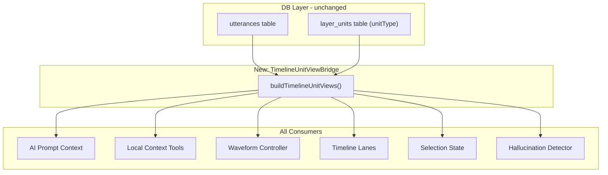
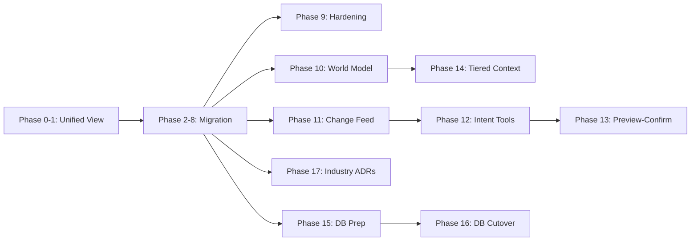

# Unified Timeline Unit View Layer — Full Migration Plan

## Problem Statement

The codebase has a dual-model architecture where `UtteranceDocType` and `LayerSegmentDocType` serve as parallel data sources. Upper-layer logic (AI prompt, local tools, waveform, timeline, selection) independently decides which source to read, causing:
- AI reports "0 utterances" when the UI shows 2 segments
- `waveformAnalysis` uses utterance rows while timeline digest uses segment rows
- Tool names say "utterance" but may contain segment data
- `selectedUtteranceIds: Set<string>` holds segment ids too (naming lie)

## Architecture Overview



## Industry Patterns & Research Synthesis

This plan intentionally aligns with mature patterns from **annotation tooling**, **enterprise data architecture**, and **agentic AI integration**. The table below maps each pattern to this codebase and to phases (so implementation stays traceable).

| Pattern | Mature practice (summary) | How we apply it | Primary phases |
|--------|---------------------------|-----------------|----------------|
| **CQRS / read model** | Separate optimized **read models** (projections) from transactional **write models**; projections are **rebuildable** and often **denormalized** for query/UI ([Microsoft CQRS journey PDF](https://download.microsoft.com/download/e/a/8/ea8c6e1f-01d8-43ba-992b-35cfcaa4fae3/cqrs_journey_guide.pdf), [Event-Driven.io projections](https://event-driven.io/en/projections_and_read_models_in_event_driven_architecture/)) | `TimelineUnitViewIndex` is a **derived read model** over Dexie rows; `buildTimelineUnitViewIndex` is a **pure projection**; invalidation = dependency change + epoch bump | 0–1, 9 (invariants), 15 (replay rebuild of canonical projection) |
| **Lightweight CQRS (same DB)** | Start with **separate models in one service** before splitting databases ([CQRS implementation discussion](https://oneuptime.com/blog/post/2026-01-24-cqrs-pattern-implementation/view)) | Keep one IndexedDB; add **facade** (`useTimelineUnitViewIndex`) instead of smart components branching on raw tables | 1, 7 |
| **Idempotent projections** | Handlers must tolerate **at-least-once** delivery; use **versioning** / idempotency keys | Migration backfill + tool list totals must be **idempotent**; `epoch` on snapshot for stale-write detection | 9, 13, 15B |
| **Strangler fig + parallel run** | Gradually replace legacy path; **shadow** new vs old, then cut over ([common migration pattern](https://martinfowler.com/bliki/StranglerFigApplication.html)) | Phase **15C** dual-write + mismatch telemetry; Phase **16** cutover; no open-ended dual-write | 15–16 |
| **DDD: bounded context + ubiquitous language** | One context owns invariants; avoid leaking storage nouns into UI language ([DDD aggregates overview](https://www.emergentmind.com/topics/domain-driven-design-ddd)) | User-facing terms stay **语段/轨道/层**; code uses **unit** internally; **single write dispatcher** owns mutation routing | 5–6, 9G, 16B |
| **ELAN / Praat tiers** | **Independent vs referring** tiers; interval vs point events; hierarchical tiers ([ELAN manual PDF](https://www.mpi.nl/tools/elan/docs/ELAN_manual.pdf)) | `layerRole`, `byLayer`, `getReferringUnits` (see Plan Review §1) | 0, 4, 10 |
| **MCP: resources vs tools vs prompts** | **Resources** = passive, addressable context; **Tools** = active, schema-bound side effects; avoid **prompt stuffing** ([MCP tools spec](https://modelcontextprotocol.io/specification/2025-06-18/server/tools), [Anthropic MCP intro](https://www.anthropic.com/news/model-context-protocol)) | Tier-1 prompt = **small stable digest**; large lists via **tools** (`list_units`, intent tools); world snapshot = **bounded resource string** with progressive detail (Phase 10 compaction) | 10, 12, 14 |
| **Context engineering** | Tiered assembly, compaction, external memory ([Context engineering OSS survey](https://arxiv.org/html/2510.21413v3)) | Phase **14** tiers; Phase **10** digest/summary modes; session memory for long threads | 10, 11, 14 |

### Deliberate non-goals (for this program)

- **Full event sourcing**: We do not require an append-only event log for all edits in Phases 0–16; **epoch + undo snapshots** cover most AI stale-write cases. Event sourcing can be a later extension if collaboration/audit demands it.
- **Separate read DB**: Not required; IndexedDB + in-memory projection is sufficient until scale forces worker-side indexing.

### Greenfield variant: no backward compatibility, no historical user data

If **there is no requirement to keep old tool names / old prompt field names**, and **there are no existing user databases to migrate**, the plan **should be simplified** as follows. This does **not** automatically remove duplication inside the **current codebase** (utterance vs segment paths still exist until Phases 0–8 land).

**What you can drop or shorten**

| Area | Full plan | Greenfield adjustment |
|------|-----------|------------------------|
| **AI tool / API naming** | Old names as aliases (`list_utterances`, etc.), compat sunset in Phase 9 | Ship **only** `list_units` / `search_units` / `get_unit_detail` (or final names); **no alias period**, no telemetry-for-alias-removal |
| **Short-term context keys** | Transitional `projectUtteranceCount` alongside `projectUnitCount` | **Single** canonical key set from day one |
| **Phase 9A** | Compatibility sunset, deprecation timeline | **Omit** or reduce to "no deprecated exports in public types" |
| **Phase 15–16 (DB)** | Strangler: dual-write + mismatch telemetry + cutover | If schema can be designed **from scratch**: implement **canonical storage directly** (e.g. `layer_units` + contents as sole write path), **no dual-write window**. Use a **one-shot** Dexie version bump + empty DB for dev only; production "no history" means no multi-version user migration story |
| **Replay / idempotency tests** | Required for safe in-place migration of real user data | Still **recommended** for correctness of projection and migrations, but scope is **test fixtures**, not terabyte-scale replay |
| **Phase 17 ADR `adr-db-unification-strangler.md`** | Documents strangler gates | Replace or supplement with **`adr-db-unification-greenfield.md`**: direct schema, single path, no parallel run |

**What stays valuable (do not skip lightly)**

- **`TimelineUnitViewIndex` as read projection** — even with a single canonical DB table, a **derived index** keeps UI/AI/waveform aligned (CQRS-light is about **separation of concerns**, not only about "two physical databases").
- **Invariants, architecture guard, perf baselines, observability** (Phase 9) — greenfield does not remove regression risk.
- **`epoch` / `isComplete`** — still needed for async load and AI stale writes.
- **Phases 10–14** — optional by product priority; independent of legacy data.

**Important distinction**

- **No user history** does not mean **no code history**: the repo may still contain legacy utterance/segment **code paths** until refactored. Greenfield mainly removes **migration ceremony**, not necessarily **application refactor scope**.

### Deliverable: ADR pack (Phase 17)

Consolidate the above into one navigable doc set:

- `docs/adr/adr-timeline-unit-view-read-model.md` — CQRS mapping (`TimelineUnitViewIndex` as projection)
- `docs/adr/adr-ai-grounding-mcp-shaped.md` — Resources/tools/tiers vs prompt stuffing
- `docs/adr/adr-db-unification-strangler.md` — Phases 15–16 strangler + cutover gates (cross-links `adr-db-unification-timeline-units.md`)
- Update `scripts/architecture-guard.config.mjs` rules to reference ADR IDs (prevent drift)

## Phase 0: Define the Unified View Type and Builder (Foundation)

### 0A. New file: `src/hooks/timelineUnitView.ts`

Define the canonical view type consumed by all upper layers:

```typescript
import type { TimelineUnitKind } from './transcriptionTypes';

export interface TimelineUnitView {
  id: string;
  kind: TimelineUnitKind;  // 'utterance' | 'segment'
  mediaId: string;
  layerId: string;
  startTime: number;
  endTime: number;
  text: string;
  speakerId?: string;
  parentUtteranceId?: string;
  annotationStatus?: string;
  textId?: string;
}

export interface TimelineUnitViewIndex {
  /** All units across all media, sorted by startTime */
  allUnits: ReadonlyArray<TimelineUnitView>;
  /** Units on the currently selected media */
  currentMediaUnits: ReadonlyArray<TimelineUnitView>;
  /** Total project-wide unit count */
  totalCount: number;
  /** Current media unit count */
  currentMediaCount: number;
  /** Lookup by id */
  byId: ReadonlyMap<string, TimelineUnitView>;
}
```

### 0B. Builder function: `buildTimelineUnitViewIndex()`

In the same file, a pure function that merges utterance + segment data into one sorted index:

```typescript
export function buildTimelineUnitViewIndex(input: {
  utterances: ReadonlyArray<UtteranceDocType>;
  segmentsByLayer: ReadonlyMap<string, ReadonlyArray<LayerSegmentDocType>>;
  segmentContentByLayer: ReadonlyMap<string, ReadonlyMap<string, { text?: string }>>;
  currentMediaId?: string;
  activeLayerIdForEdits?: string;
  defaultTranscriptionLayerId?: string;
  getUtteranceTextForLayer: (u: UtteranceDocType, layerId?: string) => string;
}): TimelineUnitViewIndex
```

Logic:
1. Map each `UtteranceDocType` to `TimelineUnitView` with `kind: 'utterance'`
2. Map each `LayerSegmentDocType` (from independent-boundary layers only) to `TimelineUnitView` with `kind: 'segment'`
3. Deduplicate by id (segments that shadow an utterance via `utteranceId` keep the segment view)
4. Sort by `startTime`
5. Build `byId` map, filter `currentMediaUnits`

### 0C. New file: `src/hooks/timelineUnitView.test.ts`

Unit tests for the builder covering:
- Utterance-only project
- Segment-only project (the bug scenario)
- Mixed utterance + segment project
- Deduplication when segments have `utteranceId`
- currentMediaId filtering

---

## Phase 1: Hook that produces the view index (React integration)

### 1A. New hook: `useTimelineUnitViewIndex()` in `src/hooks/useTimelineUnitViewIndex.ts`

```typescript
export function useTimelineUnitViewIndex(input: {
  utterances: UtteranceDocType[];
  segmentsByLayer: ReadonlyMap<string, LayerSegmentDocType[]>;
  segmentContentByLayer: ReadonlyMap<string, ReadonlyMap<string, { text?: string }>>;
  currentMediaId?: string;
  activeLayerIdForEdits?: string;
  defaultTranscriptionLayerId?: string;
  getUtteranceTextForLayer: (u: UtteranceDocType, layerId?: string) => string;
}): TimelineUnitViewIndex
```

Pure `useMemo` wrapper around `buildTimelineUnitViewIndex`. Called **once** in `TranscriptionPage.ReadyWorkspace.tsx` and threaded down as a single prop.

---

## Phase 2: AI Pipeline Migration (the original bug fix chain)

### 2A. Replace `AiLocalUtteranceToolRow` with `TimelineUnitView`

In [src/ai/chat/chatDomain.types.ts](src/ai/chat/chatDomain.types.ts):
- Delete `AiLocalUtteranceToolRow` interface
- Replace `localUtteranceIndex?: ReadonlyArray<AiLocalUtteranceToolRow>` with `localUnitIndex?: ReadonlyArray<TimelineUnitView>`
- Rename `projectUtteranceCount` to `projectUnitCount`
- Rename `utterancesOnCurrentMediaCount` to `currentMediaUnitCount`

### 2B. Update `buildTranscriptionAiPromptContext`

In [src/pages/TranscriptionPage.aiPromptContext.ts](src/pages/TranscriptionPage.aiPromptContext.ts):
- Accept `TimelineUnitViewIndex` instead of separate `projectUtterancesForTools` / `utterancesOnCurrentMedia` / `utteranceCount`
- Delete `ProjectUtteranceForAiToolsInput` and `UtteranceTimelineEntry`
- Map `unitViewIndex.allUnits` to `shortTerm.localUnitIndex`
- Use `unitViewIndex.totalCount` for `shortTerm.projectUnitCount`
- Use `unitViewIndex.currentMediaCount` for `shortTerm.currentMediaUnitCount`
- Build `utteranceTimeline` digest from `unitViewIndex.currentMediaUnits`

### 2C. Remove segment-fallback logic from `useTranscriptionAiController.ts`

In [src/pages/useTranscriptionAiController.ts](src/pages/useTranscriptionAiController.ts):
- Delete the entire `effectiveProjectRows` / `effectiveCurrentMediaRows` / `fallbackToSegments` block (lines 204–251)
- Delete the debug `fetch` instrumentation (line 253)
- Accept `unitViewIndex: TimelineUnitViewIndex` on `UseTranscriptionAiControllerInput`
- Pass `unitViewIndex` directly to `buildTranscriptionAiPromptContext`
- Feed `waveformAnalysis` with `unitViewIndex.currentMediaUnits` instead of `input.utterancesOnCurrentMedia` (fixes the waveform/timeline mismatch)

### 2D. Update `promptContext.ts` templates and personas

In [src/ai/chat/promptContext.ts](src/ai/chat/promptContext.ts):
- Rename `SHORT_TERM_TEMPLATES` keys:
  - `projectUtteranceCount` -> `projectUnitCount` with template `projectUnitCount=${v} [authoritative total across all media]`
  - `utterancesOnCurrentMediaCount` -> `currentMediaUnitCount` with template `currentTrack.unitCount=${v}`
  - `utteranceTimeline` -> `unitTimeline`
- Update `AI_SYSTEM_PERSONAS.transcription` to use "unit" language and clarify that units can be utterances or segments

### 2E. Rename local context tools

In [src/ai/chat/localContextTools.ts](src/ai/chat/localContextTools.ts):
- Add new tool names alongside old ones (backward compat): `list_units`, `search_units`, `get_unit_detail`
- Old names (`list_utterances`, etc.) remain as aliases that route to the same implementation
- Replace `NormalizedUtteranceRow` with direct use of `TimelineUnitView` from `localUnitIndex`
- Remove the `getDb()` fallback path (the view index is always authoritative)
- `get_current_selection` returns `projectUnitCount` instead of `projectUtteranceCount`

### 2F. Update hallucination detector

In [src/hooks/useAiChat.streamCompletion.ts](src/hooks/useAiChat.streamCompletion.ts):
- Read `projectUnitCount` (fallback `projectUtteranceCount` for transition)
- Regex: keep matching both "utterance" and "segment" and "unit" claim patterns

### 2G. Update `localToolSlotResolver.ts` and `intentContracts.ts`

- Add `unit.list`, `unit.search`, `unit.detail` intents
- Keep old `utterance.*` intents as aliases

### 2H. Update all AI-related tests

- [src/pages/TranscriptionPage.aiPromptContext.test.ts](src/pages/TranscriptionPage.aiPromptContext.test.ts)
- [src/ai/chat/localContextTools.test.ts](src/ai/chat/localContextTools.test.ts)
- [src/ai/chat/localToolSlotResolver.test.ts](src/ai/chat/localToolSlotResolver.test.ts)
- [src/ai/chat/aiArchitectureIntegration.test.ts](src/ai/chat/aiArchitectureIntegration.test.ts)
- [src/pages/useTranscriptionAiController.test.tsx](src/pages/useTranscriptionAiController.test.tsx)
- [src/hooks/useAiChat.test.tsx](src/hooks/useAiChat.test.tsx)
- [src/ai/chat/sessionMemory.test.ts](src/ai/chat/sessionMemory.test.ts)

---

## Phase 3: Waveform Pipeline Migration

### 3A. Update `useWaveformSelectionController`

In [src/pages/useWaveformSelectionController.ts](src/pages/useWaveformSelectionController.ts):
- Accept `unitViewIndex: TimelineUnitViewIndex` as input
- `waveformTimelineItems` = `unitViewIndex.currentMediaUnits` (filtered by active layer if segment mode)
- Remove the `WaveformTimelineItem = LayerSegmentDocType | UtteranceDocType` union — use `TimelineUnitView` directly
- `waveformRegions` maps from `TimelineUnitView` to `{ id, start, end }`

### 3B. Update `useTrackDisplayController`

In [src/pages/useTrackDisplayController.ts](src/pages/useTrackDisplayController.ts):
- Accept `TimelineUnitView[]` for overlap detection instead of separate utterance/segment arrays
- Speaker ordering derives from `unitView.speakerId`

### 3C. Update waveform bridge and interaction controllers

- [src/pages/useTranscriptionWaveformBridgeController.ts](src/pages/useTranscriptionWaveformBridgeController.ts): thread `TimelineUnitView` through
- [src/pages/useTranscriptionTimelineInteractionController.ts](src/pages/useTranscriptionTimelineInteractionController.ts): update hit-test to use `TimelineUnitView`

### 3D. Update waveform tests

- [src/pages/useWaveformSelectionController.test.tsx](src/pages/useWaveformSelectionController.test.tsx)
- [src/pages/useTrackDisplayController.test.tsx](src/pages/useTrackDisplayController.test.tsx)

---

## Phase 4: Timeline Rendering Migration

### 4A. Update `TranscriptionTimelineMediaLanes`

In [src/components/TranscriptionTimelineMediaLanes.tsx](src/components/TranscriptionTimelineMediaLanes.tsx):
- `visibleUtterances` becomes `visibleUnits: TimelineUnitView[]`
- Text resolution: use `unit.text` directly (already resolved by the view)
- Speaker layout: use `unit.speakerId`

### 4B. Update `TranscriptionTimelineTextOnly`

In [src/components/TranscriptionTimelineTextOnly.tsx](src/components/TranscriptionTimelineTextOnly.tsx):
- Same pattern: `layerItems` becomes `TimelineUnitView[]`
- Edit handler branches on `unit.kind` for segment vs utterance save path

### 4C. Update timeline sub-components

- `TranscriptionTimelineMediaTranscriptionLane.tsx`
- `TranscriptionTimelineMediaTranscriptionRow.tsx`
- `transcriptionTimelineSegmentSpeakerLayout.ts`

### 4D. Update timeline tests

- [src/components/TranscriptionTimelineMediaLanes.test.tsx](src/components/TranscriptionTimelineMediaLanes.test.tsx)
- [src/components/TranscriptionTimelineTextOnly.test.tsx](src/components/TranscriptionTimelineTextOnly.test.tsx)

---

## Phase 5: Selection State Migration

### 5A. Rename selection state fields

In [src/hooks/useTranscriptionSelectionState.ts](src/hooks/useTranscriptionSelectionState.ts):
- Rename `selectedUtteranceIds` to `selectedUnitIds` (it already holds segment ids)

### 5B. Update selection actions

In [src/hooks/useTranscriptionSelectionActions.ts](src/hooks/useTranscriptionSelectionActions.ts):
- Rename exported setter/toggle functions to use "unit" naming
- Keep old names as deprecated aliases for one release cycle

### 5C. Update `transcriptionSelectionSnapshot.ts`

In [src/pages/transcriptionSelectionSnapshot.ts](src/pages/transcriptionSelectionSnapshot.ts):
- `activeUtteranceUnitId` -> `activeUnitId`
- `selectedUtterance` -> `selectedUnit` (type becomes `TimelineUnitView | null`)
- Keep `selectedUnitKind` as-is (already correct)

### 5D. Update `transcriptionAssistantContextValue.ts`

- `selectedUtterance` -> `selectedUnit: TimelineUnitView | null`
- `utteranceCount` -> `unitCount`

### 5E. Update selection resolvers

In [src/pages/selectionIdResolvers.ts](src/pages/selectionIdResolvers.ts):
- `UtteranceSelectionMappingResult` -> `UnitSelectionMappingResult`
- Remove `unitToUtteranceId` bridge (no longer needed)

---

## Phase 6: Creation and Mutation Pipeline Migration

### 6A. Update segment creation actions

In [src/pages/transcriptionSegmentCreationActions.ts](src/pages/transcriptionSegmentCreationActions.ts):
- `CreateUtteranceOptions` -> `CreateUnitOptions`
- Input type uses `TimelineUnitView[]` instead of separate `utterancesOnCurrentMedia` / `segmentsByLayer`

### 6B. Update segment mutation controller

In [src/pages/useTranscriptionSegmentMutationController.ts](src/pages/useTranscriptionSegmentMutationController.ts):
- Input: `units: TimelineUnitView[]` instead of dual arrays
- Each mutation operation checks `unit.kind` to dispatch to the correct service

### 6C. Update speaker controller

In [src/pages/useTranscriptionSpeakerController.ts](src/pages/useTranscriptionSpeakerController.ts):
- `selectedBatchUtterances` / `selectedBatchSegmentsForSpeakerActions` merge into `selectedBatchUnits: TimelineUnitView[]`
- Speaker assignment branches on `unit.kind`

---

## Phase 7: Orchestration — Wire Everything Through ReadyWorkspace

### 7A. Update `TranscriptionPage.ReadyWorkspace.tsx`

- Call `useTimelineUnitViewIndex()` once at the top
- Thread `unitViewIndex` into:
  - AI controller
  - Waveform controller
  - Track display controller
  - Timeline components
  - Selection context

### 7B. Update `transcriptionReadyWorkspacePropsBuilders.ts`

- Replace `activeUtteranceUnitId` with `activeUnitId`
- Add `unitViewIndex` to shared lane props

### 7C. Update `transcriptionAiController.types.ts`

- Remove `utterances: UtteranceDocType[]` and `utterancesOnCurrentMedia: UtteranceDocType[]` from `UseTranscriptionAiControllerInput`
- Add `unitViewIndex: TimelineUnitViewIndex`

---

## Phase 8: Cleanup

### 8A. Remove dead types and code

- Delete `AiLocalUtteranceToolRow` from `chatDomain.types.ts`
- Delete `ProjectUtteranceForAiToolsInput` from `TranscriptionPage.aiPromptContext.ts`
- Delete `NormalizedUtteranceRow` from `localContextTools.ts`
- Remove `getDb()` fallback from `loadNormalizedUtteranceRows`
- Remove the debug `fetch` instrumentation in `useTranscriptionAiController.ts`
- Remove debug `fetch` instrumentation in `useLayerSegments.ts`, `useWaveformSelectionController.ts`, `useTranscriptionData.ts`, `TranscriptionPage.ReadyWorkspace.tsx`, `useTranscriptionSnapshotLoader.ts`

### 8B. Update `DbState` in `transcriptionTypes.ts`

- Rename `utteranceCount` to `unitCount` in the `ready` phase

### 8C. Update i18n messages

- Keys referencing "utterance" in AI context labels -> "unit" or keep bilingual
- `aiChatMetricsBarMessages.ts`, `sidePaneSidebarMessages.ts`

### 8D. Run full test suite and fix breakages

- `npx vitest run` — fix any import/rename mismatches
- `npx tsc --noEmit` — fix all type errors

---

## Phase 9: Post-Migration Hardening (Eliminate Follow-Up Risks)

### 9A. Compatibility Sunset Plan (prevent permanent bridge debt)

- Keep old AI tool names as aliases for a bounded window only: `list_utterances`, `search_utterances`, `get_utterance_detail`
- Add usage telemetry by tool name, then remove aliases when usage is near-zero
- Keep old short-term keys (`projectUtteranceCount`, `utterancesOnCurrentMediaCount`) as read-only compatibility keys for one release, then remove
- Publish explicit deprecation timeline in code comments and release notes

### 9B. Cross-Chain Consistency Guards (prevent dual-caliber regressions)

Add runtime and test invariants to guarantee one data caliber:

- `unitViewIndex.totalCount === shortTerm.projectUnitCount === longTerm.projectStats.unitCount`
- `unitViewIndex.currentMediaCount === shortTerm.currentMediaUnitCount`
- Local query tool `total` must equal `unitViewIndex.totalCount`
- Waveform region count and context timeline count must be derived from the same source (`unitViewIndex.currentMediaUnits`)

Implementation points:

- [src/pages/useTranscriptionAiController.ts](src/pages/useTranscriptionAiController.ts): emit invariant warnings in development builds
- [src/ai/chat/localContextTools.ts](src/ai/chat/localContextTools.ts): assert tool result counts match unit index counts
- New integration spec: `src/pages/transcriptionDataCaliberConsistency.test.tsx`

### 9C. Performance and Memory Hardening (prevent large-project regressions)

Add baseline and threshold tests for `buildTimelineUnitViewIndex()`:

- 1k / 5k / 10k mixed units benchmark scenarios
- Max allowed build time threshold (cold + warm)
- Allocation/retention smoke checks for repeated rebuilds

Files:

- New perf test: `src/perf/TimelineUnitViewIndexPerformanceBaseline.test.ts`
- Optional micro-optimizations in [src/hooks/timelineUnitView.ts](src/hooks/timelineUnitView.ts): stable maps, minimized object churn, branch flattening

### 9D. Observability and Alerting (surface silent misalignment early)

Add structured metrics/events:

- `timeline_unit_count_mismatch`
- `ai_local_tool_alias_usage`
- `ai_count_claim_mismatch`
- `segment_only_project_context_build`

Files:

- [src/observability/metrics.ts](src/observability/metrics.ts)
- [src/hooks/useAiChat.streamCompletion.ts](src/hooks/useAiChat.streamCompletion.ts)
- [src/pages/useTranscriptionAiController.ts](src/pages/useTranscriptionAiController.ts)

### 9E. Architecture Guardrails (prevent reintroduction of split data paths)

- Add architecture guard rule: upper-layer modules must consume `TimelineUnitViewIndex` and must not directly branch on raw `utterances` + `segmentsByLayer` in parallel
- Enforce in architecture guard config and CI
- Add PR checklist item: \"Does this change introduce a second timeline data source?\"

Files:

- [scripts/architecture-guard.config.mjs](scripts/architecture-guard.config.mjs)
- `docs/adr/adr-timeline-unit-view-single-caliber.md` (new ADR)

### 9F. Final Validation Gate

Before closing migration:

- Full typecheck and tests green
- New consistency and perf baselines green
- No production path relies on deprecated aliases
- One release of telemetry confirms no unexpected mismatch events

### 9G. Second-Order Complexity Governance Playbook (long-term reliability)

Treat this as a mandatory governance layer, not optional documentation:

- **Single-read-entry enforcement**
  - Upper-layer modules are only allowed to consume `TimelineUnitViewIndex`.
  - Any direct parallel reads of `utterances` + `segmentsByLayer` in AI/timeline/waveform paths fail CI.
- **Centralized write dispatch**
  - Introduce a single `dispatchUnitMutation(unit, action)` policy module.
  - Routing rule is explicit and test-covered: `kind='utterance'` and `kind='segment'` must hit different write paths deterministically.
- **Schema and naming drift prevention**
  - Forbid adding new `*Utterance*` naming in selection/context APIs when semantics are unit-level.
  - Add lint/guard checks for deprecated compatibility fields after sunset date.
- **Mixed-scenario golden tests as permanent gate**
  - Keep three golden suites permanently: `utterance-only`, `segment-only`, `mixed`.
  - Any regression in one scenario blocks release, even if the other two pass.
- **Release train control for compat sunset**
  - Define explicit milestone gates: Introduce alias -> measure usage -> freeze new usage -> remove alias.
  - Do not allow open-ended deprecations.

Execution artifacts:

- New governance doc: `docs/architecture/timeline-unit-governance.md`
- New ADR addendum: `docs/adr/adr-timeline-unit-view-single-caliber.md` (append lifecycle policy)
- CI gate updates in `scripts/architecture-guard.config.mjs` and test workflow

---

## Phase 10: Structured World-Model Snapshot for AI

### Problem

AI currently receives ~15 flat fields (counts, digest strings, selection ids). It must infer relationships (which unit belongs to which media, which layer is active, what's the project structure) from disconnected clues.

### Solution

Replace flat `[CONTEXT]` fields with a hierarchical snapshot that mirrors the user's mental model:

```
project
├── media[0] "interview.wav" (3:42) ← currentMedia
│   ├── unit[0] utterance 0:00–0:05 "你好" speaker=张三 transcribed
│   ├── unit[1] segment  0:05–0:12 "谢谢" speaker=李四 layer=翻译层
│   └── unit[2] segment  0:12–0:18 ""      speaker=?    raw ← selected
├── media[1] "field.wav" (1:20)
│   └── unit[0] ...
└── layers
    ├── 转写层(默认) ← activeEditLayer
    └── 翻译层(英语)
```

### Implementation

- New builder: `buildWorldModelSnapshot(unitViewIndex, layers, media, selection)` in `src/ai/chat/worldModelSnapshot.ts`
- Output: compact multi-line string (not JSON — saves tokens, easier for models to parse)
- Replace `utteranceTimeline` + count fields + layer fields with single `worldModelSnapshot` in `SHORT_TERM_TEMPLATES`
- Keep `projectUnitCount` and `currentMediaUnitCount` as redundant top-level fields (cheap insurance for count queries)
- Truncation strategy: if snapshot exceeds budget, collapse non-current media to summary lines

### Files

- New: `src/ai/chat/worldModelSnapshot.ts`, `src/ai/chat/worldModelSnapshot.test.ts`
- Modified: `promptContext.ts` (templates), `TranscriptionPage.aiPromptContext.ts` (builder call), `useTranscriptionAiController.ts` (threading)

### Benefit

Model sees the full project topology in one glance. No reconstruction needed. Fewer tool calls to understand context.

---

## Phase 11: Change-Awareness Feed

### Problem

AI has no memory of what just happened. Each turn starts from a fresh snapshot. If user just deleted a segment, AI doesn't know — it might suggest editing the deleted segment.

### Solution

Maintain a lightweight edit event ring buffer (last ~10 events):

```typescript
interface EditEvent {
  action: 'create' | 'delete' | 'edit_text' | 'move' | 'split' | 'merge' | 'assign_speaker' | 'undo' | 'redo';
  unitId: string;
  unitKind: TimelineUnitKind;
  timestamp: number;
  detail?: string; // e.g. "speaker changed from 张三 to 李四"
}
```

### Implementation

- New: `src/hooks/useEditEventBuffer.ts` — ring buffer hook, capacity 10, fed by existing mutation paths
- Serialized into prompt as `recentActions` block (replaces current `recentEdits: string[]` which only carries undo labels)
- AI persona prompt updated: "recentActions shows what the user just did; prioritize responses that relate to their current workflow"

### Files

- New: `src/hooks/useEditEventBuffer.ts`, test
- Modified: mutation controllers (emit events), `TranscriptionPage.aiPromptContext.ts` (serialize), `promptContext.ts` (template)

### Benefit

AI can say "I see you just deleted that segment — would you like me to also remove its translation?" instead of blindly querying stale data.

---

## Phase 12: Intent-Level Tools

### Problem

Current tools are CRUD-level (`list_units`, `search_units`, `get_unit_detail`). AI needs 3-5 tool calls to answer "which segments still need work?" This burns tokens and adds latency.

### Solution

Add high-order intent tools that encode common workflows:

- `find_incomplete_units(filter?)` — returns all units where `status != 'verified'`, grouped by severity
- `diagnose_quality(scope?)` — one-call quality report: untranscribed, low confidence, missing speakers, gaps, overlaps
- `batch_apply(action, unitIds, params)` — execute same operation on multiple units atomically
- `suggest_next_action()` — returns ranked list of recommended next steps based on current project state

### Implementation

- New: `src/ai/chat/intentTools.ts` — implementations using `TimelineUnitViewIndex` + layer/speaker state
- Register in `localContextTools.ts` alongside existing tools
- Update `buildLocalContextToolGuide` with descriptions
- Each tool returns structured result with `count`, `items`, `suggestion`

### Files

- New: `src/ai/chat/intentTools.ts`, `src/ai/chat/intentTools.test.ts`
- Modified: `localContextTools.ts` (registration), `promptContext.ts` (tool guide), `chatDomain.types.ts` (tool name union)

### Benefit

One tool call replaces 3-5. Faster response. Fewer opportunities for intermediate reasoning errors.

---

## Phase 13: Preview-Confirm Protocol for AI Writes

### Problem

AI can either execute directly (risky) or only suggest (requires manual user effort). No middle ground.

### Solution

Introduce a preview protocol:

1. AI proposes a batch of changes as a `ChangeSet`
2. System renders a diff preview in the UI (inline or modal)
3. User can: accept all / reject all / cherry-pick / edit individual items
4. Accepted changes execute atomically with a single undo point

```typescript
interface AiChangeSet {
  id: string;
  description: string;
  changes: Array<{
    unitId: string;
    field: string;
    before: string;
    after: string;
  }>;
}
```

### Implementation

- New: `src/ai/changeset/AiChangeSetProtocol.ts` — changeset creation, validation, application
- New UI component: `src/components/ai/AiChangeSetPreview.tsx` — diff view with accept/reject per item
- AI tool: `propose_changes(changes[])` — returns changeset id, triggers preview UI
- Undo integration: `pushUndo('AI: ${changeset.description}')` wraps entire accepted set

### Files

- New: protocol, UI component, tool registration
- Modified: `useAiToolCallHandler.ts` (handle `propose_changes`), undo system (atomic AI undo point)

### Benefit

Users trust AI more (can review before committing). AI can propose bold changes without risk. Undo is clean.

---

## Phase 14: Tiered Context Management

### Problem

Current strategy: if prompt exceeds budget, truncate history and trim context. This loses potentially critical information unpredictably.

### Solution

Replace flat truncation with priority-based context assembly:

- **Tier 1 (always include)**: world model snapshot, current selection, recent actions, project counts
- **Tier 2 (include if budget allows)**: full current-media unit list, active tool results, session memory summary
- **Tier 3 (on-demand via tools)**: historical conversation, non-current media units, detailed acoustic data

### Implementation

- Refactor `contextBudget.ts`: assign tiers to each context section, assemble greedily by priority
- Compress old conversation turns into session memory summaries (existing `sessionMemory.ts` can be extended)
- Non-current media units are never inlined — AI queries them via `list_units(mediaId=...)` when needed
- Budget allocation: Tier 1 gets guaranteed minimum, Tier 2 fills remaining, Tier 3 only via tool calls

### Files

- Modified: `src/ai/chat/contextBudget.ts` (tiered assembly), `src/ai/chat/historyTrim.ts` (compression instead of discard), `src/ai/chat/sessionMemory.ts` (conversation summarization), `promptContext.ts` (tier annotations)

### Benefit

Critical context is never lost. Less important context degrades gracefully instead of being cut arbitrarily. AI can always access full data via tools when needed.

---

## Phase Dependency Map



Phase 10-14 are independent of each other (except noted dependencies) and can be prioritized based on user pain points. **Phase 15-16** depend on a stable read-model facade (Phases 0-2 minimum) but can start after Phase 9 hardening reduces regression risk. **Phase 17** is documentation and guard alignment; it can run in parallel with Phase 9+ once the technical direction is fixed.

## Plan Review: Industry Comparison and Improvements

This section documents a critical review of the plan against industry best practices, identifies gaps, and proposes concrete improvements.

### Review 1: Data Model — Compared to ELAN/Praat Tier Architecture

**Industry approach (ELAN/Praat):**
ELAN uses a tier-based model where tiers are either "independent" (time-aligned to media) or "referring" (aligned to a parent tier). This is a tree, not a flat list. Praat distinguishes IntervalTiers (segments) from PointTiers (events). SPPAS provides a unified `anndata` object model across formats.

**Current plan gap:**
`TimelineUnitView` is a flat list with a `kind` discriminator. It does not model tier/layer hierarchy or parent-child relationships between units. This means:
- A translation segment linked to a transcription utterance looks like two independent items
- Layer dependency structure is invisible to consumers

**Improvement: Add `layerRole` and `parentUnitId` semantics**

```typescript
export interface TimelineUnitView {
  // ... existing fields ...
  layerRole: 'independent' | 'referring';
  parentUnitId?: string;    // already planned, but make it mandatory for referring units
  referringLayerId?: string; // the parent layer this unit's time is derived from
}
```

And add a method to `TimelineUnitViewIndex`:

```typescript
export interface TimelineUnitViewIndex {
  // ... existing fields ...
  /** Units grouped by layer, preserving layer hierarchy */
  byLayer: ReadonlyMap<string, ReadonlyArray<TimelineUnitView>>;
  /** Get all referring units for a given independent unit */
  getReferringUnits: (independentUnitId: string) => ReadonlyArray<TimelineUnitView>;
}
```

**Rationale:** ELAN's longevity (20+ years) proves that tier hierarchy is essential for linguistic annotation. Without it, cross-layer queries (e.g., "show me the translation of this utterance") require consumers to reconstruct the relationship themselves — exactly the kind of scattered logic we're trying to eliminate.

---

### Review 2: AI Context — Compared to Context Engineering Best Practices

**Industry approach (Cursor/Claude Code/Copilot):**
Modern AI copilots use **tiered context assembly** with compaction, isolation, and external memory. Key patterns:
- Head-Tail compaction: system prompt + recent work prioritized; middle context compressed
- Isolation: complex sub-tasks run in bounded child contexts
- External memory: progress persisted to files outside context window, retrieved on demand

**Current plan gap:**
Phase 14 (tiered context) describes tiers but lacks two critical patterns:
- No **compaction strategy** for the world model snapshot itself (Phase 10)
- No **isolation** for multi-step AI tool chains (agent loop runs in single context)

**Improvement: Add compaction to Phase 10, isolation to Phase 12**

Phase 10 addition: World model snapshot should have 3 detail levels:
- **Full**: all units with text (for small projects, < 50 units)
- **Digest**: counts + first/last 3 units per media (for medium projects, 50-500 units)
- **Summary**: counts only (for large projects, > 500 units)

The builder auto-selects level based on token budget.

Phase 12 addition: Intent tools should execute in bounded sub-contexts:
- `batch_apply` processes items in chunks, not all-at-once
- Each chunk gets its own bounded context, results merged afterward
- Prevents a 100-unit batch from blowing the context window

---

### Review 3: Write Safety — Snapshot Versioning Gap

**Industry approach:**
Optimistic concurrency control requires a version token on the data being modified. Without it, AI can propose changes based on a stale snapshot that the user has already edited.

**Current plan gap:**
No version/epoch on `TimelineUnitViewIndex`. AI reads snapshot at turn start, user edits during AI response generation, AI's proposed write targets a state that no longer exists.

**Improvement: Add snapshot epoch to TimelineUnitViewIndex**

```typescript
export interface TimelineUnitViewIndex {
  // ... existing fields ...
  /** Monotonically increasing epoch, incremented on every rebuild */
  epoch: number;
}
```

Phase 13 (preview-confirm) should validate:

```typescript
if (changeset.sourceEpoch !== currentUnitViewIndex.epoch) {
  // Show warning: "Data has changed since AI made this suggestion. Review carefully."
}
```

This is cheap to implement (one counter) and prevents the most dangerous class of stale-write bugs.

---

### Review 4: Phasing Order — Risk of Mid-Migration Breakage

**Problem identified:**
Phase 2 (AI pipeline) renames `AiShortTermContext` fields, but Phase 7 (ReadyWorkspace wiring) must be done simultaneously for compilation. The plan currently lists them as sequential phases, creating a window where the codebase doesn't compile.

**Improvement: Merge Phase 7 into each migration phase**

Instead of a standalone "wiring phase", each migration phase (2, 3, 4, 5, 6) should include its own wiring step:
- Phase 2 includes wiring `unitViewIndex` into AI controller
- Phase 3 includes wiring into waveform controller
- Phase 4 includes wiring into timeline components
- etc.

Phase 7 becomes a verification-only phase (no code changes, just integration test).

---

### Review 5: Missing — Undo Integration for Unified View

**Problem identified:**
Current undo system snapshots `utterances[]` and `LayerSegmentGraphSnapshot` separately. After unification, undo must also snapshot/restore `TimelineUnitViewIndex` coherently.

**Improvement: Add undo consideration to Phase 6**

- `TimelineUnitViewIndex` is a derived view — it auto-rebuilds when its sources change
- Undo restores the source data (utterances + segments), then the hook re-derives the view
- **No separate undo for the view itself**, but verify via test that undo → view rebuild is consistent
- Add test: "undo after AI batch edit restores view index to pre-edit state"

---

### Review 6: Missing — Offline / Sync Resilience

**Problem identified:**
`buildTimelineUnitViewIndex` assumes all data is loaded. If segments load asynchronously (e.g., after media switch), there's a window where the view shows partial data.

**Improvement: Add loading state to TimelineUnitViewIndex**

```typescript
export interface TimelineUnitViewIndex {
  // ... existing fields ...
  /** Whether all data sources have been loaded */
  isComplete: boolean;
}
```

AI pipeline should check `isComplete` before using the index. If incomplete, tools should return `{ ok: false, error: 'data_loading' }` instead of returning partial results that look like "0 units".

---

## Summary of Improvements Applied

- **Industry synthesis**: New section **Industry Patterns & Research Synthesis** maps CQRS, strangler migration, DDD, ELAN, and MCP-style grounding to concrete phases; **Phase 17** adds ADR pack + architecture-guard cross-links.
- Phase 0: Add `layerRole`, `byLayer`, `getReferringUnits`, `epoch`, `isComplete` to types
- Phase 2: Include wiring into AI controller (absorb part of Phase 7)
- Phase 3-6: Each includes its own wiring step (absorb rest of Phase 7)
- Phase 7: Becomes integration verification only
- Phase 10: Add 3-level compaction for world model snapshot
- Phase 12: Add bounded sub-context for batch operations
- Phase 13: Add epoch validation for stale-write detection
- Phase 6: Add undo consistency verification

---

## Phase 15: DB Unification Preparation

**Greenfield default (no legacy user DB):** implement the **canonical schema and write path first**; use **15A–15B** (mapping contract + replay/idempotency tests on fixtures). **Skip 15C** unless you must support in-place upgrades. **Legacy / production migration:** use **15C** dual-write + telemetry, then Phase 16 cutover.

### Goal

Unify persistent storage so timeline units have a single source of truth at the DB layer (no long-term dual persistence model).

### Scope

- Canonical storage target: `layer_units` + `layer_unit_contents` (+ `unit_relations` where needed)
- Explicit mapping from legacy utterance fields to canonical unit fields
- Backfill and replay pipeline that is deterministic, idempotent, and auditable
- **Optional (legacy deployments only):** dual-write window with strict observability (15C)

### 15A. Canonical Schema and Mapping Contract

Create a schema contract doc and typed mapping module:

- New doc: `docs/adr/adr-db-unification-timeline-units.md`
- New module: `src/db/migrations/timelineUnitMapping.ts`

Define:

- `UtteranceDocType` -> `LayerUnitDocType(unitType='utterance')`
- `LayerSegmentDocType` -> `LayerUnitDocType(unitType='segment')`
- Text/content projection rules into `layer_unit_contents`
- Relation mapping into `unit_relations`

### 15B. Migration Tooling and Verification

- New migration helpers:
  - `src/db/migrations/buildUnifiedUnitBackfill.ts`
  - `src/db/migrations/verifyUnifiedUnitBackfill.ts`
- Add replay tests:
  - `src/db/dbUnificationMigrationReplay.test.ts`
  - `src/db/dbUnificationIdempotency.test.ts`

Validation requirements:

- Same input -> same output (deterministic)
- Re-running backfill does not duplicate data (idempotent)
- Counts and key references preserved (`textId`, `mediaId`, speaker linkage)

### 15C. Dual-Write Window (Time-Bounded) — legacy deployments only

Introduce a temporary feature-flagged dual-write mode:

- Write primary path to canonical tables
- Mirror legacy tables only for compatibility reads
- Emit mismatch telemetry if projections diverge

Files:

- `src/db/engine.ts` (migration/flags)
- `src/services/LinguisticService.ts`
- `src/services/LayerSegmentationTextService.ts`
- `src/services/LegacyMirrorService.ts`

Guardrails:

- No open-ended dual-write window
- Freeze new legacy-only fields during this phase

---

## Phase 16: DB Cutover and Legacy Decommission

**Greenfield default:** if Phase 15 did not enable dual-write, Phase 16 reduces to **enforcing canonical-only read/write in code** and **deleting dead legacy branches** as the codebase is refactored — no separate “cutover release” for user data. **Legacy path:** follow 16A–16D as written.

### Goal

Complete transition to single-read and single-write DB paths, remove bridge complexity, and prevent fallback reintroduction.

### 16A. Read Path Cutover

- All read services for timeline units must source from canonical tables only
- Remove legacy read fallbacks in AI/timeline/waveform data loading
- Keep compatibility adapters only at import/export boundaries if required

### 16B. Write Path Cutover

- Disable dual-write mode behind feature flag
- Enforce single write dispatcher for unit mutations
- Verify undo/redo and batch mutations against canonical-only storage

### 16C. Legacy Decommission

- Remove obsolete mirror code paths after cutover stability window
- Archive migration diagnostics and keep replay tests permanent
- Update architecture guard rules to block any new legacy-path usage

Files:

- `scripts/architecture-guard.config.mjs`
- `src/services/LegacyMirrorService.ts` (remove or reduce to import/export adapter only)
- `src/hooks/useTranscriptionSnapshotLoader.ts` (canonical-only reads)

### 16D. Rollback and Release Gate

Cutover release requires:

- Full migration replay and idempotency suites green
- One release-window telemetry shows no count/reference mismatches
- Rollback plan validated on a production-like dataset snapshot
- Explicit go/no-go checklist signed off

---

## Risk Mitigation

- **Backward compatibility for AI tool names**: Old `list_utterances` / `search_utterances` / `get_utterance_detail` names remain as aliases. Models trained on these names will continue to work.
- **DB scope is phased**: **Phases 0-14** keep the existing Dexie schema as the persistence truth; they add a **read-model projection** (`TimelineUnitViewIndex`) and AI/UI convergence without requiring a storage migration. **Phases 15-16** intentionally change persistence to a **single canonical timeline-unit store** with strangler-style dual-write, replay tests, and a cutover gate — see Industry table (CQRS + strangler fig).
- **Incremental testability**: Each phase has its own test updates and wiring. Phase 0 can be validated independently.
- **`TimelineUnit` already exists**: The selection system (`transcriptionTypes.ts`) already has `{ unitId, kind, layerId }`. `TimelineUnitView` extends this pattern with data fields, so the conceptual model is consistent.
- **Snapshot epoch**: Cheap monotonic counter prevents stale AI writes without complex locking.
- **Loading guard**: `isComplete` flag prevents the "0 units" bug class from reappearing during async data loads.
- **ELAN-aligned hierarchy**: `layerRole` + `byLayer` + `getReferringUnits` ensures the model can scale to complex multi-tier annotation projects without requiring another architectural change.

## Estimated Scope

- **New files**: 2 (`timelineUnitView.ts`, `useTimelineUnitViewIndex.ts`) + 1 test (Phase 0-1), plus ~6 files across Phase 10-14, plus ADR pack + migration helpers in Phases 15-17
- **Modified files**: ~35-40 (types, hooks, controllers, components, AI pipeline, tests); **+10-20** for DB migration phase (engine, services, replay tests)
- **Deleted code**: ~120 lines of fallback/bridge logic, ~6 debug instrumentation blocks; additional deletion in Phase 16 (legacy mirror paths) TBD by cutover metrics
- **Net LOC change (Phases 0-14 only)**: Roughly +250 (new view types/builder/epoch/loading) / -150 (removed fallback), net ~+100
- **DB phases (15-16)**: Expect net **+migration code** and **-legacy adapter** over time; measure by replay test coverage and telemetry, not raw LOC
