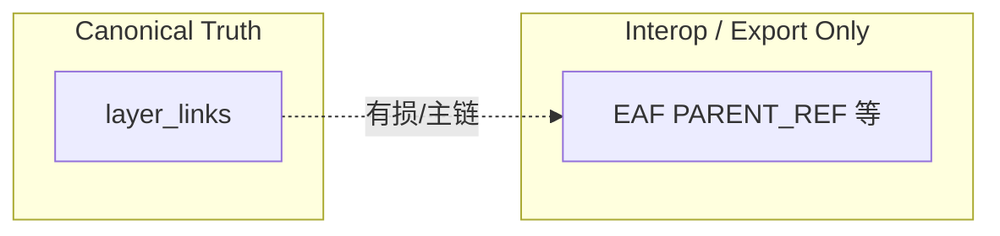

# 多宿主译文层（方案 A）执行方案（重规划）

**状态**：重规划确认版 + **审查修订** + **无 legacy 硬单源修订**（以本仓库文件为唯一权威规格；修订记录见 §0.1）  
**日期**：2026-04-20（首次）；**修订**：2026-04-20（审查并入；无 legacy 硬单源与阶段收紧；`parent*` 按 `layerType` 精确划界 §1.6、未来层类型边界 §1.7）；**再修订**：2026-04-20（协议层范围并入、阶段零脚本化门禁、测试迁移批次 A0；§1.8–§1.10 执行补强、§4.4-15/16、§4.1 测试纪律）  
**治理**：符合 `[.cursor/rules/jieyu-docs-governance.mdc](../../.cursor/rules/jieyu-docs-governance.mdc)`，执行方案归档于 `docs/execution/plans/`。

---

## 0.1 修订说明（审查并入 + 无 legacy 收紧）

**前提（与 §0 一致）**：无历史数据、无向后兼容、不留 legacy — 本版据此**收紧**执行策略，不再默认「长期 parent 投影 + 双轨读」。

1. **承认「规范领先于实现」**：仓库当前仍存在 `layer_links` 与 `parentLayerId`/`parentLayerIds` **双轨中间态**；在硬切完成前须有**合并窗口前一次性盘点**与 **CI 禁止新增「译文宿主 parent 读」**（见 §2.0）。
2. **写路径（硬切后）**：宿主关系**只**经 `layer_links` 写入；**删除**「以 `parentLayerId`/`parentLayerIds` 触发再反写 link」的过渡模式；原 `syncTranslationParentLinks` 要么删除要么收窄为「仅维护 link 图内部一致性」的纯 link 同步（见 §2.1、G12）。
3. **读路径 P0**：`translationLayerTargetResolver`、`TranscriptionTimelineComparison`、`useLayerSegments` 等必须改为 **link 图**；G9a/G9b 拆分仍适用（§7 / §8 / §9）。
4. **SSOT 风险**：半套 link 仍优于半套 parent；无 legacy 时**不允许**长期半套（见 §5）。
5. **无 legacy 专属（本次修订核心）**：
  - **仅**移除 `layerType === 'translation'` 上用于**译文→转写宿主**的 `parentLayerId` / `parentLayerIds`（§1.3、§1.6、§3、G14、G13）；**不**移除 `transcription` 上用于**层树/bundle 挂靠**的 `parentLayerId`（见 §1.6 精确划界）。  
  - `layer_links` 链上宿主引用统一为转写层 `id`（§1.5）；与现有 `transcriptionLayerKey` 字段名冲突时，以**一次性改名/改写入路径**收口，不在运行时维持 id+key 双解释。  
  - **Tier 不承载译文多宿主**：`parentTierId` / `extraParentTierIds` 不得再表达「译文第二宿主」；该语义仅存在于 layer link 图（§4.4-11、§3）。  
  - **交付形态**：以**主版本硬切**为主，不以「多年双读 + 允许名单递减」为默认路线；阶段零缩短（§2.0、§9）。
6. **协议层一致性（本次再修订）**：
  - 云协同 `upsert_relation` 的实体键与载荷字段不再以 `transcriptionLayerKey` 作为唯一宿主标识，改为转写层 `id`（见 §2.4、§3、G16）。
  - AI 工具层允许兼容输入 `transcriptionLayerKey`，但执行层必须先归一化到 `transcriptionLayerId`，禁止继续以 `translation.parentLayerId` 判定 link 是否存在（见 §2.4、§4.4-13）。

---

## 0. 决策确认（本版前提）

本版执行方案基于以下三条已确认决策：

1. **能力边界确认**：仅“译文层（translation）”支持多宿主；转写层（transcription）维持单宿主语义。
2. **关系模型确认**：`layer_links` 是**一等事实源（single source of truth）**。
3. **兼容策略确认**：无历史数据、无向后兼容、无 legacy 迁移负担，可采用破坏式重整。

> 由此推导：**译文层（`translation`）—转写宿主**关系仅以 `layer_links` 表达；**不得**再将**译文层**的 `parentLayerId` / `parentLayerIds` 作为该宿主关系的输入、输出或持久化载体（§1.3、§1.6）。**转写层（`transcription`）** 上 `parentLayerId` 若用于**层树内**挂靠（从属转写 → 根转写），与本方案范围**正交**，**保留**且不在本期迁出（§1.6）。

---

## 1. 新事实模型（避免双真相）

### 1.1 关系真相

- 译文层宿主集合 = `layer_links` 中 `layerId === translationLayer.id` 的全部 link。  
- **宿主侧引用（修订）**：以 **转写层 `Layer.id`** 为规范标识；持久化字段名若仍为 `transcriptionLayerKey`，须视为**待改名技术债**并一次性改为存 id（见 §1.5），禁止运行期「既像 key 又像 id」的双解释。  
- 主宿主通过 `isPreferred === true` 定义（同一译文层最多一个 preferred）。

### 1.2 结构约束

- 译文层至少有 1 个宿主 link。  
- **转写层**：不通过 `parentLayerId` 表达「**被译文宿主**」语义（该语义仅 `layer_links`）；**允许**通过 `parentLayerId` 表达「**从属转写层 → 根转写层**」的层树挂靠（与 `buildLayerBundles` 一致，见 §1.6）。  
- 不允许出现“有 translation 层但无 link”的悬空状态（除事务中间态）。

### 1.3 数据与投影策略（无 legacy：硬单源）

- **译文宿主（精确）**：对 `layerType === 'translation'`，不再在 `LayerDocType` 上保留 `parentLayerId` / `parentLayerIds` 作为**指向转写宿主**的载体；该关系仅由 `layer_links` 表达。  
- **转写层树（精确）**：对 `layerType === 'transcription'`，在 `constraint` 非独立边界等前提下，可继续使用 `parentLayerId` 指向**另一转写层**以表示 bundle/排序树；**不在**本期方案 A 范围内迁出或改为 link。  
- **互操作**：EAF 等仍只能表达主链时，由导出路径生成有损 `PARENT_REF`（§2.4），**不**回写为第二真相。  
- **Tier**：`parentTierId` / `extraParentTierIds` **不得**承担「译文第二宿主」；若 UI 曾依赖 tier 表达多宿主，改为读 link 图渲染（§4.4-11）。

### 1.4 代码现状、投影适配与 SSOT 决策备注（审查并入）

**与实现差距（截至修订日，需在阶段零盘点更新）**：

| 区域                                                                                                 | 现状摘要                                                                             | 规划要求                  | 风险                |
| -------------------------------------------------------------------------------------------------- | -------------------------------------------------------------------------------- | --------------------- | ----------------- |
| [translationLayerTargetResolver.ts](../../../src/utils/translationLayerTargetResolver.ts)          | 宿主命中仍主要用 `translation.parentLayerId`                                             | link 或宿主**集合**命中      | 多宿主下选层/快照/语音等静默选错 |
| [TranscriptionTimelineComparison.tsx](../../../src/components/TranscriptionTimelineComparison.tsx) | `translationLayerAppliesToComparisonSourceTranscriptionIds` 等仍看单 `parentLayerId` | 宿主集合与 source 集合**交集** | 非主宿主对照漏译文列        |
| [useLayerSegments.ts](../../../src/hooks/useLayerSegments.ts)                                      | 译文宿主解析用 `layer.parentLayerId`                                                    | preferred 与 link 一致   | 语段轨与主宿主策略漂移       |
| [LayerConstraintService.ts](../../../src/services/LayerConstraintService.ts)                       | 大量 `parentLayerId` 边遍历                                                           | link 图遍历              | 删除/约束漏边           |
| [useTranscriptionLayerActions.ts](../../../src/hooks/useTranscriptionLayerActions.ts)              | `syncTranslationParentLinks` 仍以 parent 变化触发                                      | **硬切后删除或改为纯 link 维护** | 与 §1.3 冲突         |
| [layerParentIds.ts](../../../src/utils/layerParentIds.ts)                                          | 宿主读写仍绕 parent                                                                    | **删除**或收窄为与译文宿主无关的工具  | 无 legacy 下禁止第二真相  |
| [useVoiceInteraction.ts](../../../src/hooks/useVoiceInteraction.ts)                                | 语音落层 fallback 经 resolver 间接依赖 `translation.parentLayerId`                        | 统一走 link adapter      | 语音命中目标层静默偏移       |
| [useAiToolCallHandler.layerAdapter.ts](../../../src/hooks/useAiToolCallHandler.layerAdapter.ts)    | link/unlink 仍以 `trl.parentLayerId === trc.id` 判等                                 | 改为 link 图增边/删边/切主幂等   | AI 链接动作误判         |
| [useTranscriptionCloudSyncActions.ts](../../../src/hooks/useTranscriptionCloudSyncActions.ts)      | 关系变更实体键仍为 `${transcriptionLayerKey}:${layerId}`                                  | 改为 host id 语义实体键      | 多端冲突归并与回放失真       |

**`layerParentIds.ts`（无 legacy 修订）**：不再作为「译文多宿主」过渡适配层；随 `Layer` 上译文宿主 parent 字段删除而**删除或彻底去宿主语义**（仅保留若仍有非译文场景的父层工具函数，须改名防误用）。

**`layer_links` 作一等事实源的决策备注**：在「译文多宿主 + preferred + 同步/工具改关系」目标下该决策**合适**；无 legacy 时应 **一次硬切** 到 link-only，不保留长期 parent 投影路径。

### 1.5 链上宿主标识（无 legacy：统一为 layer id）

- **规范**：每条 link 的宿主端存 **转写层 id**（建议持久化字段名 `hostTranscriptionLayerId` 或与现有引擎对齐的明确命名）。  
- **迁移**：无历史数据 → 允许在单分支内完成 **Dexie schema + 类型 + 全写入路径** 一次改名，不做双读长期并存。  
- **G4 调整**：若链上已用 id，则「转写层 **key** 变更」不再影响 link 拓扑；仍须保留「转写层 **id** 不变、仅元数据变」的约束说明。若产品仍要求 key 为人类稳定句柄，key 仅作展示字段，**不得**再作为链上外键。

### 1.6 `Layer.parent*` 语义按 `layerType` 精确划界（与代码一致）

当前仓库 `LayerDocType.layerType` **仅** `transcription` | `translation`（见 [src/db/types.ts](../../../src/db/types.ts)）。同一字段 `parentLayerId` 在实现中承担**两种正交语义**，重构时**必须分类型处理**，禁止「一刀切删光 `parentLayerId`」：

| `layerType`         | `parentLayerId`（及 `parentLayerIds`）语义                                                                                                    | 与方案 A 的关系                                                  |
| ------------------- | ---------------------------------------------------------------------------------------------------------------------------------------- | ---------------------------------------------------------- |
| `translation`   | 指向**转写宿主**（多宿主时 `parentLayerIds` 列出独立转写 id；历史上与 `parentLayerId` 首项对齐）                                                                    | **本期迁出**：宿主关系改 `layer_links`；从译文 `Layer` 上删除宿主用 `parent*`。 |
| `transcription` | **层树 / bundle**：从属转写层指向**根转写层** id（`buildLayerBundles` 等据此归类，见 [LayerOrderingService.ts](../../../src/services/LayerOrderingService.ts)） | **本期保留**：**不**迁入 `layer_links` 替代；与「译文—转写宿主」无关。            |

**`parentLayerIds`（精确）**：在当前代码路径中**主要**服务于**译文多宿主**列表（见 [layerParentIds.ts](../../../src/utils/layerParentIds.ts)）；随译文宿主迁 link 后**与译文 `parentLayerId` 一并自译文层移除**，**不**主张用于转写层多父（转写多父非本方案范围）。

### 1.7 未来若扩展其它 `layerType`（如 word / gloss / POS 层）（YAGNI 边界）

- **当前**：gloss / POS / morpheme 等存在于 **Tier**、内容 `contentRole` 或其它域模型，**不是**本文件所称 `Layer`。  
- **原则**：若产品未来新增 `layerType`，其父子/宿主关系**不得默认**复用「译文 `layer_links`」语义；须**另开规格**（是否新 link 类型、是否复用 `layer_links.linkType`、是否独立表）。  
- **本方案 A 不预付实现**：不在本期为其扩展 schema 或改 `layer_links` 约束，仅在本文划界以防执行时误用同一套规则。

### 1.8 读路径统一适配器（避免 G9a/G9b 重复实现）

- **目标**：凡「某译文是否挂在某转写宿主上」「某译文的宿主 id 集合 / preferred 宿主」一律经 **同一只读模块**（建议 `src/utils/translationHostLinkQuery.ts`，或并入 `LayerIdBridgeService` 的 query façade）从 `layer_links` 推导；禁止 resolver、对照、排序、约束各处各自 `filter` link。
- **建议导出形态**（命名可调整）：`getHostTranscriptionLayerIds(translationLayerId)`, `getPreferredHostTranscriptionLayerId(translationLayerId)`, `translationHostsIntersectTranscriptionIds(translationLayerId, transcriptionIdSet)`；调用方在一次事务或一次 React 更新周期内可复用预建的 `Map<translationLayerId, { hostIds; preferredHostId }>`。

### 1.9 G15 与 G16 锁步交付与云协议边界

- **锁步**：链上宿主字段 id 化（G15）与协同 `upsert_relation` / AI payload 的 **host id 实体键**（G16）须在**同一发布边界**内合并；禁止「DB 已写 id、协议仍广播 `transcriptionLayerKey` 主键」的跨层半套态（亦见 §4.4-13）。
- **云旧客户端（无 legacy 宣告）**：硬切发布后**不保证**仍以 `transcriptionLayerKey` 为主键的旧协同包可被正确回放；须在发布说明中要求 **客户端同版本升级**，或另开「协议版本门」规格。本方案默认**不为旧包长期维持双协议**。

### 1.10 排序服务数据依赖与测试纪律

- **`LayerOrderingService`**：`buildLayerBundles` / 拖拽重排后依赖译文宿主时，须由调用方注入 **`layerLinks`** 或 §1.8 预计算索引；禁止在纯排序函数内隐式打开 Dexie（若项目已有 store 注入，须在模块头注释写明数据来源）。
- **Vitest 纪律（对齐 G17、§4.1）**：自批次 A0 起**禁止新增**仅以 `translation.parentLayerId` / `parentLayerIds` 构造或断言「译文—转写宿主」关系的用例；须改为 `layer_links` 或 §1.8 适配器。**`transcription.parentLayerId`** 的层树 / bundle 断言除外（§1.6）。

---

## 2. 代码重构总览（按落地顺序）

### 2.0 阶段零：合并窗口前清点 + 硬切门禁（无 legacy 修订）

目标：**短窗口**内完成清点与防扩散；**不**将「多年双轨 + 双读回归」设为默认路线。

- **一次性全仓盘点**（硬切合并前必做）：列出仍把「译文宿主」绑定在 `parentLayerId`/`parentLayerIds` 或 tier 上的读/写点；合并后应为零（归档至 `docs/execution/audits/` 可选）。  
- **CI 门禁（硬切后常态）**：禁止新增「以 `translation.parentLayerId` 判定译文宿主」的逻辑；可对 `translationLayerAppliesTo*`、`resolveHostAware*` 等路径设白名单直至清零。  
- **门禁脚本化（新增）**：新增并接入 `scripts/check-translation-host-link-ssot.mjs`（命名可调整），在 `package.json` 暴露 `check:translation-host-link-ssot` 与 `check:translation-host-link-ssot:changed`；默认阻断新增 parent 宿主判定代码，允许列表仅作递减。  
- **（可选）硬切前单次夹具**：若合并前仍存在临时双轨，仅允许**短周期**内跑一次 link-only 行为夹具；**不**将 T17 类「故意 parent/link 不一致」测试纳入长期 CI（无 legacy 无此义务）。

### 2.1 第一阶段：事实源落地（阻塞阶段）

目标：先把“关系真相=layer_links”跑通，再改 UI。

- [src/services/LayerConstraintService.ts](../../../src/services/LayerConstraintService.ts)  
  - `validateExistingLayerConstraints`、`canDeleteLayer`、`getLinkedLayers` 全面改为基于 link 计算。  
  - **译文宿主**相关边与可达性：**不再**以 `translation.parentLayerId` / `parentLayerIds` 推导；改走 link 图。  
  - **转写层树**：若现有约束仍依赖 `transcription.parentLayerId` 表达从属转写 → 根转写，**保留**该语义直至另有规格（§1.6）。  
  - 多宿主校验：每个 link 指向的宿主必须是独立转写层。
- [src/hooks/useTranscriptionLayerActions.ts](../../../src/hooks/useTranscriptionLayerActions.ts)  
  - `createLayer`：译文创建时一次性写入多条 link，并且设置唯一 `isPreferred=true`。  
  - `performLayerDelete`：删除转写层时仅移除关联 link；译文 link 变空时按策略级联删译文层。  
  - `toggleLayerLink`：语义改为“改 preferred / 增减宿主 link”；**不**再写入译文 `parentLayerId` / `parentLayerIds`。  
  - **`syncTranslationParentLinks`（修订）**：无 legacy 下**删除**该「parent→link」同步路径，或替换为**仅**操作 `layer_links` 的内部整理函数（名称上避免再含 `Parent`）；禁止再以 `parentLayerId` 变化为触发条件。
- [src/services/LayerIdBridgeService.ts](../../../src/services/LayerIdBridgeService.ts)  
  - 增加 link 去重与 preferred 唯一性守卫（一个 layerId 最多一个 `isPreferred=true`）。

### 2.2 第二阶段：读取链路统一（业务读面改造）

目标：所有“译文是否属于某宿主”查询统一走 link 事实源。

**执行拆分（审查并入）**：本阶段在工单上拆为两条线，避免单 PR 过大难审。

- **G9a（读路径 / P0）**：`translationLayerTargetResolver`、`TranscriptionTimelineComparison`、`useLayerSegments`、`useVoiceInteraction` 等依赖宿主选择的 selection 路径；优先保证**多宿主命中与 preferred 一致**。  
- **G9b（图遍历 / 与阶段一衔接）**：`LayerConstraintService`、`useTranscriptionUnitActions.helpers` 等删除/约束路径；与 G1/G2 同一批次联调。
- [src/utils/translationLayerTargetResolver.ts](../../../src/utils/translationLayerTargetResolver.ts)  
  - host 命中逻辑改为 link 命中，而非 `translation` 的 `parentLayerId` / `parentLayerIds` 等值；优先调用 §1.8 适配器。
- [src/components/TranscriptionTimelineComparison.tsx](../../../src/components/TranscriptionTimelineComparison.tsx)  
  - `translationLayerAppliesToComparisonSourceTranscriptionIds` 改为“宿主集合与 source 集合有交集”。
- [src/services/LayerOrderingService.ts](../../../src/services/LayerOrderingService.ts)  
  - **译文**在 bundle/排序中的宿主对齐：以 **preferred link** 指向的宿主转写层为准，**不**再读 `translation` 的 `parentLayerId` / `parentLayerIds`。  
  - **从属转写 → 根转写** 的 bundle 归类仍基于 `transcription.parentLayerId`（与 `buildLayerBundles` 一致；§1.6，本期不改写此路径）。  
  - 拖拽改主宿主 = 修改 preferred link。  
  - **数据入参**：须满足 §1.10（由调用方注入 `layerLinks` 或 §1.8 预计算索引，禁止排序模块内隐式 IO）。
- [src/hooks/useLayerSegments.ts](../../../src/hooks/useLayerSegments.ts)  
  - 译文层时间轴来源通过“preferred 宿主”解析。
- [src/hooks/useVoiceInteraction.ts](../../../src/hooks/useVoiceInteraction.ts)
  - 语音目标层 fallback 改为基于 link 宿主集合解析，避免经 `translation.parentLayerId` 间接命中。
- [src/components/SidePaneSidebarOverview.tsx](../../../src/components/SidePaneSidebarOverview.tsx)  
  - **译文**宿主展示改为多宿主标签（含 preferred 标识），不再只显示单条 `translation.parentLayerId` 语义。

### 2.3 第三阶段：UI 与交互

目标：用户显式管理多宿主。

- [src/components/LayerActionPopover.tsx](../../../src/components/LayerActionPopover.tsx)  
  - 新建译文层支持多选宿主。  
  - 增加“主宿主”选择（默认首选第一项）。
- [src/i18n/layerActionPopoverMessages.ts](../../../src/i18n/layerActionPopoverMessages.ts)  
  - 增加多宿主说明文案与主宿主提示文案（中/英）。
- [src/hooks/transcriptionTypes.ts](../../../src/hooks/transcriptionTypes.ts)  
  - `LayerCreateInput` 使用 `hostTranscriptionLayerIds: string[]` 与 `preferredHostTranscriptionLayerId?: string`（命名可微调，但**不得**再使用 `parentLayerIds` 表达宿主集合）。
- [src/components/SidePaneSidebar.tsx](../../../src/components/SidePaneSidebar.tsx) / [src/hooks/useLayerActionPanel.ts](../../../src/hooks/useLayerActionPanel.ts)
  - `toggleLayerLink` / `createLayer` 接口签名切到 host id 语义，清理以 `transcriptionLayerKey` 传参与展示的旧约定。

### 2.4 第四阶段：互操作与导入导出

目标：互操作保持最小稳定语义。

- [src/services/EafService.ts](../../../src/services/EafService.ts)  
  - 导出时 `PARENT_REF` 仅写 preferred 宿主。  
  - 明确注释：EAF 不表达多宿主全集，仅表达主链。
- [src/hooks/useImportExport.importHandlers.ts](../../../src/hooks/useImportExport.importHandlers.ts)  
- [src/hooks/useImportExport.additionalTierHandlers.ts](../../../src/hooks/useImportExport.additionalTierHandlers.ts)  
  - 导入后按规则创建 link（至少一个 preferred）。  
  - 移除对 **译文宿主** `parentLayerId` / `parentLayerIds`（及 tier 上「第二宿主」伪语义）的对比/修复依赖；**不**要求消除对 `transcription.parentLayerId` 的层树处理（§1.6）。
- [src/hooks/useAiToolCallHandler.layerAdapter.ts](../../../src/hooks/useAiToolCallHandler.layerAdapter.ts)  
  - link/unlink 动作改为操作 link 图，**不再**以 `translation` 的 `parentLayerId` / `parentLayerIds` 比较或推导宿主是否一致。
- [src/ai/chat/toolCallSchemas.ts](../../../src/ai/chat/toolCallSchemas.ts) / [src/ai/chat/toolCallHelpers.ts](../../../src/ai/chat/toolCallHelpers.ts)
  - 参数校验与提示改为 `transcriptionLayerId` 主轴；`transcriptionLayerKey` 仅入口兼容，不进入核心关系写路径。
- [src/hooks/useTranscriptionCloudSyncActions.ts](../../../src/hooks/useTranscriptionCloudSyncActions.ts) / [src/collaboration/cloud/cloudSyncConflictHelpers.ts](../../../src/collaboration/cloud/cloudSyncConflictHelpers.ts)
  - 关系 mutation 的 `entityId/payload` 改为 host id 语义，冲突提取字段同步改名。

---

## 3. 数据层重整（无兼容版本）

在“无历史数据”前提下，采用清晰重整而非兼容叠加：

- [src/db/types.ts](../../../src/db/types.ts) / [src/db/schemas.ts](../../../src/db/schemas.ts)  
  - 关系真相仅为 `layer_links`。  
  - **仅 `translation`**：移除用于**转写宿主**绑定的 `parentLayerId` / `parentLayerIds`；**`transcription` 的层树 `parentLayerId` 保留**（§1.6）。若 TS 单层 `LayerDocType` 难以表达「仅译文无 parent」，可拆为判别联合或文档化「转写层该字段仅层树语义」。  
  - **`LayerLinkDocType`**：宿主端改为存 **转写层 id**（§1.5），并实现组合唯一索引 **`(译文 layerId, hostTranscriptionLayerId)`**（字段名以最终实现为准）。  
  - **Tier**：移除或冻结 `extraParentTierIds` 的「译文多宿主」语义；与 §1.3 一致。
- [src/db/adapter.ts](../../../src/db/adapter.ts) / [src/services/TierBridgeService.ts](../../../src/services/TierBridgeService.ts)  
  - 禁止把 **译文宿主** 写回 `Layer` 的 `parent*` 字段。  
  - 导入：仅生成 link 图，不生成第二套 parent 宿主真相。
- [src/db/engine.ts](../../../src/db/engine.ts)  
  - 为 `layer_links` 增加组合唯一索引与查询索引（键名随 §1.5 字段命名为 `hostTranscriptionLayerId` 或等价列）。
- [src/hooks/useTranscriptionCloudSyncActions.ts](../../../src/hooks/useTranscriptionCloudSyncActions.ts) / [src/collaboration/cloud/cloudSyncConflictHelpers.ts](../../../src/collaboration/cloud/cloudSyncConflictHelpers.ts)
  - `upsert_relation` 的主键与字段命名与 `LayerLinkDocType` 保持同构（host id），避免数据层与协同层双语义漂移。

---

## 4. 验收标准（按阶段门禁）

## 4.1 自动化门禁

- 新增/改造 Vitest：
  - 译文层多宿主创建：生成 N 条 link 且唯一 preferred。  
  - 删除转写层：只移除对应 link；剩余 link>0 时译文层保留。  
  - preferred 切换：排序/对照/resolver 全链路一致。  
  - 导入导出：EAF 仅主链 round-trip 不破坏 link 图。
- **测试纪律（与 §1.10、G17 对齐）**：自批次 A0 起，**禁止新增**仅以 `translation.parentLayerId` / `parentLayerIds` 作为「译文—转写宿主」唯一真值的断言；须基于 `layer_links` 或 §1.8 只读适配器。`transcription.parentLayerId` 的层树 / bundle 用例不受此限。

## 4.2 手工验收

1. 新建译文层绑定英/法两条独立转写，指定英语为主宿主。
2. 左右对照在英法视角均能命中同一译文层。
3. 删除英语转写后，译文层仍保留并自动由法语宿主持有。
4. 切换主宿主后，拖拽与对照几何行为跟随新主宿主。

## 4.3 场景覆盖矩阵（转写-翻译关系）

**「当前方案覆盖状态」列语义（审查并入）**：仅表示**规格/代码目标的可归属性**，不等于「主分支已实现」。建议取值：

- **规格已定义**：文档与本方案已写清验收口径。  
- **代码部分**：已有实现但可能仍为 parent/link 双轨或未跑齐矩阵。  
- **待验证**：依赖前置任务（G1–G17）与测试门禁。

| 场景                   | 关系形态           | 新架构可表达性 | 当前方案覆盖状态 | 备注                              |
| -------------------- | -------------- | ------- | -------- | ------------------------------- |
| 单转写绑定单译文             | 1T -> 1L       | 可表达     | 代码部分     | 基础链路                            |
| 单转写绑定多译文             | 1T -> NL       | 可表达     | 代码部分     | 一宿主 id 对多译文 layerId（link 多条）    |
| 多转写共享单译文             | NT -> 1L       | 可表达     | 代码部分     | 同一 layerId 多条 link              |
| 多转写与多译文交叉绑定          | NT -> ML       | 可表达     | 待验证      | link 图天然支持                      |
| 译文无宿主 link           | 非法态            | 可检测     | 待验证      | 约束服务阻断/修复                       |
| 同宿主重复 link           | 非法态            | 可检测     | 待验证      | 需唯一约束 + 代码去重双保险                 |
| 同译文多个 preferred      | 非法态            | 可检测     | 待验证      | 需强制唯一 preferred 规则              |
| 删除非主宿主（仍有其余宿主）       | NT -> 1L 减边    | 可表达     | 待补       | 需明确保持译文且不级联                     |
| 删除主宿主（仍有其余宿主）        | NT -> 1L 减边并换主 | 可表达     | 待补       | 需确定性重选主宿主策略                     |
| 删除最后宿主               | 1T -> 1L 断边    | 可表达     | 规格已定义    | 级联删除译文                          |
| 拖拽改主宿主               | preferred 切换   | 可表达     | 待补       | 排序与几何必须同步                       |
| AI link/unlink 多宿主操作 | 图增边/删边         | 可表达     | 待补       | 与 `toggleLayerLink` / G7 幂等语义对齐 |
| 导入仅主链后再编辑多宿主         | 互操作恢复          | 可表达     | 部分覆盖     | 需补导入后关系补齐流程                     |
| 并发写入宿主集合             | 冲突态            | 可表达     | 待补       | 云同步冲突规则需定义                      |

## 4.4 未覆盖逻辑可能性（需补规格）

以下逻辑若不补齐，会导致“可表达但不可稳定运行”：

1. 主宿主重选规则未定：删除当前主宿主且仍有多个宿主时，需明确按固定优先级选新主宿主。
2. 唯一约束未落库：需在 DB 层保证同一译文不可出现重复宿主 link，并对 preferred 唯一性做事务守卫。
3. 跨文本绑定保护未定：需禁止跨 text 的宿主-译文 link。
4. **宿主标识稳定性（修订）**：链上以 **转写层 id** 为准（§1.5）；`Layer.key` 仅展示/检索，变更不触发 link 迁移。若曾误用 key 为外键，须在 G15 中纠偏。
5. 并发冲突规则未定：多端同时改宿主集合时，需定义合并策略与 preferred 决议规则。
6. 事务原子性边界未定：创建译文层 + 批量 link + preferred 指定必须在同一事务。
7. AI 工具动作语义未补：link/unlink 需要明确“增边/删边/切主”三种模式与幂等行为。
8. 导入导出损失语义提示未补：EAF 仅主链导出时，需在 UI/日志明示有损信息。
9. 读链路残留单宿主判断点需清零：**译文宿主**路径上凡以 `translation.parentLayerId`/`parentLayerIds` 判定宿主的逻辑须改为 link 图查询；**转写层树**路径上依赖 `transcription.parentLayerId` 的 bundle/排序逻辑**不在**本条清零范围（§1.6）。
10. 测试矩阵未成体系：需把上表全部转为自动化用例，至少覆盖关系约束、删除路径、切主路径、并发路径。
11. **主宿主单一来源（无 legacy 修订）**：仅以 `LayerLink.isPreferred` 表达主宿主；**禁止**再要求 `Layer.parentLayerId` 与 tier 字段与之一致；tier 不参与译文多宿主。
12. **AI / 导入与宿主写入次序**：`toggleLayerLink`、AI 工具、创建译文 API 的调用序与幂等须写入 G7/G8 子规格；**禁止**再出现「先写 parent 再写 link」的双写路径。
13. **协议层宿主标识未收敛**：协同 `upsert_relation`、AI tool schema/adapter、冲突提取字段若仍保留 `transcriptionLayerKey` 主语义，会造成“DB 已 id 化、协议仍 key 化”的跨层失配。
14. **测试基线未先迁移**：若在同一批次同时做模型硬切 + 行为改造，会被大量 parent 旧断言掩盖真实回归；需先做 A0 基线迁移批次。
15. **「无宿主 link」对 UI 的可见性**：除 G6 单笔事务内的短暂中间态外，不得向用户暴露可编辑的「已存在 translation 但 0 条宿主 link」常态；若检测到该非法态，列表应禁用相关操作并引导重试/回滚，与 §1.2 对齐。
16. **协议与客户端版本**：硬切后不保证旧实体键 / 旧 `upsert_relation` 负载仍可回放；须在发布说明与协同文档中引用 §1.9。

---

## 5. 风险与明确不做

- 本期不做“EAF 多宿主全集表达”，仅导出 preferred 主链。  
- 本期不做 parent 字段兼容迁移脚本（因无历史数据前提）。  
- 若后续引入外部旧数据，再单独开“兼容层方案”，不回灌本方案。
- **半套 SSOT 风险**：无 legacy 下以 **硬切完成** 为发布门槛；硬切完成前**禁止**对外宣称「译文宿主已完全以 layer_links 为唯一事实源」。

---

## 6. 任务清单（重规划版）

- **阶段零**：合并窗口前一次性盘点 + 硬切后 CI 门禁（§2.0、G11）；**不**默认长期双读套件
- **批次 A0（新增）**：先迁移 parent 语义测试基线到 link 语义，再进入主干硬切（G17）
- **G15** + 定稿并编码：`LayerLinkDocType` 链上宿主改为存 **转写层 id**、Dexie 索引、唯一约束 `(译文 layerId, 宿主 id)`、全读写路径一次迁移（§1.5）
- **G16**：云协同与 AI 协议层宿主标识统一到 host id（schema/adapter/conflict helpers）
- `LayerConstraintService` 全量改为基于 link 图（与 G9b 联调）
- `useTranscriptionLayerActions`：多 link 创建/删除/切主；**删除或替换 `syncTranslationParentLinks`（G12）**
- **G9a**：`translationLayerTargetResolver` / `TranscriptionTimelineComparison` / `useLayerSegments` 等读路径改为 link-only
- **G9b** + `LayerOrderingService` / `useTranscriptionUnitActions.helpers` 等图遍历与排序路径
- **G13**：删除或去宿主语义化 `layerParentIds.ts`（§1.4）
- **G14**：从 `translation` 的 `LayerDocType` 视图或字段子集移除宿主用 `parentLayerId`/`parentLayerIds`（**不**删除 `transcription` 层树用 `parentLayerId`）；类型与 ADR 与 §1.3、§1.6 一致
- `LayerActionPopover` 多选宿主 + 主宿主选择 + i18n
- 导入导出与 AI link/unlink 链路改造为 link 图驱动（与 §4.4-12 次序规格对齐）
- 补齐 Vitest + 手工验收 4 项门禁

---

## 7. 实现子任务分解（对应 §4.4 缺口 + 无 legacy 增补）

| ID  | 缺口                                        | 实现子任务（可直接拆工单）                                                                                                                                               | 目标文件                                                                                                                                                                                                                                                                                                                                                                                                                                                                                                                                                                  |
| --- | ----------------------------------------- | ----------------------------------------------------------------------------------------------------------------------------------------------------------- | --------------------------------------------------------------------------------------------------------------------------------------------------------------------------------------------------------------------------------------------------------------------------------------------------------------------------------------------------------------------------------------------------------------------------------------------------------------------------------------------------------------------------------------------------------------------- |
| G1  | 主宿主重选规则未定                                 | 固化规则：删除当前 preferred 后按“剩余宿主在 link 创建时间最早优先，若并列按 transcription key 字典序”选新 preferred；落库前统一走同一 helper。                                                         | [src/hooks/useTranscriptionLayerActions.ts](../../../src/hooks/useTranscriptionLayerActions.ts), [src/services/LayerConstraintService.ts](../../../src/services/LayerConstraintService.ts)                                                                                                                                                                                                                                                                                                                                                                            |
| G2  | 重复 link/多 preferred 缺少强约束                 | 新增关系守卫：同一 `(translationLayerId 或 layerId, hostTranscriptionLayerId)` 仅一条 link（字段名以 G15 落库为准）；同一译文 `layerId` 仅一条 `isPreferred=true`；写入前 sanitize，写入后 assert。 | [src/services/LayerIdBridgeService.ts](../../../src/services/LayerIdBridgeService.ts), [src/db/engine.ts](../../../src/db/engine.ts)                                                                                                                                                                                                                                                                                                                                                                                                                                  |
| G3  | 跨 text 绑定保护未定                             | 在创建/修改 link 前校验 `translation.textId === host.textId`，不满足则阻断并报错。                                                                                             | [src/hooks/useTranscriptionLayerActions.ts](../../../src/hooks/useTranscriptionLayerActions.ts), [src/services/LayerConstraintService.ts](../../../src/services/LayerConstraintService.ts)                                                                                                                                                                                                                                                                                                                                                                            |
| G4  | 宿主标识漂移（修订）                                | **链上存转写层 id（§1.5）**：不再依赖「改写 link 上的 key」维持拓扑；若仍须支持层 key 展示变更，仅更新 `Layer.key` 元数据。若未来错误地仍以 key 为链上外键，则另开任务回滚为 id。                                            | [src/hooks/useTranscriptionLayerActions.ts](../../../src/hooks/useTranscriptionLayerActions.ts), [src/services/LayerIdBridgeService.ts](../../../src/services/LayerIdBridgeService.ts)                                                                                                                                                                                                                                                                                                                                                                                |
| G5  | 并发冲突合并规则未定                                | 定义冲突决议：集合并集 + preferred 决议优先级（显式用户操作 > 时间戳新值 > 稳定回退规则）。                                                                                                     | [src/hooks/useTranscriptionCloudSyncActions.ts](../../../src/hooks/useTranscriptionCloudSyncActions.ts), [src/services/LayerConstraintService.ts](../../../src/services/LayerConstraintService.ts)                                                                                                                                                                                                                                                                                                                                                                    |
| G6  | 事务原子性边界未定                                 | 将“创建译文层 + 建立 link 集 + 写 preferred”封装到单个 Dexie `rw` 事务。                                                                                                      | [src/hooks/useTranscriptionLayerActions.ts](../../../src/hooks/useTranscriptionLayerActions.ts), [src/db/dexieTranscriptionGraphStores.ts](../../../src/db/dexieTranscriptionGraphStores.ts)                                                                                                                                                                                                                                                                                                                                                                          |
| G7  | AI link/unlink 语义不完整                      | 将 AI 动作显式拆分 `add_host` / `remove_host` / `switch_preferred_host`，并保证幂等（重复调用不改变结果）。                                                                          | [src/hooks/useAiToolCallHandler.layerAdapter.ts](../../../src/hooks/useAiToolCallHandler.layerAdapter.ts), [src/hooks/useAiToolCallHandler.ts](../../../src/hooks/useAiToolCallHandler.ts)                                                                                                                                                                                                                                                                                                                                                                            |
| G8  | 导入导出有损语义提示未补                              | 导出时检测多宿主并附加 warning（仅导出 preferred）；导入后记录恢复策略提示。                                                                                                             | [src/services/EafService.ts](../../../src/services/EafService.ts), [src/hooks/useImportExport.importHandlers.ts](../../../src/hooks/useImportExport.importHandlers.ts)                                                                                                                                                                                                                                                                                                                                                                                                |
| G9  | 读链路残留单宿主判断点                               | **拆分为 G9a / G9b（见 §2.2）**；全仓清理**译文宿主**路径上对 `translation.parent*` 的判定，统一改为 link 图或 §1.8 只读适配器（**不**清理 `transcription.parentLayerId` 层树语义）。                                                                        | G9a：`translationLayerTargetResolver`、`TranscriptionTimelineComparison`、`useLayerSegments` 等；G9b：`LayerConstraintService`、`useTranscriptionUnitActions.helpers` 等                                                                                                                                                                                                                                                                                                                                                                                                      |
| G10 | 测试矩阵未体系化                                  | 建立“关系约束/删除/切主/并发/互操作”五大测试组，纳入 CI 必跑集。                                                                                                                       | [src/services/LayerConstraintService.extended.test.ts](../../../src/services/LayerConstraintService.extended.test.ts), [src/hooks/useTranscriptionLayerActions.test.tsx](../../../src/hooks/useTranscriptionLayerActions.test.tsx), [src/utils/translationLayerTargetResolver.test.ts](../../../src/utils/translationLayerTargetResolver.test.ts), [src/services/LayerOrderingService.test.ts](../../../src/services/LayerOrderingService.test.ts)                                                                                                                    |
| G11 | 缺少阶段零冻结与门禁                                | 落地 §2.0：盘点表、受控 `rg`/脚本、允许列表递减策略；PR 模板勾选「宿主关系变更是否走 link」。                                                                                                    | `scripts/`（新增或扩展现有检查）、`docs/execution/audits/`（盘点归档）                                                                                                                                                                                                                                                                                                                                                                                                                                                                                                                  |
| G12 | `syncTranslationParentLinks` 仍以 parent 为轴 | **删除**或改为纯 link 内部整理；禁止 parent 触发（§2.1）。                                                                                                                    | [src/hooks/useTranscriptionLayerActions.ts](../../../src/hooks/useTranscriptionLayerActions.ts)                                                                                                                                                                                                                                                                                                                                                                                                                                                                       |
| G13 | `layerParentIds` 与 SSOT 叙事冲突              | **删除**或去译文宿主语义；禁止作为过渡「第二真相」（§1.4）。                                                                                                                          | [src/utils/layerParentIds.ts](../../../src/utils/layerParentIds.ts)                                                                                                                                                                                                                                                                                                                                                                                                                                                                                                   |
| G14 | 译文宿主仍落在译文 Layer.parent*                   | 从 `layerType === 'translation'` 的持久化与类型中**移除**宿主用 `parentLayerId`/`parentLayerIds`；**保留** `transcription` 的层树 `parentLayerId`（§1.6）；注释与 ADR 与 §1.3 一致。    | [src/db/types.ts](../../../src/db/types.ts), `docs/adr/`（可选）                                                                                                                                                                                                                                                                                                                                                                                                                                                                                                          |
| G15 | link 字段名与语义仍为 key                         | **一次性**将链上宿主列改为存 **转写层 id**（§1.5）；更新 `createLayerLink`、Dexie、索引与全读写路径。                                                                                      | [src/db/types.ts](../../../src/db/types.ts), [src/db/engine.ts](../../../src/db/engine.ts), [src/services/LayerIdBridgeService.ts](../../../src/services/LayerIdBridgeService.ts), [src/hooks/useTranscriptionLayerActions.ts](../../../src/hooks/useTranscriptionLayerActions.ts)                                                                                                                                                                                                                                                                                    |
| G16 | 协议层宿主标识仍为 key                             | 协同 mutation、冲突提取、AI tool schema/helper/adapter 统一改为 host id 语义；`transcriptionLayerKey` 仅入口兼容。                                                               | [src/hooks/useTranscriptionCloudSyncActions.ts](../../../src/hooks/useTranscriptionCloudSyncActions.ts), [src/collaboration/cloud/cloudSyncConflictHelpers.ts](../../../src/collaboration/cloud/cloudSyncConflictHelpers.ts), [src/ai/chat/toolCallSchemas.ts](../../../src/ai/chat/toolCallSchemas.ts), [src/ai/chat/toolCallHelpers.ts](../../../src/ai/chat/toolCallHelpers.ts), [src/hooks/useAiToolCallHandler.layerAdapter.ts](../../../src/hooks/useAiToolCallHandler.layerAdapter.ts)                                                                         |
| G17 | 测试基线仍锁定 parent 语义                         | 先迁移旧断言（parent）为 link 语义断言，并补充“host id 协议”回归用例，避免硬切批次中噪声失败。                                                                                                  | [src/hooks/useTranscriptionLayerActions.test.tsx](../../../src/hooks/useTranscriptionLayerActions.test.tsx), [src/services/LayerConstraintService.extended.test.ts](../../../src/services/LayerConstraintService.extended.test.ts), [src/services/LayerOrderingService.test.ts](../../../src/services/LayerOrderingService.test.ts), [src/services/EafExportBehavior.test.ts](../../../src/services/EafExportBehavior.test.ts), [src/hooks/useTranscriptionCloudSyncActions.conflict.test.tsx](../../../src/hooks/useTranscriptionCloudSyncActions.conflict.test.tsx) |

## 8. 测试用例命名清单（建议）

| 用例 ID | 建议测试文件                                                                                                                                | 建议用例名（it/describe）                                                             | 覆盖目标    |
| ----- | ------------------------------------------------------------------------------------------------------------------------------------- | ------------------------------------------------------------------------------ | ------- |
| T1    | [src/services/LayerConstraintService.extended.test.ts](../../../src/services/LayerConstraintService.extended.test.ts)                 | `reselects preferred host deterministically after preferred host removal`      | G1      |
| T2    | [src/services/LayerConstraintService.extended.test.ts](../../../src/services/LayerConstraintService.extended.test.ts)                 | `rejects duplicate host link for same translation layer`                       | G2      |
| T3    | [src/services/LayerConstraintService.extended.test.ts](../../../src/services/LayerConstraintService.extended.test.ts)                 | `rejects multiple preferred links for one translation layer`                   | G2      |
| T4    | [src/services/LayerConstraintService.extended.test.ts](../../../src/services/LayerConstraintService.extended.test.ts)                 | `rejects cross-text host binding`                                              | G3      |
| T5    | [src/hooks/useTranscriptionLayerActions.test.tsx](../../../src/hooks/useTranscriptionLayerActions.test.tsx)                           | `translation host links stable when transcription layer key label changes`     | G4      |
| T6    | [src/hooks/useTranscriptionCloudSyncActions.conflict.test.tsx](../../../src/hooks/useTranscriptionCloudSyncActions.conflict.test.tsx) | `merges host set conflicts and resolves preferred host deterministically`      | G5      |
| T7    | [src/hooks/useTranscriptionLayerActions.test.tsx](../../../src/hooks/useTranscriptionLayerActions.test.tsx)                           | `creates translation layer and host links atomically`                          | G6      |
| T8    | [src/hooks/useAiToolCallHandler.test.tsx](../../../src/hooks/useAiToolCallHandler.test.tsx)                                           | `ai add_host action is idempotent`                                             | G7      |
| T9    | [src/hooks/useAiToolCallHandler.test.tsx](../../../src/hooks/useAiToolCallHandler.test.tsx)                                           | `ai switch_preferred_host keeps host set unchanged`                            | G7      |
| T10   | [src/services/EafService.test.ts](../../../src/services/EafService.test.ts)                                                           | `exports only preferred host and emits multi-host warning`                     | G8      |
| T11   | [src/hooks/useImportExport.import.test.tsx](../../../src/hooks/useImportExport.import.test.tsx)                                       | `import records host recovery warning when multi-host cannot be reconstructed` | G8      |
| T12   | [src/utils/translationLayerTargetResolver.test.ts](../../../src/utils/translationLayerTargetResolver.test.ts)                         | `resolves translation by host links without parent fields`                     | G9      |
| T13   | [src/components/TranscriptionTimelineComparison.test.tsx](../../../src/components/TranscriptionTimelineComparison.test.tsx)           | `filters translation layers by host-link intersection`                         | G9      |
| T14   | [src/hooks/useLayerSegments.test.ts](../../../src/hooks/useLayerSegments.test.ts)                                                     | `uses preferred host as timeline source for translation layer`                 | G9      |
| T15   | [src/services/LayerOrderingService.test.ts](../../../src/services/LayerOrderingService.test.ts)                                       | `reorders bundles based on preferred host switch`                              | G10     |
| T16   | [src/hooks/useTranscriptionLayerActions.test.tsx](../../../src/hooks/useTranscriptionLayerActions.test.tsx)                           | `translation host mutations only touch layer_links`                            | G12, G6 |
| T17   | [src/db](../../../src/db) / 集成测试（可选）                                                                                                  | `layer_links store host as transcription layer id; unique index enforced`      | G15, G2 |
| T18   | [src/hooks/useTranscriptionCloudSyncActions.conflict.test.tsx](../../../src/hooks/useTranscriptionCloudSyncActions.conflict.test.tsx) | `relation mutation payload uses host transcription layer id semantics`         | G16     |
| T19   | [src/hooks/useAiToolCallHandler.test.tsx](../../../src/hooks/useAiToolCallHandler.test.tsx)                                           | `ai link/unlink resolves host by id and remains idempotent`                    | G16, G7 |
| T20   | `scripts/`（守卫脚本测试，可选）                                                                                                                 | `blocks newly added translation parent-based host reads`                       | G11     |

## 9. 交付批次建议（最小可用）

1. 批次 A0（守卫 / 基线迁移）：**G11 + G17**，先落门禁脚本与测试断言迁移，降低后续硬切噪声。
2. 批次 A（阻塞 / 硬切主干）：**G15 + G16** + G1/G2/G3/G6 + **G12** + G14 + T1/T2/T3/T4/T7/**T16/T17/T18/T19**。
3. 批次 B（行为）：**G9a 优先**，其次 G9b；**T12/T13** 与 G9a 同批；再接 T14/T15。
4. 批次 C（协同与互操作）：G5/G7/G8 + **G13**（清理 `layerParentIds`）+ T5/T6/T8/T9/T10/T11/T20。

