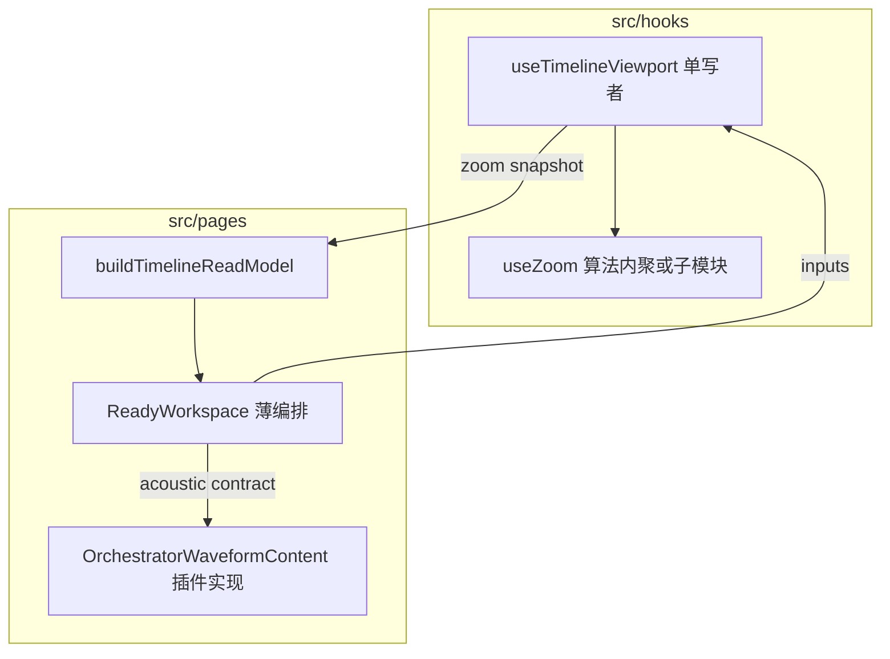

# 时间轴视口单写者与声学插件重构规划（2026-04-21）

**状态**：视口单写者 + 声学合同 + **子方案 A–F 主链已闭合**（矩阵 **v35**，2026-06-26）；**后续见 [§9](#9-后续-backlog-2026-06-26)**。  
**放置**：本文件位于 [`docs/execution/plans/`](./docs/execution/plans)，符合仓库 [文档治理规则](.cursor/rules/jieyu-docs-governance.mdc)。

**与上级文档的关系**：承接 [模式架构与平级评估-2026-04-21.md](./模式架构与平级评估-2026-04-21.md) §3.3「长期：真平级」与 §5.6 **A**（ReadyWorkspace 编排 / WaveSurfer DOM）、**useZoom 文献轴**；对齐 [ADR-0009](../../adr/0009-greenfield-timeline-single-source-freeze.md)（声学插件化、`AcousticSnapshot`、标尺与壳解耦方向）。

### 产品前提（2026-04-21 起写入）

以下前提**若成立**，本规划中的「收口」可采取 **更激进、无过渡期** 的实现（与主规划 §5 前提一致，此处单列便于实施勾选）：

- **无历史数据**：不导入旧 `jieyu` dump；不要求旧浏览器 localStorage profile 行为不变。
- **无向后兼容需求**：允许改 localStorage 键名、删迁移 shim、删「legacy 表兜底」导入路径（若产品确认）。
- **不留 legacy**：时间轴相关代码以 **单路径** 为准；兼容分支需有明确删除期限或不得新增。

**仍须保留的边界**：除非产品明确 **不做互操作导出**，否则 **`timelineMode` 等作为导出/交换格式标签** 仍可按 [ADR-0009](../../adr/0009-greenfield-timeline-single-source-freeze.md) 决策 4/5 保留在 **导出上下文**，与「运行时去 mode 化」不矛盾。

## 当前进度与排序

按 **守卫与分叉风险** 排序；完成上一行后再进入下一行（不要求并行）。

| 优先级 | 项 | 状态 / 说明 |
| --- | --- | --- |
| **P0** | 架构守卫：`useTranscriptionWorkspaceLayoutController` 行数超上限 | **已处理**：偏好逻辑拆至 [`transcriptionWorkspaceLayoutControllerPrefs.ts`](../../../src/pages/transcriptionWorkspaceLayoutControllerPrefs.ts)；守卫绿。 |
| **P0** | `TranscriptionPage.ReadyWorkspace` 行数热点 | **已压至 &lt;85%**：结构锚点外提 [`TranscriptionPage.ReadyWorkspace.structureMarkers.tsx`](../../../src/pages/TranscriptionPage.ReadyWorkspace.structureMarkers.tsx) + 文献轴跨度纯函数 [`readyWorkspaceLogicalTimelineDuration.ts`](../../../src/pages/readyWorkspaceLogicalTimelineDuration.ts)。 |
| **P1** | 视口写路径（可选） | **已收口**：`zoomPercent` / `setZoomPercent` 状态迁入 [`useTranscriptionWaveformBridgeController`](../../../src/pages/useTranscriptionWaveformBridgeController.ts)（与 `useTimelineViewport` / `useZoom` 同调用栈）；[`useTranscriptionWorkspaceLayoutController`](../../../src/pages/useTranscriptionWorkspaceLayoutController.ts) 仅保留 `zoomMode` 等布局态。 |
| **P1** | 阶段 B 剩余：`OrchestratorWaveformContent` 单对象合同 | **已完成**：`acousticStrip?: AcousticStripContract`（`acoustic` + `waveCanvasRef` + `tierContainerRef`）；`aria-busy` / `data-timeline-acoustic-shell` 仍由 read model 切片驱动。 |
| **P1** | 矩阵随动 | 以 [`timelineParityMatrix.ts`](../../../src/pages/timelineParityMatrix.ts) 的 **`TIMELINE_PARITY_MATRIX_VERSION`** 为准（**当前 = 36**）。历史：… v28–v35 selection / empty / keyboard funnel；**v36** §9 partial 拍板文案。 |
| **P2** | `timelineMode` 写路径 / cleanup / placeholder（K 表） | **已收口**：`mediaItemTimelineKind` 不再以 `timelineMode==='document'` 判定占位；`deleteAudioPreserveTimeline` 互操作 `timelineMode` 标签由 **是否存在时间对齐语段** 推断；`importAudio` 的 `refreshMediaTimelineMetadata` 不再门控于旧 `texts.metadata.timelineMode`；矩阵 **v7** 行 `timeline-mode-runtime-slim`。 |
| **P2** | import 单一路径 | **已核对**：导入/导出 segment 载荷以 **LayerUnit + `LayerSegmentQueryService`** 为唯一路径（`useImportExport.importHandlers` 无旧 segment 表读路径）；`buildOrthographyAwareExportUnits` 中 `legacyText` 仅指 LayerUnit 上 `transcription.default` 字段形态，非旧库表。 |
| **P3** | G3 深共享、Hub timeMapping 归宿 | **Hub 已收口**（矩阵 v8）。**G3**：[`TimelineLaneDraftEditorCell`](../../../src/components/transcription/TimelineLaneDraftEditorCell.tsx)（**v9**）+ [`timelineDraftAutoSaveKeys`](../../../src/utils/timelineDraftAutoSaveKeys.ts)（横向 **seg/utt/tr**、纵向 **pr-src/pr-seg/pr**）+ [`TranscriptionTimelineVerticalViewGroupList`](../../../src/components/TranscriptionTimelineVerticalViewGroupList.tsx) / 侧栏 [`TranscriptionTimelineTextTranslationItem`](../../../src/components/TranscriptionTimelineTextTranslationItem.tsx) + 多轨 [`TranscriptionTimelineMediaTranslationRow`](../../../src/components/TranscriptionTimelineMediaTranslationRow.tsx)（**`useMediaTranslationLaneRowDraftAutosave`**）；矩阵 **`g3-draft-autosave-key-helpers`** 已随 **v11** 增补多轨测锚点（**以 [`timelineParityMatrix.ts`](../../../src/pages/timelineParityMatrix.ts) 版本号为准**）。整行布局合并仍为 backlog。 |

**本规划范围内已落地**：阶段 **A0**–**D**（视口 / 声学合同 / ReadyWorkspace 瘦身）、**阶段 G**（声学长于文献轴显示语义）、**P0–P3**（热点 / timelineMode / Hub / G3 草稿格）、**子方案 [`时间轴交互与壳层收敛落地方案`](./时间轴交互与壳层收敛落地方案-2026-04-21.md) 阶段 A–F**（矩阵 v19–v35）。阶段 F：**契约（v12）→ SSOT（v16–v34）→ 选集 funnel（v28–v35）** 均已闭合。

---

## 1. 目标与非目标

### 1.1 目标（本规划要达成的工程形态）

1. **一条 read model**：继续以 [`buildTimelineReadModel`](./src/pages/timelineReadModel.ts) / `TimelineReadModel` 为 **语义快照聚合**；视口与声学相关的 **可变标量** 最终只通过 **单一写者** 更新，再回灌 `buildTimelineReadModel` 的输入（或等价的单一 `epoch` 驱动），避免 ReadyWorkspace 散写 `zoomPxPerSec`。
2. **可选 WaveSurfer / 播放器条**：[`OrchestratorWaveformContent`](./src/pages/OrchestratorWaveformContent.tsx) 收缩为 **声学插件槽** 的实现细节；[`TranscriptionPage.ReadyWorkspaceLayout.tsx`](./src/pages/TranscriptionPage.ReadyWorkspaceLayout.tsx) 仍可采用 lazy，但父级只传 **插件合同**（见阶段 B）。
3. **标尺 / 缩放单一入口**：**所有** `zoomPxPerSec`、`logicalTimelineDurationSec`、文献轴 **`useZoom` 行为**（仅允许在 [`useTimelineViewport`](./src/hooks/useTimelineViewport.ts) 内封装调用），**统一从 `src/hooks/` 下的视口 hook 投影** 读取；[`useTranscriptionWaveformBridgeController.ts`](./src/pages/useTranscriptionWaveformBridgeController.ts) 消费 **`useTimelineViewport`** 的 `projection`（见阶段 C）；编排层已移除悬空 `textTimelineZoomPxPerSec` 合同字段。
4. **声学插件边界清晰**：插件输入 = `TimelineReadModel.acoustic`（及必要的 URL / player 句柄）；输出 = seek、时长、解码态等 **窄回调**；不在 `TranscriptionTimelineWorkspaceHost` 或 `HorizontalMediaLanes` 内散落 `if (url)` 式声学门控（与 §5.3 一致）。

### 1.2 非目标（本阶段刻意不做）

- 不一次性删除 [`TranscriptionPage.ReadyWorkspace.tsx`](./src/pages/TranscriptionPage.ReadyWorkspace.tsx)（文件过大，需分阶段瘦身）。
- 不改变 **互操作导出** 侧 `timelineMode` 标签语义（ADR-0009 决策 4/5），除非产品书面取消互操作需求。
- 不在本规划内完成 **G3 纵向/横向 lane cell 深共享**（可与阶段 E 并行，另开任务）。

### 1.3 Greenfield 强化项（与视口重构并行，可选）

在 **§ 产品前提** 成立时，建议纳入同一里程碑或紧邻 PR，减少「兼容脚手架 + 新架构」双轨认知成本：

| 项 | 说明 | 参考实现锚点 |
| --- | --- | --- |
| **布局 localStorage 简化** | **已完成（阶段 A0）**：已删 `jieyu:workspace-layout-contract-version`；`normalizeWorkspaceVerticalViewPreferenceInStorage` 仅归一 `jieyu:workspace-vertical-view` 并清理旧键；矩阵 **v4**。 | 同上 |
| **`timelineMode` 写路径 / placeholder** | **本批已落地**：占位见 `details.timelineKind` / `placeholder` / `document-placeholder.track`；写路径见 `LinguisticService` + [`LinguisticService.cleanup`](../../../src/services/LinguisticService.cleanup.ts)。 | `mediaItemTimelineKind.test.ts` + `LinguisticService.test.ts` |
| **导入单一路径** | **本批已核对**：无 Dexie 旧 segment 表并行导入；segment 导出见 `useImportExport` + `LayerSegmentQueryService`。 | [`useImportExport`](../../../src/hooks/useImportExport.ts)、[`useImportExport.export.test.tsx`](../../../src/hooks/useImportExport.export.test.tsx) |

---

## 2. 现状拼装点（迁移起点）

| 区域 | 文件 | 说明 |
| --- | --- | --- |
| 编排中枢 | [`TranscriptionPage.ReadyWorkspace.tsx`](./src/pages/TranscriptionPage.ReadyWorkspace.tsx) | `zoomPxPerSec`、`logicalTimelineDurationForZoom`、`timelineReadModel`、`orchestratorRawInput` 等多束拼装 |
| 波形桥 | [`useTranscriptionWaveformBridgeController.ts`](../../../src/pages/useTranscriptionWaveformBridgeController.ts) | 经 **`useTimelineViewport`** 包装 [`useZoom`](../../../src/hooks/useZoom.ts)；对外暴露 **`timelineViewportProjection`** |
| 编排输入 | [`transcriptionReadyWorkspaceOrchestratorInput.ts`](../../../src/pages/transcriptionReadyWorkspaceOrchestratorInput.ts) | `zoomPxPerSec` / `rulerView` / `textTimelineZoomPxPerSec` **均由 `timelineViewportProjection` 派生** |
| 布局壳 | [`TranscriptionPage.ReadyWorkspaceLayout.tsx`](./src/pages/TranscriptionPage.ReadyWorkspaceLayout.tsx) | `OrchestratorWaveformContent` lazy、与 tier/滚动条 DOM 关系 |
| Read model | [`timelineReadModel.ts`](./src/pages/timelineReadModel.ts) | 已有 `zoom` / `acoustic` 字段，适合作为 **投影目标** |

---

## 3. 目标架构（示意）

```mermaid
flowchart TB
  subgraph hooks [src/hooks]
    VP[useTimelineViewport 单写者]
    ZM[useZoom 算法内聚或子模块]
  end
  subgraph pages [src/pages]
    RM[buildTimelineReadModel]
    RW[ReadyWorkspace 薄编排]
    PL[OrchestratorWaveformContent 插件实现]
  end
  RW -->|inputs| VP
  VP --> ZM
  VP -->|zoom snapshot| RM
  RW -->|acoustic contract| PL
  RM --> RW
```

说明：**`useTimelineViewport`（名称可评审）** 放在 `src/hooks/`，对外提供稳定投影；`useZoom` 可保留为 **纯函数或子 hook**，由 `useTimelineViewport` 唯一调用，避免页面层双开。

---

## 4. 分阶段实施

### 阶段 A0 — Greenfield 布局存储瘦身（**已完成**）

**已落地**：方案 1 — 删除 `WORKSPACE_LAYOUT_CONTRACT_VERSION_*` 与合同键迁移；持久化不再写合同键；`storage` 监听不再订阅该键；[`TIMELINE_PARITY_MATRIX_VERSION`](./src/pages/timelineParityMatrix.ts) **4** 且已删 `workspace-layout-contract-version` 矩阵行。

**验收**

- [`useTranscriptionWorkspaceLayoutController.test.tsx`](./src/pages/useTranscriptionWorkspaceLayoutController.test.tsx) 已更新；`npm run typecheck` 绿（合并前以本地 CI 为准）。

### 阶段 A — 合同与类型（行为不变）

**产出**

- 新增类型模块（建议）：`src/hooks/timelineViewportTypes.ts`（或同文件内嵌）定义：
  - `TimelineViewportProjection`：只读字段（`zoomPxPerSec`、`logicalTimelineDurationSec`、`rulerView`、与 `useZoom` 对齐的回调引用类型等）。
  - `AcousticStripContract`（名称可评审）：插件槽输入/输出，与 `TimelineReadModel.acoustic` 对齐。
- 在 [`docs/adr/0009-greenfield-timeline-single-source-freeze.md`](../../adr/0009-greenfield-timeline-single-source-freeze.md) 或 `docs/architecture/` 增加 **半页「视口单写者」补充**（可选，但推荐在阶段 C 前完成）。

**验收**

- `npm run typecheck`；无运行时行为变化。

**已落地（阶段 A）**

- [`src/hooks/timelineViewportTypes.ts`](../../../src/hooks/timelineViewportTypes.ts)：`TimelineViewportProjection`、`TimelineViewportScalars`、`TimelineViewportZoomControls`、`TimelineViewportZoomBridge`、`AcousticStripContract`、`AcousticStripSnapshot`；[`useZoom`](../../../src/hooks/useZoom.ts) 返回类型显式为 `TimelineViewportZoomBridge`。
- [ADR-0009](../../adr/0009-greenfield-timeline-single-source-freeze.md) 增补 **Implementation supplements / 视口单写者与类型合同**。

### 阶段 B — 声学 read model 接入波形壳（**合同对象已落地**）

**产出**

- [`OrchestratorWaveformContent`](../../../src/pages/OrchestratorWaveformContent.tsx) 使用可选 **`acousticStrip?: AcousticStripContract`**（`acoustic` + `waveCanvasRef` + `tierContainerRef`）；`WaveformAreaSection` 上 **`aria-busy`（pending_decode）** 与 **`data-timeline-acoustic-shell`**；ReadyWorkspace 经 **`buildReadyWorkspaceWaveformContentProps`** 传入 `timelineReadModel.acoustic` 与同名 refs。

**验收**

- `npm run typecheck`；结构测试断言 **`acousticStrip` / `AcousticStripContract`** 与 `aria-busy` 门禁。

### 阶段 C — 视口单写者（核心，`src/hooks/`）（**已落地**）

**产出**

- [`src/hooks/useTimelineViewport.ts`](../../../src/hooks/useTimelineViewport.ts)：内部 `useZoom`；对外 `projection`、`zoomToPercent`、`zoomToUnit`；可选 `waveformScrollLeft` 并入投影；[`UseZoomInput`](../../../src/hooks/useZoom.ts) 已导出。
- [`useTranscriptionWaveformBridgeController.ts`](../../../src/pages/useTranscriptionWaveformBridgeController.ts)：改为 **`useTimelineViewport`**；返回 **`timelineViewportProjection`**；`rulerView` 取自投影。
- [`TranscriptionPage.ReadyWorkspace.tsx`](../../../src/pages/TranscriptionPage.ReadyWorkspace.tsx)：`useTimelineReadModel` 的 zoom / logical duration / scroll **取自 `timelineViewportProjection`**；编排 / resize / annotation / waveform content **仅用投影字段**，不再从 bridge 平行解构 `zoomPxPerSec` / `rulerView` / `fitPxPerSec` / `maxZoomPercent`。
- [`useTimelineViewport.test.ts`](../../../src/hooks/useTimelineViewport.test.ts) 基础断言。

**仍待后续 PR（可选）**

- `setZoomPxPerSec` 等若需从 **`useTimelineViewport`** 直接再导出窄 API（当前 **`zoomPercent` / `setZoomPercent`** 已由 [`useTranscriptionWaveformBridgeController`](../../../src/pages/useTranscriptionWaveformBridgeController.ts) 持有，不再经 workspace layout）。

**验收**

- [`useZoom.test.ts`](../../../src/hooks/useZoom.test.ts) 全绿。
- [`TranscriptionPage.structure.test.ts`](../../../src/pages/TranscriptionPage.structure.test.ts) 已校验 `useTimelineViewport`、orchestrator 与 stage builder 的 **`timelineViewportProjection`** 门禁。

### 阶段 D — ReadyWorkspace 瘦身（**本批已落地**）

**产出**

- [`buildReadyWorkspaceStageProps`](../../../src/pages/transcriptionReadyWorkspacePropsBuilders.ts) 的 **`BuildReadyWorkspaceStagePropsInput`** 改为 **`timelineViewportProjection`** 单字段驱动 `zoomControlsProps`（`zoomPercent` / `fitPxPerSec` / `maxZoomPercent`）。

**验收**

- 定向 vitest：`TranscriptionPage.structure.test.ts`；`npm run typecheck`。

### 阶段 E — G3 深共享（并行）

- 与 [模式架构与平级评估-2026-04-21.md](./模式架构与平级评估-2026-04-21.md) §5.2 **G3** 对齐：纵向/横向 lane cell 共享；**不阻塞** A–D。
- **P3 本批（Hub）**：逻辑时间映射菜单/预览与 **`exportTimelineModeLabel` 解耦**；`computeSemanticTimelineMappingPreview` 供 Hub（及后续 UI）单点复用。
- **G3 本批（首步）**：[`TimelineLaneDraftEditorCell`](../../../src/components/transcription/TimelineLaneDraftEditorCell.tsx) 接入横向语段格与纵向对读草稿格。
- **G3 续**：[`timelineDraftAutoSaveKeys`](../../../src/utils/timelineDraftAutoSaveKeys.ts)（含纵向 **`pr-src` / `pr-seg` / `pr-`**）+ 侧栏译文行 `bubbleClick` 接入共享壳。

### 阶段 G — 声学长于文献轴：完整显示波形（2026-06-26，已修订并落地）

**最终决策（用户拍板）**：当 `mediaDur > documentSpanSec`（声学比当前文本轴长）时，**完整显示波形时长**（铺轨 / 标尺 / 建段上界 / 播放都跟到完整声学），**仅不延伸持久化的文本逻辑时长**（`logicalDurationSec` 不被更长声学抬高）。

**走过的弯路（勿重蹈）**：初版（2026-06-26 上午）把「导入冻结」误用到**显示跨度**——`resolveTimelineBindingExtentSec` 文献优先返回文献跨度，且在 `useZoom` 引入「对称 tier-primary」把波形钳在文献轴内。结果更长声学被截断、波形 / 标尺到不了声学尾部。用户判定此钳制不合理，已**全部回退**：

- `resolveTimelineBindingExtentSec` 改回 `max(文献, 声学)`（显示跨度不冻结）。
- 回退 `useZoom` / `TimeRuler` / `waveformBridgeTierScrollSync` 的对称 tier-primary，恢复 `isExtendedDocumentTimeline`（仅 `doc > media` 时 tier 主导；`media ≥ doc` 时 WaveSurfer 主导，波形完整可滚）。
- 移除 `playbackExtentSec` / `resolvePlaybackCapSec` / `clampTimeToPlaybackCap` 整条链路（2026-06-26 审计修复）；播放/seek 上界 = **`player.duration`**。
- 删除 `isTierPrimaryTimeline` / `resolveWaveformScrollClampSec` 等新增对称助手。

**保留**：导入冻结只作用于持久化 `logicalDurationSec`（`mergeImportedTimelineMetadata` / `resolveLogicalDurationAfterAudioImport` 不变）；ADR-0004 实现记录已同步修订。

**保留的独立修复（与本决策无关，继续生效）**：

- B1 hover：extended-document（`doc > media`，tier 主导）时 hover 时间用 `tier.scrollLeft` 并钳到 `documentSpanSec`，不再读被钳的 `ws.getScroll()`（`src/pages/waveformBridgeHoverScrollRaf.ts`）。
- `TimeRuler` 刻度密度按可见窗口 `viewWidthPx / windowSec`（`resolveTimeRulerPxPerSec`），`resolveTimeRulerSpanSec` 复用 `resolveTimelineBindingExtentSec`（现 = max）。
- **100% fit（2026-06-26 补充）**：`fitPxPerSec` 以 `resolveTimelineFitSpanSec`（= `max(文献轴, 声学)`，文献侧用 `documentSpanWithoutAcousticAnchor`）为分母，更长声学时 100% 一屏铺满整段波形；`documentSpanSec` 仍只表文献/语段轴，供 tier-primary 判定与语段坐标，**不**因 fit 抬高持久化 `logicalDurationSec`。

**连带清理（已完成）**：导入冻结期新增的 `duration_long` 提示在 `max` 语义下永不触发（`d > bindingExtent` 恒假），已整条移除——`timelineAxisStatus` 的 `duration_long` 联合分支与 `documentSpanSec` 入参、`timelineAxisStatusExpand` 的对应分支、`TimelineAxisStatusStrip` 渲染分支、i18n `acousticBeyondBindingExtent`（`dictKeys` + en/zh）、`useReadyWorkspaceAxisStatus` 的 `documentSpanSec` 透传及相关测试。声学超出语段仍由既有 `duration_short` 提示覆盖。

**非目标（原）→ backlog（2026-06-26 产品拍板）**：

- `timeMapping` 非 1:1 的语段 X 渲染（**时间轴 A8**）：原列为视口里程碑非目标；**现产品要求做**，单独立项，见子方案 [§9.3 / §9.4](./时间轴交互与壳层收敛落地方案-2026-04-21.md#93-架构与产品开放项)。

### 阶段 F — 语段范围手势单表面（与声学解耦）— **已落地（2026-06，矩阵 v12–v35）**

**目标（产品层）**：波形空区、`RegionsPlugin` 拖建、轨面套索等 **拖建/框选反馈** 收敛为 **单一预览状态 + 单一渲染面**；**不**在 `TranscriptionTimelineWorkspaceHost` / `HorizontalMediaLanes` 内按壳写 `if (textOnly)` 式声学门控；声学插件仅提供时长/解码/seek 等窄合同（与 §1.1、ADR-0009 一致）。

**子文档（分阶段落地方案）**：[`时间轴交互与壳层收敛落地方案-2026-04-21.md`](./时间轴交互与壳层收敛落地方案-2026-04-21.md) — **阶段 A–F 主链已闭合**；后续 backlog 见该文档 [§9](./时间轴交互与壳层收敛落地方案-2026-04-21.md#9-后续-backlog)。

**已落地摘要**

| 里程碑 | 矩阵 | 要点 |
| --- | --- | --- |
| 契约 | v12–v14 | 行 **`segment-range-gesture-single-surface`**；parity 波形/textOnly `full`，纵向 `partial` |
| Preview SSOT | v16–v34 | `useSegmentRangeGesturePreviewWriter` + `segmentRangeGesturePreviewReadModel`；legacy `lassoRect`/`waveLassoRect` 移除；`SegmentRangeLassoPreviewOverlay` |
| 选集 / 空壳 | v28–v35 | `selectionProjection`、`applyTimelineSelectionCommand`、`EmptyTimelinePolicy`；键盘 / Cmd+A 经 `writeTimelineSelection` |

**仍 intentional partial**：纵向 tier 不挂套索链（产品取舍）；波形区 `useLasso` wave 输出仍服务全局声学条拖建。

---

## 5. 验收矩阵（已写入 [`timelineParityMatrix`](../../../src/pages/timelineParityMatrix.ts)；**`TIMELINE_PARITY_MATRIX_VERSION` 以该文件为准**，当前 **v36**）

| 能力 | 行 id | parity 摘要 | 锚点测试 |
| --- | --- | --- | --- |
| 壳层 layersCount 单源 | `timeline-shell-layers-count-single-source` | 三壳 full | `timelineReadModel.test.ts` + structure |
| 时间跨度单源 | `timeline-extent-single-source` | 三壳 full | `timelineExtent.test.ts` + lanes / orchestrator |
| 标尺缩放单写者 | `timeline-viewport-single-writer` | 三壳 full | `applyTimelineViewportScroll.test.ts` + `useZoom.test.ts` |
| 声学 chrome 映射 | `acoustic-shell-chrome-map` | 三壳 full | `mapAcousticToTimelineChrome.test.ts` |
| 语段范围拖建单一面 | `segment-range-gesture-single-surface` | 波形/textOnly full；纵向 partial | `segmentRangeGestureParity.test.ts` + `useLasso.test.tsx` |
| Preview SSOT | `phase-f-range-preview-ssot` | 三壳 full | `phaseFRangePreviewSsot.test.ts` + writer / readModel tests |
| 选集写 funnel | `selection-write-funnel` | 三壳 full | `applyTimelineSelectionCommand.test.ts` + `useKeybindingActions.test.tsx` |
| 空时间轴策略 | `empty-timeline-policy` | 三壳 full | `emptyTimelinePolicy.test.ts` + `TimelineEmptyState.test.tsx` |
| 缩放与滚动（延续） | `zoom-scroll` | 三壳 full | `useZoom.test.ts` + `useTimelineViewport.test.ts` |
| 声学插件合同 | `acoustic-strip-contract` | 三壳 full | `TranscriptionPage.structure.test.ts` |
| P2：`timelineMode` 运行时收敛 | `timeline-mode-runtime-slim` | 三壳 full | `mediaItemTimelineKind.test.ts` + `LinguisticService.test.ts` |
| P3：Hub 时间映射 | `project-hub-time-mapping-modeless` | 三壳 full | `LeftRailProjectHub.test.tsx` + `timeMappingHubPreview.test.ts` |
| G3：lane 草稿格 | `g3-lane-draft-editor-cell-shared` | 三壳 full | `TimelineLaneDraftEditorCell.test.tsx` |
| G3：草稿 key + 多轨 | `g3-draft-autosave-key-helpers` | 三壳 full | `timelineDraftAutoSaveKeys.test.ts` + lanes tests |
| **仍 partial** | `layer-link-connector` | textOnly / vertical partial | `useLayerSegments.test.ts` |
| **仍 partial** | `acoustic-waveform-vad` | textOnly / vertical partial | `timelineAxisStatus.test.ts` |

---

## 6. 风险与缓解

| 风险 | 缓解 |
| --- | --- |
| `exactOptionalPropertyTypes` 与可选 props 传递 | 阶段 A 显式类型；阶段 C 用条件 spread 模式（与现 orchestrator 一致） |
| lazy + Suspense 边界行为 | 阶段 B 保持 `OrchestratorWaveformContent` 默认导出不变，仅缩 props |
| ReadyWorkspace 单文件过大 | 阶段 D 后考虑拆出 `useReadyWorkspaceTimelineViewportBundle.ts` 等（仍放 `pages/` 或 `hooks/` 按职责再定） |
| 回归面大 | 每阶段合并后跑：`useZoom`、`structure`、`timeline content`、`check:architecture-guard` |

---

## 7. 执行跟踪（todos）

- [x] **greenfield-layout-storage**：阶段 **A0** 已移除 `workspace-layout-contract-version`；矩阵 v4 已删对应行并升 `TIMELINE_PARITY_MATRIX_VERSION`。
- [x] **viewport-types**：[`timelineViewportTypes.ts`](../../../src/hooks/timelineViewportTypes.ts) 已落地；`useZoom` 返回 `TimelineViewportZoomBridge`；`npm run typecheck` 绿。
- [x] **acoustic-strip-contract**：`OrchestratorWaveformContent` 已改为 **`acousticStrip?: AcousticStripContract`**（read model + wave/tier refs）；矩阵 **v6** 已增对应行。
- [x] **use-timeline-viewport**：[`useTimelineViewport.ts`](../../../src/hooks/useTimelineViewport.ts) + [`useTimelineViewport.test.ts`](../../../src/hooks/useTimelineViewport.test.ts)；bridge 消费投影；ReadyWorkspace read model 取自投影。
- [x] **orchestrator-zoom-source**：[`transcriptionReadyWorkspaceOrchestratorInput.ts`](../../../src/pages/transcriptionReadyWorkspaceOrchestratorInput.ts) 入参改为 **`timelineViewportProjection`**；`buildOrchestratorViewModelsInput` 内派生 `zoomPxPerSec`、`rulerView`（已移除悬空 `textTimelineZoomPxPerSec` 拼装）。
- [x] **ready-workspace-slim**：ReadyWorkspace 缩放相关调用改 **`timelineViewportProjection`**；`buildReadyWorkspaceStageProps` 入参已对齐。
- [x] **parity-matrix-bump**：`TIMELINE_PARITY_MATRIX_VERSION` **11**；v9 含 **`g3-lane-draft-editor-cell-shared`**；v10 新增 **`g3-draft-autosave-key-helpers`**；v11 增补 G3 行 **`TranscriptionTimelineHorizontalMediaLanes.test.tsx`** 锚点并随草稿 hook / Escape 防抖 key 验收升版。
- [x] **phase-f-stage-0-contract**：矩阵 **v12**；新增 **`segment-range-gesture-single-surface`** 行；锚点 **`segmentRangeGestureParity.test.ts`**；`TranscriptionPage.structure.test.ts` 矩阵契约门禁；§4 **阶段 F** 文档落盘。
- [x] **p3-project-hub-time-mapping**：Hub 导出/校准/预览以 **`onApplyTextTimeMapping`** 门控；**`timeMappingHubPreview`** 单点公式；定向 `LeftRailProjectHub.test.tsx`。
- [x] **g3-lane-draft-editor-cell**：**`TimelineLaneDraftEditorCell`** 接入 **`TimelineAnnotationItem`** + **`TranscriptionTimelineVerticalViewGroupList`**；定向 `TimelineLaneDraftEditorCell.test.tsx`。
- [x] **g3-draft-autosave-keys**：**`timelineDraftAutoSaveKeys`**（含 **`timelineTranslationHostDraftAutoSaveKey`**、纵向 **pr-src / pr-seg / pr**）+ **`useTimelineLaneTextDraftAutosave`**（多轨宿主转写行 / 侧栏译文格 onChange·onBlur；Escape 与 **`usesOwnSegments`** 防抖 key 对齐）+ **`useMediaTranslationLaneRowDraftAutosave`**（多轨 **译文** 行 segment 语义与侧栏分叉收口）+ **`TranscriptionTimelineVerticalViewGroupList`**；侧栏 **`bubbleClick`**；矩阵中文 **`timelineParityMatrixMessages`**；定向 `timelineDraftAutoSaveKeys.test.ts`、`useTimelineLaneTextDraftAutosave.test.tsx`、`TranscriptionTimelineHorizontalMediaLanes.test.tsx`、`TranscriptionTimelineVerticalView.test.tsx`。
- [x] **zoom-percent-writer-in-bridge**：`zoomPercent` / `setZoomPercent` 从 workspace layout controller 迁至 **`useTranscriptionWaveformBridgeController`**，与 `useTimelineViewport` 同栈，避免 workspace 与视口双写。
- [x] **timelineMode-writepath-slim**：`mediaItemTimelineKind`、`LinguisticService.cleanup`、`importAudio` 元数据刷新已去 **`texts.metadata.timelineMode` 运行时门控**；定向 `LinguisticService.test.ts`。
- [x] **import-single-path**：核对 import/export 仅 **LayerUnit + segment 服务**；无旧 segment 表读路径；记录于 §1.3。
- [x] **interaction-convergence-a-f**：子方案阶段 A–F（矩阵 v19–v35）；含 gesture SSOT、selection funnel、keyboard selectAll；E2E chromium 36/36（2026-06-26）。

---

## 9. 后续 backlog（2026-06-26）

本规划 **视口单写者 + 声学边界 + 子方案 A–F** 主链已闭合。后续以 [`时间轴交互与壳层收敛落地方案 §9`](./时间轴交互与壳层收敛落地方案-2026-04-21.md#9-后续-backlog) 为 **执行 SSOT**；此处仅列 **父规划独有** 项：

| 优先级 | 项 | 说明 |
| --- | --- | --- |
| P2 | **§3.3 / §3.4**（子方案） | **已落地** |
| P2 | **矩阵 partial 文案** | **v36 已固化** intentional gap — 见子方案 [§9.2 / §9.5](./时间轴交互与壳层收敛落地方案-2026-04-21.md#92-矩阵-residual-partial非-af-阻塞) |
| **下一迭代** | **G3 整行布局合并** | 产品拍板排期 — lane row DOM 深合并 |
| **下一迭代** | **选集 undo 批处理** | 协作 guard 延后 |
| **单独立项** | **A8 timeMapping X 渲染** | 产品拍板 **要做** — 非 1:1 映射下语段视觉坐标 |
| 低优 | **pxPerDocSec deprecate** | 评估已完成；消费方改名后删 `viewportFrame.pxPerDocSec` |
| 低优 | **ReadyWorkspace 进一步瘦身** | §6 风险表 |
| 维护 | **RegionsPlugin / WaveSurfer 升级** | 升级时复核 drag/region API |

**建议默认下一迭代**：G3 lane row → undo 批处理 → A8 立项（子方案 [§9.4](./时间轴交互与壳层收敛落地方案-2026-04-21.md#94-建议下一迭代顺序2026-06-26-拍板后)）。

---

## 8. 开放问题（历史；已决项删除）

1. ~~**`useTimelineViewport` 与 bridge 依赖方向**~~：**已决** — viewport → bridge 注入，无循环。
2. ~~**`lassoRect` 与 scroll 同步**~~：**已决** — 经 `viewportFrame` + `applyTimelineViewportScroll` + gesture SSOT（v31–v34）。
3. **协作只读 / guard**：选集写 funnel 已统一，协作 guard 与 undo 批处理见 [§9](#9-后续-backlog-2026-06-26)。
4. ~~**能力矩阵版本**~~：**已决** — 当前 **v36**；以 [`timelineParityMatrix.ts`](../../../src/pages/timelineParityMatrix.ts) 为准。
