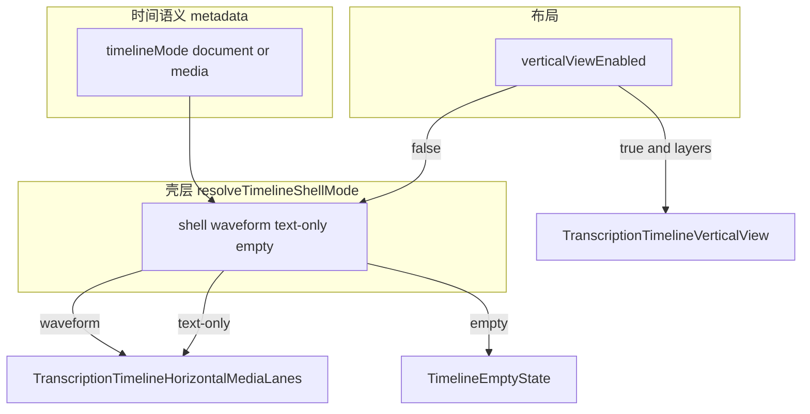
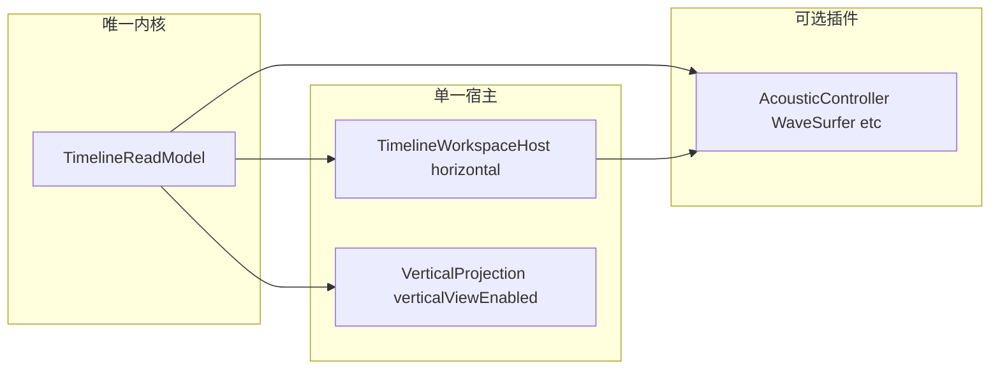

# 模式架构与平级评估（2026-04-21）

**状态**：**Greenfield 主干与 §0 勾选项已收口**；本文件保留 **§1–§2 心智模型**、**§3 产品与文案 backlog**、**§5.6–§5.8 验收与命名基线**，以及 **§5.3 / §5.6 walk 中尚未逐项关闭的增量项**（易漏能力面 ≠ 全部待办）。  
**日期**：2026-04-21（持续修订至 2026-04-21 工程记录与矩阵 v3）  
**放置**：本文件位于 [`docs/execution/plans/`](docs/execution/plans/)，符合仓库 [文档治理规则](.cursor/rules/jieyu-docs-governance.mdc)（执行规划不放 `~/.cursor/plans`）。

**概述**：现状 §1–§2；渐进 §3；Greenfield §5（含 §5.3 声学/AI 三态合同、§5.6 仓库核对易漏项：ReadyWorkspace 编排、useZoom 文献轴、轴状态条、工具栏 VAD 条件、Hub timeMapping、localContextTools、嵌入/RAG、审查 badge、VoiceAgent、协作、纵向 i18n/mutation）。**工程第二条线**：[`src/pages/timelineParityMatrix.ts`](src/pages/timelineParityMatrix.ts)（`TIMELINE_PARITY_MATRIX_VERSION = 11`）+ §5.6 L 表（类型切片、`verticalProjection` 编排；**布局合同键已移除**，纵向偏好仅 `jieyu:workspace-vertical-view` + 读时归一）已与实现对齐。

**落地审查（2026-04-22）**：[docs/execution/audits/模式架构与平级评估-落地审查-2026-04-22.md](../audits/模式架构与平级评估-落地审查-2026-04-22.md)（含 §0 勾选纠偏、已修 `acousticPending` 回归）。

## 0. 执行跟踪（todos）

> **2026-04-22 收口**：横向统一宿主与 legacy 删除已落地；元数据 `timelineMode` 仍以 [ADR-0009](../../adr/0009-greenfield-timeline-single-source-freeze.md) 为导出/互操作语义基准（非本表逐项展开）。  
> **2026-04-21 工程补充（第二条线）**：[`timelineParityMatrix`](src/pages/timelineParityMatrix.ts) 与 [`timelineParityMatrix.test.ts`](src/pages/timelineParityMatrix.test.ts) 门禁；§5.6 L 表见 §7（纵向 `verticalProjection`；**v4** 起已删 `jieyu:workspace-layout-contract-version` 矩阵行；**v5** 起增补视口单写者行与 `zoom-scroll` 双锚点；**v6** 起 `acoustic-strip-contract`；**v7** 起 `timeline-mode-runtime-slim` / P2；**v8** 起 `project-hub-time-mapping-modeless` / P3 Hub；**v9** 起 `g3-lane-draft-editor-cell-shared`；**v10** 起 `g3-draft-autosave-key-helpers`；**v11** 起 G3 行增补 `TranscriptionTimelineHorizontalMediaLanes.test.tsx` 锚点并随 hook / Escape 防抖 key 验收升版）。  
> **Greenfield 强化（无历史 / 无兼容 / 不留 legacy）**：在 §5 前提下，允许 **删迁移 shim、换 localStorage 键、import 单一路径、加速视口专项无并行过渡期**；具体任务已写入 [时间轴视口单写者与声学插件重构规划-2026-04-21.md](./时间轴视口单写者与声学插件重构规划-2026-04-21.md) 的 **§ 产品前提 / §1.3 / 阶段 A0**。

- [x] **greenfield-adr-freeze**：[ADR-0009](../../adr/0009-greenfield-timeline-single-source-freeze.md) + [ADR-0005](../../adr/0005-unified-timeline-workspace-host.md)（横向拓扑）。
- [x] **greenfield-read-model**：[`src/pages/timelineReadModel.ts`](src/pages/timelineReadModel.ts)。
- [x] **greenfield-unified-host**：[`TranscriptionTimelineWorkspaceHost`](src/pages/TranscriptionTimelineWorkspaceHost.tsx)；横向双壳均 `HorizontalMediaLanes`。
- [x] **greenfield-vertical-on-host**：纵向由宿主优先分发；纵向层头菜单已移除恒灰「显示层级关系」项。
- [x] **greenfield-db-export**：`resolveTimelineShellMode` 等已去除 `timelineMode` 运行时壳分叉（与 §7 记录一致）。
- [x] **greenfield-delete-legacy**：已删 `TranscriptionTimelineTextOnly` 实现与大测；类型见 [`transcriptionTimelineWorkspacePanelTypes.ts`](src/pages/transcriptionTimelineWorkspacePanelTypes.ts)；守卫 [`check-timeline-single-host-entry`](../../../scripts/check-timeline-single-host-entry.mjs)。
- [x] **greenfield-acoustic-ai-contract**：localContextTools + `acousticShellPending` 解码中样式。
- [x] **greenfield-ready-workspace-split**：`timelineReadModel.acoustic` → 轴条 / `playableAcoustic` → 工具栏自动分句。
- [x] **i18n-key-fix**。
- [x] **timelineMode-decouple-matrix**（与代码现状一致处已冻结；后续仅随产品变更增量核对）。
- [x] **local-tools-unavailable-contract**。
- [x] **host-props-contract-split**（见 §7 2026-04-21 记录）。
- [x] **parity-matrix** / **naming-doc**（§7 记录为已完成基线；增量文案随功能迭代）。

---

# 纯文本 / 媒体 / 横向 / 纵向：架构是否清晰、是否已平级

## 1. 实际架构（三条轴，不要混成「四种平级模式」）

| 维度                     | 含义                                                   | 主要落点                                                                                                                                                                                                                                                                                                                                                           |
| ---------------------- | ---------------------------------------------------- | -------------------------------------------------------------------------------------------------------------------------------------------------------------------------------------------------------------------------------------------------------------------------------------------------------------------------------------------------------------- |
| **时间语义 / 项目类型**        | `document`（文献/逻辑秒为主）vs `media`（以声学时间轴为默认 1:1 语境）     | `[texts.metadata.timelineMode](src/hooks/useDialogs.ts)`（经 `resolveTimelineMode`）、`[docs/adr/0004-logical-timeline-acoustic-media-lifecycle.md](docs/adr/0004-logical-timeline-acoustic-media-lifecycle.md)`                                                                                                                                                   |
| **主时间轴 UI 壳**          | `waveform`（多轨 + 波形）vs `text-only`（文献轴虚拟滚动）vs `empty` | `[src/utils/timelineShellMode.ts](src/utils/timelineShellMode.ts)` 的 `resolveTimelineShellMode`                                                                                                                                                                                                                                                                |
| **工作区布局（产品文案里的横向/纵向）** | 横向 = 多轨时间轴编辑；纵向 = 双列对照                               | 左轨 [`SidePaneSidebar` 的 `workspaceTimelineLayout`](src/components/SidePaneSidebar.tsx)；主内容由 [`TranscriptionPage.TimelineContent.tsx`](src/pages/TranscriptionPage.TimelineContent.tsx) 委托 [`TranscriptionTimelineWorkspaceHost`](src/pages/TranscriptionTimelineWorkspaceHost.tsx)，以 **`verticalComparisonEnabled`**（[`useTranscriptionTimelineContentViewModel`](src/pages/useTranscriptionTimelineContentViewModel.ts) 内由 `verticalProjection` + 层数计算）优先纵向，为真时挂载 [`TranscriptionTimelineVerticalView`](src/components/TranscriptionTimelineVerticalView.tsx)，**不挂**横向多轨波形壳 |

**实现注**：[`TranscriptionPage.TimelineContent.tsx`](src/pages/TranscriptionPage.TimelineContent.tsx) 委托 [`TranscriptionTimelineWorkspaceHost`](src/pages/TranscriptionTimelineWorkspaceHost.tsx)；`verticalComparisonEnabled` 时优先纵向，否则按 `shell` 在 **同一 `HorizontalMediaLanes` 宿主** 上区分 `waveform` / `text-only`（含 `acousticShellPending` 样式）。

**结论（是否「清晰」）**：**概念上**团队在 ADR 与 `[timelineShellMode.ts](src/utils/timelineShellMode.ts)` 顶部注释里已经拆开；**产品语言上**「纯文本模式 / 媒体模式」和「横向 / 纵向」叠在一起时容易听起来像四个同级开关，需要心智模型：**先分「文献 vs 声学语义」再分「多轨 vs 对照」再分「此刻用波形壳还是文献壳」**。仓库里已有执行向文档讨论对照与多壳收口（例如 `[docs/execution/plans/对照与多壳时间轴段块统一收口规划-2026-04-19.md](docs/execution/plans/对照与多壳时间轴段块统一收口规划-2026-04-19.md)`）说明团队也承认**实现路径仍有多条**、需继续收口。

---

## 2. 「纯文本升级成与媒体平级、能力全覆盖」——**横向 UI 已收口；元数据与文案仍迭代**

**已达成（2026-04 起）**

- **横向单宿主**：`waveform` 与 `text-only` 壳均由 [`TranscriptionTimelineHorizontalMediaLanes`](src/components/TranscriptionTimelineHorizontalMediaLanes.tsx) 渲染，经 [`TranscriptionTimelineWorkspaceHost`](src/pages/TranscriptionTimelineWorkspaceHost.tsx) 路由；原 `TranscriptionTimelineTextOnly` 实现已移除，编排 props 类型见 [`transcriptionTimelineWorkspacePanelTypes.ts`](src/pages/transcriptionTimelineWorkspacePanelTypes.ts)。
- **纵向**：编排侧 **`verticalProjection`** 与 panel 其余字段在 [`useTranscriptionTimelineContentViewModel`](src/pages/useTranscriptionTimelineContentViewModel.ts) 合并为宿主所需的 `textOnlyProps`；宿主内 **`verticalComparisonEnabled`** 优先挂载 [`TranscriptionTimelineVerticalView`](src/components/TranscriptionTimelineVerticalView.tsx)。
- **声学状态**：`acousticShellPending` 保留解码中底边提示；工具栏自动分句随 `playableAcoustic` 暴露（见 `transcriptionToolbarProps.ts` + ReadyWorkspace read model）。
- **第二条线（矩阵 + L 表）**：[`timelineParityMatrix.ts`](src/pages/timelineParityMatrix.ts) 维护能力矩阵（**v5**）；§5.6 L 表（[`timelineHostProjectionTypes.ts`](src/pages/timelineHostProjectionTypes.ts)、`verticalProjection`；布局合同键已删）已落地，见 §7。

**仍须产品/数据层跟进的项**

1. **i18n 中性化（增量）**：2026-04-22 已更新工具栏布局切换、`segmentMissingForSave`、`bundleFilterFallbackItem` 等主链文案；其余 key（空状态、Hub、帮助页）可按同一术语表继续扫尾。
2. **ADR-0004 决策 3**：删音 / 再导音与 `timelineMode` 元数据对称——实现与单测见 ADR「实现记录」；后续产品变更仍以 [ADR-0004](docs/adr/0004-logical-timeline-acoustic-media-lifecycle.md) 与 [ADR-0009](docs/adr/0009-greenfield-timeline-single-source-freeze.md) 为门禁回归。

---

## 3. 如何改进（分阶段、可落地）

改进目标可以拆成两条线：**让用户不再混淆**（沟通/产品）与 **让实现少分叉、能力可验收**（工程）。下面按投入从小到大排列。

### 3.1 短期：心智模型与文案（不改大架构也能明显变好）

- **固定入口讲清「三轴」**：在转写工作区选一处处始终可见或易发现的位置（空状态、项目 Hub、侧栏帮助链接）用**一张示意图或三句话**说明：`timelineMode`（文献秒 vs 声学语境）、壳（波形轨 vs 文献轨）、布局（多轨 vs 对照）。避免用户把「横向/纵向」当成 `document`/`media` 的别名。
- **统一用词**：落实或迭代 `[docs/execution/plans/纵横模式命名统一重命名方案-2026-04-21.md](docs/execution/plans/纵横模式命名统一重命名方案-2026-04-21.md)`，保证 i18n、Aria label、设置项里同一英文概念的中译一致。
- **「仅横向」菜单项**：2026-04-22 已移除纵向层头中恒灰、无解释的「显示层级关系」项；若日后重新引入需附 **显式说明** 或实现纵向等价能力（见 §5 目标）。

### 3.2 中期：收口双轨、用矩阵驱动平级

- **能力矩阵（维护）**：横向已统一为 `[TranscriptionTimelineHorizontalMediaLanes.tsx](src/components/TranscriptionTimelineHorizontalMediaLanes.tsx)`（`waveform` / `text-only` 壳参数不同）；**机器可读矩阵**见 [`src/pages/timelineParityMatrix.ts`](src/pages/timelineParityMatrix.ts)（`TIMELINE_PARITY_MATRIX_VERSION = 11`，门禁 [`timelineParityMatrix.test.ts`](src/pages/timelineParityMatrix.test.ts)）；与 §5.7 表互补（§5.7 偏产品验收语言，矩阵偏工程锚点）。
- **提炼共享 props / 小模块**：**编排层**：[`timelineHostProjectionTypes.ts`](src/pages/timelineHostProjectionTypes.ts) 已提供 `TimelineHostSharedLaneProps` / `TimelineHorizontalProjectionLaneProps` / `TimelineVerticalProjectionProps` 等切片，**`BuildSharedLanePropsInput` 与 orchestrator 已接入**；**组件层**：仍在 `HorizontalMediaLanes` 内继续收敛 lane header、segment 列表迭代、键盘导航、保存反馈等（深共享 cell，与 §5.2 **G3 部分**一致）。
- **i18n 与引导语**：主链已按 2026-04-22 口径中性化（见 §5.8、§7）；其余 key（空状态、Hub、帮助页）仍可按矩阵与术语表 **增量扫尾**。

### 3.3 长期：真平级（可选架构升级）

- **单一时间轴宿主 + 可插拔声学层**：理想形态是「一条 read model + 可选 WaveSurfer/播放器条」，文献标尺与缩放始终存在；`timelineMode` 主要约束**默认时间映射与导出声明**（与 [ADR-0004](docs/adr/0004-logical-timeline-acoustic-media-lifecycle.md) 一致），而不是决定挂哪棵完全不同的 React 子树。这是大改，应在矩阵把「高价值缺口」清完后再动。  
  - **专项规划**（视口单写者置于 `src/hooks/`；含 **Greenfield 布局存储瘦身 A0**、可选 `timelineMode` 写路径 / import 单路径）：[时间轴视口单写者与声学插件重构规划-2026-04-21.md](./时间轴视口单写者与声学插件重构规划-2026-04-21.md)。
- **ADR 决策 3 技术债闭环**：删音 / 再导音后 `timelineMode` 与占位媒体行为用状态机 + 测试锁死，保证 `document`↔`media` 切换可预测、可恢复，避免「名义平级、数据不对称」。

### 3.4 建议执行顺序（接续 backlog）

若已确认 **Greenfield、无兼容**，请**跳过本节顺序**，直接按 **§5 的 G0–G5** 与 §0 中 `greenfield-`* todos 执行（**§0 已全部勾选**）。

1. **能力矩阵（`parity-matrix`）**：**已维护**——见 [`timelineParityMatrix.ts`](src/pages/timelineParityMatrix.ts)；后续随能力变更 **改行 / 改锚点 / 升 `TIMELINE_PARITY_MATRIX_VERSION`**。
2. **文案与三轴说明（`naming-doc` + `clarify-user-model`）**：**命名主链已对齐**（§5.8、§7）；**固定入口三轴示意图/三句话** 仍为产品增量。
3. **纵向「仅横向」项（`vertical-horizontal-only`）**：恒灰「显示层级关系」已删（§0）；若日后新增纵向独占能力，仍须二选一（实现或明示限制）。
4. **共享 props（`shared-timeline-props`）**：**L 表编排与类型切片已落地**；**组件内深共享**仍属 §5.2 **G3** 与上条 3.2 backlog。
5. **ADR 对称性（`adr-timelinemode-symmetry`）**：与产品确认删音/再导音状态机后 **持续** 收口（§2 项 2）。

---

## 5. Greenfield：直接达成长期真平级（无历史数据、无向后兼容、不留 legacy）

**前提（你声明的约束）**：本地与协作环境均可清空或重建库；不迁移旧 `jieyu` 工程；不接受「旧项目仍能打开」；允许删文件、删迁移、删双轨测试。

**Greenfield 强化许可（在无历史数据、无向后兼容、不留 legacy 时）**

- **布局偏好**：`jieyu:workspace-layout-contract-version` **已移除**（视口专项 **阶段 A0** 已完成）；仅保留纵向键归一。
- **导入**：若永不导入旧 dump，可收敛为 **LayerUnit 单一路径**，删 legacy 表兜底分支（须产品确认）。
- **`timelineMode`**：继续推进 **运行时零门控**；写路径 / placeholder / cleanup 按 §5.6 **K 表**去隐式分支（与 [ADR-0009](../../adr/0009-greenfield-timeline-single-source-freeze.md) 决策 4 一致）；**互操作导出标签**仍可保留，除非产品取消对外导出。

**目标用户体验（单一心智模型）**：

- **始终只有一条「项目时间轴」**：[`layer_units` / segment 的 `startTime`/`endTime`](docs/adr/0004-logical-timeline-acoustic-media-lifecycle.md)（ADR-0004）为主存坐标；不存在「先进纯文本壳再切媒体壳」两套编辑器。
- **声学是可选附件**：有解码成功的媒体则显示波形/播放条并参与 seek；无媒体则 Acoustic 区域为空或折叠，**标尺与多轨编辑行为不变**（拖建、缩放、层连接器、录音等全部在同一宿主上实现一次）。
- **横向 / 纵向**：仅为**同一 read model 的两种布局投影**；纵向禁止再出现「仅横向可用」的灰菜单——要么实现，要么从产品删除该能力。
- **`document` / `media` 不再驱动 UI 分叉**：二选一方案（须写进新 ADR）：
  - **推荐**：废除 `texts.metadata.timelineMode` 作为运行时开关；若交换格式仍需要声明，则仅在**导出对话框**写入互操作字段，不参与 `resolveTimelineShellMode`。
  - **备选**：保留单一枚举，但只表示**导出/论文时间基**（如 `timebase: acoustic | manuscript`），与「是否显示波形」完全解耦；显示波形仅由「是否存在可播媒体」决定。

### 5.1 目标架构（示意）

- [`TranscriptionPage.TimelineContent.tsx`](src/pages/TranscriptionPage.TimelineContent.tsx)：**2026-04-22 已**委托 [`TranscriptionTimelineWorkspaceHost`](src/pages/TranscriptionTimelineWorkspaceHost.tsx)；`shell === 'text-only'` 仍用于在同一宿主上切换文献标尺/无波形等子视图，**不再**挂载独立 `TranscriptionTimelineTextOnly` 子树。
- [`resolveTimelineShellMode`](src/utils/timelineShellMode.ts)：**运行时**已不再用 `timelineMode` 决定整页组件类型（与 §0 `greenfield-db-export` 一致）；若未来进一步 Greenfield，可再评估是否坍缩为「empty vs active」。

### 5.2 实施阶段（建议顺序）

| 阶段     | 内容                                                                                                                                        | 产出                                        |
| ------ | ----------------------------------------------------------------------------------------------------------------------------------------- | ----------------------------------------- |
| **G0** | 新 ADR 冻结数据与 UI 不变量；列出**删除清单**（文件、类型、i18n、迁移）                                                                                              | 评审通过的单一真相文档                               |
| **G1** | 实现 `TimelineReadModel` + 与 DB 的单向同步边界（无 UI 也可单测）                                                                                          | 与现 `useTimelineUnitViewIndex` 等能力对齐的只读模型  |
| **G2** | 新建 `TimelineWorkspaceHost`：标尺 + tier + lane 渲染**一套**；Acoustic 为子条/portal                                                                  | **已达成**：[`TranscriptionTimelineWorkspaceHost`](src/pages/TranscriptionTimelineWorkspaceHost.tsx) + `HorizontalMediaLanes` |
| **G3** | 纵向：`TranscriptionTimelineVerticalView` 改为只读同一 model + 共享 lane cell 组件                                                                     | **部分**：**v9–v11** 起 [`TimelineLaneDraftEditorCell`](src/components/transcription/TimelineLaneDraftEditorCell.tsx) + [`timelineDraftAutoSaveKeys`](src/utils/timelineDraftAutoSaveKeys.ts)（含对读 **pr-** 系）；整行布局合并仍迭代           |
| **G4** | `LinguisticService` / import-export：按新 ADR 砍掉 `timelineMode` 分支与占位特殊路径中**仅为兼容**的部分                                                        | 新库从单一起点 migration 起                       |
| **G5** | 删除 legacy：`TranscriptionTimelineTextOnly`、旧壳测试；CI 守卫禁止第二横向入口 | **已达成**：文件已删 + [`check-timeline-single-host-entry`](../../../scripts/check-timeline-single-host-entry.mjs) |

### 5.3 无宿主媒体时：声学分析、语音能力、AI 数据来源（必须在 Greenfield 中显式收口）

统一宿主**不等于**「所有功能在无媒体时仍可用」。做法是：**一条时间轴 + 可选声学插件**，并在产品与实现上固定**能力分级**与 **AI / 分析面板的输入合同**，避免出现第二套「假装有媒体」的壳。

**1）声学分析（波形、VAD、F0/强度 overlay、与解码时间锁定的可视化）**

- **依赖**：解码成功的宿主媒体与播放器时间轴（与现 [`TranscriptionPage.ReadyWorkspace.tsx`](src/pages/TranscriptionPage.ReadyWorkspace.tsx) 中 waveform / `acousticOverlay*` / `vad` 一类能力一致）。
- **无媒体时**：分析 Tab、overlay、自动分句等应统一走 **`AcousticController`（或等价）状态**：`playableAcoustic === false` 时 **隐藏或整块替换为说明卡**（「导入媒体后可进行声学分析」），**禁止**在无字节时仍跑依赖采样的管线（避免静默空结果或错误日志）。
- **Greenfield 要求**：声学分析 UI 只订阅**插件暴露的快照**（例如 `waveformAnalysis`、`acousticSummary` 的生成条件与现 `[buildTranscriptionAiPromptContext](src/pages/TranscriptionPage.aiPromptContext.ts)` 一致：**无输入则无字段**），不在 `TimelineWorkspaceHost` 各处散落 `if (url)`。

**2）语音相关功能（需细分「宿主媒体」vs「层上附属音」）**

- **绑定宿主媒体的**：逐句对齐播放、波形 scrub、（若有）基于宿主 wav 的 VAD/对齐建议 —— 无宿主媒体则与 **1）** 同样降级。
- **不依赖宿主媒体的**：例如**译文层本地录音**（现已有 translation recording / blob 路径）、纯文本层编辑、扬声器标签等 —— 必须在**统一宿主**上继续可用；其数据源是 **层单元 + attachment blob**，不是「整段宿主音频」。
- **Greenfield 要求**：在 ADR / 类型里把 **`AcousticAttachment`（宿主）** 与 **`LayerAudioAttachment`（层/句）** 分开；禁止再用 `timelineMode === 'document'` 作为「能不能录音」的隐含开关。

**3）AI 分析助手的数据来源（与现 `AiPromptContext` 对齐并收紧）**

现 `[buildTranscriptionAiPromptContext](src/pages/TranscriptionPage.aiPromptContext.ts)` 已体现分层（节选含义）：

- **始终可构造**：`currentMediaUnits`、`projectUnitsForTools`、`selectionSnapshot`、`layers`、`worldModelSnapshot` 等 —— 来自 **read model / 文本时间轴**，与是否有宿主媒体无关（「当前媒体」在无媒体时可退化为占位或无 `currentMediaId`，但 **单元列表仍应有**）。
- **仅在有声学管道时注入**：`waveformAnalysis`、`acousticSummary`、`audioTimeSec` 等 —— 与 **longTerm** 里条件展开一致；模型与 tool 侧应把这三类视为 **optional**，不得假设存在。
- **Greenfield 要求**：
  - 单一 `TimelineReadModel` 产出 **文本侧 world model**；声学插件产出 **声学侧 enrichments**；`[buildTranscriptionAiPromptContext](src/pages/TranscriptionPage.aiPromptContext.ts)`（或继任者）只做 **merge**，且单测覆盖「无媒体 / 有 URL 未解码 / 可播」三态。
  - 需要字节流的 tool（例如将来扩展的「按片段重听」）在 **无 `playableAcoustic`** 时返回结构化 **unsupported**，而不是读空缓冲。

**4）验收清单（建议写入 G0 ADR）**

- 无宿主媒体：时间轴编辑全绿；声学分析区与 AI `longTerm` 声学块缺失或显式 `unavailableReason`；语音类仅测「层录音」路径。
- 有宿主媒体未解码：loading / pending，与现 `acousticPending` 语义一致但不分叉整页组件。
- 可播：声学分析与 AI 声学块出现；seek 与文献时间映射仍遵守单一 `timeMapping` 规则。

### 5.4 刻意不做的事（避免假 Greenfield）

- **不做**「先抽 props 再慢慢合并」的无限期双轨（那是 §3 渐进路线）；Greenfield 以 **G2 宿主可直接删旧组件** 为里程碑。
- **不做**「无声学时隐藏多轨」——无声学时仍是同一宿主，仅 Acoustic 插件 idle。
- **不做**旧工程文件检测与自动升级脚本（无历史数据则不需要）。

### 5.5 与 §3 渐进路线的关系

- **无兼容需求时优先走 §5**：更快得到真平级与更小维护面。
- §3 的矩阵与文案 todo 在 Greenfield 中**收缩为**：统一宿主上的**功能验收清单**（仍建议保留，作为 G3/G5 的 checklist）；其中 **§5.3 的三态与 AI merge 规则** 为清单的硬门槛。

### 5.6 仓库代码 walk：相对 §5.3 / G2–G4 仍易遗漏的能力面

以下条目来自对当前实现的检索（**非穷举**，实施 G0 时应再扫一遍 `grep timelineMode|text-only|verticalView|resolveTimelineShell`）。

**A. ReadyWorkspace「大编排」与波形区稳定性**

- [`TranscriptionPage.ReadyWorkspace.tsx`](src/pages/TranscriptionPage.ReadyWorkspace.tsx) 通过 [`transcriptionReadyWorkspacePropsBuilders`](src/pages/transcriptionReadyWorkspacePropsBuilders.ts) 组装 **侧栏、波形区、时间轴 stage、overlay** 等多束 props；[`OrchestratorWaveformContent.tsx`](src/pages/OrchestratorWaveformContent.tsx) / [`TranscriptionTimelineSections.tsx`](src/components/transcription/TranscriptionTimelineSections.tsx) 含 **WaveSurfer DOM 稳定**（CSS `order` 等）约束。统一宿主时必须**一次性**规定「声学条与 tier 的 DOM 关系」，避免合并后 WaveSurfer 反复卸载。
- [`useZoom.ts`](src/hooks/useZoom.ts) 在**无 WaveSurfer** 时用 `logicalTimelineDurationSec` + `onLogicalTimelineScrollSync` 做文献轴缩放/平移；该逻辑服务于 **`text-only` 壳下的 `HorizontalMediaLanes`**（与波形壳同一宿主），Greenfield 若继续收敛，应并入**标尺层**单一入口而非散落条件。

**B. 顶栏状态条与壳枚举的耦合**

- [`timelineAxisStatus.ts`](src/utils/timelineAxisStatus.ts) / [`useReadyWorkspaceAxisStatus.ts`](src/pages/useReadyWorkspaceAxisStatus.ts) / [`TimelineAxisStatusStrip`](src/components/transcription/TimelineAxisStatusStrip.tsx) 依赖 [`resolveTimelineShellMode`](src/utils/timelineShellMode.ts) 的 `acousticPending` 等。壳枚举删除后，应改为只读 **`AcousticSnapshot`**（解码中 / 无 URL / 可播），避免轴状态与「整页组件类型」再耦合。

**C. 工具栏与「有声学 URL」的硬条件**

- [`createTranscriptionToolbarProps`](src/pages/transcriptionToolbarProps.ts) 仅在 `selectedMediaUrl` 为真时挂载 `onAutoSegment`；VAD/自动分句与 **URL 存在**绑定，而非与 `playableAcoustic` 显式绑定。Greenfield 应统一为 **「声学插件 state === 可跑 VAD」** 才露出入口，并处理「有占位行但无 blob」的伪阳性。
- 播放、loop、波形样式、声学 overlay 等：无 `playableAcoustic` 时需统一 **disabled + 原因**（避免现成 UI 可点但无响应）。

**D. 项目 Hub / 文献↔声学时间映射 UI**

- [`LeftRailProjectHub.tsx`](src/components/transcription/LeftRailProjectHub.tsx) 含 **timeMapping 对话框、预览、回滚、与声学源不一致提示**。**P3（矩阵 v8）**：逻辑时间导出块以 **`onApplyTextTimeMapping`** 门控，与运行时 **`activeTextTimelineMode` 解耦**；`transcription.projectHub.exchange.logicalTimelineHint` 与预览数字走中性文案 + [`timeMappingHubPreview`](src/utils/timeMappingHubPreview.ts)。纵向 lane cell 深共享仍见 §5.2 **G3**。

**E. AI：local tools 与 Observer 的「缺省 null」语义**

- [`localContextTools.ts`](src/ai/chat/localContextTools.ts)：**`local-tools-unavailable-contract` 已落地**（无可播媒体时结构化 `{ ok: false, reason: 'no_playable_media' }` 等，见 §7）；若仍有 **其它路径** 或摘要层把「不可用」读成成功语气，按具体 grep 结果继续收口。
- `localContextTools` 的 summarize 文案：与上项合同 **对齐迭代**（以定向单测为准）。
- [`ProjectObserver.ts`](src/ai/ProjectObserver.ts)、[`intentTools.ts`](src/ai/chat/intentTools.ts) 可选消费 `waveformSignals` / `waveformAnalysis`；无宿主媒体时路径已部分退化，**须在 ADR 写明「无信号时的评分与推荐策略」**，避免静默 0 分误导。
- [`worldModelSnapshot.ts`](src/ai/chat/worldModelSnapshot.ts) 按 `mediaId` 分桶列举单元；占位媒体 / 无 `currentMediaId` 时排序与标签行为需单测保留。

**K. `timelineMode` 去运行时化的影响面矩阵（新增）**

- 当前 `timelineMode` 已贯穿 UI 选择、数据写入与清理、互操作导入导出、状态条提示；执行 `greenfield-db-export` 前需按下表拆迁：

| 面向 | 现状锚点 | Greenfield 迁移动作 | 回归门禁 |
| --- | --- | --- | --- |
| 读路径（UI/状态） | `useDialogs.resolveTimelineMode`、`TranscriptionPage.TimelineContent`、`timelineShellMode`、`useReadyWorkspaceAxisStatus` | 移除 `timelineMode` 对壳层分支的运行时决策，仅保留 `AcousticSnapshot`（有无可播媒体、解码状态）驱动 UI；`timelineMode` 仅作为导出标签来源。 | `timelineShellMode.test.ts` 改为不依赖 `timelineMode` 分支；`TranscriptionPage.TimelineContent.test.tsx` 保证无 `timelineMode` 也可渲染主宿主。 |
| 写路径（业务写入） | `LinguisticService`（`importAudio/deleteAudio/setup` 路径） | 去除运行时行为对 `timelineMode` 的依赖；写入层仅维护逻辑轴所需元数据（如 `logicalDurationSec`），导出时再注入互操作标签。 | `LinguisticService.test.ts` 保留删音/再导音可编辑性与逻辑轴连续性断言；新增“无 timelineMode 仍可全流程编辑”断言。 |
| cleanup / 对称恢复 | `LinguisticService.cleanup.ts`（preserve timelineMode / placeholder 细节） | 将“恢复策略”从 `timelineMode` 转为“是否存在可播媒体 + 逻辑轴长度”的显式状态机；去掉基于 mode 字段的隐式分支。 | cleanup 回归：删除媒体后可继续编辑；重新导入后声学能力恢复但不改变主存坐标。 |
| placeholder 语义 | `mediaItemTimelineKind.ts`、`useTranscriptionProjectMediaController*` | placeholder 判定不再读取 `timelineMode==='document'`，改为专用占位标记（如 `timelineKind` / `placeholder`）。 | `mediaItemTimelineKind.test.ts` 与 project setup 测试改为断言占位标记，不再断言 timelineMode。 |
| import / export | `useImportExport`、`EafService`、`FlexService`、`TextGridService`、`TranscriberService`、`ToolboxService` | 保留互操作字段写出能力（兼容 ELAN/Flex/TextGrid/TRS/Toolbox），但字段来源改为“导出上下文标签”，而非 UI 运行态开关。 | 各服务导入导出测试保留 `timelineMetadata` roundtrip；新增“运行时无 timelineMode 仍可导出带标签”测试。 |
| axis / status 文案 | `timelineAxisStatus.ts`、`TimelineAxisStatusStrip.tsx`、`i18n/timelineLaneHeaderMessages.ts` | 轴状态由 `AcousticSnapshot` + `logicalDurationSec` 驱动；`timelineMode` 文案降级为导出说明/项目信息，不再参与壳层提示。 | `timelineAxisStatus.test.ts`/`TimelineAxisStatusStrip.test.tsx` 覆盖 no media / pending / playable 三态且不依赖 mode。 |

- 执行顺序：先收口 **placeholder 与 axis/status**（低风险 UI 侧）→ 再收口 **读写路径** → 最后收口 **import/export 标签来源**，避免一次性改动过大。

**L. 统一宿主下类型合同与布局偏好迁移（新增）**

- **类型与编排**：[`timelineHostProjectionTypes.ts`](src/pages/timelineHostProjectionTypes.ts) 提供 `TimelineHostSharedLaneProps`、`TimelineHorizontalProjectionLaneProps`、`TimelineVerticalProjectionProps` 等；[`transcriptionReadyWorkspacePropsBuilders.ts`](src/pages/transcriptionReadyWorkspacePropsBuilders.ts) 的 `BuildSharedLanePropsInput` 已以 **`TimelineHostSharedLaneProps`** 为共享 lane 切片（`BuiltSharedLaneProps` 仍与多轨宿主 props **同形省略**，派生自 `TranscriptionPageTimelineHorizontalMediaLanesProps`，便于与组件 API 对齐）。
- **布局偏好**：`jieyu:workspace-vertical-view` **为主读写键**；读时把历史 `true`/`false` 规范为 `0`/`1`，并 **移除** 已废弃的 `jieyu:workspace-layout-contract-version`（若仍存在）；[`workspaceLayoutPreferenceSync.ts`](src/utils/workspaceLayoutPreferenceSync.ts) 跨标签监听纵向键等。

| 合同层 | 现状锚点 | 拆分后目标合同 | 迁移门禁 |
| --- | --- | --- | --- |
| 共享 lane 基础字段 | `BuildSharedLanePropsInput` 曾内联 `Pick<HorizontalMediaLanesProps, …>` | **`TimelineHostSharedLaneProps`**（与标尺/套索无关的 lane 切片） | `npm run typecheck`；[`useReadyWorkspaceViewModels`](src/pages/useReadyWorkspaceViewModels.ts) / [`TranscriptionPage.TimelineContent`](src/pages/TranscriptionPage.TimelineContent.tsx) 不经由第二套平行宿主类型分叉。 |
| 横向专属字段 | orchestrator 入参混用 `zoomPxPerSec` 等 | **`TimelineHorizontalProjectionLaneProps`**（与 orchestrator 字段引用对齐） | [`TranscriptionPage.TimelineContent.test.tsx`](src/pages/TranscriptionPage.TimelineContent.test.tsx) 等纵向优先路径仍渲染宿主。 |
| 纵向专属字段 | 曾全部挤在 `textOnlyPropsInput` | **`verticalProjection`** + `TranscriptionPageTimelineWorkspacePanelPropsWithoutVertical` → view-model 内合并为 `textOnlyProps` | [`useTranscriptionTimelineContentViewModel.test.tsx`](src/pages/useTranscriptionTimelineContentViewModel.test.tsx)。 |
| 布局偏好存储 | `jieyu:workspace-vertical-view` | **仅**该键 + 读时归一；**无**合同版本键 | [`useTranscriptionWorkspaceLayoutController.test.tsx`](src/pages/useTranscriptionWorkspaceLayoutController.test.tsx)。 |

- 推荐迁移策略：
  1. 第一阶段仅做类型拆分与适配层，不改运行时行为。（已完成：`timelineHostProjectionTypes` + builders 母类型。）
  2. 第二阶段把 vertical 专属字段从 `textOnlyPropsInput` 迁出为独立 projection 输入。（已完成：`verticalProjection` 经 `useOrchestratorViewModels` → view-model 合并。）
  3. 第三阶段曾写入 `jieyu:workspace-layout-contract-version`；**已回滚为 Greenfield**：矩阵 **v4** 删除该行与键，纵向仅 `jieyu:workspace-vertical-view` + 读时归一（见 §7 2026-04-21 后补记录）。

### 5.7 parity-matrix（统一宿主验收清单）

> **实现注**：下列表格为 **产品语言** 验收提纲；**工程锚点与 `parity` 三列**以 [`src/pages/timelineParityMatrix.ts`](src/pages/timelineParityMatrix.ts) 为准（`TIMELINE_PARITY_MATRIX_VERSION = 11`，单测 [`timelineParityMatrix.test.ts`](src/pages/timelineParityMatrix.test.ts)）。

| 能力 | 多轨宿主 `waveform` 壳 | 多轨宿主 `text-only` 壳 | Vertical（现状） | 统一宿主目标 | 验收门禁 |
| --- | --- | --- | --- | --- | --- |
| 语段读写（转写/翻译） | 已实现 | 已实现 | 已实现（含保存失败提示） | 单一 mutation dispatch 路径 | `TranscriptionTimelineVerticalView.test.tsx` + `TranscriptionTimelineHorizontalMediaLanes.test.tsx` 关键保存用例全绿。 |
| 层连接器显示 | 已实现 | 有限 | 依产品取舍（恒灰项已删） | vertical 等价实现或从产品能力下线 | 纵向层头菜单无不解释禁用项。 |
| 声学相关（波形/overlay/VAD） | 已实现 | 降级 | 降级 | 统一由 `AcousticSnapshot` 驱动展示/禁用态 | no media / pending / playable 三态 UI 快照测试通过。 |
| 缩放与滚动 | 已实现 | 已实现（逻辑轴） | 已实现（对照滚动） | 统一标尺策略，缩放源头唯一 | `useZoom` 与 timeline content 回归测试通过。 |
| 录音与音频附件 | 已实现 | 已实现（层录音） | 已实现（继承 workspace panel 输入） | 区分宿主声学与层附件，统一入口 | 录音相关现有测试全绿，且无 `timelineMode` 隐式门控。 |
| 空状态与引导语 | 已实现 | 已实现 | 已实现 | 文案统一到“时间轴编辑区”心智 | i18n key 与 UI 快照不再出现冲突术语。 |

### 5.8 naming-doc（术语与文案对齐）

对齐原则：避免把“时间语义（document/media）”与“布局（horizontal/vertical）”混称为同级模式。

| 内部概念 | 用户可见主文案 | 允许别名（仅说明） | 禁用文案 |
| --- | --- | --- | --- |
| `timelineMode=document` | 文献时间基（逻辑时间轴） | 纯文本时间基 | 纯文本模式（会与 UI 壳混淆） |
| `timelineMode=media` | 声学时间基 | 媒体时间基 | 波形模式（会与布局混淆） |
| `horizontal` 布局 | 多轨时间轴 | 横向对齐编辑 | 媒体模式 |
| `vertical` 布局 | 双列对照 | 纵向对照阅读 | 纯文本模式 |
| shell=`waveform/text-only/empty` | 时间轴显示状态 | 壳层状态 | 第 N 种模式 |

- UI 统一替换建议（面向后续实现）：
  1. 保留 `transcription.wave.emptyTextOnly` 语义；**帮助页 / 引导**中仍可补充「与布局（横向/纵向）无关」一句（与 §3.1 固定入口三轴说明一致）；空态主文案已随 2026-04-22 Hub/波形/侧栏收口迭代（见 §7）。
  2. `transcription.pairedReading.segmentMissingForSave` 已演进为「多轨时间轴编辑区」口径（2026-04-22）；英文同步为 multi-track timeline editor。
  3. 侧栏 `workspaceTimelineLayout` 与工具栏 `transcription.toolbar.*View` 文案已对齐「多轨时间轴 / 双列对照」（2026-04-22）。

**F. 嵌入与 PDF（与宿主声学正交）**

- [`EmbeddingService`](src/ai/embeddings/EmbeddingService.ts)、[`pdfTextUtils`](src/ai/embeddings/pdfTextUtils.ts) 等走 **独立 `mediaId`/文档源**；Greenfield 合并转写宿主**不应**破坏「项目内多附件」模型；验收时单列 **RAG 源不依赖 WaveSurfer**。

**G. 语音智能体（VoiceAgent）**

- [`VoiceAgentGroundingContext.ts`](src/services/VoiceAgentGroundingContext.ts) 等以 **corpus / segment** 为主，**不必然**读取宿主音频字节；但 dictation/analysis 模式若将来绑定播放，需与 **§5.3 声学插件** 对齐，避免第二条播放管道。

**H. 审查队列与波形 overlay**

- 工具栏 [`TranscriptionPage.Toolbar.tsx`](src/pages/TranscriptionPage.Toolbar.tsx) 中的 `lowConfidenceCount` / `reviewIssueCount` 与 [`OrchestratorWaveformContent.tsx`](src/pages/OrchestratorWaveformContent.tsx) 低置信 overlay 强相关；无波形时计数来源与展示策略要在统一宿主里重新定义（可恒为 0 + 隐藏 badge，或改为纯文本规则）。

**I. 协作与只读**

- [`CollaborationCloudReadOnlyBanner`](src/components/transcription/CollaborationCloudReadOnlyBanner.tsx) 等与壳弱相关，但 G5 大删时需保留 **协作只读 / guard** 回归场景，避免误删。

**J. 纵向视图业务与 i18n**

- [`TranscriptionTimelineVerticalView`](src/components/TranscriptionTimelineVerticalView.tsx)：**保存失败等主链**已按「多轨时间轴 / 时间轴编辑区」口径演进（2026-04-22，见 §7）；**bundle 过滤等长尾**仍建议随 `timelineParityMatrix` 与术语表 **增量 grep**。**mutation 分发**（[`timelineUnitMutationDispatch`](src/pages/timelineUnitMutationDispatch.ts) 等）在纵向应继续与横向同一 dispatcher（以现有纵向单测为门禁）。

---

## 6. 结论摘要

1. **架构是否清晰？** 横向已 **read model + 统一宿主 + 纵向投影**（`verticalComparisonEnabled` / `verticalProjection`）；`timelineMode` 语义见 ADR-0004 / 0009。
2. **纯文本与媒体是否已 UI 平级（横向）？** **是**（同一 `HorizontalMediaLanes`）；纵向与元数据项见 §2「仍须跟进」；**工程第二条线（矩阵 + L 表三阶段）已收口**（§5.6 L、§5.7 注、§0/§7）。
3. **Greenfield 主干？** §0 **已全部勾选**；**G2/G5 已达成，G3 部分、G4 随数据层长期演进**；§5.6 walk 中 A–K 仍为 **增量核对清单**（非等价于未启动）。

---

## 7. 执行记录

- 2026-04-21：完成 `i18n-key-fix`。全仓检索确认不存在 `transcription.comparison.segmentMissingForSave` 残留引用；运行态与文档统一为 `transcription.pairedReading.segmentMissingForSave`。
- 2026-04-21：完成 `timelineMode-decouple-matrix`。已补齐读路径、写路径、cleanup、placeholder、import/export、axis/status 六类迁移矩阵与对应测试门禁。
- 2026-04-21：完成 `local-tools-unavailable-contract`。`get_waveform_analysis` / `get_acoustic_summary` 在无可播媒体时返回结构化 `{ ok: false, reason: 'no_playable_media' }`，并同步摘要文案；定向测试 `localContextTools.test.ts`、`aiArchitectureIntegration.test.ts` 全绿。
- 2026-04-21：完成 `host-props-contract-split`（初版合同表）。后续 **L 表三阶段** 的工程落地见同日「第二条线」与「§5.6 L 表第三阶段」两条记录。
- 2026-04-21：完成 `parity-matrix` 与 `naming-doc`。新增统一宿主验收矩阵与术语映射表，形成后续 UI 文案与能力验收的单一依据。
- 2026-04-21：完成 `greenfield-adr-freeze`。新增 superseding ADR：`docs/adr/0009-greenfield-timeline-single-source-freeze.md`，冻结“主存坐标单一真相 + 声学可选 + timeMapping 唯一换算 + timelineMode 降级为导出标签”的基准。
- 2026-04-21：完成 `greenfield-read-model`。新增 `src/pages/timelineReadModel.ts` 与 `timelineReadModel.test.ts`，并在 `TranscriptionPage.ReadyWorkspace` 侧将 `timelineReadModelEpoch` 接到统一 read model；定向测试 `timelineReadModel.test.ts` + `TranscriptionPage.structure.test.ts` 全绿。
- 2026-04-21：（过程已并入下列「完成」项）`greenfield-unified-host` / `greenfield-vertical-on-host` / `greenfield-host-contract-split` 曾分多步提交；最终态见下两条。
- 2026-04-21：完成 `greenfield-unified-host`。`TranscriptionTimelineWorkspaceHost` 收口为单一横向宿主入口：`waveform` 与 `text-only` 均渲染统一多轨宿主；`TranscriptionPage.TimelineContent` 去除 legacy 运行时导入，仅保留类型契约；`TranscriptionTimelineWorkspaceHost.test.tsx`、`TranscriptionPage.TimelineContent.test.tsx`、`layoutGuard` 等定向回归。
- 2026-04-21：完成 `greenfield-vertical-on-host` + **`greenfield-host-contract-split`**。纵向由宿主优先分发；`TranscriptionPageTimelineContentProps` 显式 `verticalComparisonEnabled`，`workspaceShell` / `workspaceAcousticPending` 由 [`useTranscriptionTimelineContentViewModel`](src/pages/useTranscriptionTimelineContentViewModel.ts) 统一计算并下发；[`TranscriptionPage.TimelineContent.tsx`](src/pages/TranscriptionPage.TimelineContent.tsx) 收敛为纯委托。后续编排层又拆出 **`verticalProjection`**（见同日「第二条线」记录）。
- 2026-04-21：完成 `greenfield-ready-workspace-split`。`ReadyWorkspace` 将 `timelineReadModel.acoustic.state` 下发到 `useReadyWorkspaceAxisStatus` 与 orchestrator；轴状态条改为 `AcousticSnapshot` 驱动，工具栏 `onAutoSegment` 由 `playableAcoustic` 决定是否暴露。
- 2026-04-21：完成 `greenfield-acoustic-ai-contract`。`localContextTools` 无可播媒体统一返回结构化 unavailable；`ProjectObserver` 新增 `acoustic-unavailable` 推荐策略；`worldModelSnapshot` 增补“当前占位媒体无语段桶”回归用例。
- 2026-04-21：完成 `greenfield-delete-legacy`（守卫收口）。新增 `scripts/check-timeline-single-host-entry.mjs`，并接入 `check:architecture-guard`，阻止第二横向入口与 `TranscriptionTimelineTextOnly` 运行时回流。
- 2026-04-21：完成 `greenfield-db-export`（职责收束）。`resolveTimelineShellMode` 与 `timelineAxisStatus` 去除 `timelineMode` 运行时分支，`timelineMode` 留在互操作导入导出元数据路径；`npm run typecheck` 通过。
- 2026-04-21：**第二条线（矩阵 + L 表）收口**。§5.6 L 表第二阶段：`useTranscriptionTimelineContentViewModel` 将 `verticalProjection` 与不含纵向键的 `textOnlyPropsInput` 并列编排，合并后再下发宿主 `textOnlyProps`（运行时行为不变）；`buildOrchestratorViewModelsInput` 拆分写回；`timelineHostProjectionTypes` 增补 `TranscriptionPageTimelineWorkspacePanelPropsWithoutVertical`；能力矩阵 `TIMELINE_PARITY_MATRIX_VERSION` 升至 2 并新增 `host-vertical-projection-input` 验收行。定向：`npm run typecheck`、`useTranscriptionTimelineContentViewModel.test.tsx`、`TranscriptionPage.structure.test.ts`、`timelineParityMatrix.test.ts`。
- 2026-04-21：**§5.6 L 表第三阶段（布局合同版本）**。`useTranscriptionWorkspaceLayoutController` 首次读时写入 `jieyu:workspace-layout-contract-version=2`，并将非 `0`/`1` 的纵向偏好规范为 `0`/`1`；持久化 effect 与纵向键同步写回版本；`workspaceLayoutPreferenceSync` 的 `storage` 监听纳入合同键。矩阵版本升至 3 并新增 `workspace-layout-contract-version` 行；`useTranscriptionWorkspaceLayoutController.test.tsx` 增补 `0`/`true` 归一用例。

- 2026-04-21：**Greenfield 移除布局合同键（矩阵 v4）**。删除 `jieyu:workspace-layout-contract-version` 的读写与 `storage` 监听；`normalizeWorkspaceVerticalViewPreferenceInStorage` 仅归一纵向键并 `removeItem` 旧合同键；`TIMELINE_PARITY_MATRIX_VERSION` 升至 **4** 并移除矩阵对应行；定向 `useTranscriptionWorkspaceLayoutController.test.tsx`、`timelineParityMatrix.test.ts`、`npm run typecheck`。

- 2026-04-21：**视口链路收尾（矩阵 v5）**。`TIMELINE_PARITY_MATRIX_VERSION` **5**：新增 `timeline-viewport-single-writer` 行；`zoom-scroll` 行增加 `useTimelineViewport.test.ts` 锚点；ReadyWorkspace / `buildReadyWorkspaceStageProps` 仅传 **`timelineViewportProjection`** 驱动 stage zoomControls；`OrchestratorWaveformContent` 接入 **`timelineAcoustic`**（`aria-busy` / `data-timeline-acoustic-shell`）。
- 2026-04-21：**声学合同 + 缩放写者（矩阵 v6）**。`TIMELINE_PARITY_MATRIX_VERSION` **6**：新增 `acoustic-strip-contract` 行；`OrchestratorWaveformContent` 入参收敛为 **`acousticStrip?: AcousticStripContract`**；`zoomPercent` / `setZoomPercent` 迁至 **`useTranscriptionWaveformBridgeController`**（与 `useTimelineViewport` 同栈），workspace layout 仅保留 **`zoomMode`** 等；定向 `TranscriptionPage.structure.test.ts`、`npm run typecheck`、`check:architecture-guard`。
- 2026-04-21：**P2 `timelineMode` 运行时收敛（矩阵 v7）**。`TIMELINE_PARITY_MATRIX_VERSION` **7**：新增 **`timeline-mode-runtime-slim`**；`mediaItemTimelineKind` 不再以 **`timelineMode==='document'`** 判定占位；删音占位与 **`importAudio`** 文本元数据写路径不再依赖旧 `texts.metadata.timelineMode` 门控；定向 `mediaItemTimelineKind.test.ts`、`LinguisticService.test.ts`。
- 2026-04-21：**P3 Project Hub 时间映射（矩阵 v8）**。`TIMELINE_PARITY_MATRIX_VERSION` **8**：新增 **`project-hub-time-mapping-modeless`**；Hub 逻辑时间导出/校准/预览不再依赖 **`activeTextTimelineMode`**；`computeSemanticTimelineMappingPreview`；定向 `LeftRailProjectHub.test.tsx`、`timeMappingHubPreview.test.ts`。
- 2026-04-21：**G3 lane 草稿格共享壳（矩阵 v9）**。`TIMELINE_PARITY_MATRIX_VERSION` **9**：新增 **`g3-lane-draft-editor-cell-shared`**；[`TimelineLaneDraftEditorCell`](src/components/transcription/TimelineLaneDraftEditorCell.tsx) 接入 [`TimelineAnnotationItem`](src/components/TimelineAnnotationItem.tsx) 与 [`TranscriptionTimelineVerticalViewGroupList`](src/components/TranscriptionTimelineVerticalViewGroupList.tsx)；定向 `TimelineLaneDraftEditorCell.test.tsx`、`TranscriptionTimelineVerticalView.test.tsx`。
- 2026-04-21：**G3 草稿防抖 key + 侧栏译文壳（矩阵 v10）**。`TIMELINE_PARITY_MATRIX_VERSION` **10**：新增 **`g3-draft-autosave-key-helpers`**；[`timelineDraftAutoSaveKeys`](src/utils/timelineDraftAutoSaveKeys.ts)（含横向 **seg/utt/tr** 与纵向对读 **pr-src / pr-seg / pr**）；侧栏 [`TranscriptionTimelineTextTranslationItem`](src/components/TranscriptionTimelineTextTranslationItem.tsx) 接入 **`TimelineLaneDraftEditorCell`**（`bubbleClick`）；定向 `timelineDraftAutoSaveKeys.test.ts`、`TranscriptionTimelineTextTranslationItem.test.tsx`、`TranscriptionTimelineVerticalView.test.tsx`。
- 2026-04-22：**G3 草稿 hook + 矩阵 v11**。`TIMELINE_PARITY_MATRIX_VERSION` **11**：`g3-draft-autosave-key-helpers` 增补 [`TranscriptionTimelineHorizontalMediaLanes.test.tsx`](src/components/TranscriptionTimelineHorizontalMediaLanes.test.tsx) 锚点（覆盖多轨 [`TranscriptionTimelineMediaTranslationRow`](src/components/TranscriptionTimelineMediaTranslationRow.tsx) 与 `timelineTranslationHostDraftAutoSaveKey`）；[`useTimelineLaneTextDraftAutosave`](src/hooks/useTimelineLaneTextDraftAutosave.ts) 抽出 [`TranscriptionTimelineMediaTranscriptionRow`](src/components/TranscriptionTimelineMediaTranscriptionRow.tsx) / [`TranscriptionTimelineTextTranslationItem`](src/components/TranscriptionTimelineTextTranslationItem.tsx) 的 onChange/onBlur 防抖与落盘；侧栏 **Escape** 清除的防抖 key 与 **`usesOwnSegments`**（`seg-` vs `tr-`）对齐；`npm test` 全绿：移除已删 `TranscriptionTimelineTextOnly` 的 CSS inline 白名单、`test:timeline-regression` 去 TextOnly 路径、刷新 `css-inline-style-baseline` / `css-unused-selectors-baseline`、`unusedSelectors` 阈值 36、`i18n-hardcoded-baseline`（矩阵 `labelZh`）、[`useTranscriptionLayerActions.test.tsx`](src/hooks/useTranscriptionLayerActions.test.tsx) 断言随宿主转写提示更新。

- 2026-04-22：完成 **legacy 删除与类型抽离**。删除 `src/components/TranscriptionTimelineTextOnly.tsx` 与 `TranscriptionTimelineTextOnly.test.tsx`；新增 [`src/pages/transcriptionTimelineWorkspacePanelTypes.ts`](src/pages/transcriptionTimelineWorkspacePanelTypes.ts)；新增 [ADR-0005](../../adr/0005-unified-timeline-workspace-host.md)；更新 [ADR-0004](../../adr/0004-logical-timeline-acoustic-media-lifecycle.md) 实现记录与 References；纵向层头菜单移除恒禁用「显示层级关系」项；`npm run check:architecture-guard`、`npm run typecheck`、定向 vitest 通过。

- 2026-04-22：**顺序收口（文案 → ADR 记录 → 壳层核对 → 断链）**。更新 `src/i18n/index.ts` 工具栏与对读相关主链文案（多轨时间轴 / 双列对照、保存失败提示等）；ADR-0004 决策 3 增补「回归锁定」实现记录；确认 `timelineShellMode` 不读取 `timelineMode`；修正 `unified_timeline_unit_view_078c48aa.plan.md`、`时间轴稳定性与性能三批次工单`、`规划-层关系矩阵…`、`规划-页面工具栏…` 中对已删 TextOnly 的链接；刷新本文件 §2 / §5.6 / §5.7 / §5.8；`npm run check:docs-governance` 通过，`report:docs-link-debt` 不再报 TextOnly 断链。

- 2026-04-22：**Hub / 波形空态 / 侧栏 Aria + 全量断链清零**。`transcription.wave.emptyTextOnly`、`projectHub.exchange.logicalTimelineHint` 与 `sidePaneSidebarMessages.workspaceLayoutModeStripAria` 去「纯文本模式」混称；`report:docs-link-debt` 所列断链已修（含 Orthography 页更名、`layerParentIds`→`useLayerSegments`、Supabase/sql 与 architecture 相对路径、样式文件迁移路径等）。

- 2026-04-21：**Greenfield 无兼容前提写入规划**。§5 增补「Greenfield 强化许可」（布局合同键可简化、`timelineMode` 写路径继续去门控、import 单路径可选）；§0 引用块与 §3.3 指向 [时间轴视口单写者与声学插件重构规划-2026-04-21.md](./时间轴视口单写者与声学插件重构规划-2026-04-21.md) 的 **§ 产品前提、§1.3、阶段 A0** 与执行跟踪 todos；两文件交叉一致。

