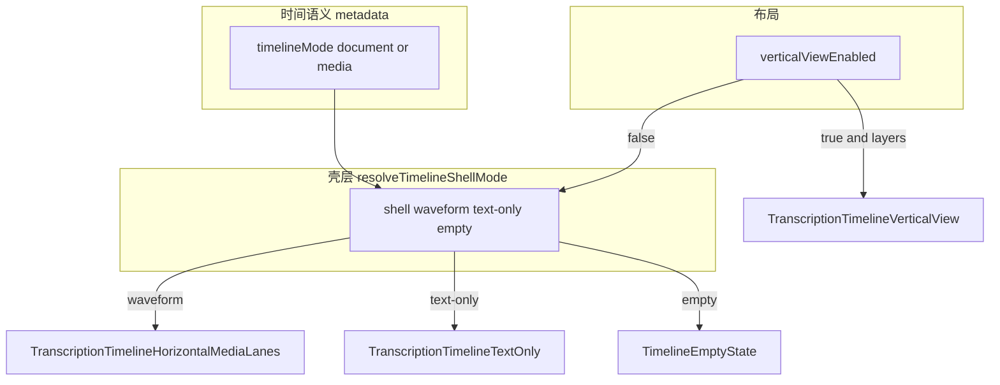
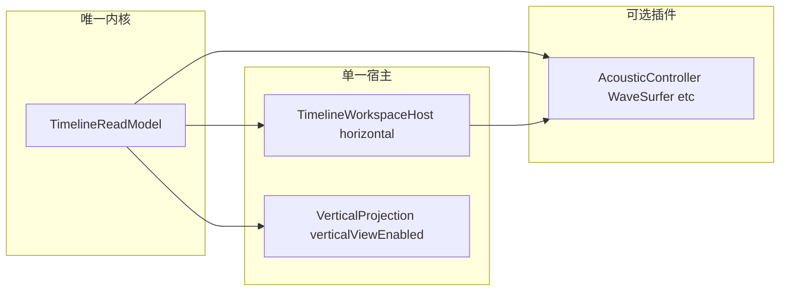

# 模式架构与平级评估（2026-04-21）

**状态**：执行规划草案（现状评估 + 渐进改进 + Greenfield 无兼容一步到位）  
**日期**：2026-04-21  
**放置**：本文件位于 [`docs/execution/plans/`](docs/execution/plans/)，符合仓库 [文档治理规则](.cursor/rules/jieyu-docs-governance.mdc)（执行规划不放 `~/.cursor/plans`）。

**概述**：现状 §1–§2；渐进 §3；Greenfield §5（含 §5.3 声学/AI 三态合同、§5.6 仓库核对易漏项：ReadyWorkspace 编排、useZoom 文献轴、轴状态条、工具栏 VAD 条件、Hub timeMapping、localContextTools null 语义、嵌入/RAG、审查 badge、VoiceAgent、协作、纵向 i18n/mutation）。

## 0. 执行跟踪（todos）

- [x] **greenfield-adr-freeze**：写 superseding ADR（或重写 0004）冻结单一真相——主存坐标、声学可选、timeMapping 规则、导出字段；明确废弃 `texts.metadata.timelineMode` 或降为纯导出标签。
- [x] **greenfield-read-model**：实现唯一 `TimelineReadModel`（层、语段、选中、缩放域、声学附件状态），Horizontal/Vertical 仅为同一模型的投影。
- [ ] **greenfield-unified-host**：新建唯一横向宿主（标尺+多轨+可选 AcousticStrip）；删除 `TranscriptionTimelineTextOnly` 与壳层 waveform/text-only 二选一。
- [ ] **greenfield-vertical-on-host**：`TranscriptionTimelineVerticalView` 消费同一 read model；移除「仅横向」能力与双份 props。
- [ ] **greenfield-db-export**：Dexie/schema 与 ELAN/Flex 等导出收束；新库单一起点 migration。
- [ ] **greenfield-delete-legacy**：删 legacy 文件与双轨测试；CI 防第二横向入口。
- [ ] **greenfield-acoustic-ai-contract**：§5.3 + §5.6 E——localContextTools 声学 tool 显式 unavailable、ProjectObserver 无波形策略、worldModelSnapshot 占位媒体分桶。
- [ ] **greenfield-ready-workspace-split**：§5.6 A/B/C——ReadyWorkspace props 瀑布、`useZoom` 文献轴、轴状态条、`AcousticSnapshot`、工具栏 autoSegment 与 `playableAcoustic` 对齐。
- [x] **i18n-key-fix**：将文档与实现中的过期键名统一为 `transcription.pairedReading.segmentMissingForSave`，移除 `transcription.comparison.segmentMissingForSave` 表述。
- [x] **timelineMode-decouple-matrix**：补齐 `timelineMode` 去运行时化迁移矩阵（读路径、写路径、cleanup、placeholder、import/export、axis/status）。
- [x] **local-tools-unavailable-contract**：`get_waveform_analysis` / `get_acoustic_summary` 无声学时返回结构化 unavailable，并让 summary 文案与结果一致。
- [x] **host-props-contract-split**：统一宿主改造时拆分 `HorizontalMediaLanesProps` 绑定关系；补 `workspace-vertical-view` 偏好迁移/重置策略。
- [x] **parity-matrix**（渐进备选）：统一宿主上的验收清单。
- [x] **naming-doc**：产品文案与 §5 新用户模型对齐。

---

# 纯文本 / 媒体 / 横向 / 纵向：架构是否清晰、是否已平级

## 1. 实际架构（三条轴，不要混成「四种平级模式」）

| 维度                     | 含义                                                   | 主要落点                                                                                                                                                                                                                                                                                                                                                           |
| ---------------------- | ---------------------------------------------------- | -------------------------------------------------------------------------------------------------------------------------------------------------------------------------------------------------------------------------------------------------------------------------------------------------------------------------------------------------------------- |
| **时间语义 / 项目类型**        | `document`（文献/逻辑秒为主）vs `media`（以声学时间轴为默认 1:1 语境）     | `[texts.metadata.timelineMode](src/hooks/useDialogs.ts)`（经 `resolveTimelineMode`）、`[docs/adr/0004-logical-timeline-acoustic-media-lifecycle.md](docs/adr/0004-logical-timeline-acoustic-media-lifecycle.md)`                                                                                                                                                   |
| **主时间轴 UI 壳**          | `waveform`（多轨 + 波形）vs `text-only`（文献轴虚拟滚动）vs `empty` | `[src/utils/timelineShellMode.ts](src/utils/timelineShellMode.ts)` 的 `resolveTimelineShellMode`                                                                                                                                                                                                                                                                |
| **工作区布局（产品文案里的横向/纵向）** | 横向 = 多轨时间轴编辑；纵向 = 双列对照                               | 左轨 [`SidePaneSidebar` 的 `workspaceTimelineLayout`](src/components/SidePaneSidebar.tsx)；主内容在 [`TranscriptionPage.TimelineContent.tsx`](src/pages/TranscriptionPage.TimelineContent.tsx) **优先**判断 `verticalViewEnabled`（与 `textOnlyProps` 同源），为真且有层时挂载 [`TranscriptionTimelineVerticalView`](src/components/TranscriptionTimelineVerticalView.tsx)，**不挂**横向多轨波形壳 |

**实现注**：纵向开启时 `resolveTimelineShellMode` 会先得到 `shell: 'text-only'`，但 [`TranscriptionPage.TimelineContent.tsx`](src/pages/TranscriptionPage.TimelineContent.tsx) 在渲染顺序上**先于**按 `shell` 分支，直接 `return` 纵向视图，因此不会误挂 `TranscriptionTimelineTextOnly`。

**结论（是否「清晰」）**：**概念上**团队在 ADR 与 `[timelineShellMode.ts](src/utils/timelineShellMode.ts)` 顶部注释里已经拆开；**产品语言上**「纯文本模式 / 媒体模式」和「横向 / 纵向」叠在一起时容易听起来像四个同级开关，需要心智模型：**先分「文献 vs 声学语义」再分「多轨 vs 对照」再分「此刻用波形壳还是文献壳」**。仓库里已有执行向文档讨论对照与多壳收口（例如 `[docs/execution/plans/对照与多壳时间轴段块统一收口规划-2026-04-19.md](docs/execution/plans/对照与多壳时间轴段块统一收口规划-2026-04-19.md)`）说明团队也承认**实现路径仍有多条**、需继续收口。

---

## 2. 「纯文本升级成与媒体平级、能力全覆盖」——**目前未做到**

**已对齐 / 共享的部分（说明不是完全从属关系）**

- 纵向视图与横向共享同一套 `textOnlyProps` 输入，主路由在 [`TranscriptionPage.TimelineContent.tsx`](src/pages/TranscriptionPage.TimelineContent.tsx)（`verticalViewEnabled` 时直接 `TranscriptionTimelineVerticalView`，与随后计算的 `shell === 'waveform'` 无关）。
- `TranscriptionTimelineTextOnly` 已承载大量与媒体轨同族的能力：多轨头、语段、翻译行、录音控件引用等（见 `[TranscriptionTimelineTextOnly.tsx](src/components/TranscriptionTimelineTextOnly.tsx)` 与对照侧透传注释）。
- ADR-0004 明确 `timelineMode` 与占位媒体、`logicalDurationSec`、`timeMapping` 的边界，文献项目可在无声学解码时仍编辑主存坐标。

**仍体现「非平级」或双轨差异的证据**

1. **主内容仍是两套大组件**：波形多轨 `[TranscriptionTimelineHorizontalMediaLanes.tsx](src/components/TranscriptionTimelineHorizontalMediaLanes.tsx)` 与文献轨 `[TranscriptionTimelineTextOnly.tsx](src/components/TranscriptionTimelineTextOnly.tsx)` 并行维护，props 大面积相似但并非单一宿主（纵向为第三条：`TranscriptionTimelineVerticalView`）。
2. **壳层选择依赖声学是否可播 + `timelineMode`**：例如 `timedMediaWithoutUrl` 仅在 `timelineMode === 'media'` 时把无 URL 情况仍视为可走 waveform 壳（[`timelineShellMode.ts` 第 37–46 行](src/utils/timelineShellMode.ts)）；`document` 路径默认更常落在 `text-only` 壳。
3. **产品文案仍提示能力边界**：如 i18n `[transcription.wave.emptyTextOnly](src/i18n/index.ts)`（纯文本下波形编辑需先导入媒体）、`[transcription.pairedReading.segmentMissingForSave](src/i18n/index.ts)` 引导回横向多轨完成对齐等——说明若干工作流仍以「媒体时间轴壳」为权威入口。
4. **纵向 UI 仍有「仅横向时间轴可用」的禁用项**：例如 `[useTranscriptionTimelineVerticalChrome.ts](src/hooks/useTranscriptionTimelineVerticalChrome.ts)` 中「显示层级关系」带 `horizontalOnlyMeta` 且 `disabled: true`。
5. **ADR 已记技术债**：[ADR-0004 决策 3](docs/adr/0004-logical-timeline-acoustic-media-lifecycle.md) 指出删音等路径上 `timelineMode` 与「再导音是否恢复 media」的**元数据对称**仍在收敛中——这与「两种模式完全平权、可逆切换」的目标一致，但说明**尚未收尾**。

---

## 3. 如何改进（分阶段、可落地）

改进目标可以拆成两条线：**让用户不再混淆**（沟通/产品）与 **让实现少分叉、能力可验收**（工程）。下面按投入从小到大排列。

### 3.1 短期：心智模型与文案（不改大架构也能明显变好）

- **固定入口讲清「三轴」**：在转写工作区选一处处始终可见或易发现的位置（空状态、项目 Hub、侧栏帮助链接）用**一张示意图或三句话**说明：`timelineMode`（文献秒 vs 声学语境）、壳（波形轨 vs 文献轨）、布局（多轨 vs 对照）。避免用户把「横向/纵向」当成 `document`/`media` 的别名。
- **统一用词**：落实或迭代 `[docs/execution/plans/纵横模式命名统一重命名方案-2026-04-21.md](docs/execution/plans/纵横模式命名统一重命名方案-2026-04-21.md)`，保证 i18n、Aria label、设置项里同一英文概念的中译一致。
- **「仅横向」菜单项**：对 `[useTranscriptionTimelineVerticalChrome.ts](src/hooks/useTranscriptionTimelineVerticalChrome.ts)` 等 `disabled: true` + `horizontalOnly` 的项，改为**显式说明**（例如「当前仅在多轨时间轴显示层级连线」）或「即将支持」，避免用户以为纵向模式是半成品却不知道为什么点不了。

### 3.2 中期：收口双轨、用矩阵驱动平级

- **先做能力矩阵再写代码**：用表格列出 `[TranscriptionTimelineHorizontalMediaLanes.tsx](src/components/TranscriptionTimelineHorizontalMediaLanes.tsx)`、`[TranscriptionTimelineTextOnly.tsx](src/components/TranscriptionTimelineTextOnly.tsx)`、`[TranscriptionTimelineVerticalView.tsx](src/components/TranscriptionTimelineVerticalView.tsx)` 在录音、拖建、层连接器、VAD、自动分句、保存与错误提示上的差异；每项标记「已实现 / 仅多轨 / 需 timeMapping」。矩阵即 backlog，也便于写 Vitest 门禁（与 `[对照与多壳时间轴段块统一收口规划-2026-04-19.md](docs/execution/plans/对照与多壳时间轴段块统一收口规划-2026-04-19.md)` 对齐）。
- **提炼共享 props / 小模块**：主内容区仍可有双壳，但把重复的 lane header、segment 列表迭代、键盘导航、保存反馈等抽到共享 hook 或小组件，降低「改了一轨忘了另一轨」的概率；[`TranscriptionPage.TimelineContent.tsx`](src/pages/TranscriptionPage.TimelineContent.tsx) 与 [`useTranscriptionTimelineContentViewModel.ts`](src/pages/useTranscriptionTimelineContentViewModel.ts) 侧尽量**单一构造路径**再拆给两壳。
- **i18n 与引导语**：把仍写死「请先到横向模式」的提示（如 `[transcription.pairedReading.segmentMissingForSave](src/i18n/index.ts)`）与矩阵联动——若文献壳已能完成同一操作，应改写为中性「多轨时间轴」或「时间轴编辑区」，避免暗示只有波形壳才算数。

### 3.3 长期：真平级（可选架构升级）

- **单一时间轴宿主 + 可插拔声学层**：理想形态是「一条 read model + 可选 WaveSurfer/播放器条」，文献标尺与缩放始终存在；`timelineMode` 主要约束**默认时间映射与导出声明**（与 [ADR-0004](docs/adr/0004-logical-timeline-acoustic-media-lifecycle.md) 一致），而不是决定挂哪棵完全不同的 React 子树。这是大改，应在矩阵把「高价值缺口」清完后再动。
- **ADR 决策 3 技术债闭环**：删音 / 再导音后 `timelineMode` 与占位媒体行为用状态机 + 测试锁死，保证 `document`↔`media` 切换可预测、可恢复，避免「名义平级、数据不对称」。

### 3.4 建议执行顺序（接续 backlog）

若已确认 **Greenfield、无兼容**，请**跳过本节顺序**，直接按 **§5 的 G0–G5** 与 frontmatter 中 `greenfield-`* todos 执行。

1. **能力矩阵（todo `parity-matrix`）**：先定验收范围，避免先做大型合并却说不清「平级」判据。
2. **文案与三轴说明（`naming-doc` + `clarify-user-model`）**：与矩阵同步，用户可见收益快。
3. **纵向「仅横向」项（`vertical-horizontal-only`）**：每项二选一——实现或明示限制，减少「灰掉无解释」。
4. **共享 props（`shared-timeline-props`）**：矩阵稳定后再动，降低双轨改动的回归面。
5. **ADR 对称性（`adr-timelinemode-symmetry`）**：与产品确认删音/再导音状态机后收口，依赖数据层测试多于 UI。

---

## 5. Greenfield：直接达成长期真平级（无历史数据、无向后兼容、不留 legacy）

**前提（你声明的约束）**：本地与协作环境均可清空或重建库；不迁移旧 `jieyu` 工程；不接受「旧项目仍能打开」；允许删文件、删迁移、删双轨测试。

**目标用户体验（单一心智模型）**：

- **始终只有一条「项目时间轴」**：[`layer_units` / segment 的 `startTime`/`endTime`](docs/adr/0004-logical-timeline-acoustic-media-lifecycle.md)（ADR-0004）为主存坐标；不存在「先进纯文本壳再切媒体壳」两套编辑器。
- **声学是可选附件**：有解码成功的媒体则显示波形/播放条并参与 seek；无媒体则 Acoustic 区域为空或折叠，**标尺与多轨编辑行为不变**（拖建、缩放、层连接器、录音等全部在同一宿主上实现一次）。
- **横向 / 纵向**：仅为**同一 read model 的两种布局投影**；纵向禁止再出现「仅横向可用」的灰菜单——要么实现，要么从产品删除该能力。
- **`document` / `media` 不再驱动 UI 分叉**：二选一方案（须写进新 ADR）：
  - **推荐**：废除 `texts.metadata.timelineMode` 作为运行时开关；若交换格式仍需要声明，则仅在**导出对话框**写入互操作字段，不参与 `resolveTimelineShellMode`。
  - **备选**：保留单一枚举，但只表示**导出/论文时间基**（如 `timebase: acoustic | manuscript`），与「是否显示波形」完全解耦；显示波形仅由「是否存在可播媒体」决定。

### 5.1 目标架构（示意）

- [`TranscriptionPage.TimelineContent.tsx`](src/pages/TranscriptionPage.TimelineContent.tsx)：缩为「空状态 | 有层时始终挂载 `TimelineWorkspaceHost`；`verticalViewEnabled` 时用 `VerticalProjection` 包裹同一子树或共享 context」，**删除** `shell === 'text-only'` 与 `TranscriptionTimelineTextOnly` 分支。
- [`resolveTimelineShellMode`](src/utils/timelineShellMode.ts)：Greenfield 下可删除或坍缩为「empty vs active」；**不再**用 `timelineMode` 与 `timedMediaWithoutUrl` 决定整页组件类型。

### 5.2 实施阶段（建议顺序）

| 阶段     | 内容                                                                                                                                        | 产出                                        |
| ------ | ----------------------------------------------------------------------------------------------------------------------------------------- | ----------------------------------------- |
| **G0** | 新 ADR 冻结数据与 UI 不变量；列出**删除清单**（文件、类型、i18n、迁移）                                                                                              | 评审通过的单一真相文档                               |
| **G1** | 实现 `TimelineReadModel` + 与 DB 的单向同步边界（无 UI 也可单测）                                                                                          | 与现 `useTimelineUnitViewIndex` 等能力对齐的只读模型  |
| **G2** | 新建 `TimelineWorkspaceHost`：标尺 + tier + lane 渲染**一套**；Acoustic 为子条/portal                                                                  | 横向路径上不再引用 `TranscriptionTimelineTextOnly` |
| **G3** | 纵向：`TranscriptionTimelineVerticalView` 改为只读同一 model + 共享 lane cell 组件                                                                     | 删除 `horizontalOnly` 禁用路径或实现等价功能           |
| **G4** | `LinguisticService` / import-export：按新 ADR 砍掉 `timelineMode` 分支与占位特殊路径中**仅为兼容**的部分                                                        | 新库从单一起点 migration 起                       |
| **G5** | 删除 legacy：`[TranscriptionTimelineTextOnly.tsx](src/components/TranscriptionTimelineTextOnly.tsx)`、旧壳测试、旧 i18n；CI 或 eslint 规则禁止再引入「第二横向入口」 | 全绿 vitest + 更小 bundle                     |

### 5.3 无宿主媒体时：声学分析、语音能力、AI 数据来源（必须在 Greenfield 中显式收口）

统一宿主**不等于**「所有功能在无媒体时仍可用」。做法是：**一条时间轴 + 可选声学插件**，并在产品与实现上固定**能力分级**与 **AI / 分析面板的输入合同**，避免出现第二套「假装有媒体」的壳。

**1）声学分析（波形、VAD、F0/强度 overlay、与解码时间锁定的可视化）**

- **依赖**：解码成功的宿主媒体与播放器时间轴（与现 [`TranscriptionPage.ReadyWorkspace.tsx`](src/pages/TranscriptionPage.ReadyWorkspace.tsx) 中 waveform / `acousticOverlay*` / `vad` 一类能力一致）。
- **无媒体时**：分析 Tab、overlay、自动分句等应统一走 **`AcousticController`（或等价）状态**：`playableAcoustic === false` 时 **隐藏或整块替换为说明卡**（「导入媒体后可进行声学分析」），**禁止**在无字节时仍跑依赖采样的管线（避免静默空结果或错误日志）。
- **Greenfield 要求**：声学分析 UI 只订阅**插件暴露的快照**（例如 `waveformAnalysis`、`acousticSummary` 的生成条件与现 `[buildTranscriptionAiPromptContext](src/pages/TranscriptionPage.aiPromptContext.ts)` 一致：**无输入则无字段**），不在 `TimelineWorkspaceHost` 各处散落 `if (url)`。

**2）语音相关功能（需细分「宿主媒体」vs「层上附属音」）**

- **绑定宿主媒体的**：逐句对齐播放、波形 scrub、（若有）基于宿主 wav 的 VAD/对齐建议 —— 无宿主媒体则与 **1）** 同样降级。
- **不依赖宿主媒体的**：例如**译文层本地录音**（现已有 translation recording / blob 路径）、纯文本层编辑、扬声器标签等 —— 必须在**统一宿主**上继续可用；其数据源是 **层单元 + attachment blob**，不是「整段宿主音频」。
- **Greenfield 要求**：在 ADR / 类型里把 **`AcousticAttachment`（宿主）** 与 **`LayerAudioAttachment`（层/句）** 分开；禁止再用 `timelineMode === 'document'` 作为「能不能录音」的隐含开关。

**3）AI 分析助手的数据来源（与现 `AiPromptContext` 对齐并收紧）**

现 `[buildTranscriptionAiPromptContext](src/pages/TranscriptionPage.aiPromptContext.ts)` 已体现分层（节选含义）：

- **始终可构造**：`currentMediaUnits`、`projectUnitsForTools`、`selectionSnapshot`、`layers`、`worldModelSnapshot` 等 —— 来自 **read model / 文本时间轴**，与是否有宿主媒体无关（「当前媒体」在无媒体时可退化为占位或无 `currentMediaId`，但 **单元列表仍应有**）。
- **仅在有声学管道时注入**：`waveformAnalysis`、`acousticSummary`、`audioTimeSec` 等 —— 与 **longTerm** 里条件展开一致；模型与 tool 侧应把这三类视为 **optional**，不得假设存在。
- **Greenfield 要求**：
  - 单一 `TimelineReadModel` 产出 **文本侧 world model**；声学插件产出 **声学侧 enrichments**；`[buildTranscriptionAiPromptContext](src/pages/TranscriptionPage.aiPromptContext.ts)`（或继任者）只做 **merge**，且单测覆盖「无媒体 / 有 URL 未解码 / 可播」三态。
  - 需要字节流的 tool（例如将来扩展的「按片段重听」）在 **无 `playableAcoustic`** 时返回结构化 **unsupported**，而不是读空缓冲。

**4）验收清单（建议写入 G0 ADR）**

- 无宿主媒体：时间轴编辑全绿；声学分析区与 AI `longTerm` 声学块缺失或显式 `unavailableReason`；语音类仅测「层录音」路径。
- 有宿主媒体未解码：loading / pending，与现 `acousticPending` 语义一致但不分叉整页组件。
- 可播：声学分析与 AI 声学块出现；seek 与文献时间映射仍遵守单一 `timeMapping` 规则。

### 5.4 刻意不做的事（避免假 Greenfield）

- **不做**「先抽 props 再慢慢合并」的无限期双轨（那是 §3 渐进路线）；Greenfield 以 **G2 宿主可直接删旧组件** 为里程碑。
- **不做**「无声学时隐藏多轨」——无声学时仍是同一宿主，仅 Acoustic 插件 idle。
- **不做**旧工程文件检测与自动升级脚本（无历史数据则不需要）。

### 5.5 与 §3 渐进路线的关系

- **无兼容需求时优先走 §5**：更快得到真平级与更小维护面。
- §3 的矩阵与文案 todo 在 Greenfield 中**收缩为**：统一宿主上的**功能验收清单**（仍建议保留，作为 G3/G5 的 checklist）；其中 **§5.3 的三态与 AI merge 规则** 为清单的硬门槛。

### 5.6 仓库代码 walk：相对 §5.3 / G2–G4 仍易遗漏的能力面

以下条目来自对当前实现的检索（**非穷举**，实施 G0 时应再扫一遍 `grep timelineMode|text-only|verticalView|resolveTimelineShell`）。

**A. ReadyWorkspace「大编排」与波形区稳定性**

- [`TranscriptionPage.ReadyWorkspace.tsx`](src/pages/TranscriptionPage.ReadyWorkspace.tsx) 通过 [`transcriptionReadyWorkspacePropsBuilders`](src/pages/transcriptionReadyWorkspacePropsBuilders.ts) 组装 **侧栏、波形区、时间轴 stage、overlay** 等多束 props；[`OrchestratorWaveformContent.tsx`](src/pages/OrchestratorWaveformContent.tsx) / [`TranscriptionTimelineSections.tsx`](src/components/transcription/TranscriptionTimelineSections.tsx) 含 **WaveSurfer DOM 稳定**（CSS `order` 等）约束。统一宿主时必须**一次性**规定「声学条与 tier 的 DOM 关系」，避免合并后 WaveSurfer 反复卸载。
- [`useZoom.ts`](src/hooks/useZoom.ts) 在**无 WaveSurfer** 时用 `logicalTimelineDurationSec` + `onLogicalTimelineScrollSync` 做文献轴缩放/平移；该逻辑今天主要服务 TextOnly 壳，Greenfield 应并入**标尺层**，而不是随 `TranscriptionTimelineTextOnly` 删除而丢失。

**B. 顶栏状态条与壳枚举的耦合**

- [`timelineAxisStatus.ts`](src/utils/timelineAxisStatus.ts) / [`useReadyWorkspaceAxisStatus.ts`](src/pages/useReadyWorkspaceAxisStatus.ts) / [`TimelineAxisStatusStrip`](src/components/transcription/TimelineAxisStatusStrip.tsx) 依赖 [`resolveTimelineShellMode`](src/utils/timelineShellMode.ts) 的 `acousticPending` 等。壳枚举删除后，应改为只读 **`AcousticSnapshot`**（解码中 / 无 URL / 可播），避免轴状态与「整页组件类型」再耦合。

**C. 工具栏与「有声学 URL」的硬条件**

- [`createTranscriptionToolbarProps`](src/pages/transcriptionToolbarProps.ts) 仅在 `selectedMediaUrl` 为真时挂载 `onAutoSegment`；VAD/自动分句与 **URL 存在**绑定，而非与 `playableAcoustic` 显式绑定。Greenfield 应统一为 **「声学插件 state === 可跑 VAD」** 才露出入口，并处理「有占位行但无 blob」的伪阳性。
- 播放、loop、波形样式、声学 overlay 等：无 `playableAcoustic` 时需统一 **disabled + 原因**（避免现成 UI 可点但无响应）。

**D. 项目 Hub / 文献↔声学时间映射 UI**

- [`LeftRailProjectHub.tsx`](src/components/transcription/LeftRailProjectHub.tsx) 含 **timeMapping 对话框、预览、回滚、与声学源不一致提示**；i18n 如 `transcription.projectHub.exchange.logicalTimelineHint` 仍绑定「text-only 心智」。元数据收缩后，要指定这些 UI **迁到何处**（项目设置 / Hub / 导出向导）以及是否仍需要 `logicalDurationSec` 作为**纯标尺上限**。

**E. AI：local tools 与 Observer 的「缺省 null」语义**

- [`localContextTools.ts`](src/ai/chat/localContextTools.ts) 中 `get_waveform_analysis` / `get_acoustic_summary` 在无数据时返回 **`null`**（见 `context.longTerm?.… ?? null`）。建议在 Greenfield 中改为结构化 **`{ ok: false, reason: 'no_playable_media' }`**（或等价），以免模型把 `null` 误读成「无问题」。
- `localContextTools` 的 summarize 文案目前会在无数据时仍输出“已读取”式成功句；`local-tools-unavailable-contract` 需一并收口结果结构与自然语言摘要，避免语义不一致。
- [`ProjectObserver.ts`](src/ai/ProjectObserver.ts)、[`intentTools.ts`](src/ai/chat/intentTools.ts) 可选消费 `waveformSignals` / `waveformAnalysis`；无宿主媒体时路径已部分退化，**须在 ADR 写明「无信号时的评分与推荐策略」**，避免静默 0 分误导。
- [`worldModelSnapshot.ts`](src/ai/chat/worldModelSnapshot.ts) 按 `mediaId` 分桶列举单元；占位媒体 / 无 `currentMediaId` 时排序与标签行为需单测保留。

**K. `timelineMode` 去运行时化的影响面矩阵（新增）**

- 当前 `timelineMode` 已贯穿 UI 选择、数据写入与清理、互操作导入导出、状态条提示；执行 `greenfield-db-export` 前需按下表拆迁：

| 面向 | 现状锚点 | Greenfield 迁移动作 | 回归门禁 |
| --- | --- | --- | --- |
| 读路径（UI/状态） | `useDialogs.resolveTimelineMode`、`TranscriptionPage.TimelineContent`、`timelineShellMode`、`useReadyWorkspaceAxisStatus` | 移除 `timelineMode` 对壳层分支的运行时决策，仅保留 `AcousticSnapshot`（有无可播媒体、解码状态）驱动 UI；`timelineMode` 仅作为导出标签来源。 | `timelineShellMode.test.ts` 改为不依赖 `timelineMode` 分支；`TranscriptionPage.TimelineContent.test.tsx` 保证无 `timelineMode` 也可渲染主宿主。 |
| 写路径（业务写入） | `LinguisticService`（`importAudio/deleteAudio/setup` 路径） | 去除运行时行为对 `timelineMode` 的依赖；写入层仅维护逻辑轴所需元数据（如 `logicalDurationSec`），导出时再注入互操作标签。 | `LinguisticService.test.ts` 保留删音/再导音可编辑性与逻辑轴连续性断言；新增“无 timelineMode 仍可全流程编辑”断言。 |
| cleanup / 对称恢复 | `LinguisticService.cleanup.ts`（preserve timelineMode / placeholder 细节） | 将“恢复策略”从 `timelineMode` 转为“是否存在可播媒体 + 逻辑轴长度”的显式状态机；去掉基于 mode 字段的隐式分支。 | cleanup 回归：删除媒体后可继续编辑；重新导入后声学能力恢复但不改变主存坐标。 |
| placeholder 语义 | `mediaItemTimelineKind.ts`、`useTranscriptionProjectMediaController*` | placeholder 判定不再读取 `timelineMode==='document'`，改为专用占位标记（如 `timelineKind` / `placeholder`）。 | `mediaItemTimelineKind.test.ts` 与 project setup 测试改为断言占位标记，不再断言 timelineMode。 |
| import / export | `useImportExport`、`EafService`、`FlexService`、`TextGridService`、`TranscriberService`、`ToolboxService` | 保留互操作字段写出能力（兼容 ELAN/Flex/TextGrid/TRS/Toolbox），但字段来源改为“导出上下文标签”，而非 UI 运行态开关。 | 各服务导入导出测试保留 `timelineMetadata` roundtrip；新增“运行时无 timelineMode 仍可导出带标签”测试。 |
| axis / status 文案 | `timelineAxisStatus.ts`、`TimelineAxisStatusStrip.tsx`、`i18n/timelineLaneHeaderMessages.ts` | 轴状态由 `AcousticSnapshot` + `logicalDurationSec` 驱动；`timelineMode` 文案降级为导出说明/项目信息，不再参与壳层提示。 | `timelineAxisStatus.test.ts`/`TimelineAxisStatusStrip.test.tsx` 覆盖 no media / pending / playable 三态且不依赖 mode。 |

- 执行顺序：先收口 **placeholder 与 axis/status**（低风险 UI 侧）→ 再收口 **读写路径** → 最后收口 **import/export 标签来源**，避免一次性改动过大。

**L. 统一宿主下类型合同与布局偏好迁移（新增）**

- `transcriptionReadyWorkspacePropsBuilders` 目前以 `HorizontalMediaLanesProps` 为共享字段母类型；`greenfield-unified-host` 落地时需先拆出宿主无关的共享合同，再由横向/纵向投影各自补充差异字段。
- `workspace-vertical-view` 当前是持久化布局偏好；切换到单宿主后需明确「沿用、迁移还是重置」以及对应的首启行为，避免用户进入新架构后出现布局错配。

| 合同层 | 现状锚点 | 拆分后目标合同 | 迁移门禁 |
| --- | --- | --- | --- |
| 共享 lane 基础字段 | `transcriptionReadyWorkspacePropsBuilders.ts` 的 `BuildSharedLanePropsInput = SharedLaneFields & ...`，`SharedLaneFields` 来源于 `HorizontalMediaLanesProps` | 新建 `TimelineHostSharedProps`（与宿主无关：层列表、语段读写、连接器、录音入口、speaker 过滤、displayStyleControl） | `useReadyWorkspaceViewModels` 与 `TranscriptionPage.TimelineContent` 类型检查通过，且不再 import `HorizontalMediaLanesProps` 作为共享母类型。 |
| 横向专属字段 | `zoomPxPerSec`、`lassoRect`、`timelineRenderUnits`、`renderAnnotationItem` 等当前混入 orchestrator 输入 | 新建 `HorizontalProjectionProps`，仅挂在 Horizontal projection；共享宿主不再直接依赖这些字段 | `TranscriptionPage.TimelineContent.test.tsx`：vertical 打开时不要求横向专属 props 仍可渲染。 |
| 纵向专属字段 | `verticalViewEnabled`、`verticalPaneFocus`、`updateVerticalPaneFocus` 当前通过 textOnlyProps 透传 | 新建 `VerticalProjectionProps`，与 shared props 并列输入；去掉“借道 textOnlyProps”的耦合 | `useTranscriptionTimelineContentViewModel.test.tsx`：vertical 开关与焦点行为在拆分后语义保持。 |
| 布局偏好存储 | `WORKSPACE_VERTICAL_VIEW_KEY = 'jieyu:workspace-vertical-view'`（`useTranscriptionWorkspaceLayoutController.ts`） | 保留键名一版兼容读取，新增 `workspaceLayoutVersion=2` 写回策略：首次进入新宿主时规范化一次并记录版本 | `useTranscriptionWorkspaceLayoutController.test.tsx`：旧键值 `0/1` 升级后行为不变；无值时默认策略可预测。 |

- 推荐迁移策略：
  1. 第一阶段仅做类型拆分与适配层，不改运行时行为。
  2. 第二阶段把 vertical 专属字段从 `textOnlyPropsInput` 迁出为独立 projection 输入。
  3. 第三阶段执行偏好键规范化与版本化写回，保留旧值读取一周迭代周期。

### 5.7 parity-matrix（统一宿主验收清单）

| 能力 | Horizontal（现状） | Text-only（现状） | Vertical（现状） | 统一宿主目标 | 验收门禁 |
| --- | --- | --- | --- | --- | --- |
| 语段读写（转写/翻译） | 已实现 | 已实现 | 已实现（含保存失败提示） | 单一 mutation dispatch 路径 | `TranscriptionTimelineVerticalView.test.tsx` + `TranscriptionTimelineHorizontalMediaLanes.test.tsx` 关键保存用例全绿。 |
| 层连接器显示 | 已实现 | 有限 | 禁用（horizontalOnly） | vertical 等价实现或从产品能力下线 | `useTranscriptionTimelineVerticalChrome` 相关菜单测试不再出现“无解释禁用”。 |
| 声学相关（波形/overlay/VAD） | 已实现 | 降级 | 降级 | 统一由 `AcousticSnapshot` 驱动展示/禁用态 | no media / pending / playable 三态 UI 快照测试通过。 |
| 缩放与滚动 | 已实现 | 已实现（逻辑轴） | 已实现（对照滚动） | 统一标尺策略，缩放源头唯一 | `useZoom` 与 timeline content 回归测试通过。 |
| 录音与音频附件 | 已实现 | 已实现（层录音） | 已实现（继承 textOnly 输入） | 区分宿主声学与层附件，统一入口 | 录音相关现有测试全绿，且无 `timelineMode` 隐式门控。 |
| 空状态与引导语 | 已实现 | 已实现 | 已实现 | 文案统一到“时间轴编辑区”心智 | i18n key 与 UI 快照不再出现冲突术语。 |

### 5.8 naming-doc（术语与文案对齐）

对齐原则：避免把“时间语义（document/media）”与“布局（horizontal/vertical）”混称为同级模式。

| 内部概念 | 用户可见主文案 | 允许别名（仅说明） | 禁用文案 |
| --- | --- | --- | --- |
| `timelineMode=document` | 文献时间基（逻辑时间轴） | 纯文本时间基 | 纯文本模式（会与 UI 壳混淆） |
| `timelineMode=media` | 声学时间基 | 媒体时间基 | 波形模式（会与布局混淆） |
| `horizontal` 布局 | 多轨时间轴 | 横向对齐编辑 | 媒体模式 |
| `vertical` 布局 | 双列对照 | 纵向对照阅读 | 纯文本模式 |
| shell=`waveform/text-only/empty` | 时间轴显示状态 | 壳层状态 | 第 N 种模式 |

- UI 统一替换建议（面向后续实现）：
  1. 保留 `transcription.wave.emptyTextOnly` 语义，但在帮助文案增加“与布局无关”的说明。
  2. `transcription.pairedReading.segmentMissingForSave` 的中文文案从“横向模式（多轨编辑）”演进为“多轨时间轴编辑区”。
  3. 侧栏 `workspaceTimelineLayout` 文案统一使用“多轨时间轴 / 双列对照”。

**F. 嵌入与 PDF（与宿主声学正交）**

- [`EmbeddingService`](src/ai/embeddings/EmbeddingService.ts)、[`pdfTextUtils`](src/ai/embeddings/pdfTextUtils.ts) 等走 **独立 `mediaId`/文档源**；Greenfield 合并转写宿主**不应**破坏「项目内多附件」模型；验收时单列 **RAG 源不依赖 WaveSurfer**。

**G. 语音智能体（VoiceAgent）**

- [`VoiceAgentGroundingContext.ts`](src/services/VoiceAgentGroundingContext.ts) 等以 **corpus / segment** 为主，**不必然**读取宿主音频字节；但 dictation/analysis 模式若将来绑定播放，需与 **§5.3 声学插件** 对齐，避免第二条播放管道。

**H. 审查队列与波形 overlay**

- 工具栏 [`TranscriptionPage.Toolbar.tsx`](src/pages/TranscriptionPage.Toolbar.tsx) 中的 `lowConfidenceCount` / `reviewIssueCount` 与 [`OrchestratorWaveformContent.tsx`](src/pages/OrchestratorWaveformContent.tsx) 低置信 overlay 强相关；无波形时计数来源与展示策略要在统一宿主里重新定义（可恒为 0 + 隐藏 badge，或改为纯文本规则）。

**I. 协作与只读**

- [`CollaborationCloudReadOnlyBanner`](src/components/transcription/CollaborationCloudReadOnlyBanner.tsx) 等与壳弱相关，但 G5 大删时需保留 **协作只读 / guard** 回归场景，避免误删。

**J. 纵向视图业务与 i18n**

- [`TranscriptionTimelineVerticalView`](src/components/TranscriptionTimelineVerticalView.tsx) 与 **bundle 过滤、保存失败提示**（如 `transcription.pairedReading.segmentMissingForSave`）仍假设用户理解「横向多轨」；宿主统一后应改写为 **「时间轴编辑区」** 或等价中性词，并核对 **mutation 分发**（[`timelineUnitMutationDispatch`](src/pages/timelineUnitMutationDispatch.ts) 等）在纵向是否仍走同一 dispatcher。

---

## 6. 结论摘要

1. **架构是否清晰？** 在代码/ADR 层面相对清晰（现状为三轴分叉）；在 Greenfield 目标下应收敛为 **read model + 布局投影 + 可选声学** 两轴半，见 §5。
2. **纯文本与媒体是否已 UI 平级？** **没有**（现状见 §2）；无兼容包袱时应走 §5 **删除双壳**，而不是长期维持 `TextOnly` 与 `HorizontalMediaLanes` 并行。
3. **无历史数据、一步到位？** **按 §5 的 G0–G5**：新 ADR 冻结 → `TimelineReadModel` → `TimelineWorkspaceHost` → 纵向改投影 → 数据层/导出收束 → 删 legacy 与旧测试；执行跟踪以 **§0** 中 `greenfield-*` 为主链；**§5.6** 为代码库核对出的易漏清单（编排层、Hub、AI tools、嵌入、审查、协作）。

---

## 7. 执行记录

- 2026-04-21：完成 `i18n-key-fix`。全仓检索确认不存在 `transcription.comparison.segmentMissingForSave` 残留引用；运行态与文档统一为 `transcription.pairedReading.segmentMissingForSave`。
- 2026-04-21：完成 `timelineMode-decouple-matrix`。已补齐读路径、写路径、cleanup、placeholder、import/export、axis/status 六类迁移矩阵与对应测试门禁。
- 2026-04-21：完成 `local-tools-unavailable-contract`。`get_waveform_analysis` / `get_acoustic_summary` 在无可播媒体时返回结构化 `{ ok: false, reason: 'no_playable_media' }`，并同步摘要文案；定向测试 `localContextTools.test.ts`、`aiArchitectureIntegration.test.ts` 全绿。
- 2026-04-21：完成 `host-props-contract-split`。补齐 shared/horizontal/vertical 三层合同拆分表，明确 `workspace-vertical-view` 偏好迁移与版本化写回策略。
- 2026-04-21：完成 `parity-matrix` 与 `naming-doc`。新增统一宿主验收矩阵与术语映射表，形成后续 UI 文案与能力验收的单一依据。
- 2026-04-21：完成 `greenfield-adr-freeze`。新增 superseding ADR：`docs/adr/0009-greenfield-timeline-single-source-freeze.md`，冻结“主存坐标单一真相 + 声学可选 + timeMapping 唯一换算 + timelineMode 降级为导出标签”的基准。
- 2026-04-21：完成 `greenfield-read-model`。新增 `src/pages/timelineReadModel.ts` 与 `timelineReadModel.test.ts`，并在 `TranscriptionPage.ReadyWorkspace` 侧将 `timelineReadModelEpoch` 接到统一 read model；定向测试 `timelineReadModel.test.ts` + `TranscriptionPage.structure.test.ts` 全绿。
- 2026-04-21：推进 `greenfield-unified-host`（进行中）。新增 `src/pages/TranscriptionTimelineWorkspaceHost.tsx` 统一承载 waveform/text-only/empty 分发，并将 `TranscriptionPage.TimelineContent` 路由委托给该宿主；补 `TranscriptionTimelineWorkspaceHost.test.tsx`，并通过 `TimelineContent`/`layoutGuard` 定向回归。
- 2026-04-21：推进 `greenfield-vertical-on-host`（进行中）。将纵向优先渲染分支迁入 `TranscriptionTimelineWorkspaceHost`（新增 `verticalComparisonEnabled` 合同），`TranscriptionPage.TimelineContent` 不再本地分支渲染 Vertical；补充宿主 vertical 优先测试，`WorkspaceHost`/`TimelineContent`/`layoutGuard` 定向回归全绿。
- 2026-04-21：推进 `greenfield-host-contract-split`（进行中）。`TranscriptionPageTimelineContentProps` 新增显式 `verticalComparisonEnabled`，由 `useTranscriptionTimelineContentViewModel` 统一计算（含 effectiveLayersCount 兜底）后下发，`TimelineContent` 不再直接读取 `textOnlyProps.verticalViewEnabled` 作为宿主路由条件；补齐 view-model 断言并通过 `structure` + `timeline content/workspace host` 定向回归。
- 2026-04-21：继续推进 `greenfield-host-contract-split`（进行中）。`TimelineContent` 的 shell 与 acousticPending 计算迁移到 `useTranscriptionTimelineContentViewModel`，改为显式下发 `workspaceShell` / `workspaceAcousticPending`；`TimelineContent` 收敛为纯宿主渲染委托。定向回归：`useTranscriptionTimelineContentViewModel`、`TimelineContent`、`WorkspaceHost`、`structure`、`layoutGuard` 全绿（56 tests passed）。

