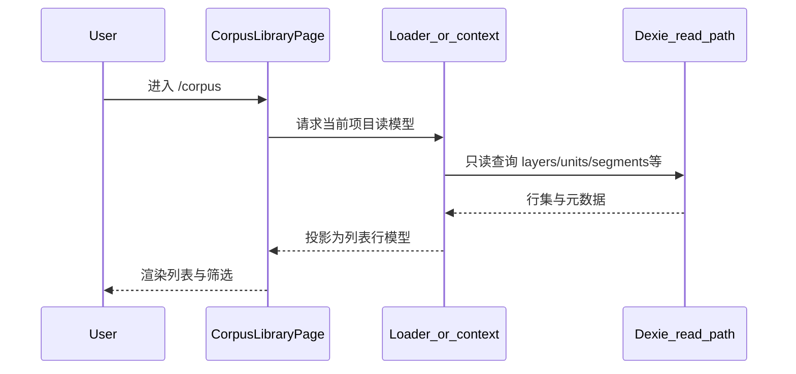

# 语料库页面开发路线图（2026-04-22）

**说明**：本文件为 **`/corpus` 语料库工作台** 的专题执行路线图；**不替代** 仓库内写作母版、标注/词典路线图或 ADR 正文。与邻域职责、联评闸口、工程闸门见 **§0** 与 **§7–§8**。若与 `docs/architecture/` 或代码冲突，以 **架构摘录 + 代码** 为运行时事实。

---

## 0. 阅读地图与对外锚点（稳定引用）

| 读者目的 | 阅读段落 |
|----------|----------|
| 路由、壳层、导航与全产品五板块关系 | **§1–§2** |
| 语料库宪章、规划顺序、成熟分层参照 | **§4** |
| 读模型档位、Dexie 只读链、**刷新粒度（与标注 §4.2.1 对齐）** | **§5.1–§5.2.1** |
| 工作集、出站最小字段、深链 **R6** | **§5.3–§5.5** |
| 页内 A–E 分区 | **§6** |
| 与标注/词典/分析的硬边界与 **R1–R8 联评** | **§7** |
| **P0–P3 分期**、**工程闸门 / Spike / 互操作口径** | **§8**（含 **§8.2 导出分轨**） |
| 实现检索入口 | **§9** |
| 交叉阅读索引 | **§10** |

**跨文档固定锚点**（其他计划书引用时勿改编号）：**§5.2.1**（刷新）、**§5.3–§5.5**（工作集 / 出站 / 深链）、**§7**（邻域）、**§8.2**（导出与标准格式口径）、**§10**（延伸阅读）。

---

## 1. 页面定义

| 项 | 约定 |
|----|------|
| **产品名** | 语料库（Corpus library） |
| **主路由** | `/corpus` |
| **兼容** | 历史书签 `/writing` → **`/corpus`** 重定向（以 `src/App.tsx` 为准） |
| **壳组件** | `CorpusLibraryPage`（占位阶段：`FeatureAvailabilityPanel`） |
| **i18n 前缀（占位）** | `workspace.corpus.unavailable.*`、`app.nav.corpus` |

---

## 2. 主导航：五大板块（产品级信息架构）

**工作台核心导航**固定为五块，**顺序与** `src/App.tsx` 中 `navGroups` → `workspace-core` → `items` **一致**（从左到右 / 从上到下以壳层实现为准）：

| 顺序 | 板块 | 路由 | 角色（一句话） |
|:----:|------|------|----------------|
| 1 | **转写** | `/transcription` | **宿主工作台**：媒体与时间轴、语段编辑、层链与主链写库 |
| 2 | **标注** | `/annotation` | **分层语言学标注**与写库能力（当前多为占位，演进见标注路线图） |
| 3 | **词典** | `/lexicon` | **项目词典**（`lexemes` 等）与 FLEx 向导出；与语料页「术语备忘」分轨 |
| 4 | **语料** | `/corpus` | **集选、预览、出站**与外软桥接；只读为主，不写第二套正文真源 |
| 5 | **分析** | `/analysis` | **统计、质量与洞察**（当前多为占位，演进独立验收） |

**层级提醒**：本节是 **全产品主导导航**；**§6** 仅约束 **`/corpus` 页内** A–E 子分区，二者勿混谈。

---

## 3. 用户价值（一句话）

在转写 / 田野语境下，让用户 **在同一站内完成「找语料 → 对照术语备忘 → 必要时短稿 → 复制或导出到外软」**，减少切应用与复制丢失元数据；**不**承担通用排版字处理器或 **项目语言学词典** 的全量编辑真值。

---

## 4. 规划入手：成熟模式与设计原则

在动线框与组件树之前，对齐学界常见的 **语料库分层**，并写下本页 **宪章**，避免与转写宿主、标注、词典抢真源。

### 4.1 成熟语料库常见分层（参照模式，非对标单一产品）

| 分层 | 典型职责 | 在本路线图的对应带 |
|------|-----------|-------------------|
| **Inventory / 目录** | 媒体、会话、文件级元数据；稳定 id | 项目 + 媒体维度；为筛选与出站提供 **上下文** |
| **Concordance / 查询与集选** | 命中列表、facet、**工作集（basket）** | **§6 · A** 与 **§5.3** |
| **Annotation / Lexicon** | 分层标注、词条生命周期、词典导出 | **显式非 `/corpus` 页主责**（见 **§7** 与 **§2** 标注/词典板块） |
| **Export + citation** | 片段出站、可复现引用、悬空策略 | **§6 · E**；与 **ADR 0011**、`corpusRef` / Resolver 同轨 |
| **Tools / adapters** | 统计、NLP、LLM；对「工作集」只读或受控写回 | **§6 · D**；**默认复制优先、不写回转写** |

### 4.2 语料库宪章（本页约束，违反须 ADR 或改本路线图）

1. **单一真源**：语段正文与层语言学数据仍以 **转写 / 标注宿主** 为写库真源；语料库为 **读模型 + 集选 + 出站**，禁止静默新增第三套可编辑正文真源。  
2. **标识稳定**：出站与 AI 上下文使用 **与宿主一致的 unit / segment / 层 / 时间语义**；对外引用形状与 **Resolver 公开面** 对齐，**禁止**页面级依赖 `TranscriptionPage.citationJump.ts` 式编排（与 **ADR 0011** 精神一致）。  
3. **职责分离**：不在语料库承担 **项目词典 CRUD**、**FLEx 全量词典导出**、**多实例层编辑器**；需编辑则 **深链** **§2** 所列 **词典** / **标注** / **转写** 板块。  
4. **出站可诊断**：剪贴板 / 下载失败须有 **错误码 + i18n**，与 `workspace.corpus.*`（及后续扩展键）同轨。  
5. **渐进交付**：**P0** 以 **只读列表 + 多选 + `text/plain`（及简单 md）** 为最小闭环；**P1+** 再扩 HTML 剪贴板、bundle、短稿与智能体窄适配器；**标准交换格式**走 **§8.1 / §8.2**，与词典侧导出 **分轨**。

### 4.3 推荐规划顺序（先于 UI）

| 顺序 | 规划产出 | 目的 |
|------|-----------|------|
| 1 | **读模型从哪来**（单宿主投影 vs 跨媒体聚合） | 定首屏数据范围与性能预算 |
| 2 | **工作集与选择语义**（与转写 `selectedUnitIds` 同源或隔离） | 避免双轨选择漂移 |
| 3 | **出站最小载荷**（字段表 + 文本模板） | P0 可测、可对接 Resolver |
| 4 | **与词典 / 标注 / AI 的接口**（只读摘要 vs 写动作入口） | 落实 **§7** 与工具注册分区；跨页上下文落实 **[标注页与词典页开发路线图 · §1.5 R8](./标注页与词典页开发路线图-2026-04-22.md)** |
| 5 | 信息架构线框与组件拆分 | 在 **§6** 页内分区上落地 |

---

## 5. 数据流与工作集

本节把 **「打开语料库 → 看到列表 → 多选 → 出站」** 写成可评审的逻辑序列，并固定 **工作集** 概念，供实现 PR 对照。

### 5.1 读模型：两种产品档位（实现前须二选一或分阶段）

| 档位 | 含义 | 工程影响（方向性） |
|------|------|---------------------|
| **MVP-A：转写读模型的另一视图** | 依赖当前宿主上下文（当前媒体 / 当前层链），列表与筛选语义与转写侧栏 **同源或子集** | 复用现有 snapshot / segment 列表思路；**不**承诺跨媒体一次查全库 |
| **MVP-B：项目级语料索引** | 跨媒体、可重建索引的「语料库专用投影」 | 需单独索引或查询层、分页与一致性策略；**工作量大**，建议在 MVP-A 稳定后再立项 |

**默认建议**：以 **MVP-A** 为 P0–P1 默认叙事，在 PR 或 ADR 中明确；MVP-B 作为可选里程碑单独立项。

### 5.2 逻辑数据流（打开项目 → 首屏）

具体表名与 hook 名称以 **`docs/architecture/` + 代码** 为准；本图仅表达 **只读链**。

### 5.2.1 刷新粒度契约（与标注 / 词典对齐）

语料库（**只读**）触发的读模型刷新，须与 **[标注页与词典页开发路线图](./标注页与词典页开发路线图-2026-04-22.md) · §4.2.1** 使用 **同一最小粒度**（默认 **unitId**；若 PR 约定更细粒度，须 **三页联评** 书面定案）。**禁止**以「整页重拉」为默认路径替代 unit 级增量。只读刷新 **不得**进入写库队列；**不得**作为第二触发源 **覆盖** 转写 / 标注侧 **未提交草稿**（冲突与草稿仍走既有票据与 **§4.2.1** 所述策略）。**M0** 须将本侧事件名 / payload 写入该文档的 **跨页同步事件表**（见该文档 **M0 交付第 5 条**）。

### 5.3 工作集（basket）与选择语义

| 决策点 | 选项 | 说明 |
|--------|------|------|
| **与转写选择是否同源** | **同源**：语料库多选即（或镜像）`selectedUnitIds` | 深链回波形/时间轴体验一致；须处理「用户未打开转写」时的降级 |
| | **隔离**：语料库维护本地 `corpusBasket` | 不干扰转写选择；须提供「在转写中打开」深链 |
| **清空与失焦** | 切换媒体 / 切换项目 | 工作集是否清空须在 UX 与 PR 中写明，避免幽灵引用 |

**跨页上下文（联评 R8）**：须在 **Router 会话状态或 URL state** 中统一约定键名（如 `lexiconReturn`、`corpusBasket` 等，**实现 PR 定稿**），使 **转写 `selectedUnitIds`、语料工作集、词典列表排序 / 滚动 / 选中** 在 **三页与转写** 往返后 **可预测、可验收**；与 **[标注页与词典页开发路线图](./标注页与词典页开发路线图-2026-04-22.md) · §6.1 P1**（「返回词典保留上下文」）须 **同一联评批次**验收。

**出站动作**只消费 **当前工作集** + ** Resolver 认可的引用形状**；不在此重复 ADR 正文。

### 5.4 出站最小字段（P0 建议列，可增不可随意删）

| 字段 | 用途 |
|------|------|
| 项目 id / 名称 | 人类可读出处 |
| 媒体 id / 文件名 | 音频/文献来源 |
| unit id（及必要时 segment id） | 机器可追溯 |
| 层 id / 层类型 | 区分转写/译文等 |
| 起止时间码（宿主语义） | 与播放器/导出一致 |
| 展示用文本片段 | 剪贴板正文来源 |

与 **`corpusRef`** 字段对齐工作放在 **Resolver / ADR 0011** 迭代中完成，本表为 **产品侧最小集合**。

### 5.5 三页共享：深链与引用形状（联评 R6）

深链 query（`unitId`、`layer`、`lexemeId`、媒体 id 等）与上表字段须 **与标注 / 词典 / 转写互跳 URL 合同一致**，避免同一对象多套 query 语义。合入前按 **[标注页与词典页开发路线图 · §1.5 R6](./标注页与词典页开发路线图-2026-04-22.md)** 勾选；**Resolver 公开面** 为 **机器侧** 权威形状时，以 **ADR 0011** 与实现为准。

---

## 6. 信息架构（语料库页内分区 A–E）

本节的 **A–E** 仅描述 **`/corpus` 页面内部** 子区，与 **§2 五大板块**（主导航）层级不同。

| 分区 | 任务 | 数据 / 行为口径（实现时对齐架构） |
|------|------|-----------------------------------|
| **A · 语料** | 检索、筛选、预览、多选、元数据展示 | 只读为主；写回转写须走既有事务与宿主动作 |
| **B · 术语备忘** | 田野代码、术语表、可选缩写速查 | **非** `lexemes` 全生命周期编辑；与 **§2 · 词典** 板块职责分离 |
| **C · 短稿** | 字段笔记、语例旁注、小段 md | 软上限；长文真值默认外软 |
| **D · 智能体** | 摘要、对比、扩写 | 复用既有 `useAiChat` / 工具链；复制优先、默认不写回转写正文 |
| **E · 出站** | 多 MIME 剪贴板、可选 bundle | 与错误码、白名单 HTML 策略同既有写作域规划精神 |

---

## 7. 与邻域的硬边界（防重复）

- **标注板块（`/annotation`）**：分层写库、多实例层、POS/gloss/morph 等 **不在** 语料库复制一套编辑器；需改层数据应 **深链** 标注或转写宿主。  
- **词典板块（`/lexicon`）**：`lexemes`、义项、词形、FLEx 类导出 **不在** 语料库承担；术语备忘与「项目词典」在文案与入口上 **分轨**。  
- **分析板块（`/analysis`）**：全量统计仪表盘、质量模型真值 **不作为** 语料库 P0–P1 必交付；语料库侧重 **集选出站**，与 **§2 · 分析** 的边界在实现 PR 中写清。  
- **书目 / `bibliographic_sources`**：本路线图 **默认不包含** 参考文献工作流（若产品日后扩展，须单独 ADR/计划）。

**三页里程碑联评**：凡触及上述边界或 **§5** 数据流（跨页、出站、只读词条、AI 工具、**跨页上下文**），合入前须按 **[标注页与词典页开发路线图 · §1.5](./标注页与词典页开发路线图-2026-04-22.md)** 的 **联评清单（R1–R8）** 勾选或注明 N/A，与 **§1.4** 防重复表同批审阅。

---

## 8. 分期、验收与工程闸门

### 8.0 分期表（本路线图专用）

| 阶段 | 交付 | 最小验收 |
|------|------|----------|
| **P0** | A + E：多选语料 → 纯文本 / md 复制 + 可追溯元数据 | 至少两款目标外软 fixture 粘贴通过 |
| **P1** | B 只读或轻编辑 + HTML 剪贴板 + 错误提示 | 空选、超长、剪贴板失败可诊断 |
| **P2** | D + C 最小面（textarea 或小型 CM6） | 工具可审计；无静默写转写 |
| **P3（可选）** | bundle 导出 | 与导出/安全白名单同 PR 评审 |

**开放门槛**：与 `docs/execution/plans/独立工作台开放门槛与复用边界-2026-03-30.md` 中各工作台 **go 条件**对齐时，将本路线图 P0–P2 **勾成可测清单** 即可；**不在此文件修改** 门槛正文。

### 8.1 工程闸门与演进主轴（执行化）

下列条款为 **P0–P3 之上** 的横向约束；**入级 Spike / 新依赖**须满足 **量化触发条件**（Spike PR 填入实测基线与阈值），避免「为技术而技术」。

| 议题 | 一期执行策略 | 阶段与验收 |
|------|--------------|------------|
| **跨层检索性能（Concordance）** | 保持 **MVP-A + Dexie 只读链** 为 P0–P1 默认，**不**在一期前置替换底层检索引擎；设 **P2+ 时间盒 Spike**，候选：**SQLite-WASM + FTS5**、**Tantivy WASM**（可叠 **OPFS** 作缓存层，非一期阻塞）。 | **进入 Spike 的前置（示例，可在 PR 收紧）**：在约定硬件与数据规模下，出现 **可复现** 的（a）A 区列表首屏或滚动 **p95 明显超产品预算**；（b）工作集内 **正则 / 跨层组合** 查询 **热路径** 持续超预算；或（c）MVP-B 立项已书面批准。验收：基线数据、包体与冷启动、迁移与 **回退策略**、与标注 **§6.4** 结论对齐。 |
| **协同与状态主干** | **唯一生产写链**：**Dexie 关系模型 + Supabase 协同协议**；**不**引入 **Yjs**（或其他 CRDT）作为 **并行** 生产写链，避免双主干一致性风险。若未来 **时间盒 PoC** 评估 CRDT，须 **独立 ADR**，且不得绕开现有协议守卫与冲突治理。 | 验收：跨端回放、冲突票据、禁写守卫语义不变；**无第二套写入路径**。 |
| **IGT 布局引擎（与标注页共享结论）** | 语料库 **A 区列表** 以 **虚拟列表 + 行模型** 为默认；IGT **对齐灾难**的主治理在 **[标注页与词典页路线图 · §6.5](./标注页与词典页开发路线图-2026-04-22.md)**。全局默认：**Row-based + `@tanstack/react-virtual`**；**`pretext` 或等价布局预计算** 仅作 **P2+ 对照 Spike**，非一期默认依赖。 | 对照前置：TanStack 基线在 **可量化指标**（断行对齐误差、长行编辑掉帧等）下仍不达标。验收：收益、包体、维护成本、回退策略书面结论。 |
| **防御性指针与删除语义** | **渐进**：先 **引用断裂可诊断 + 展示层可降级渲染（不白屏）**；再按对象域扩 **软删 / `deletedAt` / 墓碑** 与可选 **后台 GC Worker**。**UI 展示** 可在不违背 SSOT 前提下缓存 **人类可读快照**（如末次已知 lemma 文本）以支撑降级；**真值**仍以 Resolver 与宿主表为准。 | 验收：删除 / 软删 / 断链后 **可渲染**；错误码与修复动作可追溯；**禁止**静默假成功。与 **[标注页与词典页 · §4.10](./标注页与词典页开发路线图-2026-04-22.md)** 同批回归。 |
| **判词与 MWE 建议** | **P2 本地增强**：Worker 内增量统计（n-gram、NPMI、分支熵 / Accessor Variety 等）→ **High/Medium/Low** 建议；**默认不静默改写** token。 | 离线可算、可取消、可审计采纳后才进写链。 |
| **本地自动分词 / 索引** | 默认 **Worker + Dexie 增量索引**；OPFS 仅 **P3+ 可选缓存**。与 AutoGloss / Leipzig 校验链协同：**建议优先、人工确认**。 | 冷启动不阻断 A/B/E 主闭环；算法不可用则降级手动检索。 |
| **本地优先与 AI** | 云端 AI 为 **联网可选（opt-in）**；**离线** A/B/E 必须可用；D 区可降级为本地模板 / 规则 / **可选** 端侧模型。 | **P2 验收**：离线集选 + 复制导出仍闭环；AI 不可用时 **可诊断提示**。 |
| **端侧重型模型（ONNX Runtime Web 等）** | **P3+ 可选**：仅当 **离线** 场景存在 **硬产品承诺** 且规则引擎不足时立项；须 **独立 ADR**（包体、WebGPU 可用率、模型授权、回退到「仅人工」路径）。 | 验收：**不得**阻断无 GPU / 无模型时的主链；加载失败可诊断。 |
| **学术互操作导出（语料出站侧）** | P0 轻量复制不变；**P1–P2** 增加 **标准交换格式** 接入，**优先复用** 仓内已有 **EAF / TextGrid / FLExText / TRS** 等导出服务形成 **可选 profile**，**禁止**新建与既有服务并行的第二套导出管线。 | 验收：至少 **1** 条标准格式链路可从 **`/corpus` 出站** 触达，且 `text/plain` / `text/html` 路径仍可用。 |
| **引用级联安全（悬空引用）** | 与 **Resolver** 生命周期一致：删除 / 软删后进入 **断裂态**，不得假成功；跨页变更经 **统一事件语义** 触发脏标记与只读刷新。 | **M0–M2** 验收：悬空引用 / 级联删除回归用例；断裂态 **错误码 + 文案** 可追溯。 |

### 8.2 导出分轨与「格式孤岛」澄清

为避免「语料库只做 md → 全产品无互操作」的误读，钉死下列 **产品事实**：

1. **`/corpus`（语料库）**：承担 **工作集出站**——**P0** 以 `text/plain`、简单 **md** 为主；**P1+** 扩 **HTML 剪贴板、bundle**；**P1–P2** 按 **§8.1** 接入 **语料 / 时间轴向** 标准交换 **profile**（如 EAF、TextGrid、TRS 等），**入口与文案** 与词典侧区分（联评 **R5**）。  
2. **`/lexicon`（词典）**：承担 **项目词典** 的 **FLEx / flextext 包**、词条 XML、附件、manifest；可增 **LIFT** 等 **SIL / WeSay 生态** 可选导出（见 **[标注页与词典页 · §4.7](./标注页与词典页开发路线图-2026-04-22.md)**），**不在语料库替代**。  
3. **`/annotation`（标注）**：IGT 与 **LaTeX（`gb4e` / `expex`）片段** 等学术稿路径在 **[标注页与词典页路线图 · §4.7、§6.5](./标注页与词典页开发路线图-2026-04-22.md)** 分期，与语料库 **E 区** 出站 **分轨、可组合**（用户可先后使用两页导出，而非混用一个入口）。

---

## 9. 代码锚点（只读索引）

- 路由与导航：`src/App.tsx`（**§2** 五大板块顺序）  
- 占位页：`src/pages/CorpusLibraryPage.tsx`  
- 占位样式守卫：`src/pages/FeatureAvailabilityPage.layoutGuard.test.ts`  
- 文案：`src/i18n/index.ts`（`workspace.corpus.*`、`app.nav.corpus`）  
- 转写侧列表与筛选（**读模型参考**，非直接依赖合同）：`src/components/SidePaneSidebarSegmentList.tsx`  
- 选择快照（**工作集决策时对照**）：`src/pages/useTranscriptionSelectionSnapshot.ts`  

---

## 10. 延伸阅读（不修改下列文件正文）

仓库中另有 **写作域二期母版**、**语料引用 ADR**、**语料库产品定位与执行方案** 等；交叉阅读时在本地打开对应路径即可；**本路线图不强制同步改写** 那些文件的条款，但若 **§8.1–§8.2** 与产品真值冲突，以 **产品定位文 + ADR** 为准并 **回写其一**。

**与标注 / 词典路线图的固定交叉阅读**：

- **[标注页与词典页开发路线图 · §1.4–§1.5](./标注页与词典页开发路线图-2026-04-22.md)**：防重复边界与 **R1–R8** 联评清单。  
- **§4.2.1**：跨页同步 **unit 粒度**；与本文 **§5.2.1** 对读。  
- **§4.10**：防御性引用与删除语义；与本文 **§8.1** 防御性指针行对读。  
- **§6.2 市场对标**：**Sketch Engine**（concordance、**PCID**）与 **`/corpus` 工作集只读衔接**；**ELAN / FLEx** 分工与交换格式精神，对应 **Resolver + `corpusRef` + §8.2 导出分轨**（**ADR 0011** 等）。

---

*若停止维护，将 YAML `status` 改为 `superseded` 并在正文首段注明接替文档路径。*
