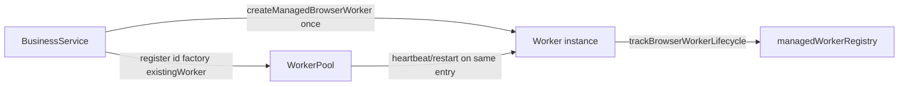

# Design — worker-pool-ownership

## 所有权模型



- `register(id, label, factory, existingWorker?)`：`existingWorker` 存在时**直接使用**，factory 仅用于 crash restart。
- `deregister(id)`：terminate + 从 pool 删除；业务层 `release()` 仍负责 blob URL 与 lifecycle tracking。

## Registry 清理

- `markManagedWorkerTerminated(id)` → `entries.delete(id)`，避免 Map 无限增长。

## 服务改造模式

```typescript
const spawned = createManagedBrowserWorker({ ... });
const worker = spawned.worker;
getWorkerPool().register('embedding', 'Embedding', restartFactory, worker);
```
