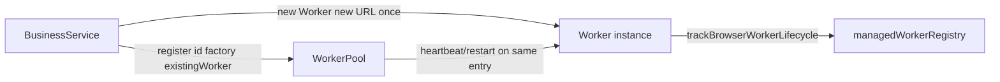

# Design — worker-pool-ownership

## 所有权模型


```mermaid
flowchart LR
  service[BusinessService] -->|new Worker new URL once| worker[Worker instance]
  service -->|register id factory existingWorker| pool[WorkerPool]
  pool -->|heartbeat/restart on same entry| worker
  worker -->|trackBrowserWorkerLifecycle| registry[managedWorkerRegistry]
```

- `register(id, label, factory, existingWorker?)`：`existingWorker` 存在时**直接使用**，factory 仅用于 crash restart。
- `deregister(id)`：terminate + 从 pool 删除；业务层 `release()` 仍负责 lifecycle tracking。

## Registry 清理

- `markManagedWorkerTerminated(id)` → `entries.delete(id)`，避免 Map 无限增长。

## 服务改造模式

worker 只能用字面量 `new Worker(new URL('./x.ts', import.meta.url), { type: 'module' })` 创建：Vite 只在看到这个字面量时才打包 worker；把 `new URL(...)` 传进 helper 会让生产包直接发出 `.ts`，worker 起不来（已删除的 `createManagedBrowserWorker` 就是这样坏掉的）。
Workers must be created with the literal `new Worker(new URL('./x.ts', import.meta.url), { type: 'module' })`: Vite only bundles a worker when it sees that literal. Passing `new URL(...)` through a helper ships the raw `.ts` and the worker never starts (this is how the deleted `createManagedBrowserWorker` broke).

```typescript
const createEmbeddingWorker = () =>
  new Worker(new URL('./embedding.worker.ts', import.meta.url), { type: 'module' });
const worker = createEmbeddingWorker();
const releaseTracking = trackBrowserWorkerLifecycle(worker, { id, source: 'WorkerEmbeddingRuntime' });
getWorkerPool().register('embedding', 'Embedding', createEmbeddingWorker, worker);
```
