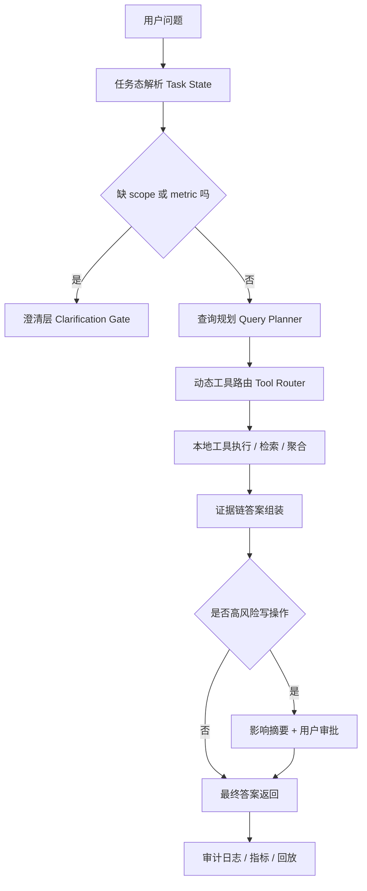

> 文档角色：调研文档。本文用于保留外部产品架构对标、能力分析与落地判断，不直接代表仓库当前已采用实现。

# 调研-专用任务AI产品架构对标与解语目标-2026-04-16

> 本文件为单一总文档版本，已整合：
> 1. 当前 AI 智能体代码审查结论
> 2. 编程与设计类 AI 产品架构对标
> 3. 解语项目目标、KPI 与 90 天落地路线

> 目的：在“通用大模型”之上，梳理编程与设计类 AI 产品如何做任务化架构优化，并给出解语项目的可落地目标与实施路径。
> 日期：2026-04-16
> 适用范围：解语 AI 问答/智能体、工具调用、查询链路、续轮、设计到代码协作链路。

---

## 1. 执行摘要

本次对标的核心结论：

1. 专用任务 AI 产品的关键不在“换更强模型”，而在“把模型放进可控系统”。
2. 编程类产品的成熟点在于：可执行任务编排、工具契约、验证回路、PR级交付。
3. 设计类产品的成熟点在于：视觉上下文绑定、约束化生成、多方案并行、可回写主工程。
4. 解语应采用“正确性优先”的升级顺序：
   1. P0（2周）：工具契约+可观测性+续轮止损
   2. P1（1月）：验证链+可写操作 Planner
   3. P2-P3（1季度）：动态工具过滤+语义检索+离线评测闭环

---

## 2. 对标对象与资料来源

### 2.1 编程任务类（Coding Agents）

1. GitHub Copilot Cloud Agent
   1. 参考：Research/Plan/Iterate、PR 创建与跟踪、Skills、MCP 扩展、hooks、防火墙配置。
   2. 来源：https://docs.github.com/en/copilot/how-tos/use-copilot-agents/cloud-agent
   3. 来源：https://docs.github.com/en/copilot/how-tos/use-copilot-agents

2. Cursor
   1. 参考：代码库理解、功能规划、错误修复、变更审查、规则与技能体系。
   2. 来源：https://cursor.com/docs

3. Devin / Cognition / Windsurf 生态
   1. 参考：云端代理、并行子代理（Manage Devins）、定时会话（Schedule Devins）、自动修复 review comments、隔离执行环境。
   2. 来源：https://cognition.ai/blog

4. Replit Agent
   1. 参考：Canvas 可视化工作台、多方向并行方案、注释驱动修改、应用变更回写主工程。
   2. 来源：https://docs.replit.com/replitai/canvas
   3. 来源：https://blog.replit.com

### 2.2 设计任务类（Design Agents）

1. Figma AI
   1. 参考：Figma Make/Sites、Code Layers、MCP 连接编码工具、设计上下文直达开发代理。
   2. 来源：https://www.figma.com/ai/

2. Canva Magic Design
   1. 参考：品牌套件约束（Brand Kit）、模板化自动生成、安全审核分层、内容到设计的一体化流水线。
   2. 来源：https://www.canva.com/magic-design/
   3. 来源：https://www.canva.com/ai-image-generator/

3. Framer AI
   1. 参考：Wireframer（对话生成响应式页面）、Workshop（组件级增强）、AI Translate、AI 插件接多模型。
   2. 来源：https://www.framer.com/ai/
   3. 来源：https://www.framer.com/features/ai/

4. Uizard / UX Pilot
   1. 参考：文本到多屏原型、截图/线框扫描、主题批量生成、Figma 双向流、代码导出与交付。
   2. 来源：https://uizard.io/
   3. 来源：https://uxpilot.ai/

### 2.3 通用 Agent 工程化框架（用于抽象模式）

1. Vercel AI SDK Tool Calling / Agents
   1. 参考：strict mode、tool approval、multi-step（stopWhen）、prepareStep、activeTools、tool call repair、生命周期 hooks。
   2. 来源：https://ai-sdk.dev/docs/ai-sdk-core/tools-and-tool-calling
   3. 来源：https://ai-sdk.dev/docs/agents

> 注：OpenAI/Anthropic 部分官方页面在当前抓取环境存在 403 或地区限制，因此本报告使用可访问公开资料与可验证产品文档进行归纳。

---

## 3. 通用模型如何被“专用任务化”：8 个架构升级层

### L1 任务对象化（Task Object Model）

把“对话”变成“任务”：

1. 编程类：Issue -> Plan -> Branch -> PR -> Review。
2. 设计类：Prompt/草图 -> 多方案 Frame -> 比较 -> 回写主稿/导出。

价值：将输出单位从“文本”升级为“可交付工件”。

### L2 领域上下文图（Context Graph）

1. 编程类：代码图、依赖图、测试图、变更图。
2. 设计类：组件树、样式变量、版式约束、设备断点。

价值：减少“语义上懂、工程上错”的问题。

### L3 工具契约层（Tool Contract）

1. 强 schema（参数类型、边界、必填项）。
2. active tools（动态工具子集，不一次喂全量）。
3. 可修复调用（repair tool call）。

价值：把模型自由度转为可控执行精度。

### L4 规划执行层（Planner -> Executor）

1. 显式步骤（step）和终止条件（stopWhen）。
2. 可并行子任务（parallel subagents）。
3. 步间上下文压缩与改写（prepareStep）。

价值：大任务可拆解，成本和风险可预算。

### L5 验证与批准层（Verification / Approval）

1. 前置验证：参数、权限、影响范围。
2. 后置验证：结果一致性、约束是否被破坏。
3. 人在回路：高风险写操作 needsApproval。

价值：降低误操作成本，提升可审计性。

### L6 观察与追踪层（Observability）

1. run/step/tool 全链路日志。
2. requestId/traceId 贯通。
3. token、时延、成功率、修复率可聚合。

价值：把问题定位从“猜测”变成“证据”。

### L7 工件回写层（Artifact Commit）

1. 编程类：自动分支、PR、review comment autofix。
2. 设计类：主稿回写、变更摘要、可撤销。

价值：闭环交付，而非单次问答。

### L8 治理与安全层（Governance）

1. 防火墙、hooks、外部域访问约束。
2. AUP 与内容审核。
3. 模型与工具权限配置。

价值：面向团队与企业级落地。

---

## 4. 跨产品对照：他们如何在通用模型上做“任务化增强”

## 4.1 编程类

### GitHub Copilot Cloud Agent

1. 通用模型之上增加：任务生命周期管理（研究-规划-迭代-PR）。
2. 架构增强点：
   1. session 跟踪
   2. custom agents 与 skills
   3. MCP 扩展
   4. hooks 与环境/网络策略
3. 对解语可借鉴：把“工具调用结果”升级成“任务回合记录 + 可追踪提交单元”。

### Cursor

1. 通用模型之上增加：代码库理解入口（理解->规划->修复->审查）流程化。
2. 架构增强点：
   1. 规则/技能体系
   2. 大上下文模型池与 agent 模型分层
3. 对解语可借鉴：将 queryFamily、scope、metric 变成显式任务语义帧，而非隐式提示词状态。

### Devin / Windsurf

1. 通用模型之上增加：云代理并行执行与长期任务调度。
2. 架构增强点：
   1. 管理多代理并行
   2. 定时运行与状态继承
   3. review comment 自动闭环
3. 对解语可借鉴：多步任务引入并行子任务与检查点恢复（尤其批量语言资产处理）。

### Replit Agent

1. 通用模型之上增加：Canvas 视觉任务板。
2. 架构增强点：
   1. 多方案并排比较
   2. 标注驱动修改
   3. “应用到主工程”前有摘要确认
3. 对解语可借鉴：在转写/语言资产场景引入“对比视图 + 应用摘要 + 可撤销回写”。

## 4.2 设计类

### Figma AI

1. 通用模型之上增加：设计上下文作为一等输入（含 MCP 到编码工具）。
2. 架构增强点：
   1. 设计上下文 -> 编码代理
   2. 例行设计任务自动化（命名、翻译、图像编辑）
3. 对解语可借鉴：把语言资产结构化上下文通过 MCP 风格接口暴露给执行代理。

### Canva Magic Design

1. 通用模型之上增加：模板与品牌资产约束化。
2. 架构增强点：
   1. brand kit 约束
   2. 安全审核分层
   3. 多格式输出流水线
3. 对解语可借鉴：将“语言规则、正字法偏好、目标输出模板”做成品牌套件式约束资产。

### Framer AI

1. 通用模型之上增加：从提示到响应式页面，再到发布链路。
2. 架构增强点：
   1. wireframer 快速起稿
   2. workshop 组件级增强
   3. AI plugins 接多模型
3. 对解语可借鉴：将“问答->工具->结果”升级为“草案->增强->发布/应用”的流水线。

### Uizard / UX Pilot

1. 通用模型之上增加：草图/截图/PRD 输入到可编辑原型。
2. 架构增强点：
   1. 扫描器（截图/线框）
   2. 主题批量生成
   3. Figma 双向流
   4. 代码交付
3. 对解语可借鉴：支持“从文档与截图提取任务约束 -> 自动构建工作流原型”。

---

## 5. 解语当前基线（代码证据）

### 5.1 已具备能力

1. 本地工具解析与执行主链路：
   1. [src/ai/chat/localContextTools.ts](../src/ai/chat/localContextTools.ts)
2. 槽位推断与澄清：
   1. [src/ai/chat/localToolSlotResolver.ts](../src/ai/chat/localToolSlotResolver.ts)
3. 续轮与停止机制：
   1. [src/ai/chat/agentLoop.ts](../src/ai/chat/agentLoop.ts)
4. 对话编排入口与 loop 驱动：
   1. [src/hooks/useAiChat.ts](../src/hooks/useAiChat.ts)
5. 工具决策与高风险门控：
   1. [src/hooks/useAiChat.toolDecisionPipeline.ts](../src/hooks/useAiChat.toolDecisionPipeline.ts)
6. 指标埋点：
   1. [src/observability/metrics.ts](../src/observability/metrics.ts)

### 5.2 关键差距

1. 停止条件还不够“答案完成度驱动”。
2. scope 歧义未形成独立澄清原因（仍可能默认兜底）。
3. search 语义召回能力不足（lexical 主导）。
4. 观测链路有埋点但缺统一诊断面板和错误分类标准。

---

## 6. 借鉴清单（明确到可执行项）

## 6.1 直接借鉴（P0，2周）

1. Schema-first 工具注册中心（借鉴 AI SDK strict + input schema）
   1. 所有本地工具统一声明参数 schema、默认值、边界。
   2. 验收：无 schema 工具不得进入执行器。

2. Tool approval + impact summary（借鉴 AI SDK needsApproval、Replit apply summary）
   1. 高风险操作先给影响摘要，再确认执行。
   2. 验收：高风险误执行 = 0。

3. 结构化 run/step/tool 追踪（借鉴 DevTools / Copilot session tracking）
   1. 统一 requestId、stepNumber、toolName、duration、error taxonomy。
   2. 验收：80% 以上线上问题可在 10 分钟内定位。

4. 续轮止损门（借鉴 stopWhen）
   1. 单步可答任务必须提前终止。
   2. 验收：单步类任务平均步数 <= 1.3。

## 6.2 能力增强（P1，1月）

1. 可写操作 Planner（借鉴 Devin 多阶段执行）
   1. step plan + 依赖关系 + 检查点恢复。
   2. 验收：3 类复杂批处理任务一次成功率 >= 70%。

2. Tool call repair（借鉴 AI SDK repair）
   1. 参数错配自动修复 1 次，失败再澄清。
   2. 验收：参数错误导致失败率下降 50%。

3. 动态工具子集 activeTools（借鉴 AI SDK activeTools）
   1. 按 queryFamily 与 scope 激活工具。
   2. 验收：错误工具调用率下降 30%。

## 6.3 规模化优化（P2-P3，1季度）

1. 语义检索与证据链输出
   1. lexical + semantic + evidence。
   2. 验收：search 相关任务准确率提升到 >= 90%。

2. 并行子任务与调度
   1. 批量语言资产处理支持并行 worker 与可恢复重入。
   2. 验收：大任务 wall-clock 时间下降 40%。

3. 评测飞轮
   1. 引入离线回放集 + 路由混淆矩阵 + 发布门槛。
   2. 验收：每次发布前自动生成质量卡。

---

## 7. 基于解语性质的目标体系（建议 KPI）

> 说明：以下为建议目标，T0 基线需在首周通过埋点实测确认。

### 7.1 准确性

1. 意图路由准确率（五类 queryFamily）：
   1. P0 >= 88%
   2. P1 >= 93%
   3. P3 >= 96%
2. 高风险误执行：始终为 0。
3. scope 一致率：
   1. P0 >= 95%
   2. P1 >= 98%

### 7.2 效率

1. 单步可答任务平均步数：
   1. P0 <= 1.3
2. token/turn：
   1. P1 较 T0 下降 15%
   2. P3 较 T0 下降 25%
3. P95 响应时延：
   1. P1 较 T0 下降 20%

### 7.3 稳定性

1. 工具首次成功率：
   1. P0 >= 85%
   2. P1 >= 92%
   3. P3 >= 97%
2. 最终成功率（含修复/重试）：
   1. P1 >= 95%
   2. P3 >= 98%

### 7.4 可观测性

1. 关键链路采样覆盖率 >= 95%。
2. 诊断中位时长（MTTD）<= 10 分钟（P1）。
3. 发布前自动评测通过率门槛 >= 95%。

---

## 8. 落地实施蓝图（90天）

### 8.1 第 1-2 周（P0）

1. 工具契约中心
2. 高风险确认与影响摘要
3. 统一 trace 事件模型
4. 续轮 stopWhen 等价门

交付物：

1. schema registry
2. 审计事件规范 v1
3. P0 回归测试集

### 8.2 第 3-6 周（P1）

1. 可写操作 Planner v1
2. tool repair
3. activeTools 动态筛选
4. scope 澄清扩展（增加 scope_ambiguous）

交付物：

1. Planner 执行器
2. 修复策略与重试策略
3. 路由冲突矩阵报告

### 8.3 第 7-12 周（P2-P3）

1. semantic/hybrid 查询链
2. 并行子任务调度
3. 评测平台与质量闸门

交付物：

1. 线上质量看板
2. 离线回放集
3. 发布门槛自动化

---

## 9. 风险与控制

1. 风险：Planner 覆盖写操作后，错误成本上升。
   1. 控制：强制 needsApproval + 回滚 + 幂等。
2. 风险：动态工具过滤过度，导致“该用工具未激活”。
   1. 控制：保底工具池 + 回退策略。
3. 风险：语义检索引入后延迟抖动。
   1. 控制：分层预算与缓存策略。
4. 风险：观测数据过多导致维护负担。
   1. 控制：分级采样与事件裁剪。

---

## 10. 对管理层的简版建议

1. 不要把这轮升级定义为“换模型项目”，应定义为“任务系统工程化项目”。
2. 首阶段只看三件事：
   1. 正确（误执行为 0）
   2. 可查（问题 10 分钟可定位）
   3. 省（无效续轮与 token 浪费下降）
3. 通过后再扩大到多步并行与高级检索。

---

## 11. 附录：本仓库相关参考文档

1. [docs/规划-AI问答架构统一改进方案-2026-04-12.md](./规划-AI问答架构统一改进方案-2026-04-12.md)
2. [docs/规划-LLM对话与任务识别完整落地方案-2026-03-17.md](./规划-LLM对话与任务识别完整落地方案-2026-03-17.md)
3. [docs/规划-AI功能开发进度与Bug修复方案-2026-03-22.md](./规划-AI功能开发进度与Bug修复方案-2026-03-22.md)
4. [docs/发布说明-AI调研四阶段收口与回归-2026-04-07.md](./发布说明-AI调研四阶段收口与回归-2026-04-07.md)

---

## 12. 当前实现证据矩阵（代码级）

### 12.1 端到端执行链路证据

1. 对话发送与主编排入口：
   1. [src/hooks/useAiChat.ts](../src/hooks/useAiChat.ts)
2. 流来源分发（本地快速路径/LLM）：
   1. [src/hooks/useAiChat.streamFactory.ts](../src/hooks/useAiChat.streamFactory.ts)
3. 流完成期工具解析与收口：
   1. [src/hooks/useAiChat.streamCompletion.ts](../src/hooks/useAiChat.streamCompletion.ts)
4. 完成阶段桥接：
   1. [src/hooks/useAiChat.streamCompletionPhase.ts](../src/hooks/useAiChat.streamCompletionPhase.ts)
5. 本地工具解析与执行：
   1. [src/ai/chat/localContextTools.ts](../src/ai/chat/localContextTools.ts)
6. 槽位推断、scope 推断、澄清信号：
   1. [src/ai/chat/localToolSlotResolver.ts](../src/ai/chat/localToolSlotResolver.ts)
7. 续轮停止与预算判断：
   1. [src/ai/chat/agentLoop.ts](../src/ai/chat/agentLoop.ts)
8. 工具决策管线（含高风险门控）：
   1. [src/hooks/useAiChat.toolDecisionPipeline.ts](../src/hooks/useAiChat.toolDecisionPipeline.ts)

### 12.2 已确认的关键能力

1. list 分页快照绑定 scope，避免跨页语义漂移：
   1. [src/ai/chat/localContextListUnitsSnapshotStore.ts](../src/ai/chat/localContextListUnitsSnapshotStore.ts)
2. scope 空命中保持空结果，不再回退扩大范围：
   1. [src/ai/chat/localContextTools.ts](../src/ai/chat/localContextTools.ts)
3. search 在 scoped-empty 返回空结果，而非 data_loading：
   1. [src/ai/chat/localContextTools.ts](../src/ai/chat/localContextTools.ts)
4. 续轮停止增加 requestedMetric 匹配约束：
   1. [src/ai/chat/agentLoop.ts](../src/ai/chat/agentLoop.ts)

### 12.3 当前高优先差距（待补）

1. 停止条件尚未全面升级为“答案完成度优先”，仍偏工具结果信号驱动。
2. 澄清原因未独立覆盖 scope_ambiguous，存在默认兜底误答风险。
3. search 仍以 lexical 召回为主，语义检索链路未完全进入主流程。
4. 可观测性有指标但缺统一 run/step/tool 诊断视图与稳定错误分类。

---

## 13. 审查发现清单（P0/P1/P2）

### 13.1 P0（立即影响正确性或安全）

1. 续轮停止策略需补“单步可答即停”的通用门。
2. 高风险写操作必须始终经过影响范围摘要与确认。
3. scope 歧义必须澄清，不允许默认猜测后执行。

### 13.2 P1（影响质量和效率）

1. 工具参数修复与失败重试策略需要标准化。
2. 动态工具子集激活需要落地，减少无关工具干扰。
3. 语义路由需补同义词/反例词典与阈值分层。

### 13.3 P2（规模化与持续优化）

1. 多步并行子任务与检查点恢复能力。
2. 语义检索与证据链融合。
3. 离线回放评测与发布质量闸门自动化。

---

## 14. 已完成修复与验证记录（本轮）

### 14.1 已完成修复

1. scope 过滤空命中语义修正。
2. list handle 分页 scope 固化。
3. search scoped-empty 返回空结果语义修正。
4. agent loop metric mismatch 停止条件修正。

### 14.2 已补测试

1. localContextTools 相关边界测试补齐。
2. agentLoop metric mismatch 回归测试补齐。

### 14.3 验证结论

1. 已有多组 vitest 定向测试通过。
2. build 在近期验证中通过。
3. 类型检查需要持续以最新工作区状态复验（以当前分支实时结果为准）。

---

## 15. 解语目标对齐结论（最终版）

### 15.1 本项目应该达到的能力目标

1. 意图理解：五类 queryFamily 稳定分流，冲突问法优先澄清。
2. 工具调用：高风险零误执行，参数错误可修复。
3. 查询准确：scope 一致、证据可追溯、语义召回可用。
4. 查询效率：单步可答任务少续轮，复杂任务多步可控。

### 15.2 本项目应该达到的工程目标

1. 可观测：每一步执行可追踪、可归因、可复盘。
2. 可回归：发布前离线回放集自动通过。
3. 可治理：权限、网络、模型与工具边界可配置。

### 15.3 本项目应该达到的业务目标

1. 降低人工排障成本。
2. 提升语言资产处理吞吐。
3. 在不牺牲编辑体验前提下提升 AI 产出质量。

---

## 16. 文档使用说明

1. 本文档是当前对齐与实施的唯一总文档。
2. 后续新增调研、审查、验收结果，直接追加到本文件对应章节。
3. 旧文档继续作为历史依据保留，不再作为当前状态唯一来源。

---

## 17. 高关联对标收敛版（从本项目实际需求出发）

### 17.1 应保留为主对标池的产品类型

结合解语当前的真实目标——语言资产工作台、语言数据查询解释、受控工具执行、低误触人机协同——建议后续主对标池收敛为以下五组：

1. 本地化与翻译平台
   1. Smartling
   2. Lokalise
   3. Phrase
   4. DeepL 企业能力
   5. 借鉴重点：术语库、翻译记忆、风格指南、QA 规则、人审回写、批量资产治理。
2. 知识工作台与企业知识检索
   1. Notion AI
   2. Atlassian Rovo
   3. 借鉴重点：权限内检索、来源引用、工作区上下文记忆、答案可追溯。
3. 查询型 Copilot / BI 分析代理
   1. ThoughtSpot Sage
   2. Power BI Copilot
   3. 借鉴重点：自然语言转结构化查询、缺参澄清、指标解释、结果卡片化。
4. 受控工具型智能体
   1. GitHub Copilot
   2. Cursor
   3. 借鉴重点：Plan -> Execute -> Verify 闭环、工具审批、技能扩展、失败修复重试。
5. 高风险动作治理型智能体
   1. Microsoft Security Copilot
   2. 借鉴重点：高风险动作双确认、审计链路、事件时间线、证据优先输出。

### 17.2 建议降级为次级参考的产品类型

以下方向仍可作为方法论启发，但不建议继续作为解语主对标池：

1. 设计生成类产品：Canva、Framer、Uizard、UX Pilot。
   1. 原因：更偏视觉与页面生成，对语言资产查询主链路关联较弱。
2. 云端全自动编程代理：Devin、重工程版 Replit Agent。
   1. 原因：其核心价值在代码仓库自动变更、部署与 PR 流程，不是当前解语的核心业务。
3. 强垂直法务/医疗模型。
   1. 原因：证据链方法可借鉴，但业务工作流与解语并不直接同构。

### 17.3 收敛后的核心判断

1. 解语不应继续按“更强聊天模型”定义方向。
2. 解语更适合定义为“查询型、证据型、可审批、可复盘”的专用任务智能体。
3. 因此，架构优化重点应放在：任务态、澄清态、证据链、审批层、观测层，而不是开放式自由对话能力。

---

## 18. 借鉴高关联产品后的现有架构优化方案

### 18.1 目标架构图（收敛版）

### 18.2 优化方向一：从聊天驱动升级为任务驱动

现有主链路已具备问答编排能力，但核心状态仍以 message 和 tool result 为中心。建议引入统一任务对象：

1. queryFamily
2. requestedMetric
3. scope
4. evidence
5. pendingClarification
6. executionState
7. answerReady

直接收益：

1. 续轮停止判断更稳，不再单纯依赖“有没有工具结果”。
2. 连续追问能继承同一任务语义，而不是靠隐式上下文猜测。
3. 可以对不同 queryFamily 采用不同 stopWhen 与预算策略。

建议落点：

1. [src/hooks/useAiChat.ts](../src/hooks/useAiChat.ts)：引入统一 task state 生命周期。
2. [src/ai/chat/agentLoop.ts](../src/ai/chat/agentLoop.ts)：停止条件从“工具信号驱动”升级为“任务完成度驱动”。

### 18.3 优化方向二：把澄清机制做成一等公民

建议把澄清原因标准化为显式类型，而不是混在一般失败和 fallback 中：

1. scope_ambiguous
2. metric_ambiguous
3. query_ambiguous
4. target_ambiguous
5. action_ambiguous

> 口径对齐说明（2026-04-16）：当前代码已落地并在指标链路中使用的是以上 5 类。`entity_missing / conflict_between_slots / permission_blocked` 作为下一阶段扩展枚举，不再标注为“本轮已实现”。

直接收益：

1. 能明确区分“该问清楚”与“该执行”。
2. 减少 scope 猜错与默认兜底误答。
3. 便于 UI 与日志层做结构化展示和统计。

建议落点：

1. [src/ai/chat/localToolSlotResolver.ts](../src/ai/chat/localToolSlotResolver.ts)
2. [src/hooks/useAiChat.streamCompletion.ts](../src/hooks/useAiChat.streamCompletion.ts)

### 18.4 优化方向三：把检索结果升级为证据链答案

建议统一最终输出结构：

1. 结论
2. 证据来源
3. scope 范围
4. 不确定项
5. 建议下一步

直接收益：

1. 更符合知识工作台与本地化平台场景。
2. 用户更容易判断答案是否可靠。
3. 为后续审计与回放保留完整依据。

建议落点：

1. [src/hooks/useAiChat.streamCompletion.ts](../src/hooks/useAiChat.streamCompletion.ts)
2. [src/hooks/useAiChat.streamCompletionPhase.ts](../src/hooks/useAiChat.streamCompletionPhase.ts)

### 18.5 优化方向四：建立查询型 Copilot 标准执行模板

建议把常见查询类任务统一拆为四步：

1. 识别查询目标
2. 补齐缺失参数
3. 执行查询 / 搜索 / 聚合
4. 结果解释与下一步推荐

这会使语言资产查询、统计、分布、异常解释这类任务显著更稳定。

建议落点：

1. [src/ai/chat/localContextTools.ts](../src/ai/chat/localContextTools.ts)：统一工具返回结构。
2. [src/ai/chat/agentLoop.ts](../src/ai/chat/agentLoop.ts)：按模板决定是否进入下一步。

### 18.6 优化方向五：为写操作和高风险操作加统一审批层

建议所有高风险动作都走统一审批协议：

1. 影响对象摘要
2. 风险等级
3. 用户确认
4. 执行后审计记录

建议风险等级标准化为：

1. low
2. medium
3. high
4. destructive

建议落点：

1. [src/hooks/useAiChat.toolDecisionPipeline.ts](../src/hooks/useAiChat.toolDecisionPipeline.ts)
2. [src/hooks/useAiChat.ts](../src/hooks/useAiChat.ts)

### 18.7 优化方向六：从指标散点升级为可复盘运行面板

建议把每一轮 agent 执行沉淀为统一 run log：

1. 用户问题
2. queryFamily
3. scope
4. selectedTools
5. 澄清次数
6. 每一步耗时
7. 停止原因
8. 最终答案是否命中 requestedMetric

建议落点：

1. [src/observability/metrics.ts](../src/observability/metrics.ts)
2. [src/hooks/useAiChat.ts](../src/hooks/useAiChat.ts)

---

## 19. 分阶段实施清单（明确到文件级）

### 19.1 P0：先保正确性与可控性（1-2 周）

1. 停止条件升级为“任务完成优先”
   1. 主改文件：[src/ai/chat/agentLoop.ts](../src/ai/chat/agentLoop.ts)
   2. 配套文件：[src/hooks/useAiChat.ts](../src/hooks/useAiChat.ts)
2. scope 澄清原因独立化
   1. 主改文件：[src/ai/chat/localToolSlotResolver.ts](../src/ai/chat/localToolSlotResolver.ts)
   2. 配套文件：[src/hooks/useAiChat.streamCompletion.ts](../src/hooks/useAiChat.streamCompletion.ts)
3. 高风险审批协议统一化
   1. 主改文件：[src/hooks/useAiChat.toolDecisionPipeline.ts](../src/hooks/useAiChat.toolDecisionPipeline.ts)
   2. 配套文件：[src/hooks/useAiChat.ts](../src/hooks/useAiChat.ts)

P0 验收标准：

1. 高风险误执行 = 0。
2. 单步可答任务平均步数 <= 1.3。
3. scope 误判率显著下降，并可统计各类澄清原因。

#### 19.1.1 当前执行状态（2026-04-16）

P0 首批核心项已实际落地并完成验证：

1. 已完成：单步可答任务提前终止，避免不必要续轮。
2. 已完成：scope_ambiguous 显式澄清，不再在范围不明时默认猜测。
3. 已完成：高风险确认预览优先展示真实影响范围摘要。
4. 已完成：澄清场景进入 waiting_clarify 状态并计入指标。

本轮验证证据：

1. 定向与集成测试共 60 / 60 通过。
2. TypeScript 类型检查通过。
3. 生产构建通过。

对应代码落点：

1. [src/ai/chat/agentLoop.ts](../src/ai/chat/agentLoop.ts)
2. [src/ai/chat/localToolSlotResolver.ts](../src/ai/chat/localToolSlotResolver.ts)
3. [src/hooks/useAiChat.streamCompletion.ts](../src/hooks/useAiChat.streamCompletion.ts)
4. [src/hooks/useAiChat.destructiveGate.ts](../src/hooks/useAiChat.destructiveGate.ts)

### 19.2 P1：增强可解释与查询稳定性（3-6 周）

1. 证据链答案结构统一
   1. 主改文件：[src/hooks/useAiChat.streamCompletion.ts](../src/hooks/useAiChat.streamCompletion.ts)
   2. 配套文件：[src/hooks/useAiChat.streamCompletionPhase.ts](../src/hooks/useAiChat.streamCompletionPhase.ts)
2. 查询型 Copilot 四步模板化
   1. 主改文件：[src/ai/chat/localContextTools.ts](../src/ai/chat/localContextTools.ts)
   2. 配套文件：[src/ai/chat/agentLoop.ts](../src/ai/chat/agentLoop.ts)
3. 运行日志模型统一
   1. 主改文件：[src/observability/metrics.ts](../src/observability/metrics.ts)
   2. 配套文件：[src/hooks/useAiChat.ts](../src/hooks/useAiChat.ts)

P1 验收标准：

1. 查询相关回答具备结论、证据、范围、不确定项、下一步五段结构。
2. 线上问题可在 10 分钟内定位主要失败阶段。
3. 查询类任务的一次成功率明显提升。

#### 19.2.1 当前执行状态（2026-04-16）

1. `search_units`、`list_units`、`get_unit_detail` 在 `current_scope` 下已优先接入统一 `segment_meta` 读模型，并保留 `localUnitIndex` 回退。
2. `search_units` 已支持结构化过滤：`speakerId`、`noteCategory`、`selfCertainty`、`annotationStatus`、`hasText`。
3. 所有成功的本地查询结果继续携带 `_readModel` 元信息；当前范围命中统一读模型时会显式标记 `source: "segment_meta"`，便于排障和证据链解释。
4. 本地查询型回答已统一升级为“五段式证据链答案”：结论、证据、范围、不确定项、建议下一步，覆盖 `get_project_stats`、`list_units`、`search_units`、`get_unit_detail`、`diagnose_quality` 等主路径。
5. `AiTaskSession` 与 AI 决策日志已补统一 trace 字段：`phase`、`stepNumber`、`toolName`、`requestId`、`durationMs`、`errorTaxonomy`；侧栏决策面板可直接显示原因与耗时，便于定位失败阶段。
6. `find_incomplete_units` 已补 `segment_meta` 优先路径：在 `current_scope` 下直接从 segment_meta 查询未完成语段（annotationStatus ≠ verified），回退到 `localUnitIndex`。
7. `batch_apply` 已补 `segment_meta` 优先校验路径：unitIds 优先从 segment_meta 匹配，报告 unresolvedUnitIds，回退到 `localUnitIndex`。
8. `useTranscriptionSnapshotLoader` token/morpheme 加载已改为懒加载：首屏只加载核心数据，`loadLinguisticAnnotations` 在首屏就绪后延迟触发，不阻塞 UI 渲染。
9. `segment_meta` 已覆盖全部三种 scope（`project` / `current_track` / `current_scope`）：`SegmentMetaService` 新增 `listAll()`（项目级全量）和 `listByMediaId()`（当前音轨跨层）方法；`loadScopedSegmentMetaRows` 对 `project` 使用 `listAll`，`current_track` 使用 `listByMediaId`，`current_scope` 保持 `rebuildForLayerMedia` + `listByLayerMedia` 回退。`search_units` 的 segment_meta 路径同步覆盖三种 scope。`localContextListUnitsSnapshotStore` 与 `normalizedUnitRowsFromContext` 现为纯回退路径（segment_meta 为空或异常时启用），可在观察一个版本后安全删除。
10. 验证证据：全量回归 **342 文件 / 2880 测试通过**，`tsc --noEmit` 通过（改动文件无新增错误），生产构建通过。

### 19.3 P2：做效率和规模化（6-12 周）

1. hybrid search 与 evidence ranking
2. activeTools 动态子集激活
3. 离线回放评测与发布质量闸门

#### 19.3.1 当前执行状态（2026-04-16）

1. `search_units` 在本地 `localUnitIndex` 回退路径已补轻量 hybrid 排序：短语命中 + token overlap 融合排序，返回 `ranking.strategy: "hybrid_local"`，降低纯短语匹配导致的漏召回。
2. 已补动态工具子集路由规划：按用户问题生成 `queryFamily / selectedTools / scope / requestedMetric`，并将 `selectedTools` 注入系统提示词（Active query tools for this turn）。
3. `agentLoop` 停止条件已从“仅工具结果存在性”扩展为“任务状态优先”：支持 `answerReady` 与 `executionState=answer_ready` 的显式停机，并结合 `queryFamily` 做搜索/详情场景的提前收口。
4. 观测与门禁基础保持可用：`scripts/evaluate-m6-release-gate.mjs` 仍负责 build + 关键指标的自动判定。

验证证据：

1. 定向回归通过：`localToolSlotResolver / localContextTools / promptContext / agentLoop` 共 **76 / 76**。
2. 架构链路回归通过：`useAiChat.streamCompletion / aiArchitectureIntegration` 共 **39 / 39**。
3. `npx tsc --noEmit` 通过，`npm run build` 通过。

优先涉及文件：

1. [src/ai/chat/localContextTools.ts](../src/ai/chat/localContextTools.ts)
2. [src/ai/chat/localToolSlotResolver.ts](../src/ai/chat/localToolSlotResolver.ts)
3. [src/observability/metrics.ts](../src/observability/metrics.ts)

### 19.4 最终收敛结论

1. 解语最该借鉴的不是设计生成模型本身，而是本地化平台、知识工作台、查询型 Copilot、受控工具智能体和安全治理智能体的系统能力。
2. 对当前代码最重要的升级不是“大换模型”，而是把已有链路升级为任务态、证据态、审批态、可复盘态。
3. 只要 P0 和 P1 做实，当前架构就能从“可用的 AI 对话能力”升级为“可托付的专用任务系统”。
